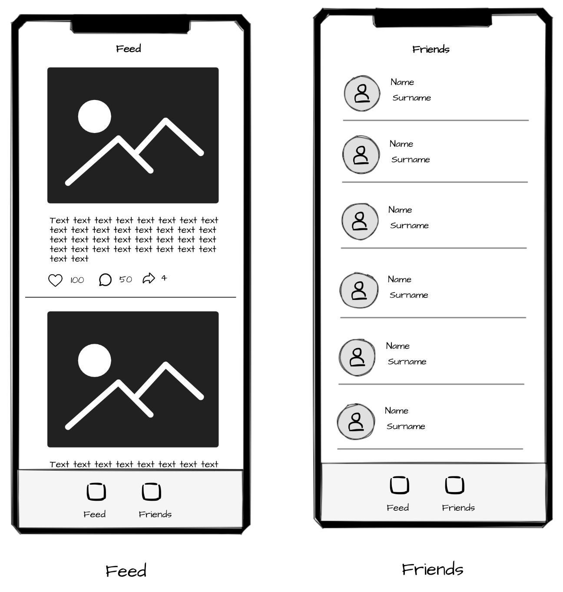

# Построение интерфейсов на UIKit

Резюме: в этом проекте ты познакомишься с основами адаптивной верстки iOS приложения с использованием фреймворка [UIKit](https://developer.apple.com/documentation/uikit).

💡 [Нажми сюда](https://new.oprosso.net/p/4cb31ec3f47a4596bc758ea1861fb624), **чтобы поделиться с нами обратной связью на этот проект**. Это анонимно и поможет нашей команде сделать обучение лучше. Рекомендуем заполнить опрос сразу после выполнения проекта.

## Contents

1. [Chapter I](#chapter-i) \
   -[Introduction](#introduction)
2. [Chapter II](#chapter-ii) \
   -[UIKit и SwiftUI](#uikit-%D0%B8-swiftui) \
   -[UIKit](#uikit) \
   -[Auto Layout](#auto-layout) \
   -[Storyboard / Xib](#storyboard-xib) \
   -[MVC](#mvc)
3. [Chapter III](#chapter-iii) \
   -[Задания](#%D0%B7%D0%B0%D0%B4%D0%B0%D0%BD%D0%B8%D1%8F) \
   -[Дополнительные задачи (\*)](#%D0%B4%D0%BE%D0%BF%D0%BE%D0%BB%D0%BD%D0%B8%D1%82%D0%B5%D0%BB%D1%8C%D0%BD%D1%8B%D0%B5-%D0%B7%D0%B0%D0%B4%D0%B0%D1%87%D0%B8)

## Chapter I

### Introduction

1. На протяжении всего курса тебя будет сопровождать чувство неопределенности и острого дефицита информации - это нормально. Не забывай, что информация в репозитории и Google всегда с тобой. Как и пиры, и Rocket.Chat. Общайся. Ищи. Опирайся на здравый смысл. Не бойся ошибиться.
2. Будь внимателен к источникам информации. Проверяй. Думай. Анализируй. Сравнивай.
3. Внимательно читай задания. Перечитай несколько раз.
4. Читать примеры тоже лучше внимательно. В них может быть что-то, что не указано в явном виде в самом задании.
5. Тебе могут встретиться несоответствия, когда что-то новое в условиях задачи или примере противоречит уже известному. Если встретилось такое — попробуй разобраться. Если не получилось — запиши вопрос в открытые вопросы и выясни в процессе работы. Не оставляй открытые вопросы неразрешенными.
6. Если задание кажется непонятным или невыполнимым — так только кажется. Попробуй его декомпозировать. Скорее всего, отдельные части станут понятными.
7. На пути тебе встретятся самые разные задания. Те, что помечены звездочкой (\*) — подходят для более дотошных. Они повышенной сложности и необязательны к выполнению. Но если ты их сделаешь, то получишь дополнительный опыт и знания.
8. Не пытайся обмануть систему и окружающих. В первую очередь ты обманешь себя.
9. Есть вопрос? Спроси своего соседа справа. Если это не помогло — соседа слева.
10. Когда пользуешься помощью — всегда разбирайся до конца: почему, как и зачем. Иначе помощь не будет иметь смысла.
11. Всегда делай push только в ветку develop! Ветка master будет проигнорирована. Работай в директории src.
12. В твоей директории не должно быть иных файлов, кроме тех, что обозначены в заданиях.

## Chapter II

### Фреймворки UIKit и SwiftUI

На данный момент существует два основных фреймворка для верстки под iOS: [UIKit](https://developer.apple.com/documentation/uikit) и [SwiftUI](https://developer.apple.com/xcode/swiftui/), и это два разных подхода к созданию интерфейсов.

UIKit предлагает императивный подход созданию интерфейсов, т. е. мы вручную управляем созданием всем графических элементов напрямую, контролируем время их жизни и т. д.

SwiftUI придерживается более современного, декларативного подхода наподобие Web, где мы просто описываем верхнеуровнево, как должен выглядеть экран, а система уже сама распределяет ресурсы и управляет графическими объектами.

SwiftUI — это достаточно молодой, по меркам индустрии, фреймворк, и хотя он постоянно дорабатывается компанией Apple и позиционируется, как будущее верстки для iOS, он все еще не обладает полным функционалом UIKit. Поэтому разработчики очень аккуратно подходят к его использованию, что уж говорить о старых проектах, в которых большая часть кода написана на UIKit.

На сегодняшний день iOS-разработчик должен уметь использовать в полной мере как SwiftUI, так и UIKit.

### UIKit

[UIKit](https://developer.apple.com/documentation/uikit) — это основной и самый старый фреймворк для создания графического пользовательского интерфейса под iOS. Он был представлен Apple в 2007 году.

У каждой платформы существует своя дизайн-система и рекомендации по проектированию интерфейсов. Например, у Android — это [Material](https://m3.material.io/), а у Apple — [Apple Design](https://www.figma.com/community/file/1248375255495415511). И чтобы разработчикам каждый раз не создавать базовые компоненты с нуля, в UIKit они уже реализованы.

Базовым классом, с которым ты будешь часто взаимодействовать при работе с UIKit, является [UIView](https://developer.apple.com/documentation/uikit/uiview). От него уже наследуется класс контроллов [UIControl](https://developer.apple.com/documentation/uikit/uicontrol), от которого, в свою очередь, наследуются все интерактивные элементы типа [UIButton](https://developer.apple.com/documentation/uikit/uibutton), [UISegmentedControl](https://developer.apple.com/documentation/uikit/uisegmentedcontrol) и т. д. Более подробный список компонентов можно посмотреть [здесь](https://developer.apple.com/documentation/uikit/mac_catalyst/uikit_catalog_creating_and_customizing_views_and_controls).

В большинстве случаев тебе хватит  UIKit, и в первую очередь Apple рекомендует использовать именно его. Но иногда появляются более сложные задачи по работе с графикой, анимацией и различного рода оптимизациями. В таком случае следует опуститься на уровень ниже и использовать низкоуровневые фреймворки по работе с графикой: [CoreGraphics](https://developer.apple.com/documentation/coregraphics) и [CoreAnimation](https://developer.apple.com/documentation/quartzcore).

## Chapter III

### Верстки iOS

### Auto Layout

**[Auto Layout](https://developer.apple.com/library/archive/documentation/General/Conceptual/Devpedia-CocoaApp/Storyboard.html)** — это система динамического вычисления размеров и позиционирования графических компонентов на экране, разработанная компанией Apple в 2012 году для iOS 6 и OS X 10.7 Lion.

До появления Auto Layout разработчикам приходилось вручную рассчитывать размеры каждого графического компонента и его позицию на экране. Ситуация существенно усложнилась с появлением большого количества устройств с разными размерами и пропорциями экранов. Тогда Apple придумала новый универсальный способ проектирования, основанный на описании ограничений (constraints) между графическими компонентами.

По факту, AutoLayout — это математический движок, который решает СЛУ (Систему Линейных Уравнений), где уравнения — это как раз и есть заданный набор ограничений, а решение — размер и позиция графического компонента.

У Auto Layout есть узкое горлышко: чем сложнее система уравнений, тем дольше ее решать. Поэтому при проектировании интерфейсов с использованием Auto Layout рекомендуется оптимизировать ограничения и избегать избыточного количества сложных связей между ними.

### Storyboard / Xib

[Storyboard / Xib](https://developer.apple.com/library/archive/documentation/General/Conceptual/Devpedia-CocoaApp/Storyboard.html) — это графические файлы, хранящие верстку интерфейса приложения. Данный механизм впервые был представлен в iOS 5, выпущенной в октябре 2011 года.

Главной особенностью Storyboard является то, что вместе с ним в Xcode был представлен удобный редактор ([Interface Builder](https://en.wikipedia.org/wiki/Interface_Builder)), который позволял проектировать интерфейсы, не написав ни строчки кода (по аналогии с Figma или Sketch). Это очень удобно, если нужно быстро создать простой интерфейс.

### MVC

Каждый день миллионы разработчиков сталкиваются с решением огромного числа проблем, и очень многие из них встречаются от проекта к проекту. Для решения похожих задач и были придуманы и паттерны. Разработчики берут наиболее часто встречающиеся проблемы и описывают общую концепцию их решения. В отличие от готовых функций или библиотек, паттерн представляет собой не конкретный код, а общую концепцию решения проблемы, и ее еще нужно подстроить под задачи.

Одна из самых распространенных проблем при разработке мобильного приложения — это разделение бизнес-логики и UI-слоя. Именно эту задачу и решает паттерн MVC.

- [MVC](https://developer.apple.com/library/archive/documentation/General/Conceptual/DevPedia-CocoaCore/MVC.html) — архитектурный паттерн проектирования, служащий для отделения данных от бизнес-логики и пользовательского интерфейса приложения. Основная концепция MVC предлагает разделить код на несколько слоев:
- Модель (Model): предоставляет данные и реагирует на команды контроллера, изменяя свое состояние.
- Представление (View): отвечает за отображение данных модели пользователю, реагируя на изменения модели.
- Контроллер (Controller): интерпретирует действия пользователя, оповещая модель о необходимости изменений.

При работе над разными проектами ты изучишь еще немало архитектурных решений и паттернов проектирования, таких как [MVVM](https://en.wikipedia.org/wiki/Model%E2%80%93view%E2%80%93viewmodel), [VIPER](https://github.com/strongself/The-Book-of-VIPER), [Redux](https://medium.com/mackmobile/getting-started-with-redux-in-swift-54e00f323e2b) и т. д. Важно понимать, что не существует серебряной пули, и каждый паттерн имеет свои сильные и слабые стороны. MVC является наиболее простым для понимания, и его можно использовать как некий базис, от которого можно отталкиваться при изучении более сложных паттернов.

### Литература

- [Исчерпывающая книга по AutoLayout](https://www.oreilly.com/library/view/ios-auto-layout/9780133440669/)
- [Математические основы Auto Layout](https://habr.com/ru/companies/oleg-bunin/articles/437584/)
- [Туториал с примерами по работе CoreAnimation](https://medium.com/@quangtqag/core-animation-examples-742f9af00188)
- [Оптимизация производительности в списках](https://prafullkumar77.medium.com/uitableview-performance-optimisation-to-improve-the-smoothness-of-list-scrolling-ce97cbb8ba85)
- [Статья про мониторинг производительности приложения](https://medium.com/@peteliev/diagnose-and-solve-performance-problem-with-xcode-instruments-5c25c27f21d5)
- [Паттерны проектирования iOS](https://habr.com/ru/companies/badoo/articles/281162/)
- [Статья про паттерн MVC](https://ahmedaminhassanismail.medium.com/model-view-controller-pattern-in-swift-mvc-for-beginners-35db8d479832)

## Chapter IV

### Задания

Тебе необходимо выполнить верстку базовых экранов социальной сети (только верстку), отображающих список постов, друзей.

Общие требования:

- Не используй сторонние библиотеки.
- Для разработки всех компонентов применяй UIKit + AutoLayout.
- Обеспечь адаптивность верстки под различные размеры экранов.
- Используй паттерн [MVC](https://developer.apple.com/library/archive/documentation/General/Conceptual/DevPedia-CocoaCore/MVC.html) на UI слое.
- Применяй моковые данные из файла MockService.swift.
- Пока данные грузятся, показывай пользователю индикатор загрузки.

**Task I: Launch Screen**

- Реализуй экран приветствия при запуске приложения.
- Верстка должна быть реализована через Storyboards и AutoLayout.
- На стартовом экране обязательно должны присутствовать логотип и название приложения (можешь придумать любое).

**Task II: Экран Ленты**

- Создай экран ленты пользователя, отображающий посты пользователя.
- Включи заголовок ленты, изображение (заглушка) и текст каждого поста.
- Добавь элементы управления, такие как кнопка «нравится», количество комментариев и количество просмотров.
- При нажатии на пост в ленте должен открываться полный экран поста (достаточно страницы заглушки).
- Используй UICollectionView.

**Task III: Экран Списка друзей**

- Создай экран, отображающего список друзей пользователя.
- Каждый элемент списка должен содержать фотографию друга (заглушка), его имя и дополнительную информацию.
- Используй UITableView.

**Task IV: Кастомный спиннер (Индикатор загрузки)**

- Реализуй стилизованный кастомный спиннер (анимация в приложении).
- Для анимации используй фреймворк CoreAnimation.
- Анимация не должна останавливаться даже при сворачивании приложения.

#### Карта экранов:

### Дополнительные задачи (\*)

**Task V: Кастомный шрифт**

- UI-компоненты для ввода/вывода текста должны использовать нестандартный шрифт. (Например: [Roboto](https://fonts.google.com/specimen/Roboto) или любой на свое усмотрение).

**Task VI: Единая палитра**

- Выдели все цвета и шрифты, которые будут использоваться в приложении, в одном месте (в цветовую/шрифтовую палитру).

**Task VII: Pull to refresh**

- Реализуй механику [pull to refresh](https://ui-patterns.com/patterns/pull-to-refresh) на экранах новостей и друзей (для обновления данных).

**Task VIII: Детальный экран ленты**

- Реализуй экран детального поста в ленте.

**Task IX: Поиск друзей**

- Реализуй локальный поиск друзей по имени.

**Task X: Производительность**

- Добейся стабильных 60/120 FPS в ленте новостей.

#### Приложение:

- Файл с моковыми данными:

  [MockServices.swift](https://git.21-school.ru/masters/MS1_UIKit.ID_1396210/-/blob/7/materials/MockServices.swift)
- Анимация индикатора загрузки:

  [spinner\_animation.gif](https://git.21-school.ru/masters/MS1_UIKit.ID_1396210/-/blob/7/materials/spinner_animation.gif)