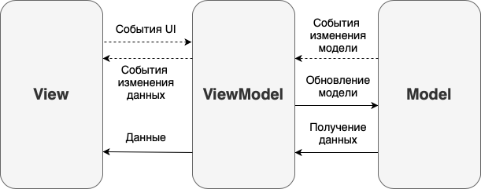

# Android. Мобильное приложение

Разработка и реализация мобильного приложения для операционной системы Android на языке Kotlin.

💡 [Нажми сюда](https://new.oprosso.net/p/4cb31ec3f47a4596bc758ea1861fb624), **чтобы поделиться с нами обратной связью на этот проект**. Это анонимно и поможет нашей команде сделать обучение лучше. Рекомендуем заполнить опрос сразу после выполнения проекта.

## Содержание

1. [Глава 1](#%D0%B3%D0%BB%D0%B0%D0%B2%D0%B0-1)
2. [Глава 2](#%D0%B3%D0%BB%D0%B0%D0%B2%D0%B0-2) \
   2.1. [Правила](#%D0%BF%D1%80%D0%B0%D0%B2%D0%B8%D0%BB%D0%B0) \
   2.2. [Информация](#%D0%B8%D0%BD%D1%84%D0%BE%D1%80%D0%BC%D0%B0%D1%86%D0%B8%D1%8F)
3. [Глава 3](#%D0%B3%D0%BB%D0%B0%D0%B2%D0%B0-3) \
   3.1. [Часть 1. Описание и требования](#%D1%87%D0%B0%D1%81%D1%82%D1%8C-1-%D0%BE%D0%BF%D0%B8%D1%81%D0%B0%D0%BD%D0%B8%D0%B5-%D0%B8-%D1%82%D1%80%D0%B5%D0%B1%D0%BE%D0%B2%D0%B0%D0%BD%D0%B8%D1%8F) \
   3.2. [Часть 2. Реализация слоя данных и слоя бизнес-логики](#%D1%87%D0%B0%D1%81%D1%82%D1%8C-2-%D1%80%D0%B5%D0%B0%D0%BB%D0%B8%D0%B7%D0%B0%D1%86%D0%B8%D1%8F-%D1%81%D0%BB%D0%BE%D1%8F-%D0%B4%D0%B0%D0%BD%D0%BD%D1%8B%D1%85-%D0%B8-%D1%81%D0%BB%D0%BE%D1%8F-%D0%B1%D0%B8%D0%B7%D0%BD%D0%B5%D1%81-%D0%BB%D0%BE%D0%B3%D0%B8%D0%BA%D0%B8) \
   3.3. [Часть 3. Реализация слоя пользовательского интерфейса](#%D1%87%D0%B0%D1%81%D1%82%D1%8C-3-%D1%80%D0%B5%D0%B0%D0%BB%D0%B8%D0%B7%D0%B0%D1%86%D0%B8%D1%8F-%D1%81%D0%BB%D0%BE%D1%8F-%D0%BF%D0%BE%D0%BB%D1%8C%D0%B7%D0%BE%D0%B2%D0%B0%D1%82%D0%B5%D0%BB%D1%8C%D1%81%D0%BA%D0%BE%D0%B3%D0%BE-%D0%B8%D0%BD%D1%82%D0%B5%D1%80%D1%84%D0%B5%D0%B9%D1%81%D0%B0)

## Глава 1

## Введение

Тебе предстоит разработать и реализовать клиентское мобильное приложение для отображения информации об объектах с использованием паттерна MVVM. Приложение будет поддерживать:

- получение коллекции данных с сервера со списком объектов;
- сохранение полученной информации в базу данных;
- отображение списка объектов;
- отображение детальной информации об объекте.

## Глава 2

## Правила

- Исходный код должен быть загружен в git-репозиторий.
- У тебя есть вопрос? Спроси своего соседа справа. В противном случае попробуй обратиться к своему соседу слева.
- Твое справочное руководство: коллеги / Интернет / документация.

## Информация

### Паттерн MVVM

Паттерн MVVM (Model-View-ViewModel) — архитектурный шаблон проектирования приложения. Состоит из трех компонентов: модели бизнес-логики (Model), модели представления (ViewModel) и представления (View).
Механизм привязки данных (bindings) обеспечивает связь между компонентами View и ViewModel.

#### Модель бизнес-логики

Описывает используемые в приложении данные. Модели могут содержать логику, непосредственно связанную этими данными, например, логику валидации свойств модели. В то же время модель не должна содержать никакой логики, связанной с отображением данных и взаимодействием с визуальными элементами управления.

#### Представление

Определяет визуальный интерфейс, через который пользователь взаимодействует с приложением.
Представление передает действия пользователя в модель представления посредством команд.

#### Модель представления

Связывает представление и модель бизнес-логики через механизм привязки данных. Если в модели бизнес-логики изменяются значения свойств, то автоматически происходит изменение отображаемых данных в представлении, хотя напрямую модель бизнес-логики и представление не связаны.

Содержит логику по получению данных из модели бизнес-логики, которые потом передаются в представление. Модель представления определяет логику по обновлению данных в модели бизнес-логики.

Визуальные компоненты, например, поле ввода, не используют события, а представление взаимодействует с моделью представления посредством команд. Например, пользователь хочет сохранить введенные в текстовое поле данные. Он нажимает на кнопку и тем самым отправляет команду в модель представления. А модель представления уже получает переданные данные и в соответствии с ними обновляет модель.

## Глава 3

### Часть 1. Описание и требования

**Общие требования:**

- Код программы должен находиться в папке src и не противоречить требованиям ниже.
- В качестве референса по дизайну ты можешь использовать [Material 2](https://m2.material.io/develop/android).
- Дизайн приложения должен быть интуитивно понятным.

**Для реализации мобильного приложения нужно использовать следующие стандартные инструменты:**

- Android Studio 2022.1.1;
- Kotlin 1.8.10;
- Android SDK 32;
- Gradle 7.6 (управление зависимостями);
- Material 2 (создание пользовательского интерфейса).

**В проект должны быть добавлены следующие зависимости:**

- Room 2.5.0 (работа с базой данных);
- Kotlinx.Serialization 1.4.1 (сериализация JSON);
- Retrofit 2.9.0 (сетевое взаимодействие);
- Dagger 2.45 (внедрение зависимостей);
- Kotlin Coroutines 1.6.4 (асинхронная работа).

**Приложение должно отвечать следующим требованиям с точки зрения архитектуры:**

- Использование архитектурного паттерна MVVM.
- Присутствие трех основных слоев приложения: данных, бизнес-логики и пользовательского интерфейса.

### Часть 2. Реализация слоя данных и слоя бизнес-логики

В этой части тебе необходимо реализовать:

1. Слой данных (datasource):
   - База данных:
     - Должны быть созданы отдельные модели (Entity) для таблиц базы данных.
     - Имя модели должно формироваться как ИмяEntity (Например, UserEntity).
     - Должны быть реализованы CRUD-операции.
   - Сетевой сервис:
     - Должны быть созданы отдельные модели (Dto) с сериализатором.
     - Имя модели должно формироваться как ИмяDto (Например, UserDto).
2. Слой бизнес-логики (domain):
   - Должны быть созданы отдельные модели (Domain).
   - Имя модели должно формироваться как Имя (Например, User).
   - Должны быть реализованы мапперы для Dto<->Domain, Entity<->Domain. Обрати внимание, мапперы должны располагаться в тех слоях (в тех пакетах), из которых они конвертируют модели (entity, dto) в модели бизнес-логики.
   - Мапперы должны быть оформлены в виде [функций расширения](https://kotlinlang.org/docs/extensions.html).
   - Должен быть реализован репозиторий для работы с базой данных.
   - Должен быть реализован репозиторий для работы с сетевым сервисом.
3. Внедрение зависимостей (DI).

Проверить правильность получения и сохранения данных можно с помощью логирования.

### Часть 3. Реализация слоя пользовательского интерфейса

В этой части тебе необходимо:

1. Реализовать слой пользовательского интерфейса (presentation):
   - Главный экран:
     - Кнопка обновления информации об объектах:
       - При нажатии на кнопку должно происходить получение данных об объектах с сервера.
       - Операция получения данных с сервера должна выполняться асинхронно и не блокировать главный поток.
       - При ошибке получения данных с сервера должно показаться всплывающее уведомление на экране.
       - Данные, полученные с сервера, должны быть сохранены в базу данных.
       - Операция сохранения данных с сервера должна выполняться асинхронно и не блокировать главный поток.
     - Список с краткой информацией об объектах:
       - Данные для отображения должны браться из базы данных.
       - Операция получения информации из базы данных должна выполняться асинхронно и не блокировать главный поток.
       - Элемент списка должен содержать несколько текстовых полей, а также картинку.
       - При нажатии на элемент списка должен происходить переход на экран с подробностями об объекте.
     - Должна поддерживаться горизонтальная и вертикальная ориентация устройства.
   - Экран с подробностями об объекте:
     - Детальная информация об объекте:
       - Должна отображаться полная информация об объекте.
       - Данные должны быть загружены из сети в базу данных.
       - Операция загрузки данных из сети в базу данных должна выполняться асинхронно и не блокировать главный поток.
       - Данные для отображения должны быть получены из базы данных.
       - Операция получения информации из базы данных должна выполняться асинхронно и не блокировать главный поток.
       - Должна обеспечиваться возможность прокрутки отображаемых данных, если не все содержимое помещается на экране.
       - Должна поддерживаться горизонтальная и вертикальная ориентация устройства.
   - Должны быть созданы отдельные модели (ViewData).
   - Имя модели должно формироваться как ИмяViewData (Например, UserViewData).
   - Должны быть реализованы мапперы ViewData<->Domain.
   - Мапперы должны быть оформлены в виде [функции расширения](https://kotlinlang.org/docs/extensions.html).
2. Обеспечить связь между слоем пользовательского интерфейса и слоем бизнес-логики.