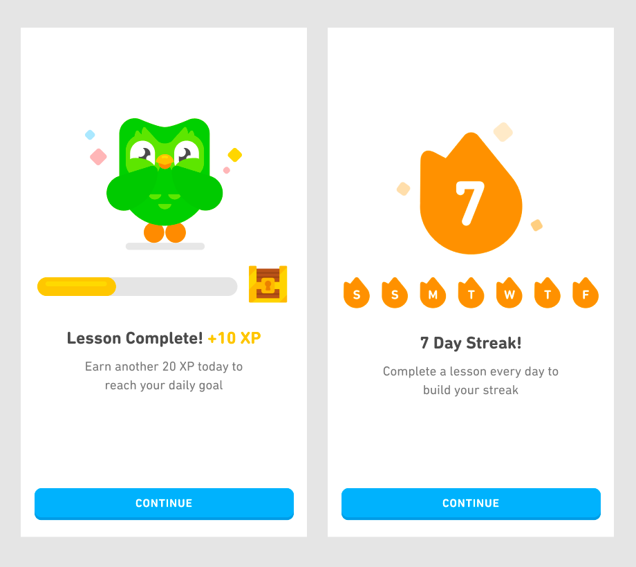
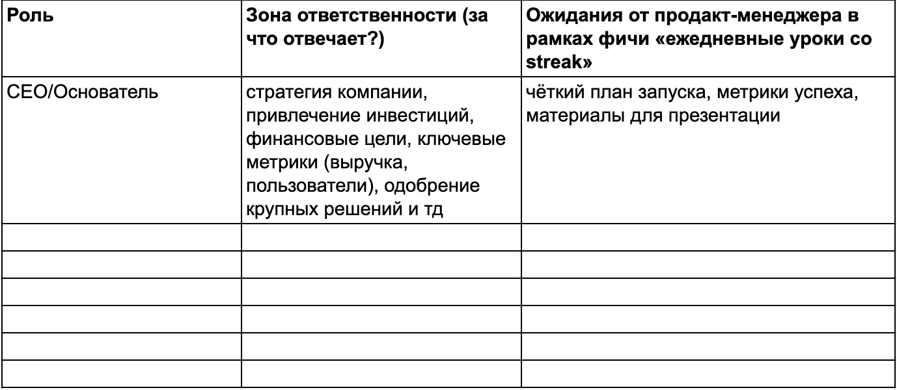
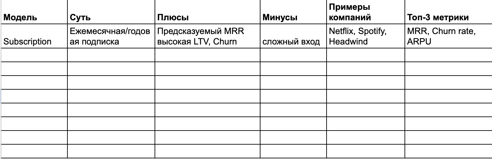

## Основы работы продакт-менеджера

В этом проекте ты освоишь ключевые этапы запуска фичи в EdTech: от анализа ролей в команде (дизайнер, разработчики, продакт-менеджер) и классификации продукта до построения жизненного цикла и практической работы с инструментами для управления проектами.

На примере внедрения функции «Ежедневные уроки со streak» — от kick-off до формирования бэклога — ты научишься распределять роли, декомпозировать задачи, фиксировать договоренности со стейкхолдерами и работать в трекерах.

Полученные навыки можно сразу применять в работе: для согласования ожиданий между CEO и разработкой и создания бэклогов спринтов.

💡 [Нажми сюда](https://new.oprosso.net/p/4cb31ec3f47a4596bc758ea1861fb624), **чтобы поделиться с нами обратной связью на этот проект**. Это анонимно и поможет нашей команде сделать обучение лучше. Рекомендуем заполнить опрос сразу после выполнения проекта.

## Содержание

-   [Как учиться в «Школе 21»](https://platform.21-school.ru/project/73463/task#%D0%BA%D0%B0%D0%BA-%D1%83%D1%87%D0%B8%D1%82%D1%8C%D1%81%D1%8F-%D0%B2-%D1%88%D0%BA%D0%BE%D0%BB%D0%B5-21)
-   [Введение](https://platform.21-school.ru/project/73463/task#%D0%B2%D0%B2%D0%B5%D0%B4%D0%B5%D0%BD%D0%B8%D0%B5)
-   [Chapter I](https://platform.21-school.ru/project/73463/task#chapter-i)
-   [Chapter II](https://platform.21-school.ru/project/73463/task#chapter-ii)
    -   [Задание 1. Роли в команде](https://platform.21-school.ru/project/73463/task#%D0%B7%D0%B0%D0%B4%D0%B0%D0%BD%D0%B8%D0%B5-1-%D1%80%D0%BE%D0%BB%D0%B8-%D0%B2-%D0%BA%D0%BE%D0%BC%D0%B0%D0%BD%D0%B4%D0%B5)
    -   [Задание 2. Классификация продукта и выбор фичи](https://platform.21-school.ru/project/73463/task#%D0%B7%D0%B0%D0%B4%D0%B0%D0%BD%D0%B8%D0%B5-2-%D0%BA%D0%BB%D0%B0%D1%81%D1%81%D0%B8%D1%84%D0%B8%D0%BA%D0%B0%D1%86%D0%B8%D1%8F-%D0%BF%D1%80%D0%BE%D0%B4%D1%83%D0%BA%D1%82%D0%B0-%D0%B8-%D0%B2%D1%8B%D0%B1%D0%BE%D1%80-%D1%84%D0%B8%D1%87%D0%B8)
    -   [Задание 3. Жизненный цикл продукта](https://platform.21-school.ru/project/73463/task#%D0%B7%D0%B0%D0%B4%D0%B0%D0%BD%D0%B8%D0%B5-3-%D0%B6%D0%B8%D0%B7%D0%BD%D0%B5%D0%BD%D0%BD%D1%8B%D0%B9-%D1%86%D0%B8%D0%BA%D0%BB-%D0%BF%D1%80%D0%BE%D0%B4%D1%83%D0%BA%D1%82%D0%B0)
    -   [Задание 4. Первый бэклог](https://platform.21-school.ru/project/73463/task#%D0%B7%D0%B0%D0%B4%D0%B0%D0%BD%D0%B8%D0%B5-4-%D0%BF%D0%B5%D1%80%D0%B2%D1%8B%D0%B9-%D0%B1%D1%8D%D0%BA%D0%BB%D0%BE%D0%B3)
    -   [Задание 5. Фиксация договоренностей](https://platform.21-school.ru/project/73463/task#%D0%B7%D0%B0%D0%B4%D0%B0%D0%BD%D0%B8%D0%B5-5-%D1%84%D0%B8%D0%BA%D1%81%D0%B0%D1%86%D0%B8%D1%8F-%D0%B4%D0%BE%D0%B3%D0%BE%D0%B2%D0%BE%D1%80%D0%B5%D0%BD%D0%BD%D0%BE%D1%81%D1%82%D0%B5%D0%B9)

-   Здесь тебя ждет уникальный образовательный опыт с большим количеством свободы. Ты получаешь задачу и самостоятельно ищешь пути решения, используя любые удобные способы поиска информации — ресурсы Интернета или нейросети (например, GigaChat). Но внимательно относись к качеству информации: проверяй, думай, анализируй, сравнивай.
-   Взаимообучение (Peer-to-Peer, P2P) — это обмен знаниями и опытом с другими пирами, где каждый выступает и учителем, и учеником. Такой подход позволяет глубже понять материал, учась друг у друга.
-   Чувствуй себя свободно и проси о помощи — вокруг тебя те, кто тоже впервые проходят этот путь. Делись своим опытом и идеями с другими. Присоединяйся к RocketChat, чтобы быть в курсе всех новостей от нашего сообщества.
-   Твое обучение не будет иметь никакого смысла, если ты будешь копировать чужие решения. Если пользуешься помощью других — всегда разбирайся до конца, почему, как и зачем. Не бойся ошибиться.
-   Кажется, что задача невыполнима? Сделай перерыв, проветрись, перезагрузи голову — это помогало многим. Возможно, после этого решение придет само собой.
-   Важен не только результат обучения, но и сам процесс. Нужно не просто решить задачу, а понять, КАК ее решить.

Как работать с проектом:

-   Перед выполнением проект необходимо склонировать с GitLab в одноименный репозиторий.
-   Все файлы необходимо создавать в папке _src/_ склонированного репозитория.
-   После клонирования проекта необходимо создать ветку develop и вести разработку в ней. После этого пушить в GitLab также нужно ветку develop.
-   В твоей директории не должно быть иных файлов, кроме тех, что обозначены в заданиях.

## Введение

Добро пожаловать в мир реальных продуктовых задач!

В проектах этого направления не будет теории, ее ты точно сможешь найти самостоятельно. Но будет погружение в симуляцию реальной продуктовой разработки.

О чем будут проекты?

1.  В каждом проекте ты будешь выполнять роль продакт-менеджера. У тебя есть команда, стейкхолдеры и все их противоречивые ожидания.
2.  У тебя будет максимально реалистичная среда: давление от CEO, dev не понимает ТЗ, дизайнер рисует без плана, маркетинг обещает миллионы и другие проблемы.
3.  Конкретные дедлайны: «фича через 3 недели», «отчёт завтра», «питч для инвесторов».
4.  Задания построены таким образом, что ты будешь осваивать реальные рабочие инструменты типа Miro, Notion, Figma, DataLens и их отечественные аналоги на практике. То, что используют в компаниях.

Быть продактом — это не только про навыки, но и про насмотренность.

Поэтому с каждым проектом ты будешь погружаться в разный контекст: будут меняться компании, отрасли, этапы развития продукта.

Например:

EdTech → FinTech → E-commerce → HealthTech

Seed → Product-Market Fit → Scale → Close

В заданиях тебе нужно будет работать с теми же инструментами, что используют продакт-менеджеры.

Если конкретный инструмент окажется недоступен, в задании будет отмечено, что тебе необходимо самостоятельно найти и использовать его аналог (в том числе отечественный) для решения задачи.

## Chapter I

Представь, что ты — новый продакт-менеджер в 5-й команде EdTech-приложения по изучению языков. Ваш продукт — мобильное приложение LinguaDaily для изучения языков (английский, испанский, китайский). При этом базовые уроки доступны бесплатно, а премиум-версия дает доступ к дополнительным материалам и убирает рекламу.

Текущие метрики продукта: 5k MAU, D1 retention 25%, конверсия в премиум 3%.

Ты приходишь на первую встречу с командой.

CEO «Петя» (он же основатель, говорит быстро):

_«Нужно срочно добавить фичу как у Duolingo — streak + геймификация. Инвесторы ждут движения. Запуск через 3 недели. Иначе они уйдут»._

Разработчик «Саша» (вздыхает):

_«Понятно, что срочно. Но “как у Duolingo” — это размыто. У меня нет ТЗ. Backend не потянет 10 фич сразу. Нужны приоритеты и конкретика. Что делать сначала?»_

Дизайнер «Катя» (отправляет ссылку в общий чат):

_«Я пока подготовила 8 вариантов экранов Streak_ (дисклеймер: ты понимаешь, что это было сделано без связи с задачей)_, посмотрите, какой лучше?»_

Маркетолог «Дима» (обращается ко всем):

_«Я уже лью таргет, обещаю 1M установок. Мне нужны креативы, а для креативов — что показывать! Дайте мне работающую фичу!»_

Ты понимаешь, что действия в команде не скоординированы, каждый говорит о своем, и не факт, что понимает, чем занимаются другие. В таких условиях есть риск сорвать срок.

**Задача вашей команды:** запустить фичу «Ежедневные уроки со streak» (пользователь получает серию уроков, за пропуск теряет streak) за три недели, а твоя задача как продакта — скоординировать процесс, чтобы все случилось.

|_Streak (ударный режим) — это система мотивации, популярная в приложениях для изучения языков (как [Duolingo](https://ru.duolingo.com/help/what-is-a-streak)), где огонек (🔥) показывает, сколько дней подряд вы выполняете хотя бы одно задание, помогая формировать привычку и закреплять знания. Streak длится, пока вы занимаетесь каждый день, и его потеря мотивирует продолжать, даже в трудных обстоятельствах, чтобы не прерывать цепочку.
|---|
Как это работает (на примере Duolingo):
1\. Занимайтесь каждый день:выполняйте хотя бы один урок, чтобы ваш streak продолжился
2\. Значок пламени (🔥) показывает количество дней подряд.
3\. Мотивация: поддерживает постоянную практику, которая важна для изучения языка.
4\. Напоминания: можно настроить уведомления в приложении, чтобы не забывать заниматься.
_|

Источник: [https://blog.duolingo.com/improving-the-streak/](https://blog.duolingo.com/improving-the-streak/)

## Chapter II

## Задание 1. Роли в команде

Сначала тебе нужно детальнее познакомиться с ролью PM и ее отличиями от других ролей в твоей команде.

Доступные данные:

-   «Петя» (CEO): ожидает запуск фичи через 3 недели, хочет питч для инвесторов.
-   «Саша» (Developer = Full Stack): умеет React Native, backend на Node.js, жалуется на расплывчатые ТЗ.
-   «Катя» (Product Design): работает в Figma, но рисует без пользовательских сценариев.
-   «Дима» (App Marketing): Яндекс Директ / ASO / Фичиринг в сторах, обещает 100k установок за 500k руб.

**Что сделать:**

1.  Создай страницу в Notion / Google Sheets (или другом аналоге, в т. ч. и отечественном).
2.  Назови страницу или вкладку таблицы: «Роли в команде».
3.  Создай таблицу со следующими колонками: «Роль», «Зона ответственности» (за что отвечает?), «Ожидания от продакт-менеджера» в рамках фичи «Ежедневные уроки со streak».
4.  Самостоятельно изучи информацию и заполни таблицу для 7 ролей: CEO, Product manager, Dev (full stack), Product Design, Marketing manager App, Product owner, Project manager.
5.  При заполнении таблицы тебе могут пригодиться исследования рынка продакт-менеджмента за 2024 и 2025 годы ([ссылка](https://devcrowd.ru/pm25/)), чтобы понять ожидания от роли, направления и тренды профессии, изучить ЗП и другие моменты.

Часто у профессионалов есть личные базы знаний или графы, которые действуют как быстрая шпаргалка и источник развития.

На этом шаге ты можешь начать формировать свою базу знаний по теме продакт-менеджмента — формировать список книг, Telegram-каналов, блогов и других артефактов, упомянутых в исследованиях или найденных самостоятельно.

_Пример заполнения_

**Результат:** таблица «Роли в команде» (7 ролей).

## Задание 2. Классификация продукта и выбор фичи

**Цель**: описать типы продуктов и влияние на задачи продакта.

**Что сделать:**

1.  В том же документе из Задания 1 создай новую страницу (в Notion) или вкладку (в Google Sheets) с названием «Модели монетизации».
2.  Заполни таблицу «Модели монетизации» с исследованием основных видов (минимум 5) моделей монетизации цифровых продуктов (Модель, Суть, Плюсы, Минусы, Примеры компаний, Топ-3 метрики).

_Пример заполнения таблицы «Модели монетизации»:_

1.  После исследования всех моделей выбери наиболее подходящую для твоего продукта. Ниже под сравнительной таблицей отдельной строкой вынеси название выбранной модели и приведи 2–3 аргумента, обосновывающие твой выбор, почему выбранная модель подходит наиболее всего.
2.  В том же документе из Задания 1 создай новый лист с названием «Выбор фичи».
3.  Ознакомься с описанием пяти потенциальных фич. Заполни таблицу «Выбор фичи» с колонками: «Название фичи», «Соответствие продукту» (учитывая метрики: 5k MAU, D1 25%, премиум 3%), «Сложность внедрения», «Приоритет».

По итогам заполнения выбери одну фичу для реализации в первом спринте.

_Спринт — это отрезок времени, где результатом будет поставка ценности. У спринта есть 1–2 цели, над достижением которой работает вся команда. Стандартная практика — 2 недели равны 1 спринту._

_Спринт (sprint) пришел из методологии Scrum — гибкой методологии управления проектами, которая используется для разработки программного обеспечения._

|**Фича**|**Что это**|
|---|---|
|**Streak**|Ежедневные уроки из серии дней (🔥), регулярные напоминания, где твоя мотивация — не прервать цепочку|
|**Геймификация**|Разные уровни, бейджи или ачивки|
|**Доступ оффлайн**|Скачивание уроков для работы без интернета (для тех, кто в дороге)|
|**Push**|Уведомления о новых уроках/напоминаниях|
|**Социалка**|Делиться прогрессом с кем-то, челленджи с друзьями|

4\. Обоснуй свой выбор (укажи 2–3 аргумента, почему лучше начать именно с этой фичи). Напиши аргументы в строке рядом с выбранной фичей.

**Результат:**

-   Таблица «Модели монетизации» + аргументы в пользу выбранной модели.
-   Таблица «Выбор фичи» + аргументы в пользу выбранной фичи.

## Задание 3. Жизненный цикл продукта

**Цель**: показать жизненный цикл продукта и взаимодействие продакта со стейкхолдерами.

**Что сделать:**

1.  Составить схему жизненного цикла твоего продукта:
    -   Создай доску в Miro с названием, связанным с твоим проектом (или другом аналоге, в т. ч. и отечественном, например, Holst), и нарисуй схему жизненного цикла продукта с этапами: Idea —> MVP/MLP —> Scaling —> Support
    -   Для каждого этапа кратко подпиши основную задачу этой фазы (например, для этапа MVP/MLP — поиск product–market fit).
2.  Обозначить текущую стадию продукта, на которой находится команда:
    -   Определи, на каком этапе находится ваш образовательный продукт, и на схеме визуально выдели этот этап (например, MVP/MLP — цветом, рамкой или иконкой).
    -   Под блоком текущей стадии перечисли 2–3 ключевых риска продукта на данном этапе (например, отсутствие product–market fit, нестабильные метрики, ограниченные ресурсы разработки).
3.  Определить взаимодействие продакта со стейкхолдерами:
    -   Для каждого из 4 этапов жизненного цикла (Idea, MVP/MLP, Scaling, Support) определи по одному по одному ключевому типу взаимодействия продакт-менеджера со стейкхолдерами (например, этап Idea — продакт согласует видение продукта и цели с CEO).
    -   Отобрази эти взаимодействия на схеме с помощью стрелок, кратких подписей или иконок (кто, с кем и по какому поводу взаимодействует на каждом этапе).

**Результат:**

Итоговая схема жизненного цикла продукта с этапами должна быть целостной и информативной. По ней должно быть понятно:

-   какие стадии проходит продукт;
-   где находится ваша команда сейчас;
-   какие риски актуальны;
-   как продакт коммуницирует со стейкхолдерами на каждом этапе.

## Задание 4. Первый бэклог

**Цель**: практика работы с задачами и их трекингом, ролями в команде и декомпозицией фичи.

**Шаг 1. Создать проект для ведения активности**

Что сделать:

-   В Trello/Notion (или другом аналоге, в т. ч. и отечественном) создай новый проект/доску.
-   Создай на доске 5 колонок для отслеживания статуса задач (например, Backlog → To Do → In Progress → Testing → Done).

**Шаг 2. Декомпозировать фичу для сценария на 8 задач**

Тебе нужно разложить фичу «Ежедневные уроки со streak» на 8 задач по типу работы:

-   3 задачи — дизайн;
-   3 задачи — разработка (dev);
-   2 задачи — тестирование.

Для каждой категории задач есть рекомендации по фокусу на механику streak:

-   В дизайне обязательно предусмотреть:
    -   Дизайн экрана/состояния «ежедневный урок» + визуальный счетчик streak (например, иконка пламени с числом дней подряд).
    -   Дизайн состояний «продолжается» и «прерван» (что видит пользователь, если пропустил день).
    -   Дизайн экрана/элементов напоминаний/баннеров, которые мотивируют сохранить streak (тексты, визуальные подсказки).
-   В разработке учесть:
    -   Разработку бэкенд-логики подсчета streak: что считается за «день», когда streak увеличивается, как обнуляется, что происходит при минимальной активности (1 урок в день).
    -   Хранение и отображение количества дней подряд в интерфейсе.
    -   Настройку уведомлений/напоминаний, которые помогают не прервать streak (push, in‑app).
-   В тестирование заложить:
    -   Проверку, что streak корректно растет при ежедневном выполнении хотя бы одного урока и корректно сбрасывается или «ломается» при пропуске.
    -   Тестирование системы уведомлений: приходят ли уведомления вовремя, помогают ли не пропустить день (разные сценарии: пользователь сделал урок утром/вечером, не заходил целый день и т. п.).

**Важно:** при формулировании задач для команды используй формулировки, которые отражают, именно фича поддерживает формирование ежедневной привычки у пользователя. Избегай абстрактных задач в стиле «Добавить экран».

_NB: для системности можно отдельно собрать все техническое и дизайн-требование к фиче в один артефакт/документ, а далее разделить по задачам. Это поможет комплексно описать функционал и перейти к части его дробления на непересекающиеся задачи для дизайнеров, разработчиков и тестировщиков._

**Шаг 3. Назначить ответственных по ролям**

Для каждой из 8 созданных карточек-задач укажи исполнителя (роль), чтобы участник команды с первого взгляда на доску понимал, за какой тип работы кто отвечает. Опирайся на роли из Задания 1:

-   \[Design\] Дизайнер отвечает за задачи, связанные с UX/UI.
-   \[Dev\] Разработчики — за создание логики учета дней и т. д.
-   \[QA\] Тестировщики — за тестирование сценариев «каждый день выполняю урок» и т. д.

**Шаг 4. Приоритизировать задачи (топ‑3 на спринт)**

Из 8 задач в бэклоге выбери 3 самые важные, которые станут целью первого спринта. Зафиксируй эти задачи в отдельном пространстве.

Приоритизируй с учетом того, что сама core-механика streak — ключевой мотивационный механизм.

По итогам спринта из топ‑3 задач должна появиться фича, которая позволяет:

-   проходить ежедневный урок;
-   видеть, что streak растет;
-   получать базовое напоминание, помогающее не забыть и не прервать цепочку.

_Пример возможного топ‑3:_

-   _\[Design\] Сценарий экрана «ежедневный урок» + отображение streak_.
-   _\[Dev\] Реализация логики подсчета streak (увеличение при выполнении урока, сброс при пропуске)_.
-   _\[QA\] Базовые тесты сценария «пользователь делает один урок в день → streak растет»_.

Критерий приоритета: первый инкремент должен уже демонстрировать «ощущение серии» и мотивировать вернуться завтра.

**Результат:** доска бэклога, в которой настроены 5 колонок: Backlog → To Do → In Progress → Testing → Done, отражены и распределены задачи, выбраны 3 задачи на спринт.

## Задание 5. Фиксация договоренностей

**Цель**: отработать взаимодействие со стейкхолдерами и научиться прозрачно фиксировать договоренности по запуску фичи.

**Шаг 1. Создать страницу в Notion**

В рабочем пространстве Notion (или другом аналоге, в т. ч. и отечественном) создай страницу с названием «Kick-off фичи: Ежедневные уроки со streak» или «Meet».

Задай понятную структуру страницы. Например, в виде блоков/заголовков:

-   Цели фичи:
    -   Стейкхолдеры и их ожидания.
    -   Scope первой версии.
    -   Риски и допущения.
    -   План коммуникации.
    -   Метрики успеха (опционально).

Страница должна быть единой «точкой правды» по процессу запуска фичи, куда можно отправить любого участника команды или стейкхолдера, чтобы они могли быстро понять, что и почему делает команда.

**Шаг 2. Зафиксировать ожидания стейкхолдеров**

Перечисли ключевых стейкхолдеров твоего продукта и явно опиши их ожидания от фичи «Ежедневные уроки со streak»:

_Пример оформления блока «Стейкхолдеры и ожидания»:_

-   _CEO:_
    -   _Ожидание: запуск первой версии фичи «Ежедневные уроки со streak» через 2 недели._
    -   _Что важно:_
        -   _чтобы уже работал базовый ежедневный урок и streak (серия дней подряд)_.
        -   _Было что показать пользователям/инвесторам в качестве механики формирования привычки_.

**Шаг 3. Описать Scope и ограничения**

Кратко зафиксируй, что входит в первую версию фичи «Ежедневных уроков со streak(Scope)», а что точно не делается в эту итерацию (Out of Scope):

_Пример оформления блока «Scope и ограничения»:_

-   _В Scope (делаем в первой версии):_
    -   _Базовая механика streak: подсчет дней подряд, когда пользователь сделал хотя бы один урок, и простое отображение streak в интерфейсе._
-   _Out of Scope (не делаем сейчас):_
    -   _Сложные награды и уровни за длину streak._

**Зачем это нужно**: это главный инструмент управления ожиданиями по объему работ и защиты от «расползания» функциональности.

**Шаг 4. Указать риски и допущения**

Создай блок «Риски и допущения» (можешь оформить в виде таблицы: риск — влияние — план реакции).

_Примеры рисков:_

-   _Риск: не успеваем реализовать и протестировать логику streak за 2 недели._
    -   _План митигации: заранее договориться, что в крайнем случае оставляем самый простой вариант streak (счетчик + базовые правила), а дополнительные улучшения переносим._

_Пример фиксации допущений:_

-   _Считаем, что день — это календарные сутки по времени сервера._

**Шаг 5. Описать план коммуникации**

Создай отдельный блок «План коммуникации» и опиши, как команда будет синхронизироваться по процессу запуска фичи.

_Например:_

-   _Ежедневные стендапы в Slack (дейлики):_
    -   _Формат: короткие апдейты в канале или быстрые созвоны._
    -   _Структура: вчера, сегодня, блокеры по фиче «Ежедневные уроки со streak»._

**Результат:** страница «Kick-off фичи: Ежедневные уроки со Streak» или «Meet».

___

**После выполнения всех заданий собери результаты в единый документ — вставь в него все рабочие ссылки на созданные материалы:**

-   **Ссылки на таблицы, страницы и проекты в Notion / Google Sheets / Trello (или на другие аналоговые платформы, в которых выполнялось задание).**
-   **Ссылки на доску в Miro (или на другие аналоговые платформы, в которых выполнялось задание).**

**Перед каждой ссылкой укажи название задания, к которому относится этот материал, и что это за материал.**

**Помести документ в папку _src/_**

💡 [Нажми сюда](https://new.oprosso.net/p/4cb31ec3f47a4596bc758ea1861fb624), **чтобы поделиться с нами обратной связью на этот проект**. Это анонимно и поможет нашей команде сделать обучение лучше. Рекомендуем заполнить опрос сразу после выполнения проекта.