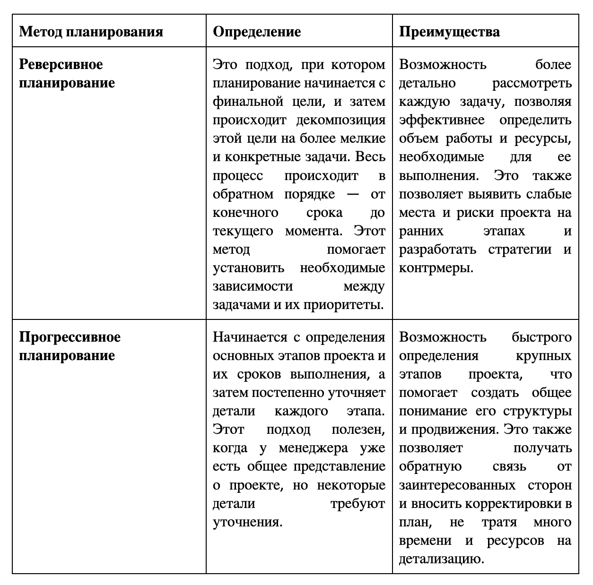
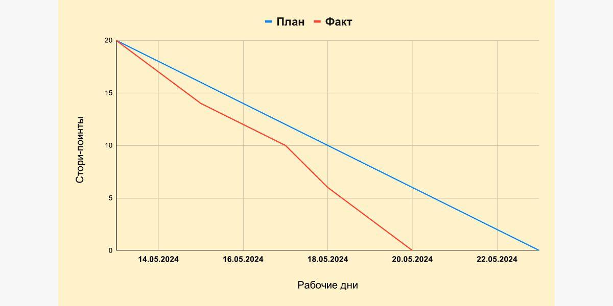

## Проект 10: Как эффективно планировать

> 💡 [Нажми сюда](https://new.oprosso.net/p/4cb31ec3f47a4596bc758ea1861fb624), **чтобы поделиться с нами обратной связью на этот проект**. Это анонимно и поможет нашей команде сделать обучение лучше. Рекомендуем заполнить опрос сразу после выполнения проекта.
> Этот проект познакомит с инструментами планирования и оценки задач, а также подробно рассмотрит релизный цикл разработки.

## Оглавление

- [Chapter I](#chapter-i)
- [Chapter II](#chapter-ii)
- [Chapter III](#chapter-iii)
  - [1.1. Методы реверсивного и прогрессивного планирования](#11-%D0%BC%D0%B5%D1%82%D0%BE%D0%B4%D1%8B-%D1%80%D0%B5%D0%B2%D0%B5%D1%80%D1%81%D0%B8%D0%B2%D0%BD%D0%BE%D0%B3%D0%BE-%D0%B8-%D0%BF%D1%80%D0%BE%D0%B3%D1%80%D0%B5%D1%81%D1%81%D0%B8%D0%B2%D0%BD%D0%BE%D0%B3%D0%BE-%D0%BF%D0%BB%D0%B0%D0%BD%D0%B8%D1%80%D0%BE%D0%B2%D0%B0%D0%BD%D0%B8%D1%8F)
  - [1.2. Буфер, диаграмма сгорания](#12-%D0%B1%D1%83%D1%84%D0%B5%D1%80-%D0%B4%D0%B8%D0%B0%D0%B3%D1%80%D0%B0%D0%BC%D0%BC%D0%B0-%D1%81%D0%B3%D0%BE%D1%80%D0%B0%D0%BD%D0%B8%D1%8F)
  - [1.3. Расчет количества часов на задачу и баланс ресурсов](#13-%D1%80%D0%B0%D1%81%D1%87%D0%B5%D1%82-%D0%BA%D0%BE%D0%BB%D0%B8%D1%87%D0%B5%D1%81%D1%82%D0%B2%D0%B0-%D1%87%D0%B0%D1%81%D0%BE%D0%B2-%D0%BD%D0%B0-%D0%B7%D0%B0%D0%B4%D0%B0%D1%87%D1%83-%D0%B8-%D0%B1%D0%B0%D0%BB%D0%B0%D0%BD%D1%81-%D1%80%D0%B5%D1%81%D1%83%D1%80%D1%81%D0%BE%D0%B2)
  - [1.4. Планирование релизов программного обеспечения](#14-%D0%BF%D0%BB%D0%B0%D0%BD%D0%B8%D1%80%D0%BE%D0%B2%D0%B0%D0%BD%D0%B8%D0%B5-%D1%80%D0%B5%D0%BB%D0%B8%D0%B7%D0%BE%D0%B2-%D0%BF%D1%80%D0%BE%D0%B3%D1%80%D0%B0%D0%BC%D0%BC%D0%BD%D0%BE%D0%B3%D0%BE-%D0%BE%D0%B1%D0%B5%D1%81%D0%BF%D0%B5%D1%87%D0%B5%D0%BD%D0%B8%D1%8F)
- [Chapter IV](#chapter-iv)
  - [1.5. Задания](#15-%D0%B7%D0%B0%D0%B4%D0%B0%D0%BD%D0%B8%D1%8F)

## Chapter I

### Как учиться в "Школе 21"

«Школа 21» может быть не похожа на тот образовательный опыт, который случался с тобой ранее. Это обучение отличает высокий уровень автономии: у тебя есть задача, и ее необходимо выполнить. На протяжении всего курса ты будешь самостоятельно добывать информацию, чтобы углубиться в тему и решить задачу. Пользуйся всеми доступными средствами поиска информации — ресурсы интернета неограниченны. Внимательно относись к источникам информации (например, если используешь нейросети): проверяй, думай, анализируй, сравнивай.

Тебе необходимо презентовать свое решение другим учащимся и получить от них обратную связь. Взаимообучение (P2P, Peer-to-Peer) — это процесс, при котором учащиеся обмениваются знаниями и опытом, выступая одновременно в роли учителей и учеников. Этот подход позволяет учиться не только у преподавателя, но и друг у друга, что способствует более глубокому пониманию материала.

Смело проси о помощи: вокруг тебя такие же пиры, которые тоже проходят этот путь впервые. Не бойся откликаться на просьбы о помощи. Твой опыт ценен и полезен, смело делись им с другими участниками. Присоединяйся к Rocket.Chat, чтобы получать свежие анонсы от сообщества.

Твое обучение не будет иметь никакого смысла, если ты будешь копировать чужие решения. Если пользуешься помощью других — всегда разбирайся до конца, почему, как и зачем. Не бойся ошибиться.

Если ты на чем-то застрял и кажется, что ты уже все перепробовал, но все равно непонятно, куда идти, — просто передохни! Поверь, этот совет помогал многим специалистам в их работе. Проветрись, перезагрузи голову, и, возможно, в следующий раз тебе наконец придет нужное решение!

Важен не только результат обучения, но и сам процесс. Нужно не просто решить задачу, а понять, КАК ее решить.

**Как работать с проектом:**

- Перед выполнением проект необходимо склонировать с GitLab в одноименный репозиторий.
- Все файлы необходимо создавать в папке *src/* склонированного репозитория.
- После клонирования проекта необходимо создать ветку `develop` и вести разработку в ней. После этого пушить в GitLab также нужно ветку `develop`.
- В твоей директории не должно быть иных файлов, кроме тех, что обозначены в заданиях.

## Chapter II

Планирование является одним из ключевых элементов в управлении проектами, и эффективное планирование играет решающую роль в успехе проекта. В этом модуле мы рассмотрим различные методы и инструменты, которые помогают менеджеру достичь максимальной эффективности в планировании.

## Chapter III

### 1.1. Методы реверсивного и прогрессивного планирования

Оба метода имеют свои преимущества и недостатки, и, в конечном итоге, выбор метода планирования будет зависеть от конкретной ситуации и требований проекта. Важно учитывать факторы, такие как сложность проекта, доступность и опыт ресурсов, возможные риски. На разных этапах жизненного цикла проекта можно применять разные методы.

**Пример:**

> *В компании X решили создать новое программное обеспечение. Начальный проект был разработан в соответствии с методом прогрессивного планирования. Однако по мере уточнения деталей, возникла необходимость перейти на метод реверсивного планирования, чтобы более точно определить ресурсы и задачи для каждого этапа разработки.*

### 1.2. Буфер, диаграмма сгорания

Буфер в контексте планирования проекта представляет собой дополнительный запас времени или ресурсов, предусмотренный в плане проекта для возможных задержек или изменений. Буфер помогает учитывать непредвиденные обстоятельства, риски и необходимость внесения корректировок в проектный план без превышения сроков выполнения проекта и снижения качества работы.

Существуют два вида буфера, которые обычно используются в планировании проектов: **временной** и **ресурсный**.

| Временной буфер | Ресурсный буфер |
| --- | --- |
| - Дополнительное время, которое добавляется к каждой задаче или к концу проекта в целом. - Предназначен для возможных задержек, необходимости доработок или изменений, которые могут возникнуть в процессе выполнения проекта. - Помогает обеспечить гибкость и устойчивость проекта к внешним факторам. | - Представляет собой дополнительные ресурсы, которые резервируются для проекта с целью обеспечения его успешного завершения. Это может быть дополнительное количество исполнителей или оборудования. - Позволяет справиться с неожиданными возможностями или проблемами, которые могут возникнуть в ходе выполнения проекта. |

#### Диаграмма сгорания (Burndown Chart)

**Диаграммы сгорания** — удобный инструмент для наблюдения прогресса по проекту и контроля выполнения плана. Это метод наблюдения за ходом проекта и фиксирования оставшегося времени для работы над его бэклогом (оставшимися задачами). Благодаря диаграммам легко понять, идет ли работа по плану и нет ли задержек.

Диаграмму сгорания задач применяют руководители Scrum-команд для наблюдения:

- за оставшимися задачами в проекте;
- за временем, необходимым для завершения этих задач.

В методологии Scrum используются два вида Диаграмм сгорания задач:

- сгорание спринта — для мониторинга объема оставшейся работы в конкретном спринте;
- сгорание проекта — для отслеживания оставшейся работы в проекте.

Для составления диаграммы сгорания в IT-проекте используется методология Agile, а конкретно метод Scrum. Для создания диаграммы могут быть использованы различные инструменты, например:

1. **Jira** — один из самых популярных инструментов для управления проектами Agile и Scrum. Он предоставляет функциональность для создания и отслеживания диаграммы сгорания, автоматически обновляя ее на основе фактического прогресса выполнения задач. К сожалению, продукты Atlassian больше не доступны в России.
2. **Trello** — это онлайн-платформа для управления задачами, которая также может использоваться для создания диаграммы сгорания. В Trello можно создавать списки задач (бэклог) и на основе данных о сроках можно вручную создать график сгорания.
3. **Excel** — это классический инструмент для работы с табличными данными, который можно использовать для создания диаграммы сгорания. Чтобы создать диаграмму сгорания в Excel, можно построить линейный график, где по горизонтальной оси отображается время, и по вертикальной оси — количество задач или историй. После этого можно работать уже с данными в таблице, после изменения которых автоматически обновится соответствующий график.

**Пример диаграммы сгорания** (изучи самостоятельно, что такое сторипоинты):

### 1.3. Расчет количества часов на задачу и баланс ресурсов

Для эффективной оценки времени на выполнение задачи могут применяться следующие методы.

| Метод | Определение | Пример |
| --- | --- | --- |
| Экспертная оценка | Количество часов на задачу оценивается экспертами, которые имеют опыт в предметной области. | В команде есть опытный программист, он дает оценку в 8 часов. |
| Сравнение с ранее выполненными задачами | Если на текущем или на прошлом проекте уже были выполнены задачи, которые похожи по объему на новую задачу, то можно ориентироваться на них для оценки времени на выполнение новой задачи. | Ранее уже был написан алгоритм сортировки массива, на это было потрачено 6 часов. Мы можем использовать эту оценку, как базу для оценки времени на выполнение новой задачи, учитывая ее уникальные особенности и сложность. |
| Пошаговое разбиение | Задачу разбивают на меньшие подзадачи и оценивают время на выполнение каждой из них. Затем, суммируя оценки времени выполнения подзадач, получают итоговую оценку времени на выполнение всей задачи. | Допустим, мы разделим задачу на два этапа: написание алгоритма сортировки и его тестирование. Пусть на написание алгоритма уйдет 5 часов, а на тестирование — 3 часа. Считаем итоговую оценку: 5 часов + 3 часа = 8 часов. |

Таким образом, с помощью различных методов оценки, можно получить более достоверное представление о количестве часов, необходимых для выполнения задачи на проекте.

### 1.4. Планирование релизов программного обеспечения

Мы называем IT-компаниями предприятия, которые доставляют пользователям продукт в виде программного обеспечения. Как создается это программное обеспечение? Например, у нас есть задача 1, задача 2 и задача 3 и в сумме разработчики оценили их выполнение в 1 календарный месяц. Но чтобы получить конкретный срок, в который функционал этих задач будет доступен пользователям, менеджеру проекту нужно учитывать также процессы тестирования и сборки этого функционала в единое целое.

Каждая задача в проекте – это добавление нового кода. При этом, часто платформы, которые разрабатывают IT-команды, просто гигантские, там тысячи пользовательских историй, множество опций и условий. Чтобы новый код был стабилен, IT-команды работают релизными циклами, а также используют интеграцию кода в общий репозиторий с автоматической проверкой и сборкой – CI/CD.

**Релизный цикл** – это заданная последовательность этапов и процессов для выпуска новой версии программного продукта.

**Пример:**

> *Команда выпускает релизы продукта "Сервис поиска авиабилетов" каждые две недели. На этой неделе менеджеры запланировали, что будут сделаны две задачи: 1 – добавить новую фильтрацию цен, 2 – починить ошибку сохранения данных пользователя. Это значит, что в течение недели будет разработан функционал для этих задач, они пройдут тесты и будут объединены в одну версию продукта, затем произойдет релиз и обновление увидят пользователи.*

Таким образом, при планировании задач, менеджер проектов должен учитывать время разработчиков, время на тестирование, а также время на сборку релиза. Поэтому расписание релизов так удобно для команды – чаще всего в компаниях есть определенный дедлайн, до которого нужно выполнить все задачи, которые пойдут в релиз. Например, релиз каждый четверг в 14, значит задачи должны пройти тест и быть в статусе "готово" в среду до 17:00.

Какие еще есть преимущества работы с релизными циклами:

1. **Оперативность:** Возможность быстро выпустить исправления ошибок или отреагировать на внешние события
2. **Управление рисками:** Снижается риск сбоев, связанных с большими релизами, так как каждый релиз проходит через несколько этапов проверки.
3. **Удобство экспериментов:** Команды могут быстро проверять гипотезы и получать обратную связь, не дожидаясь большого цикла.
4. **Проще управлять большим объемом работы:** Разделение большого проекта на множество мелких релизов позволяет сотням разработчиков работать одновременно, не блокируя друг друга.

## **Полезные ссылки**

- <https://app.asana.com/>

## Chapter IV

### 1.5. Задания

#### Задание 1.

В седьмом проекте (User Story, бэклог, документация API) нашего курса ты разработал пространство для проекта в Asana и наполнил его бэклогом выбранного проекта. Возьми на основу этот бэклог и создай диаграмму сгорания:

- Уже с имеющимися новыми знаниями дай оценку задачам, которые находятся в бэклоге. Отметь дедлайны.
- Используя любой инструмент (например, Excel), создай шаблон диаграммы сгорания. Оформи шаблон таким образом, чтобы информация легко воспринималась и не вызывала вопросов.
- Отобрази на диаграмме бэклог проекта. (Ты можешь смоделировать ситуации, при которых какие-то задачи были выполнены в срок, какие-то с опозданием, какие-то, наоборот, раньше оцениваемой даты.)

Загрузи результат своей работы в формате .pdf и .xlsx, .xls, .xlsm в репозиторий в папку src/ в корне проекта (обязательно в ветку develop).

**Результат должен содержать как бэклог проекта, так и диаграмму сгорания.**

#### Задание 2.

В пятом проекте (Сбор требований) ты подготовил документ с требованиями по своему проекту, который будешь реализовывать в рамках курса. Вернись к этим требованиям и составь по ним бэклог для разработки проекта. Используй для этого инструмент [Asana](https://app.asana.com/).

- Разбей работы на этапы.
- Декомпозируй задачи.
- Назначь себя исполнителем в каждой задаче.
- Выбери статусы, по которым будешь следить за выполнением задач и передвигать их на доске.
- Расположи на доске задачи с учетом статуса их выполнения (например, требования по проекту ты уже собрал, значит, задачу можно передвинуть в столбец «Выполнено»).

Ты можешь использовать шаблон [Sprint Planning template](https://asana.com/ru/templates/sprint-planning) или создать свой.

Скриншот выполненной работы или файл с решением в формате .pdf загрузи в репозиторий в папку src/ в корне проекта (обязательно в ветку *develop*).