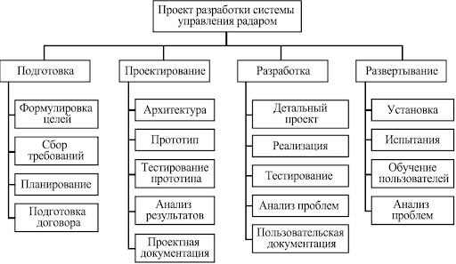
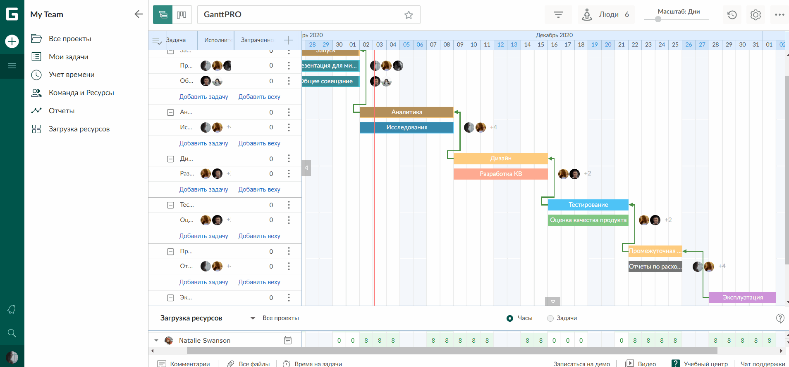
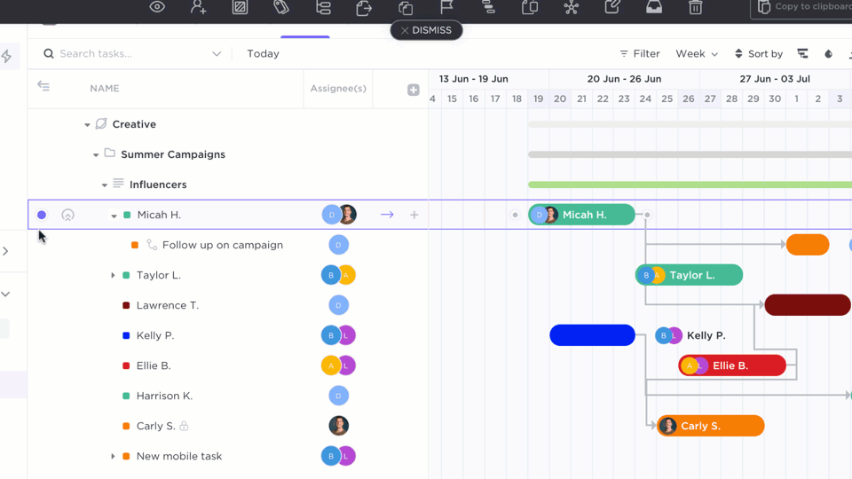
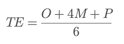

# Проект 11: Формирование плана работ на основе бэклога

> 💡 [Нажми сюда](https://new.oprosso.net/p/4cb31ec3f47a4596bc758ea1861fb624), **чтобы поделиться с нами обратной связью на этот проект**. Это анонимно и поможет нашей команде сделать обучение лучше. Рекомендуем заполнить опрос сразу после выполнения проекта.
> В этом проекте ты научишься строить дорожные карты проекта с учетом последовательности задач и зависимостей между ними.

## Оглавление

- [Chapter I](#chapter-i)
- [Chapter II](#chapter-ii)
- [Chapter III](#chapter-iii)
  - [1.1. Структура декомпозиции проекта](#11-%D1%81%D1%82%D1%80%D1%83%D0%BA%D1%82%D1%83%D1%80%D0%B0-%D0%B4%D0%B5%D0%BA%D0%BE%D0%BC%D0%BF%D0%BE%D0%B7%D0%B8%D1%86%D0%B8%D0%B8-%D0%BF%D1%80%D0%BE%D0%B5%D0%BA%D1%82%D0%B0)
  - [1.2. Дорожная карта проекта и Диаграмма Ганта](#12-%D0%B4%D0%BE%D1%80%D0%BE%D0%B6%D0%BD%D0%B0%D1%8F-%D0%BA%D0%B0%D1%80%D1%82%D0%B0-%D0%BF%D1%80%D0%BE%D0%B5%D0%BA%D1%82%D0%B0-%D0%B8-%D0%B4%D0%B8%D0%B0%D0%B3%D1%80%D0%B0%D0%BC%D0%BC%D0%B0-%D0%B3%D0%B0%D0%BD%D1%82%D0%B0)
  - [1.3. Определение зависимостей между этапами проекта](#13-%D0%BE%D0%BF%D1%80%D0%B5%D0%B4%D0%B5%D0%BB%D0%B5%D0%BD%D0%B8%D0%B5-%D0%B7%D0%B0%D0%B2%D0%B8%D1%81%D0%B8%D0%BC%D0%BE%D1%81%D1%82%D0%B5%D0%B9-%D0%BC%D0%B5%D0%B6%D0%B4%D1%83-%D1%8D%D1%82%D0%B0%D0%BF%D0%B0%D0%BC%D0%B8-%D0%BF%D1%80%D0%BE%D0%B5%D0%BA%D1%82%D0%B0)
  - [1.4. PERT-анализ и сетевые диаграммы](#14-pert-%D0%B0%D0%BD%D0%B0%D0%BB%D0%B8%D0%B7-%D0%B8-%D1%81%D0%B5%D1%82%D0%B5%D0%B2%D1%8B%D0%B5-%D0%B4%D0%B8%D0%B0%D0%B3%D1%80%D0%B0%D0%BC%D0%BC%D1%8B)
- [Chapter IV](#chapter-iv)
  - [1.4. Задания](#14-%D0%B7%D0%B0%D0%B4%D0%B0%D0%BD%D0%B8%D1%8F)

## **Chapter I**

### **Как учиться в «Школе 21»**

«Школа 21» может быть не похожа на тот образовательный опыт, который случался с тобой ранее. Это обучение отличает высокий уровень автономии: у тебя есть задача, и ее необходимо выполнить. На протяжении всего курса ты будешь самостоятельно добывать информацию, чтобы углубиться в тему и решить задачу. Пользуйся всеми доступными средствами поиска информации — ресурсы интернета неограниченны. Внимательно относись к источникам информации (например, если используешь нейросети): проверяй, думай, анализируй, сравнивай.

Тебе необходимо презентовать свое решение другим учащимся и получить от них обратную связь. Взаимообучение (P2P, Peer-to-Peer) — это процесс, при котором учащиеся обмениваются знаниями и опытом, выступая одновременно в роли учителей и учеников. Этот подход позволяет учиться не только у преподавателя, но и друг у друга, что способствует более глубокому пониманию материала.

Смело проси о помощи: вокруг тебя такие же пиры, которые тоже проходят этот путь впервые. Не бойся откликаться на просьбы о помощи. Твой опыт ценен и полезен, смело делись им с другими участниками. Присоединяйся к Rocket.Chat, чтобы получать свежие анонсы от сообщества.

Твое обучение не будет иметь никакого смысла, если ты будешь копировать чужие решения. Если пользуешься помощью других — всегда разбирайся до конца, почему, как и зачем. Не бойся ошибиться.

Если ты на чем-то застрял и кажется, что ты уже все перепробовал, но все равно непонятно, куда идти, — просто передохни! Поверь, этот совет помогал многим специалистам в их работе. Проветрись, перезагрузи голову, и, возможно, в следующий раз тебе наконец придет нужное решение!

Важен не только результат обучения, но и сам процесс. Нужно не просто решить задачу, а понять, КАК ее решить.

### Как работать с проектом

- Перед выполнением проект необходимо склонировать с GitLab в одноименный репозиторий.
- Все файлы необходимо создавать в папке *src/* склонированного репозитория.
- После клонирования проекта необходимо создать ветку `develop` и вести разработку в ней. После этого пушить в GitLab также нужно ветку `develop`.
- В твоей директории не должно быть иных файлов, кроме тех, что обозначены в заданиях.

## Chapter II

На этапе планирования работ нужно учесть много факторов и условий, включая ограниченность ресурсов и времени, потенциальные задержки из-за неправильной последовательности действий. Проектному менеджеру нужно разбить проект на задачи и убедиться в том, что описание прозрачно для исполнителя, а место задачи в общем плане позволяет достигнуть цели проекта максимально эффективно.

## Chapter III

### 1.1. Структура декомпозиции проекта

**Структура декомпозиции проекта (Work Breakdown Structure, WBS)** — инструмент управления проектами, используемый для визуализации результатов проекта в иерархической структуре. Он помогает руководителям проектов разбить сложную проектную деятельность на простые и управляемые задачи.

**Как его использовать**

**Шаг 1.** Первым шагом создания структуры декомпозиции работ является понимание масштаба проекта. На этом шаге определяются цели проекта.

**Шаг 2.** Определяются ключевые этапы первого уровня. Декомпозируем главную цель на достижимые, конкретные результаты.

**Шаг 3.** Разбивка этапов на задачи.

**Шаг 4.** Декомпозиция задач на подзадачи и группировка их в так называемых пакетов. Пакетами работ традиционно называют завершающие ответвления ИСР на самом низком уровне, где указываются действия для закрытия этапов. У каждого пакета работ должно быть описание с данными об ответственных и ходе выполнения соответствующих задач.

**Шаг 5.** Назначение ответственных. За каждой задачей закрепляется ответственный.

Другое название Структуры декомпозиции проекта в русском языке — **Иерархическая структура работ (ИСР)**. ИСР не включает в себя информацию о сроках и ресурсах и представляет собой первый шаг в проектной стратегии.

Существуют разные формы графического исполнения ИСР: контурная структура, иерархическая таблица, дерево.

**Пример ИСР в виде древовидной структуры:**

### 1.2. Дорожная карта проекта и Диаграмма Ганта

В начале работ над проектом важно, чтобы все участники команды и стейкхолдеры понимали, какие цели и задачи перед ними стоят и в какие сроки какие задачи должны быть выполнены, что для этого потребуется и кто ответственен за каждый из этапов. Для визуализации этой информации составляют дорожную карту проекта.

**Дорожная карта (от англ. roadmap)** — это документ, в котором наглядно отображается стратегический план проекта: его главные цели и задачи, сроки исполнения, ответственные, основные этапы. Дорожная карта помогает всем участникам понять, зачем нужен проект и что должно получиться в результате.

**Как разработать roadmap:**

- Разбить проект на крупные задачи.
- Прописать сроки реализации каждого этапа.
- Назначить ответственных.

Когда дорожная карта работ по проекту будет готова, нужно проверить, чтобы она соответствовала **трём критериям**:

- **Прозрачность.** Roadmap должен быть понятен всем участникам команды.
- **Гибкость.** Дорожная карта должна быть гибкой, то есть уметь подстраиваться под внешние обстоятельства (например, должна быть возможность менять местами этапы, менять исполнителей, снимать зависимости, двигать сроки и т. д.). В противном случае при малейших изменениях потребуется возвращаться в самое начало и строить roadmap заново.
- **Отражать риски.** Если участник видит, что на каком-то этапе могут быть сложности, нужно зафиксировать и обсудить этот момент.

**Диаграмма Ганта** — это популярный тип столбчатых диаграмм, который используется для иллюстрации дорожной карты проекта. Чаще всего менеджеры проектов пользуются именно этим инструментом.

Создание диаграммы Ганта — один из важных этапов в управлении проектами, поэтому развитию инструментов в этой области уделяется много времени. По статистике около 30% менеджеров строят диаграммы Ганта в Excel. Это достаточно устаревший метод. В сравнении с другими инструментами Excel тяжеловесен, не так гибок в управлении, не имеет удобных интеграций с досками задач. Поэтому для работы лучше использовать готовые сервисы с разными полезными фичами.

[GanttPro](https://ganttpro.com/) — один из самых популярных и продвинутых сервисов не только для построения диаграммы Ганта, но и в целом для управления проектами. Единственный минус — сервис доступен только при покупке лицензии (есть двухнедельный тестовый период).

[Clickup](https://app.clickup.com/) — сервис, включающий себя все необходимые функции для управления проектами. Сервис интуитивно понятен для пользователя, облегчённый дизайн и обучающие подсказки, всплывающие при первом использовании ClickUp, помогут менее чем за час разобраться в основных функциях. ClickUp совмещает в себя десятки различных функций: составления списка целей и задач, чат, создание документов, уведомлений, составление расписания, построение диаграммы Ганта и др.

Полезная фишка — сервис интегрирован с Asana. Диаграмму Ганта можно легко построить на основе доски задач в Asana. Этим мы и займемся в задании к этому модулю.

В Jira тоже можно создать диаграмму Ганта. Среди других сервисов Miro, Advanced Roadmaps, ProductPlan, Roadmunk.

### 1.3. Определение зависимостей между этапами проекта

На этапе формирования плана важно определить зависимости между этапами работ и отдельными задачами. Это тоже можно отобразить на диаграмме Ганта. Например, нельзя приступить к вёрстке без готовых дизайн-макетов. Это очень простой пример, но когда дело касается технически сложных проектов, зависимости между задачами могут быть неявными на первый взгляд, но блокирующими друг друга по сути.

Определение зависимостей между этапами проекта очень важно для его успешного выполнения. Зависимости могут быть логическими или физическими. Определение зависимостей помогает сформировать порядок выполнения задач.

**Примеры зависимостей между этапами проекта:**

- Начало следующего этапа зависит от завершения предыдущего этапа. Например, перед тем как начать разработку программного продукта, необходимо завершить этап анализа и проектирования.
- Некоторые задачи могут требовать завершения нескольких предыдущих задач перед тем, как будут выполнены.
- Некоторые задачи могут выполняться параллельно, не имея прямой зависимости друг от друга. Например, разработка пользовательского интерфейса и разработка базы данных могут быть выполнены параллельно. В конечном счете это может сократить общий срок реализации проекта. Поэтому важно параллелить все задачи, которые только можно.
- При планировании процесса разработки ПО, нужно учитывать релизные циклы, о которых мы говорили ранее. Если разработчики закончили фичу к 1 октября, это не значит, что другая команда сможет ей воспользоваться 2 октября, даже если тестирование пройдено. У релизов может быть своё расписание и приоритеты, иногда бывают ситуации, что задача выполнена, но ждёт своей очереди на запуск месяцами.

## 1.4. PERT-анализ и сетевые диаграммы

PERT-анализ (от Program Evaluation and Review Technique) — это классический инструмент управления проектами, особенно полезный для оценки сроков выполнения проекта и анализа неопределённости. Этот метод помогает также определить критический путь проекта и понять, какие задачи влияют на общую длительность проекта, а какие имеют запас времени.

Критический путь это самая длинная последовательность работ в проекте, определяющая его минимальную продолжительность. Длина критического пути равна длительности проекта, а любая задержка на критическом пути означает задержку всего проекта.

Основная идея PERT-анализа в использовании трёх оценок времени для каждой задачи:

| Тип оценки | Что означает | Пример |
| --- | --- | --- |
| O (Optimistic) | Минимальное время, если всё пойдёт идеально | 3 дня |
| M (Most likely) | Наиболее вероятное время | 5 дней |
| P (Pessimistic) | Максимальное время при неблагоприятных условиях | 9 дней |

Из них рассчитывается ожидаемое время (TE) по формуле:

Это средневзвешенное значение, где основной вес даётся наиболее вероятному сценарию. При подстановке оценок из таблицы мы получаем TE = 5,3 дня.

PERT анализ часто используется совместно с еще одним инструментом визуализации хода проекта – сетевой диаграммой. Это карта проекта, которая отражает последовательность задач, их продолжительность и зависимости. Для составления PERT-диаграмм можно использовать стандартный функционал Excel или удобный [шаблон Miro](https://miro.com/app/dashboard/?tpTemplate=pert-diagram&isCustom=false&share_link_id=313456027267).

Пример, где может быть полезно использование PERT – проект, где задачи одной команды зависят от результата работы другой команды. Рассмотрим все детали такого кейса.

| Задача | Запуск промо-кампании с розыгрышами призов |
| --- | --- |
| Вовлеченные команды | Сервис регистрации чеков Сервис розыгрышей Сервис авторизации пользователей Промо-сайт |
| Описание необходимых действий для запуска | A. Настройка проекта в сервисе для регистрации чеков B. Разработка API методов для запуска розыгрышей, присвоения призов C. Разработка API методов для регистрации и авторизации пользователей D. Разработка промо-сайта |
| Описание зависимостей и последовательности действий | Чтобы протестировать запуск розыгрышей и присвоение призов, нужен готовый проект регистрации чеков. Разработка промо-сайта ведется после того, как все API-методы уже готовы. |
| Критический путь | A -> B -> D |
| Сетевая диаграмма | net diagram |

## Полезные ссылки

<https://app.clickup.com/login>\
<https://ganttpro.com/>\
<https://app.clickup.com/>

# Chapter IV

## 1.4 Задания

### Задание 1

Продолжим плотно работать над проектом, который ты реализуешь в рамках курса. В прошлом уроке ты подготовил пространство с задачами в Asana. Создай для своего проекта ИСР. Возможно, ты поймешь, что какие-то задачи нужно еще больше декомпозировать или поменять местами из-за зависимостей.

- Используй для построения ИСР любой вид визуализации: контурная структура, иерархическая таблица или дерево.
- Дополни ИСР небольшими вводными по своему проекту, чтобы проверяющему было понятно, как оценивать твой проект.
- Определи цель проекта.
- Разбей структуру на этапы.
- Декомпозируй этапы на задачи.
- Определи в задачах пакеты работ.

Результат своей работы в формате .*pdf* загрузи в репозиторий в папку `src/` в корне проекта (обязательно в ветку *develop*).

### Задание 2

Создай диаграмму Ганта в сервисе [Clickup](https://app.clickup.com/) для своего проекта. Сервис интегрирован с [Asana](https://asana.com/), где в предыдущем уроке ты уже создал пространство с задачами. При построении диаграммы Ганта можно импортировать эту доску. После импорта настрой зависимости между этапами, отобрази статусы.

Результат своей работы в формате .*pdf* загрузи в репозиторий в папку `src/` в корне проекта (обязательно в ветку *develop*).