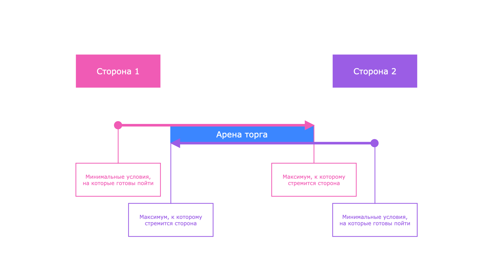

# Проект 14: Эффективные переговоры

Проект описывает виды и этапы переговоров, а также стратегии переговоров для достижения своих целей в различных ситуациях.

## Оглавление

- [Chapter I](#chapter-i)
  - [Как учиться в «Школе 21»](#%D0%BA%D0%B0%D0%BA-%D1%83%D1%87%D0%B8%D1%82%D1%8C%D1%81%D1%8F-%D0%B2-%D1%88%D0%BA%D0%BE%D0%BB%D0%B5-21)
  - [Как работать с проектом](#%D0%BA%D0%B0%D0%BA-%D1%80%D0%B0%D0%B1%D0%BE%D1%82%D0%B0%D1%82%D1%8C-%D1%81-%D0%BF%D1%80%D0%BE%D0%B5%D0%BA%D1%82%D0%BE%D0%BC)
- [Chapter II](#chapter-ii)
- [Chapter III](#chapter-iii)
  - [1.1. Основные понятия. Виды переговоров, этапы](#11-%D0%BE%D1%81%D0%BD%D0%BE%D0%B2%D0%BD%D1%8B%D0%B5-%D0%BF%D0%BE%D0%BD%D1%8F%D1%82%D0%B8%D1%8F-%D0%B2%D0%B8%D0%B4%D1%8B-%D0%BF%D0%B5%D1%80%D0%B5%D0%B3%D0%BE%D0%B2%D0%BE%D1%80%D0%BE%D0%B2-%D1%8D%D1%82%D0%B0%D0%BF%D1%8B)
  - [1.2. Как подготовиться к переговорам](#12-%D0%BA%D0%B0%D0%BA-%D0%BF%D0%BE%D0%B4%D0%B3%D0%BE%D1%82%D0%BE%D0%B2%D0%B8%D1%82%D1%8C%D1%81%D1%8F-%D0%BA-%D0%BF%D0%B5%D1%80%D0%B5%D0%B3%D0%BE%D0%B2%D0%BE%D1%80%D0%B0%D0%BC)
  - [1.3. Ключевые навыки для проведения эффективных переговоров](#13-%D0%BA%D0%BB%D1%8E%D1%87%D0%B5%D0%B2%D1%8B%D0%B5-%D0%BD%D0%B0%D0%B2%D1%8B%D0%BA%D0%B8-%D0%B4%D0%BB%D1%8F-%D0%BF%D1%80%D0%BE%D0%B2%D0%B5%D0%B4%D0%B5%D0%BD%D0%B8%D1%8F-%D1%8D%D1%84%D1%84%D0%B5%D0%BA%D1%82%D0%B8%D0%B2%D0%BD%D1%8B%D1%85-%D0%BF%D0%B5%D1%80%D0%B5%D0%B3%D0%BE%D0%B2%D0%BE%D1%80%D0%BE%D0%B2)
  - [1.4. Сложности и стратегии их преодоления в переговорах](#14-%D1%81%D0%BB%D0%BE%D0%B6%D0%BD%D0%BE%D1%81%D1%82%D0%B8-%D0%B8-%D1%81%D1%82%D1%80%D0%B0%D1%82%D0%B5%D0%B3%D0%B8%D0%B8-%D0%B8%D1%85-%D0%BF%D1%80%D0%B5%D0%BE%D0%B4%D0%BE%D0%BB%D0%B5%D0%BD%D0%B8%D1%8F-%D0%B2-%D0%BF%D0%B5%D1%80%D0%B5%D0%B3%D0%BE%D0%B2%D0%BE%D1%80%D0%B0%D1%85)
  - [1.5. Базовые стратегии переговоров и арена торга](#15-%D0%B1%D0%B0%D0%B7%D0%BE%D0%B2%D1%8B%D0%B5-%D1%81%D1%82%D1%80%D0%B0%D1%82%D0%B5%D0%B3%D0%B8%D0%B8-%D0%BF%D0%B5%D1%80%D0%B5%D0%B3%D0%BE%D0%B2%D0%BE%D1%80%D0%BE%D0%B2-%D0%B8-%D0%B0%D1%80%D0%B5%D0%BD%D0%B0-%D1%82%D0%BE%D1%80%D0%B3%D0%B0)
- [Chapter IV](#chapter-iv)
  - [1.6. Задания](#16-%D0%B7%D0%B0%D0%B4%D0%B0%D0%BD%D0%B8%D1%8F)

## Chapter I

### Как учиться в «Школе 21»

1. «Школа 21» может быть не похожа на тот образовательный опыт, который случался с тобой ранее. Это обучение отличает высокий уровень автономии: у тебя есть задача, и ее необходимо выполнить. На протяжении всего курса ты будешь самостоятельно добывать информацию, чтобы углубиться в тему и решить задачу. Пользуйся всеми доступными средствами поиска информации — ресурсы интернета неограниченны. Внимательно относись к источникам информации (например, если используешь нейросети): проверяй, думай, анализируй, сравнивай.
2. Тебе необходимо презентовать свое решение другим учащимся и получить от них обратную связь. Взаимообучение (P2P, Peer-to-Peer) — это процесс, при котором учащиеся обмениваются знаниями и опытом, выступая одновременно в роли учителей и учеников. Этот подход позволяет учиться не только у преподавателя, но и друг у друга, что способствует более глубокому пониманию материала.
3. Смело проси о помощи: вокруг тебя такие же пиры, которые тоже проходят этот путь впервые. Не бойся откликаться на просьбы о помощи. Твой опыт ценен и полезен, смело делись им с другими участниками. Присоединяйся к Rocket.Chat, чтобы получать свежие анонсы от сообщества.
4. Твое обучение не будет иметь никакого смысла, если ты будешь копировать чужие решения. Если пользуешься помощью других — всегда разбирайся до конца, почему, как и зачем. Не бойся ошибиться.
5. Если ты на чем-то застрял и кажется, что ты уже все перепробовал, но все равно непонятно, куда идти, — просто передохни! Поверь, этот совет помогал многим специалистам в их работе. Проветрись, перезагрузи голову, и, возможно, в следующий раз тебе наконец придет нужное решение!
6. Важен не только результат обучения, но и сам процесс. Нужно не просто решить задачу, а понять, КАК ее решить.

### Как работать с проектом

1. Перед выполнением проект необходимо склонировать с GitLab в одноименный репозиторий.
2. Все файлы необходимо создавать в папке src/ склонированного репозитория.
3. После клонирования проекта необходимо создать ветку develop и вести разработку в ней. После этого пушить в GitLab также нужно ветку develop.
4. В твоей директории не должно быть иных файлов, кроме тех, что обозначены в заданиях.

## Chapter II

Работа менеджера подразумевает постоянное участие в переговорах. Согласование требований по проекту, бюджета, команды — это всё переговоры. И от умения менеджера говорить, слушать, аргументировать зависит успех проекта. Кроме профессиональной деятельности, мы ежедневно участвуем в переговорах и в повседневной рутине. Договориться с родными или партнёром о покупке чего-либо в дом, о совместном путешествии и т. д. — в любой сфере можно применять навыки успешного переговорщика. Поэтому текущий модуль будет максимально полезен для всех сфер жизни.

## Chapter III

### 1.1. Основные понятия. Виды переговоров, этапы

Переговоры — это процесс общения и взаимодействия между двумя или более сторонами с целью достижения соглашения по определенному вопросу или решению проблемы. В контексте проектного управления переговоры могут происходить с клиентами, командой проекта, стейкхолдерами и другими заинтересованными сторонами.

Основные виды переговоров в проектном управлении:

- **Внутренние переговоры:** происходят внутри команды проекта или организации. Например, переговоры о ресурсах, приоритетах задач, распределении обязанностей.
- **Внешние переговоры:** зависят от взаимодействия с внешними стейкхолдерами, такими как клиенты, поставщики и партнеры. Например, переговоры о сроках реализации проекта, финансовых вопросах, требованиях к проекту.
- **Международные переговоры:** имеют место при работе с международными клиентами или проектами, сотрудничестве с компаниями из других стран. Например, менеджер работает в российском филиале корпорации Johnson&Johnson. Структура выстроена таким образом, что в каждой стране есть своё представительство бренда. Все эти представительства с технической стороны обслуживает одна команда разработки, которая базируется в Бельгии. Каждая локальная команда периодически коммуницирует по своим задачам с глобальной командой разработки.

Затронем специфику переговоров в отношении типа компании, где работает менеджер проектов — в агентстве, предоставляющем проекты на заказ или в команде, которая разрабатывает собственный продукт.

В агентстве менеджер представляет интересы заказчика и выступает связующим звеном между клиентом и внутренней командой: он фиксирует ожидания, согласовывает бюджеты, защищает сроки и объём работ. Главная сложность здесь — баланс между тем, что хочет клиент, и тем, что объективно возможно выполнить команде. Поэтому агентские переговоры часто построены вокруг обоснования стоимости, объёма работ, приоритизации и управления ожиданиями.

В продуктовой компании переговоры происходят внутри экосистемы одной организации, но это не делает их проще. Менеджер продукта или проекта ведёт переговоры со стейкхолдерами: владельцами процессов, руководителями департаментов, разработчиками, маркетингом. Здесь нет «клиента» в классическом смысле — есть множество сторон с пересекающимися интересами, ограниченными ресурсами и своим представлением о ценности задач. Переговоры часто строятся вокруг установления приоритетов, доказательства бизнес-ценности, совместного поиска решений и выравнивания целей между командами.

Главное отличие: **в агентстве переговоры чаще внешние и контрактные**, а **в продукте — внутренние и стратегические**. В первом случае менеджер должен уметь мягко, но чётко отстаивать позицию команды и обосновывать стоимость услуг. Во втором — выстраивать долгосрочное сотрудничество со стейкхолдерами, договариваться об обмене ресурсами и аргументировать продуктовые решения данными.

**Основные этапы переговоров**

| Этап переговоров | Описание |
| --- | --- |
| Подготовка | Определение целей и интересов, анализ ситуации, исследование собеседников и их требований |
| Обсуждение | Стороны обмениваются информацией и ищут взаимовыгодные решения. Важно слушать активно, устанавливать доверительные отношения и использовать эмпатию |
| Принятие решений | После обсуждения стороны приходят к соглашению и принимают решение |
| Реализация | Важно следить за выполнением договоренностей и при необходимости вносить коррективы |

### 1.2. Как подготовиться к переговорам

Очень важным аспектом эффективных переговоров является подготовка. Чем лучше менеджер подготовлен, тем больше шансов на успешный и взаимовыгодный результат. Рассмотрим несколько ключевых шагов для подготовки к переговорам:

- **Исследование и анализ ситуации:** перед началом переговоров необходимо провести исследование и обзор ситуации. Использовать доступные ресурсы: документы, отчеты, историю предыдущих переговоров, чтобы получить полное представление о контексте и важных факторах.
- **Определение целей и интересов:** на основе исследования определить свои цели и интересы, а также цели и интересы другой стороны. Определить, чего мы хотим достичь в результате переговоров. Проработать для себя крайние значения, на которые мы готовы: идеальный исход, хороший, приемлемый и ни в каком варианте неприемлемый.
- **Составление стратегии переговоров:** разработать стратегию, которая поможет достичь поставленных целей. Учесть сильные и слабые стороны, а также стиль предпочтений и стратегии другой стороны. Подумать о возможных альтернативных вариантах, чтобы быть готовыми к компромиссам. Например, менеджер встречается с заказчиком для обсуждения бюджета проекта. Заказчик готов заплатить 1 млн руб., а менеджер подготовил смету на 1,5 млн руб. Во время встречи обе стороны решают, каким образом можно уложиться в бюджет: сократить объемы разработки, урезать функционал, подключить к проекту менее опытного, но с более низкой ставкой часа разработчика, увеличить сроки разработки и т. д.
- **Установление коммуникативного плана:** определение того, как менеджер будет представлять свою точку зрения и общаться с другой стороной. Выбор подходящих коммуникационных навыков и инструментов для эффективного взаимодействия и убеждения.

Важно помнить, что подготовка к переговорам — это непрерывный процесс, который требует анализа и обновления информации на каждом этапе. Чем более информированным и готовым будет менеджер, тем выше вероятность достичь успеха в процессе переговоров.

### 1.3. Ключевые навыки для проведения эффективных переговоров

Теперь, когда мы разобрались с основами переговоров и процессом подготовки, рассмотрим ключевые навыки, которые могут помочь менеджеру.

| Навык переговорщика | Описание |
| --- | --- |
| Активное слушание и эмпатия | Полезно отдать приоритет другой стороне, внимательно выслушать и действительно понять ее интересы и потребности, а не гнуть свою линию. Практиковать активное слушание можно, поставив себя на место другой стороны |
| Установление доверительных отношений со сторонами | Когда переговоры начались, уже может быть поздно устанавливать доверительные отношения. Поэтому менеджер должен быть всегда на шаг впереди. Быть открытым и объективным, проявлять искреннюю заинтересованность к проекту, а не думать только о получении личной выгоды. |
| Творческое мышление и поиск взаимовыгодных решений | Часто переговоры связаны с компромиссами. Важно развивать свои навыки творческого мышления и поиска взаимовыгодных решений. Искать варианты, которые удовлетворяют интересы всех сторон и создают положительный результат для проекта. |
| Коммуникационные навыки и умение убеждать | Аргументы должны быть логичными, подкрепляться фактами. Во время коммуникации можно использовать дополнительную визуализацию — примеры, иллюстрации. С помощью такой предварительной подготовки можно гораздо лучше выразить свои идеи. Ясный, убедительный язык, говорение без восходящих неуверенных интонаций также добавляет авторитета выступающему. |
| Обработка конфликтов и управление эмоциями | Переговоры могут вызывать конфликты и эмоциональные реакции — это нормально. Нужно разобраться в источниках конфликтов и использовать стратегии управления конфликтами: поиск компромиссов, построение конструктивного диалога и учет интересов всех сторон. |

Применение этих ключевых навыков поможет провести эффективные переговоры, достичь согласия и взаимовыгодного результата для проекта и всех заинтересованных сторон.

### 1.4. Сложности и стратегии их преодоления в переговорах

В процессе переговоров могут возникать различные сложности и преграды — это нормальная ситуация, не стоит заранее бояться, что что-то пойдет не так. Рассмотрим некоторые из часто возникающих сложностей и стратегии их преодоления.

| Сложность | Описание | Как противостоять |
| --- | --- | --- |
| Манипуляция | Сознательная или неосознанная манипуляция со стороны других участников переговоров. Если заказчик говорит: «Я так хочу, сделайте так», — это тоже манипуляция. Варианты манипуляций: эмоциональное подавление, манипуляция фактами и обстоятельствами, доверием. Изучи самостоятельно приёмы манипуляций, которые могут применяться в переговорах. Предупрежден — значит вооружен. | быть морально готовым к манипуляции со стороны оппонента сохранять спокойствие и не торопиться задавать уточняющие вопросы все время возвращать обсуждение к плану переговоров |
| Преодоление преград в общении с представителями других профессий | Заказчик может не быть глубоко погружен в технические аспекты разработки, но быть профессиональным маркетологом и разбираться в стратегии развития своего продукта. В данном случае полезно объединить свои знания и направить их на общее развитие продукта. | Подготовка должна быть особенно тщательной: все термины и сложные технические нюансы нужно «перевести» на максимально простой и понятный язык. Заранее продумать примеры, с помощью которых можно проиллюстрировать свои идеи. |
| Явная агрессия со стороны других участников переговоров | Не всегда обе стороны тщательно готовятся к переговорам и используют максимально эмпатичные техники. Все-таки не нужно забывать о том, что стороны в переговорах — это люди. Люди могут быть агрессивны, могут грубо высказываться и вести себя несоответственно ситуации. Нужно быть готовым к тому, что такая ситуация может произойти. | Если вторая сторона уже находится в состоянии агрессии, то вернуть ее в баланс и продолжить переговоры, скорей всего, не получится. Должно пройти время. Возможно, у человека сегодня плохой день, и есть другие заботы, которые спровоцировали такую реакцию. Наилучшей стратегией будет перенести переговоры на другой день. |

### 1.5. Базовые стратегии переговоров и арена торга

Существует семь базовых стратегий переговоров. Они могут комбинироваться, дополняться, видоизменяться, но базово сохраняется следующий перечень:

- Приспособление
- Игнорирование
- Доминирование
- Манипуляция
- Соперничество
- Компромисс
- Сотрудничество

Важное понятие, с которым нужно работать перед переговорами, — арена торга.

Арена торга — диапазон торга по одному условию контракта, ограниченный двумя значениями. Речь может идти не только о деньгах, но и о сроках, объемах работ и т.д. Арена торга — это место пересечения допустимых для обеих сторон условий.

Во время переговоров каждая сторона может до последнего оттягивать момент раскрытия карт. Это нормальная позиция. Каждая сторона хочет получить свой максимум. Важно получить этот максимум без уничтожения своего оппонента. То есть, например, если Сторона 1 вынудила Сторону 2 согласиться на минимальные условия, на которые Сторона 2 готова пойти, то в конечном счете не факт, что такая ситуация сыграет Стороне 1 на руку. Ведь момент переговоров означает, что впереди между сторонами будет еще длительное сотрудничество. Поэтому все-таки желательный исход — такой, который устроит обе стороны.

## Chapter IV

### 1.6. Задания

#### Задание 1. Изучение стратегий переговоров

Изучи стратегии переговоров. Составь таблицу (или иной вид представления информации), где дай определение и характерные признаки каждой из стратегий переговоров:

- Приспособление,
- Игнорирование,
- Доминирование,
- Манипуляция,
- Соперничество,
- Компромисс,
- Сотрудничество.

Результат в формате .pdf или xsl загрузи в репозиторий в папку src/ в корне проекта (обязательно в ветку *develop*).

#### Задание 2. Подготовка к переговорам

Представь, что тебе предстоит встреча с заказчиком, на которой вы будете обсуждать смету по проекту. Ты заранее знаешь, что заказчика не устраивает сумма, которую ему рассчитали. Подготовься к переговорам по следующему брифу.

- Коротко опиши, какой проект нужен заказчику (например, корпоративный сайт строительной компании, мобильное приложение по поиску попутчика для путешествий, интернет-магазин по продаже веганских десертов, CRM-система для банка и т. д.).
- Перечисли функционал, который должен быть разработан. (5-10 параметров, 1 слайд).
- Определи цели переговоров и интересы каждой из сторон.
- Определи арену торга. Заполни минимум-максимум со стороны компании разработчика и предположи минимум-максимум со стороны заказчика.
- Проработай стратегию переговоров. Смоделируй возражения заказчика и закрой их заранее продуманными ответами. Отработай таким образом не менее 5 возражений.
- Продумай, какие инструменты и методы ты мог бы использовать. Например, метод «салями» или «открытая дверь». Изучи, какие инструменты, техники и методы бывают, и выбери 3 наиболее подходящих для твоего кейса. Опиши каждый из выбранных методов применимо к своим переговорам.

Презентацию с результатами подготовки к переговорам в формате .pdf или .pptx загрузи в репозиторий в папку src/ в корне проекта (обязательно в ветку *develop*).