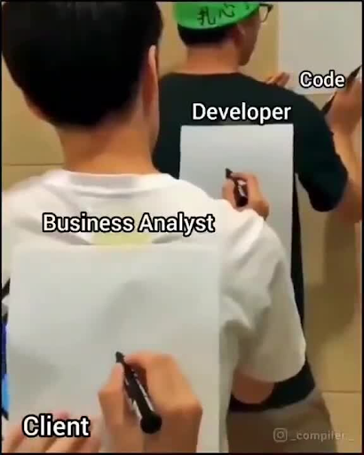
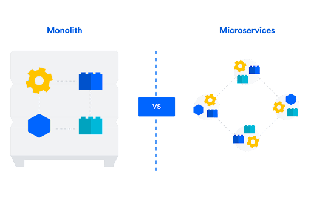
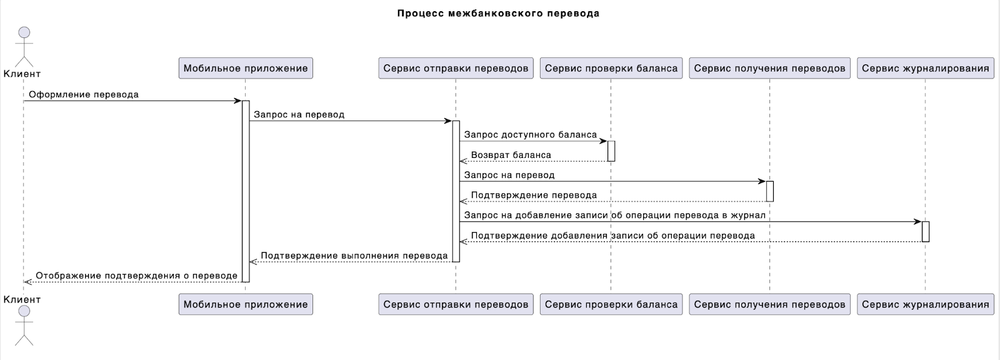

# Проект 18: Аналитика и архитектура проекта

> 💡 [Нажми сюда](https://new.oprosso.net/p/4cb31ec3f47a4596bc758ea1861fb624), **чтобы поделиться с нами обратной связью на этот проект**. Это анонимно и поможет нашей команде сделать обучение лучше. Рекомендуем заполнить опрос сразу после выполнения проекта.
> В проекте познакомимся с задачами и инструментами аналитики, рассмотрим основные бизнес-модели и UML диаграммы.

## Оглавление

- [Chapter I](#chapter-i)
  - [Как учиться в «Школе 21»](#%D0%BA%D0%B0%D0%BA-%D1%83%D1%87%D0%B8%D1%82%D1%8C%D1%81%D1%8F-%D0%B2-%D1%88%D0%BA%D0%BE%D0%BB%D0%B5-21)
  - [Как работать с проектом](#%D0%BA%D0%B0%D0%BA-%D1%80%D0%B0%D0%B1%D0%BE%D1%82%D0%B0%D1%82%D1%8C-%D1%81-%D0%BF%D1%80%D0%BE%D0%B5%D0%BA%D1%82%D0%BE%D0%BC)
- [Chapter II](#chapter-ii)
- [Chapter III](#chapter-iii)
  - [1.1. Аналитика](#11-%D0%B0%D0%BD%D0%B0%D0%BB%D0%B8%D1%82%D0%B8%D0%BA%D0%B0)
  - [1.2. Проектирование и архитектура](#12-%D0%BF%D1%80%D0%BE%D0%B5%D0%BA%D1%82%D0%B8%D1%80%D0%BE%D0%B2%D0%B0%D0%BD%D0%B8%D0%B5-%D0%B8-%D0%B0%D1%80%D1%85%D0%B8%D1%82%D0%B5%D0%BA%D1%82%D1%83%D1%80%D0%B0)
  - [1.3. Модели AS-IS и TO-BE](#13-%D0%BC%D0%BE%D0%B4%D0%B5%D0%BB%D0%B8-as-is-%D0%B8-to-be)
  - [1.4. Диаграмма последовательностей](#14-%D0%B4%D0%B8%D0%B0%D0%B3%D1%80%D0%B0%D0%BC%D0%BC%D0%B0-%D0%BF%D0%BE%D1%81%D0%BB%D0%B5%D0%B4%D0%BE%D0%B2%D0%B0%D1%82%D0%B5%D0%BB%D1%8C%D0%BD%D0%BE%D1%81%D1%82%D0%B5%D0%B9)
- [Chapter IV](#chapter-iv)
  - [1.5. Задания](#15-%D0%B7%D0%B0%D0%B4%D0%B0%D0%BD%D0%B8%D1%8F)
    - [Задание 1.](#%D0%B7%D0%B0%D0%B4%D0%B0%D0%BD%D0%B8%D0%B5-1)

## Chapter I

### Как учиться в «Школе 21»

1. «Школа 21» может быть не похожа на тот образовательный опыт, который случался с тобой ранее. Это обучение отличает высокий уровень автономии: у тебя есть задача, и ее необходимо выполнить. На протяжении всего курса ты будешь самостоятельно добывать информацию, чтобы углубиться в тему и решить задачу. Пользуйся всеми доступными средствами поиска информации — ресурсы интернета неограниченны. Внимательно относись к источникам информации (например, если используешь нейросети): проверяй, думай, анализируй, сравнивай.
2. Тебе необходимо презентовать свое решение другим учащимся и получить от них обратную связь. Взаимообучение (P2P, Peer-to-Peer) — это процесс, при котором учащиеся обмениваются знаниями и опытом, выступая одновременно в роли учителей и учеников. Этот подход позволяет учиться не только у преподавателя, но и друг у друга, что способствует более глубокому пониманию материала.
3. Смело проси о помощи: вокруг тебя такие же пиры, которые тоже проходят этот путь впервые. Не бойся откликаться на просьбы о помощи. Твой опыт ценен и полезен, смело делись им с другими участниками. Присоединяйся к Rocket.Chat, чтобы получать свежие анонсы от сообщества.
4. Твое обучение не будет иметь никакого смысла, если ты будешь копировать чужие решения. Если пользуешься помощью других — всегда разбирайся до конца, почему, как и зачем. Не бойся ошибиться.
5. Если ты на чем-то застрял и кажется, что ты уже все перепробовал, но все равно непонятно, куда идти, — просто передохни! Поверь, этот совет помогал многим специалистам в их работе. Проветрись, перезагрузи голову, и, возможно, в следующий раз тебе наконец придет нужное решение!
6. Важен не только результат обучения, но и сам процесс. Нужно не просто решить задачу, а понять, КАК ее решить.

### Как работать с проектом

1. Перед выполнением проект необходимо склонировать с GitLab в одноименный репозиторий.
2. Все файлы необходимо создавать в папке src/ склонированного репозитория.
3. После клонирования проекта необходимо создать ветку develop и вести разработку в ней. После этого пушить в GitLab также нужно ветку develop.
4. В твоей директории не должно быть иных файлов, кроме тех, что обозначены в заданиях.

## Chapter II

Мы приступаем к изучению объемного модуля, который касается непосредственно разработки продукта. Здесь мы рассмотрим более подробно этапы жизненного цикла проекта или продукта, выясним, какие специалисты задействованы на каждом из этапов, какие инструменты здесь применяются и что непосредственно своими руками делает менеджер. С подготовительным этапом мы уже познакомились ранее, когда изучали сбор требований, бюджетирование, формирование плана по проекту и реестра рисков.

## Chapter III

### 1.1. Аналитика

Начнем с разбора этапа аналитики. На этом этапе осуществляется детальное изучение требований заказчика и анализ существующих систем и процессов. Главная цель этого этапа — определение функциональных и нефункциональных требований к проекту, а также разработка подробного плана реализации.

Одной из основных задач на этапе аналитики является более глубокий анализ и документирование требований. Для этого применяются разные инструменты, о которых мы уже говорили на курсе. В числе основных методов: интервьюирование заказчика, брифинг, анализ документации и проведение исследований. Результатом этой работы является создание документа «Требования к проекту», который содержит все необходимые требования и ограничения.

На этом этапе в работу активно вовлечены бизнес-аналитик и технический писатель. Бизнес-аналитик описывает требования, технический писатель пишет техническое задание. Заказчик или стейкхолдер тоже активно вовлечены в процессы, так как на их стороне валидируются требования и финализируются документы.

С какими инструментами работают бизнес-аналитики? Перечислим некоторые популярные инструменты:

- Microsoft Excel и его аналоги,
- PowerPoint и аналоги,
- Task-трекеры (Jira, Trello, Asana и др.),
- Базы знаний (Confluence, Notion и др.),
- Базы данных,
- Microsoft Visio и аналоги,
- Python-скрипты,
- SAS,
- TIBCO Spotfire.

Роль проектного менеджера на этапе аналитики заключается в координации работы аналитической команды и обеспечении правильного понимания требований заказчика. Он также отвечает за составление плана аналитических работ и контроль их выполнения. Проще говоря, если мы договорились с заказчиком, что пришлем документ с требованиями через две недели, то менеджер должен проследить за соблюдением этих сроков.

Все документы, сформированные на этом этапе, подлежат обязательному согласованию с заказчиком.

На небольших типовых проектах этап аналитики может целиком закрыть менеджер без вовлечения аналитика и технического писателя. Например, для проекта по созданию сайта-визитки для репетитора собрать требования и проанализировать аудиторию может менеджер. Но когда дело касается интернет-магазина с большим каталогом или разработки CRM для управления бизнесом, потребуются знания аналитиков.

### 1.2. Проектирование и архитектура

Разберем этап проектирования и архитектуры. На этом этапе разрабатывается детальный план реализации проекта, определяются структура и компоненты системы, а также выбираются технологии и инструменты для реализации.

PM должен понимать, где мы храним данные, как и куда мы их передаем, как взаимодействуют части приложения под капотом между собой и т. д.

**Архитектура** — это схематическое пояснение, откуда и куда перетекают данные, как они обрабатываются, на каких этапах предоставляются пользователям.

Какой может быть архитектура приложения. Эти термины PM должен знать и уметь объяснить, в чем разница между ними:

- **монолитная архитектура (монолит)** — в основе функциональные блоки, которые находятся в одной кодовой базе и зависят друг от друга;
- **микросервисная архитектура (микросервисы)** — базируется на отдельных модулях, которые взаимодействуют между собой по определенному алгоритму и образуют общую систему.

Еще одно понятие, с которым часто работают менеджеры в крупных компаниях, — это legacy. Технологии развиваются с высокой скоростью. Соответственно, то, что мы разработали несколько лет назад, постепенно устаревает. И чем дольше наше приложение существует, тем больше legacy-кода оно содержит. Главная проблема устаревших кодов — в сложном обеспечении их поддержки. Поэтому часто менеджеры в корпорациях управляют проектами, связанными с модернизацией legacy.

Существует еще альтернативный вариант микросервисов — **Серверлес (Serverless Computing).** Этот вариант позволяет разрабатывать приложения, хранить данные и настраивать интеграцию с другими платформами без создания виртуальных машин и обслуживания инфраструктуры.

Одна из основных задач на этапе проектирования и архитектуры — это разработка архитектуры системы. Это включает в себя определение компонентов системы, их взаимодействия и структуры данных. Для этого применяются разные инструменты, например, UML (Unified Modeling Language), диаграммы классов, диаграммы последовательности и другие.

Роль менеджера проекта на этапе проектирования и архитектуры — в координации работы команды и обеспечении соответствия плана реализации требованиям заказчика. Менеджер проекта должен общаться с архитекторами и разработчиками, чтобы уточнить детали проектирования и решить возникающие проблемы. Он также отвечает за контроль выполнения задач и соблюдение сроков.

Что конкретно делает менеджер? Проводит встречи с архитекторами и разработчиками для обсуждения плана реализации, контролирует выполнение задач и соблюдение сроков, работает с конфликтами и проблемными ситуациями.

### 1.3. Модели AS-IS и TO-BE

Модели AS-IS и TO-BE — это инструменты, которые используются в бизнес-анализе для описания текущего состояния бизнес-процессов (AS-IS) и желаемого будущего состояния (TO-BE). Эти модели помогают идентифицировать проблемы и улучшить процессы, оптимизировать ресурсы и повысить эффективность работы организации.

Модель AS-IS представляет собой описание текущих бизнес-процессов, структуры и взаимодействия между различными компонентами системы. Она позволяет проанализировать существующие проблемы, узкие места и неэффективные процессы. Модель AS-IS может быть представлена в виде диаграммы потоков данных, диаграммы активности или других подходящих инструментов.

Составление модели — это достаточно кропотливая задача. Во-первых, нужно уметь пользоваться инструментом визуализации, во-вторых, очень хорошо понимать, как устроены процессы сейчас и как мы хотим, чтобы они выглядели в будущем. То есть должна быть проведена масштабная предварительная работа.

Модель TO-BE представляет собой описание желаемого будущего состояния бизнес-процессов после внесения изменений и улучшений. Она позволяет определить, каким образом новые процессы будут работать, какие компоненты системы будут добавлены или изменены, и как будет улучшена эффективность работы. Модель TO-BE может быть представлена в виде диаграммы потоков данных, диаграммы активности или других подходящих инструментов.

Инструменты (CASE-средства), в которых можно строить модели AS-IS и TO-BE:

- Microsoft Visio,
- Lucidchart,
- Bizagi Modeler,
- ARIS Express,
- Draw.io.

### 1.4. Диаграмма последовательностей

Диаграмма последовательностей (Sequence Diagram) — это инструмент, который используется для описания **взаимодействия между объектами или участниками системы во времени**. Она позволяет показать, какие сообщения передаются между участниками, в каком порядке и какие процессы инициируются в результате этих сообщений. Диаграммы последовательностей помогают глубже понять логику работы системы, уточнить требования и согласовать ожидания между аналитиками, разработчиками и заказчиками.

Диаграмма последовательностей позволяет:

- зафиксировать **детальный сценарий** работы системы — как в текущем виде, так и в будущей целевой архитектуре;
- выявить **лишние, дублирующие или отсутствующие шаги** в процессе взаимодействия;
- согласовать понимание процесса между стейкхолдерами;
- подготовить основу для проектирования API, интеграций или функциональных модулей.

Пример диаграммы последовательностей:

Подведем итоги. Начался довольно сложный блок курса, который посвящен непосредственно созданию проекта. В лекции мы рассмотрели, что происходит с проектом на этапе аналитики, что такое архитектура и какие инструменты помогают строить наглядные схемы и модели для наилучшего понимания процессов.

Следующий проект будет чуть менее хардкорный — мы приступим к изучению этапа прототипирования и дизайна. Здесь можно будет подключить свои креативные способности.

### Полезные ссылки

<https://www.drawio.com/>

## Chapter IV

### 1.5. Задания

## Задание 1.

Кафе и служба доставки Pizza Margo имеет большую потребность наладить процесс получения и обработки заказов на доставку пиццы.

Вводные данные:

- Компания имеет три физических кафе с кухнями, где могут готовить заказы на доставку.
- Заказы от клиентов поступают следующими способами:
  - по телефону во все точки кафе,
  - через чат в Telegram,
  - через сайт.
- Требуется решить несколько проблем:
  - Администраторы кафе не успевают обрабатывать заказы, т. к. занимаются физической посадкой в зале кафе. Клиенты недовольны долгим ожиданием ответа на звонок.
  - Не из всех точек кафе возможна доставка, соответственно, часто администратор вынужден консультировать клиента по доступным для заказа доставки кафе.
  - Отсутствует, в целом, общая системность и прозрачность обработки заказа.
  - При обработке заказов в чате Telegram пользователь испытывает трудности, т. к. в процессе коммуникации он должен быть в сети: убедиться в том, что его заказ приняли, удостовериться, что все позиции есть в наличии, оплатить заказ.

Твоя задача состоит в том, чтобы провести бизнес-анализ и разработать модели AS-IS и TO-BE для процесса управления заказами компании. В моделях должны быть отображены процессы от получения заказа пиццерией до осуществления доставки покупателю. Общий запрос — необходимо сделать процесс получения и обработки заказа максимально прозрачным как для пользователя, так и для пиццерии и всех вовлеченных сотрудников.

Для построения моделей ты можешь использовать, например, Miro, или любой другой инструмент, в котором можно наглядно в виде схемы отобразить процессы. Загрузи результат в формате .jpg, .pdf или .png в репозиторий в папку src/ в корне проекта (обязательно в ветку *develop*).