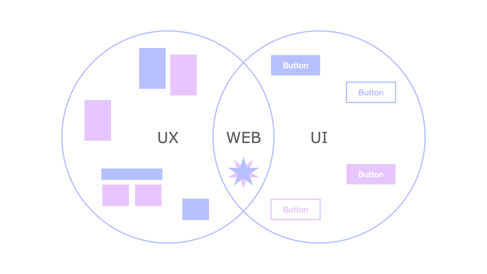
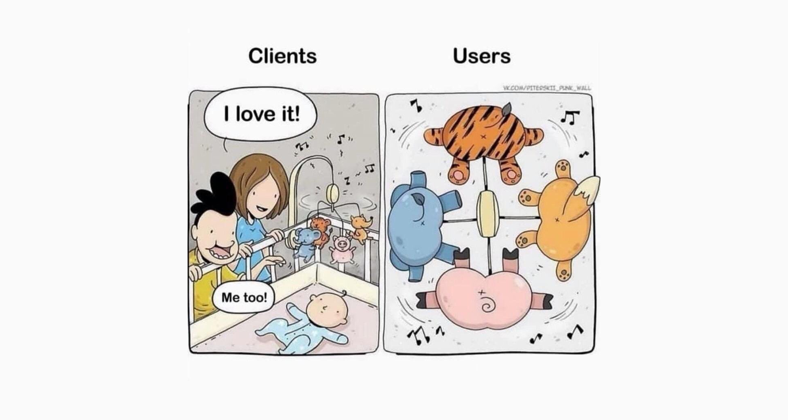
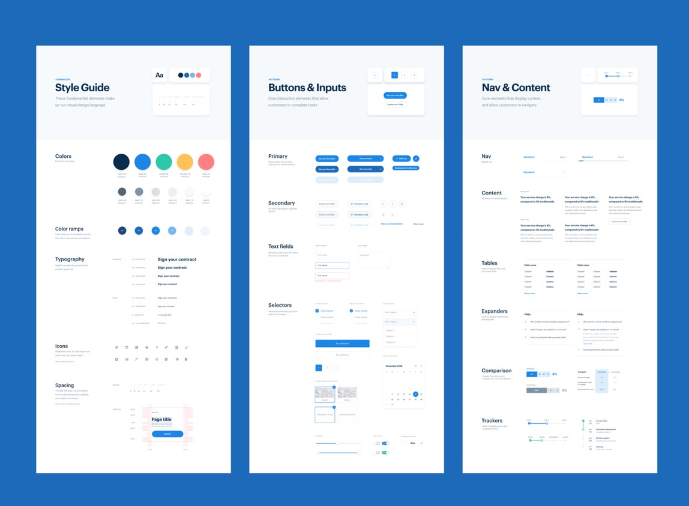
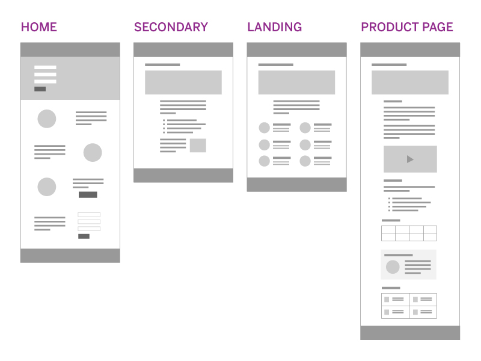
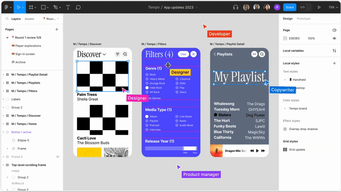

# Проект 19: прототипирование и дизайн

> 💡 [Нажми сюда](https://new.oprosso.net/p/4cb31ec3f47a4596bc758ea1861fb624), **чтобы поделиться с нами обратной связью на этот проект**. Это анонимно и поможет нашей команде сделать обучение лучше. Рекомендуем заполнить опрос сразу после выполнения проекта.
> В этом проекте поговорим про дизайн – инструменты, дизайн-систему, текст в дизайне и прототипирование.

## Оглавление

- [Chapter I](#chapter-i)
  - [Как учиться в «Школе 21»](#%D0%BA%D0%B0%D0%BA-%D1%83%D1%87%D0%B8%D1%82%D1%8C%D1%81%D1%8F-%D0%B2-%D1%88%D0%BA%D0%BE%D0%BB%D0%B5-21)
  - [Как работать с проектом](#%D0%BA%D0%B0%D0%BA-%D1%80%D0%B0%D0%B1%D0%BE%D1%82%D0%B0%D1%82%D1%8C-%D1%81-%D0%BF%D1%80%D0%BE%D0%B5%D0%BA%D1%82%D0%BE%D0%BC)
- [Chapter II](#chapter-ii)
- [Chapter III](#chapter-iii)
  - [1.1. Web-, UX-, UI-дизайн. В чем разница?](#11-web--ux--ui-%D0%B4%D0%B8%D0%B7%D0%B0%D0%B9%D0%BD-%D0%B2-%D1%87%D0%B5%D0%BC-%D1%80%D0%B0%D0%B7%D0%BD%D0%B8%D1%86%D0%B0)
  - [1.2. Дизайн-система](#12-%D0%B4%D0%B8%D0%B7%D0%B0%D0%B9%D0%BD-%D1%81%D0%B8%D1%81%D1%82%D0%B5%D0%BC%D0%B0)
  - [1.3. Текст в дизайне](#13-%D1%82%D0%B5%D0%BA%D1%81%D1%82-%D0%B2-%D0%B4%D0%B8%D0%B7%D0%B0%D0%B9%D0%BD%D0%B5)
  - [1.4. Прототипирование](#14-%D0%BF%D1%80%D0%BE%D1%82%D0%BE%D1%82%D0%B8%D0%BF%D0%B8%D1%80%D0%BE%D0%B2%D0%B0%D0%BD%D0%B8%D0%B5)
  - [1.5. Инструменты дизайнера](#15-%D0%B8%D0%BD%D1%81%D1%82%D1%80%D1%83%D0%BC%D0%B5%D0%BD%D1%82%D1%8B-%D0%B4%D0%B8%D0%B7%D0%B0%D0%B9%D0%BD%D0%B5%D1%80%D0%B0)
  - [Полезные ссылки](#%D0%BF%D0%BE%D0%BB%D0%B5%D0%B7%D0%BD%D1%8B%D0%B5-%D1%81%D1%81%D1%8B%D0%BB%D0%BA%D0%B8)
- [Chapter IV](#chapter-iv)
  - [1.6. Задания](#16-%D0%B7%D0%B0%D0%B4%D0%B0%D0%BD%D0%B8%D1%8F)
    - [Задание 1.](#%D0%B7%D0%B0%D0%B4%D0%B0%D0%BD%D0%B8%D0%B5-1)

## Chapter I

### Как учиться в «Школе 21»

1. «Школа 21» может быть не похожа на тот образовательный опыт, который случался с тобой ранее. Это обучение отличает высокий уровень автономии: у тебя есть задача, и ее необходимо выполнить. На протяжении всего курса ты будешь самостоятельно добывать информацию, чтобы углубиться в тему и решить задачу. Пользуйся всеми доступными средствами поиска информации — ресурсы интернета неограниченны. Внимательно относись к источникам информации (например, если используешь нейросети): проверяй, думай, анализируй, сравнивай.
2. Тебе необходимо презентовать свое решение другим учащимся и получить от них обратную связь. Взаимообучение (P2P, Peer-to-Peer) — это процесс, при котором учащиеся обмениваются знаниями и опытом, выступая одновременно в роли учителей и учеников. Этот подход позволяет учиться не только у преподавателя, но и друг у друга, что способствует более глубокому пониманию материала.
3. Смело проси о помощи: вокруг тебя такие же пиры, которые тоже проходят этот путь впервые. Не бойся откликаться на просьбы о помощи. Твой опыт ценен и полезен, смело делись им с другими участниками. Присоединяйся к Rocket.Chat, чтобы получать свежие анонсы от сообщества.
4. Твое обучение не будет иметь никакого смысла, если ты будешь копировать чужие решения. Если пользуешься помощью других — всегда разбирайся до конца, почему, как и зачем. Не бойся ошибиться.
5. Если ты на чем-то застрял и кажется, что ты уже все перепробовал, но все равно непонятно, куда идти, — просто передохни! Поверь, этот совет помогал многим специалистам в их работе. Проветрись, перезагрузи голову, и, возможно, в следующий раз тебе наконец придет нужное решение!
6. Важен не только результат обучения, но и сам процесс. Нужно не просто решить задачу, а понять, КАК ее решить.

### Как работать с проектом

1. Перед выполнением проект необходимо склонировать с GitLab в одноименный репозиторий.
2. Все файлы необходимо создавать в папке src/ склонированного репозитория.
3. После клонирования проекта необходимо создать ветку develop и вести разработку в ней. После этого пушить в GitLab также нужно ветку develop.
4. В твоей директории не должно быть иных файлов, кроме тех, что обозначены в заданиях.

## Chapter II

Следующим этапом разберем проектирование и дизайн. На этом этапе разрабатывается пользовательский интерфейс (UI) и определяется пользовательский опыт (UX) проекта. Главной целью этого этапа является создание удобного и привлекательного интерфейса для пользователей, который будет соответствовать их потребностям и ожиданиям.

На этом этапе активно участвуют UX-дизайнеры, UI-дизайнеры, web-дизайнеры. В зависимости от проекта это может быть и один специалист. Дизайнеры отвечают за разработку пользовательских сценариев, создание макетов интерфейса, выбор цветовой схемы и шрифтов, а также определение взаимодействия элементов интерфейса. Заказчик и стейкхолдеры на этом этапе тоже активно вовлечены в процесс — на их стороне согласование макетов. Очень важно каждый макет финально подписывать с заказчиком, прежде чем переходить к верстке. Верстка незафиналенного макета может обернуться бесконечными правками и доработками, которые потребуют дополнительного вовлечения дизайнера и frontend-разработчика.

Представим, что мы нарисовали макет, не подписали его у заказчика и передали в верстку. Frontend-разработчик уже работает над своей задачей. И тут выясняется, что заказчик хочет внести корректировки в дизайн. Соответственно мы вынуждены откатиться на этап дизайна, переделать макет, затем согласовать его с заказчиком и уже только после этого вернуться к верстке, где скорее всего частично придется переделывать уже выполненное. Это всё дополнительное время и, как следствие, деньги. Мы, конечно, не исключаем того, что заказчик может попросить внести изменения в уже согласованный макет — это нормальная рабочая ситуация, но вся дополнительная работа должна быть оплачиваемой. Соответственно все новые доработки будут оцениваться как в часах, так и в деньгах. Это, в том числе, позволяет дисциплинировать заказчика, ведь правки по дизайну можно вносить до бесконечности, если не будет какого-то ограничителя в виде, например, подписи макета как элемента финализации.

На этапе разработки дизайна часто можно привлекать в качестве консультанта frontend-разработчика. Он может подсказать дизайнеру, что из задуманного можно реализовать, а что потребует значительных ресурсов. Фантазии дизайнера иногда нужно ограничивать, ведь мы должны соблюдать баланс между запланированным на выполнение задачи временем и тем, что именно можно за это время реализовать.

Роль проектного менеджера на этапе дизайна заключается в координации работы дизайнерской команды и обеспечении соответствия дизайна требованиям заказчика и пользователей. Менеджер организовывает встречи с дизайнерами и заказчиком, уточняет требования и решает возникающие проблемы. Он также отвечает за контроль выполнения задач и соблюдение сроков, финализацию макетов.

## Chapter III

### 1.1. Web-, UX-, UI-дизайн. В чем разница?

Во вводной части к лекции мы упомянули, что на проекте могут работать UX-, UI-, web-дизайнеры. На самом деле ответвлений гораздо больше (например, графический дизайнер, продуктовый дизайнер, гейм-дизайнер и др.), мы рассмотрим такие роли, которые встречаются в разработке дизайна проектов наиболее часто.

Основная разница между web-, UX- и UI-дизайнерами — в зоне их ответственности и специализации. UX-дизайнер отвечает за User Experience (с англ. «пользовательский опыт») и юзабилити, UI-дизайнер — за User Interface (с англ. «пользовательский интерфейс»), то есть визуальное представление. А web-дизайнер создаёт web-приложения, учитывая оба эти направления.

Можно сказать, что web-дизайнер — это универсальный специалист, который разбирается в нескольких областях, а UX- и UI-дизайнеры — специалисты более узкого профиля. Если обобщить, UI — это визуал, а UX — удобство использования продукта.

Если представить, что продукт — это коттедж, то UX-дизайнер будет проектировать количество и расположение комнат, UI-дизайнер — решать, из каких материалов, какого цвета и формы будут стены, потолок, крыша и крыльцо, а web-дизайнер будет главным архитектором, который отвечает за проект в целом.

Сегодня различия между тремя областями стираются: каждому из рассматриваемых специалистов приходится продумывать взаимодействие пользователя с продуктом. Разница остаётся в плане творчества: web-дизайнер — более креативная специальность, чем UI/UX-дизайнер.

Часто UX и UI-задачи на небольших проектах выполняет один специалист, его называют UX/UI-дизайнер. Он исследует продукт с точки зрения пользовательского опыта, создаёт прототипы и отрисовывает детали интерфейса.

Принципы UI/UX-дизайна подробно разобрал Стив Круг в бестселлере «Не заставляйте меня думать. Веб-юзабилити и здравый смысл». Кратко выпишем основные:

- **Подстраивать дизайн под человека, а не человека под дизайн.** Например, расположенную над строкой ввода подсказку пользователь при наборе не должен закрывать рукой.
- **Использовать память системы, а не пользователя.** Большие объемы информации, даты и сложные вычисления делегируем машине.
- **Ценить усилия и данные пользователя** — интерфейс должен сохранять данные, а не заставлять пользователя каждый раз вводить их заново. Например, при заказе пиццы автоматически сохранять адрес и предлагать его использовать при следующем заказе.
- **Заботиться о смысле каждого экрана** — каждая страница должна быть понятна сама по себе, без привязки к предыдущим и последующим.
- **Давать непрерывную обратную связь** — пользователь должен всегда понимать, что происходит и на каком этапе процесса он находится.
- **Избегать лишних сущностей** — вместо того, чтобы вводить для функции новый элемент, стоит поду­мать, как наде­лить ей уже суще­ству­ю­щий.

Для того чтобы понимать, каких результатов ждать от дизайнера, важно учитывать, в какой области особенно компетентен наш специалист. И не нужно ли, например, поискать в помощь UX-дизайнеру еще и UI-специалиста.

### 1.2. Дизайн-система

Давай познакомимся с инструментом, позволяющим стандартизировать и упорядочить работу с дизайном продукта или экосистемы в целом. Дизайн-система — это набор правил, компонентов и руководств, которые определяют визуальное и функциональное поведение продукта. Она помогает обеспечить консистентность и эффективность дизайна, а также упрощает процесс разработки и поддержки продукта. Дизайн-система включает в себя следующие элементы:

- **Брендовые элементы:** логотипы, цвета, шрифты, иконки и другие элементы, которые отражают бренд компании.
- **Компоненты интерфейса:** кнопки, поля ввода, навигационные элементы и другие компоненты, которые используются для построения пользовательского интерфейса.
- **Руководства по стилю:** правила и рекомендации по использованию брендовых элементов и компонентов интерфейса.
- **Ресурсы и шаблоны:** файлы и шаблоны, которые помогают дизайнерам создавать новые элементы и макеты.

Дизайн-систему обычно разрабатывает команда дизайнеров и разработчиков, работающих над продуктом. Они определяют правила и стандарты, которые должны быть соблюдены при разработке новых функций и элементов. Дизайн-система также может эволюционировать и обновляться по мере развития продукта.

Использование дизайн-системы позволяет обеспечить единый стиль даже очень большого продукта. При этом, если какой-то элемент требует усовершенствования, его легко изменить сразу во всех макетах.

Чаще всего дизайн-системы используются в экосистемах, где трудятся десятки дизайнеров и множество разных команд. Вероятность создать неконсистентный дизайн в таких компаниях стремится в космос, поэтому стандартизация здесь необходима. Однако и на небольших проектах для упрощения работы можно создавать дизайн-систему. И в рамках задания к этому модулю ты с этим поупражняешься.

### 1.3. Текст в дизайне

Текст в дизайне — это не просто подписи к кнопкам, а полноценная часть пользовательского опыта. Он встречается в интерфейсах (кнопки, поля ввода, подсказки, ошибки, пустые состояния), в навигации и онбординге, в маркетинговых экранах, письмах, пушах и даже в системных сообщениях. Пользователь читает текст, чтобы понять, что происходит, что от него хотят и что будет дальше. Если текст неясный, перегруженный или противоречивый, дизайн перестаёт работать, даже если визуально он выглядит аккуратно.

В больших компаниях за тексты часто отвечают UX-редакторы или UX-райтеры — специалисты, которые проектируют формулировки как часть интерфейса. Но в большинстве продуктов отдельной роли нет, и ответственность делят дизайнер и продакт. Дизайнер отвечает за то, как текст встроен в интерфейс и читается, продакт — за смысл, точность и соответствие бизнес-целям.

Примеры ошибок в оформлении текста:

| Описание | В чём проблема и почему это важно |
| --- | --- |
| На экране ошибки оплаты в тексте шутка *“что-то сломалось, но мы не знаем что”*. | В ситуации, где пользователь рискует деньгами или временем, такой текст усиливает тревогу и снижает доверие к продукту. |
| На странице регистрации абсурдные канцеляризмы: *“В целях обеспечения корректного начала взаимодействия с функциональными возможностями сервиса вам необходимо осуществить процедуру первоначальной настройки профиля пользователя”* | В онбординге такой текст не помогает, а пугает и замедляет пользователя. Нормальная версия для продукта могла бы звучать так: “*Давайте настроим профиль — это займёт пару минут.”* |

Иногда проблема может быть не в смысле, а в лишнем пробеле или неудачном переносе строки. Нужно помнить о том, что подобные нюансы влияют на общую картину восприятия продукта пользователем.

### 1.4. Прототипирование

Отдельно рассмотрим этап прототипирования, который обычно предшествует дизайну. Разработка прототипа является важным шагом перед переходом к дизайну, поскольку позволяет проверить и уточнить концепцию продукта, а также сэкономить время и ресурсы на более поздних этапах разработки.

В ходе прототипирования создается макет, который имитирует взаимодействие пользователя с интерфейсом проекта. Нередко прототипы делают интерактивными (кликабельными).

Прототип нужен для презентации проекта заказчику и оценки его юзабилити. Тестирование прототипа позволяет заранее выявить и устранить ошибки, прежде чем вкладывать деньги в разработку конечного дизайнерского решения и кода.

Прототип может быть нарисован на бумаге или создан в графическом редакторе. Основное отличие этих способов — в уровне детализации и кликабельности элементов.

Вот несколько шагов, которые помогают в разработке прототипа:

- **Определить цели и задачи:** перед тем как приступить к разработке прототипа, важно понять, что именно мы хотим достичь с помощью своего приложения или сайта. Определить основные задачи, которые пользователи должны выполнить с помощью нашего продукта.
- **Создать структуру:** начать с создания структуры приложения или сайта. Выделить основные разделы и подразделы, а также связи между ними. Это поможет определить основные элементы интерфейса и навигацию.
- **Добавить основные элементы интерфейса:** включить в прототип основные элементы интерфейса: кнопки, поля ввода, выпадающие списки и другие элементы, с помощью которых пользователи будут взаимодействовать с приложением или сайтом.
- **Определить последовательность действий:** сформулировать последовательность действий, которые пользователи должны выполнить для достижения своих целей. Учесть, какие шаги могут быть пропущены или изменены, предусмотреть альтернативные пути. Например, позволить зарегистрироваться не только с помощью электронной почты, но и через социальные сети или google-аккаунт.
- **Добавить переходы и анимацию:** добавить переходы между экранами и анимацию, чтобы сделать прототип более интерактивным и реалистичным. Это поможет пользователям лучше понять, как они будут взаимодействовать с продуктом. Этот шаг доступен в случае разработки прототипа с помощью интерактивного инструмента, например, в [inVision](https://www.invisionapp.com).
- **Тестировать и собирать обратную связь:** протестировать свой прототип на реальных пользователях и собрать обратную связь. Учесть замечания и предложения пользователей, чтобы улучшить дизайн и функциональность продукта.

Некоторые лайфхаки для новичков в прототипировании:

- Использовать готовые шаблоны: существует множество готовых шаблонов прототипов, которые могут помочь быстро создать базовую структуру и элементы интерфейса.
- Не бояться экспериментировать: прототипирование — это творческий процесс, поэтому не нужно бояться экспериментировать с различными идеями и концепциями. Иногда лучшие решения могут появиться из неожиданных источников.
- Учитывать обратную связь: обратная связь пользователей — это ценный источник информации для улучшения прототипа.

Создание прототипа помогает быстро проверить концепцию продукта, чтобы понять его сильные и слабые стороны до начала разработки. На несложных проектах прототип может собрать и менеджер. Визуализация своих идей позволит улучшить коммуникацию и снизить возможность недопонимания.

### 1.5. Инструменты дизайнера

В каких инструментах работают дизайнеры. Например, для создания макетов интерфейса можно использовать Sketch, Figma или Adobe XD. Для тестирования пользовательского опыта можно применять инструменты UsabilityHub или UserTesting.

Figma массово вошла в российскую IT-разработку относительно недавно, приблизительно в 2019 году. До этого времени макеты преимущественно дизайнились в фотошопе или в Sketch. Figma — онлайн-редактор для создания прототипов и интерфейсов. В этом как раз большой плюс инструмента и явное преимущество. Макет можно скорректировать максимально быстро, при этом все изменения сохранятся, потому что работа осуществляется в онлайн-редакторе. При этом есть возможность работать в установленной на свой компьютер программе.

Интерфейс Figma достаточно дружелюбен для того, чтобы менеджер мог самостоятельно скорректировать текст или изображение на макете по комментариям заказчика, если это какие-то незначительные нюансы, для которых нецелесообразно обращаться к дизайнеру.

Шаги для работы в Figma и создания прототипа или макета простого сайта:

- **Зарегистрироваться** на платформе [Figma](https://www.figma.com/) и создать новый проект.
- **Определить цели и задачи:** определить, что именно мы хотим достичь с помощью макета. Определить основные функциональные требования и дизайнерские решения для сайта или приложения.
- **Создать рабочую область:** нарисовать основную структуру макета, включая заголовки, навигационное меню, контентные блоки и футер (подвал сайта). Для этого можно использовать инструменты Figma для создания прямоугольников, текста и других элементов интерфейса.
- **Добавить контент:** заполнить макет текстовым и графическим контентом. Использовать инструменты Figma для добавления изображений, текста и других элементов.
- **Поработать с цветами и шрифтами:** выбрать цветовую палитру и шрифты для сайта. Например, использовать уже готовые решения, которые помогают определить сочетания цветов ([Coolors](https://coolors.co/palettes/trending)).
- **Экспортировать макет:** когда макет готов, экспортировать его в нужном формате (например, PNG или PDF) для дальнейшего использования.

Некоторые функции и инструменты Figma, которые могут быть полезны при создании макета:

- **Компоненты:** применяй компоненты для повторного применения элементов интерфейса, таких как кнопки или заголовки, в разных частях макета. Это позволяет легко обновлять все экземпляры компонента одновременно.
- **Автоаннотации:** используй функцию автоаннотаций, чтобы автоматически создавать спецификации дизайна, включая размеры, отступы и цвета элементов.
- **Коллаборация:** пригласи других участников проекта для совместной работы над макетом. Figma позволяет работать в режиме реального времени, что упрощает командную работу.
- **Плагины:** применяй плагины Figma для расширения функциональности платформы.
- **Web-просмотр:** используй функцию web-просмотра, чтобы поделиться макетом с другими людьми и получить обратную связь. Web-просмотр позволяет просматривать и комментировать макет в браузере без необходимости установки Figma.

Проджект менеджеру важно разбираться в инструментах дизайнера не только для того, чтобы собрать макет самостоятельно, но и для лучшего понимания возможностей дизайна. Принимая работу у дизайнера, менеджер не оценивает субъективно “красиво/некрасиво”, а смотрит на соответствие решаемой задаче. Важно проверить, что дизайн поддерживает пользовательский сценарий: понятна ли логика экранов, очевидны ли ключевые действия, нет ли лишних шагов или неоднозначных решений.

### Полезные ссылки

- <https://www.invisionapp.com>
- <https://www.figma.com/>
- <https://coolors.co/palettes/trending>
- <https://tilda.cc/ru/>
- <https://fabrx.co/full-preview-wireframes/>
- <https://www.sberbank.ru/nova>
- <https://developer.apple.com/design/human-interface-guidelines/guidelines/overview/>
- <https://www.flaticon.com/ru/>
- <https://www.figma.com/community/search?resource_type=mixed&sort_by=relevancy&query=design+system&editor_type=all&price=all&creators=all>
- <https://ui.shadcn.com/>

## Chapter IV

### 1.6. Задания

## Задание 1.

Давай вернемся к твоему проекту, для которого ты сформировал бюджет, создал пространство в Asana и разработал дорожную карту. Теперь пришло время приступить к дизайну. В конце курса ты разработаешь свой сайт на базе конструктора [Tilda](https://tilda.cc/ru/). Начнем с дизайн-системы. Для того чтобы тебе было легче разрабатывать дизайн для своего сайта, разработай дизайн-систему, которая поможет стандартизировать работу в дальнейшем.

Для вдохновения ты можешь использовать уже готовые библиотеки и примеры компонентов, например, ресурс [Fabrx](https://fabrx.co/full-preview-wireframes/). Пример дизайн-системы: [СберБанк-Онлайн](https://www.sberbank.ru/nova) (Nova). Или дизайн-система [Apple Human Interface Guidelines](https://developer.apple.com/design/human-interface-guidelines/guidelines/overview/) [сквозной цифровой опыт: web, desktop, мобильные, часы, TV].

В рамках первого знакомства с инструментом Figma тебе нужно разработать простую дизайн-систему для своего проекта. Она должна состоять минимально из следующих элементов:

1. Используемые шрифты и их начертания. *Подсказка: минимизируй количество используемых гарнитур (семейств шрифтов): два — более чем достаточно, один — оптимальный вариант. Начертаний может быть несколько. Если ты все-таки решишь использовать более одного шрифта, убедись, что они имеют схожее начертание и их символы совпадают по ширине.*
2. Цветовая палитра. *Подсказка: Оптимальная рабочая палитра для дизайна сайта — это 3-4 цвета: Основной цвет — им выделены ключевые акценты на страницах; Дополнительный — используется для второстепенных блоков, выгодно сочетается с основным, но не отвлекает от него. Фоновый — спокойный оттенок, на котором не теряются основной и дополнительный цвета.*
3. Варианты кнопок. *Подсказка: Можно отдельно указать, как будут выглядеть кнопки для главных пользовательских действий (например, с заливкой), а как для первостепенных (например, без заливки, но с рамкой).*
4. Компоненты. Как будут выглядеть повторяющиеся карточки. Например, карточка товара, если сайт подразумевает это.
5. Иконки. Если на сайте планируется использование иконок, то важно, чтобы они были одинаковыми по стилистике. Можно использовать ресурсы с бесплатными иконками, например, [Flaticon](https://www.flaticon.com/ru/).
6. Ты можешь дополнить дизайн-систему любыми элементами на свое усмотрение. Это могут быть фотографии (аналог фотобанка), вариант оформления таблицы или чек-боксов и т. д.

Пример дизайн-системы, на основе которого ты можешь оформить свой вариант:

Оформи свою дизайн-систему как один или несколько макетов в Figma, загрузи результат работы в формате .pdf в репозиторий в папку src/ в корне проекта (обязательно в ветку *develop*).

Ты можешь воспользоваться [бесплатными шаблонами](https://www.figma.com/community/search?resource_type=mixed&sort_by=relevancy&query=design+system&editor_type=all&price=all&creators=all) дизайн-систем в Figma, которыми делятся дизайнеры. Учти, что на поиск подходящего шаблона зачастую может уйти больше времени, чем на создание своего шаблона с нуля. Но поиск может быть увлекательным и поможет развить насмотренность, а это ключевое качество для восприятия дизайна.