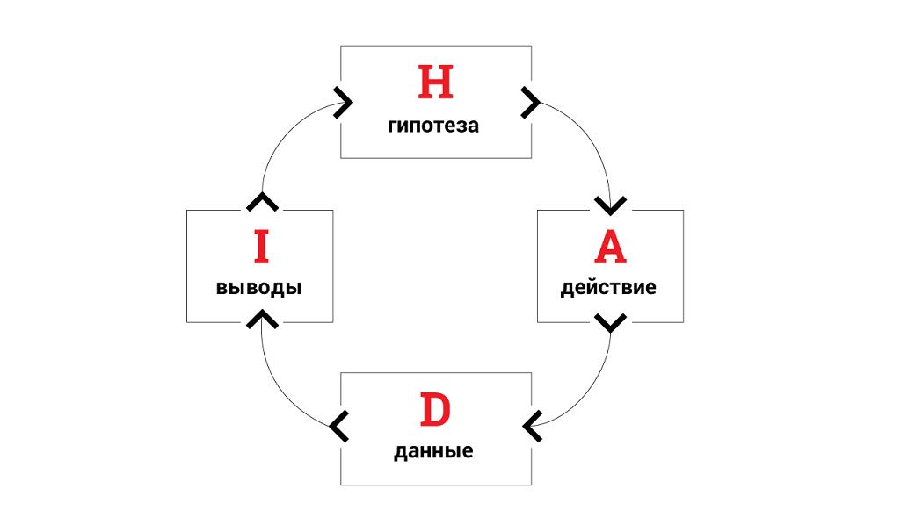

## Проект 6: Анализ продукта

> 💡 [Нажми сюда](https://new.oprosso.net/p/4cb31ec3f47a4596bc758ea1861fb624), **чтобы поделиться с нами обратной связью на этот проект**. Это анонимно и поможет нашей команде сделать обучение лучше. Рекомендуем заполнить опрос сразу после выполнения проекта.
> В этом проекте мы подглядываем из мира Project Management в мир Product Management, ты узнаешь о методах исследования продукта и научишься формировать гипотезы для его развития. Для того чтобы больше погрузиться в тему и разобраться в ней, ты будешь работать в команде.

## Оглавление

- [Chapter I](#chapter-i)
- [Chapter II](#chapter-ii)
- [Chapter III](#chapter-iii)
  - [1.1. Project Management и Product Management](#11-project-management-%D0%B8-product-management)
  - [1.2. Анализ целевой аудитории](#12-%D0%B0%D0%BD%D0%B0%D0%BB%D0%B8%D0%B7-%D1%86%D0%B5%D0%BB%D0%B5%D0%B2%D0%BE%D0%B9-%D0%B0%D1%83%D0%B4%D0%B8%D1%82%D0%BE%D1%80%D0%B8%D0%B8)
  - [1.3. Гипотезы и исследования](#13-%D0%B3%D0%B8%D0%BF%D0%BE%D1%82%D0%B5%D0%B7%D1%8B-%D0%B8-%D0%B8%D1%81%D1%81%D0%BB%D0%B5%D0%B4%D0%BE%D0%B2%D0%B0%D0%BD%D0%B8%D1%8F)
  - [1.4. Основные метрики продукта](#14-%D0%BE%D1%81%D0%BD%D0%BE%D0%B2%D0%BD%D1%8B%D0%B5-%D0%BC%D0%B5%D1%82%D1%80%D0%B8%D0%BA%D0%B8-%D0%BF%D1%80%D0%BE%D0%B4%D1%83%D0%BA%D1%82%D0%B0)
- [Chapter IV](#chapter-iv)
  - [1.5. Задания](#15-%D0%B7%D0%B0%D0%B4%D0%B0%D0%BD%D0%B8%D1%8F)
    - [Задание 1.](#%D0%B7%D0%B0%D0%B4%D0%B0%D0%BD%D0%B8%D0%B5-1)
    - [Бонусное задание.](#%D0%B1%D0%BE%D0%BD%D1%83%D1%81%D0%BD%D0%BE%D0%B5-%D0%B7%D0%B0%D0%B4%D0%B0%D0%BD%D0%B8%D0%B5)

## Chapter I

## Как учиться в «Школе 21»

- «Школа 21» может быть не похожа на тот образовательный опыт, который случался с тобой ранее. Это обучение отличает высокий уровень автономии: у тебя есть задача, и ее необходимо выполнить. На протяжении всего курса ты будешь самостоятельно добывать информацию, чтобы углубиться в тему и решить задачу. Пользуйся всеми доступными средствами поиска информации — ресурсы интернета неограниченны. Внимательно относись к источникам информации (например, если используешь нейросети): проверяй, думай, анализируй, сравнивай.
- Тебе необходимо презентовать свое решение другим учащимся и получить от них обратную связь. Взаимообучение (P2P, Peer-to-Peer) — это процесс, при котором учащиеся обмениваются знаниями и опытом, выступая одновременно в роли учителей и учеников. Этот подход позволяет учиться не только у преподавателя, но и друг у друга, что способствует более глубокому пониманию материала.
- Смело проси о помощи: вокруг тебя такие же пиры, которые тоже проходят этот путь впервые. Не бойся откликаться на просьбы о помощи. Твой опыт ценен и полезен, смело делись им с другими участниками. Присоединяйся к Rocket.Chat, чтобы получать свежие анонсы от сообщества.
- Твое обучение не будет иметь никакого смысла, если ты будешь копировать чужие решения. Если пользуешься помощью других — всегда разбирайся до конца, почему, как и зачем. Не бойся ошибиться.
- Если ты на чем-то застрял и кажется, что ты уже все перепробовал, но все равно непонятно, куда идти, — просто передохни! Поверь, этот совет помогал многим специалистам в их работе. Проветрись, перезагрузи голову, и, возможно, в следующий раз тебе наконец придет нужное решение!
- Важен не только результат обучения, но и сам процесс. Нужно не просто решить задачу, а понять, КАК ее решить.

**Как работать с проектом:**

1. Перед выполнением проект необходимо склонировать с GitLab в одноименный репозиторий.
2. Все файлы необходимо создавать в папке *src/* склонированного репозитория.
3. После клонирования проекта необходимо создать ветку develop и вести разработку в ней. После этого пушить в GitLab также нужно ветку develop.
4. В твоей директории не должно быть иных файлов, кроме тех, что обозначены в заданиях.

## Chapter II

В предыдущем проекте ты уже познакомился с продуктовым менеджментом и даже составил план для самостоятельного изучения этой области знаний. Надеемся, что ты успел что-то изучить, и тогда текущий проект позволит закрепить и знания и применить их на практике.

Специалисты в IT делятся по уровню знаний на *Junior*, *Middle* и *Senior*. Для того чтобы достичь уровня Senior, нужно совершенствоваться в смежных областях. Например, Project Manager со знанием продуктовых метрик гораздо ценнее на рынке, чем специалист, который умеет работать только с конкретными проектами. Эта формула применима к любой сфере деятельности. Поэтому в рамках курса мы затронем тему анализа продукта.

## Chapter III

## 1.1. Project Management и Product Management

Ты уже знаешь о таких областях, как Project Management и Product Management. Остановимся здесь еще раз и сфокусируемся на пересечениях и различиях.

Пересечения областей Project Management и Product Management:

- Обе области имеют цель достижения успешных результатов. Product Manager и Project Manager работают вместе, чтобы их достигнуть.
- Обе роли требуют сильного лидерства и коммуникационных навыков, поскольку эти люди должны взаимодействовать с различными стейкхолдерами, включая команду разработки, заказчика и других участников проекта.
- Оба менеджера ответственны за достижение целей и удовлетворение требований пользователей.

| Критерий сравнения | Project Management | Product Management |
| --- | --- | --- |
| Цель | Успешное завершение конкретного проекта на основе заранее определенных целей и ограничений (время, бюджет и ресурсы). | Постоянное улучшение и развитие продукта на основе потребностей и требований клиентов. |
| Фокус | На планировании и управлении проектом. | На стратегии продукта, исследовании рынка и управлении жизненным циклом продукта. |
| С кем взаимодействует | Руководит командой разработки и координирует работу между различными функциональными областями проекта. | Работает с командой разработки, чтобы определить и управлять требованиями продукта и обеспечить его успешное развитие. |

В целом, Project Management и Product Management обладают своими целями, задачами и наборами навыков. Чтобы совместная работа была эффективной, придерживайся этих принципов:

- **Единое информационное поле** — общий roadmap, синхронизация задач в Jira, регулярные апдейты.
- **Совместное планирование** — на старте работ или релиза нужно договариваться, какие фичи реально доставить.
- **Чёткие границы ответственности** — продакт не лезет в контроль сроков и ресурсов, проджект не переприоритизирует фичи.
- **Регулярная обратная связь** — короткие встречи 1–2 раза в неделю помогают выровнять фокус.
- **Доверие и прозрачность** — продакт делится гипотезами и рисками, проджект — статусом и ограничениями.

Анализом продукта и исследованиями, как правило, в большей степени занимается Product Manager, но эти знания пригодятся тебе, чтобы лучше понимать контекст задач и влияние этого этапа (изучи, чем отличается Delivery от Discovery!) на реализацию.

## 1.2. Анализ целевой аудитории

Одно из основных понятий в анализе продукта — **целевая аудитория.**

**Целевая аудитория (ЦА)** — это аудитория потенциальных потребителей товара, услуги или сервиса. Это круг потребителей, физических или юридических лиц, на который продукт рассчитан и которому он может быть интересен. Целевая аудитория рано или поздно приобретает товар или сервис.

Почему важно выделять ЦА? Четко определить, кто ЦА для конкретного продукта, нужно, чтобы:

- Хорошо знать, кто эти люди/компании. Понимать их потребности.
- Говорить на языке целевой аудитории.
- Повысить узнаваемость бренда среди наиболее лояльной группы потребителей = повысить лояльность.
- Делить аудиторию на микросегменты и составлять индивидуальные предложения.
- Подобрать наиболее подходящие каналы продвижения.
- Снизить стоимость привлеченного лида — целевого контакта для покупки.
- Правильно управлять рекламными кампаниями — экономить рекламный бюджет.
- Управлять возвратом инвестиций и конверсией на всех этапах воронки продаж.

Маркетинговый анализ целевой аудитории помогает лучше понять, кто покупатель этого продукта: его демографические данные, интересы, потребности, платежеспособность. Это позволяет вносить в продукт необходимые изменения: улучшать, находить и исправлять ошибки. Создавать эффективные УТП (узнай и запомни расшифровку этой аббревиатуры), чтобы повысить количество продаж. Также анализ ЦА бренда позволяет понять, какие новые продуктовые линейки будут интересны потребителям. Эти данные помогут снизить количество расходов на тесты и минимизировать риски на неудачный запуск продукции.

Определение и анализ целевой аудитории должны идти в тандеме с сегментацией ЦА. Необходимо делить общее ядро на отдельные группы, чтобы было легче настраивать рекламу и создавать предложения.

**Какие инструменты помогут сделать анализ целевой аудитории сайта?**

- Google Analytics,
- Яндекс Метрика,
- Simply Measured,
- SimilarWeb,
- KISSmetrics,
- Hotjar.

На основе анализа целевой аудитории составляется общий портрет покупателя. Это собирательный *образ клиента*, который включает в себя *следующий набор характеристик*:

- Возраст и пол;
- Геолокацию;
- Семейное положение, наличие детей;
- Сфера профессиональной деятельности и зарплата;
- Потребности, проблемы, интересы, барьеры покупок.

Анализ ЦА нужен, чтобы понять, какие *каналы* и как их задействовать, чтобы получить больше лидов.

- SEO,
- контент-маркетинг,
- таргетированная реклама,
- SMM,
- контекстная реклама,
- e-mail маркетинг.

## 1.3. Гипотезы и исследования

**Гипотеза** — еще один термин, с которым тесно работает Product Manager.

**Гипотеза** *—* это утверждение об аудитории/продукте/сервисе, которое необходимо проверить.

Оно формулируется в утвердительной форме, например:

- Пользователю важно иметь чат поддержки в приложении.

Наблюдение — первый шаг в составлении гипотезы. Множество сервисов вокруг имеют недостатки. Для исправления этих недоработок их нужно фиксировать в режиме гипотез об изменениях. Например, пользователю сервиса по заказу такси удобнее пользоваться приложением, если оно точно определяет геолокацию.

Чтобы проверить гипотезу, можно пользоваться уже готовыми алгоритмами, например, HADI. Он осуществляется по такой схеме:

**Как правильно формулировать гипотезу?**

Самый простой способ формулирования гипотезы: «Если мы сделаем X, то получится Y».

*Например, «Если добавить на сайте возможность доставки Почтой России, мы увеличим конверсию в оплату на 10%» или «Если изменим заголовок в письме рассылки, то увеличим открываемость писем на 20%».*

Более сложный, но правильный с точки зрения подхода и корректности работы с гипотезами — это формулирование по формату **SMART**.

**Формулировка гипотезы по формату SMART**

| SPECIFIC — КОНКРЕТНАЯ | Гипотеза должна быть конкретной. Что хотим достичь сейчас, какая конечная цель? Найти новые рекламные каналы, новый сегмент клиентов или выйти на новый рынок Х. |
| --- | --- |
| **MEASURABLE — ИЗМЕРИМАЯ** | Каждая гипотеза должна иметь измеримый результат, который поможет понять, какой результат является для нас хорошим, а какой нет. |
| **ACHIEVABLE — ДОСТИЖИМАЯ** | Отвечаем на вопрос, достижима ли поставленная нами цель? Гипотезы не про мотивацию или премии, в рамках проверки гипотез мы должны четко понимать, приближаемся ли к конечной цели, или она в целом недостижима в указанные сроки и критерии. |
| **RELEVANT — РЕЛЕВАНТНАЯ** | Все гипотезы должны относиться к нашей цели, гипотезы, не связанные с действующей целью, лучше отложить. Нет смысла тестировать новые сегменты/каналы клиентов в РФ, если цель стоит выйти на зарубежный рынок. |
| **TIME-BOUND — ОГРАНИЧЕННАЯ ПО ВРЕМЕНИ** | Без ограничений по времени весь процесс проверки гипотез может затянуться и данные начнут искажаться. У каждой гипотезы должны быть ограничения по времени, обычно цикл проверки гипотезы занимает 1-2 недели. |

**Пример продуктовой гипотезы по формату SMART:**

*«Если добавим на сайте поиск товара, мы сможем увеличить количество людей, зашедших на сайт и добавивших товар в корзину, с 30% до 40% за следующий квартал».*

Неотъемлемой частью продуктового анализа являются **исследования**. Они могут быть количественными и качественными.

К основным **методам качественных исследований** относятся (изучи самостоятельно каждый из методов):

- интервью,
- наблюдение,
- эксперимент.

**Количественные исследования** — это описательные исследования, нацеленные на строгую стандартизацию и формализацию процесса сбора и обработки информации, дающие возможность получить точные данные об исследуемой аудитории, выраженные в абсолютных или относительных величинах.

Количественное исследование отвечает на вопрос «Сколько?».

*Самый главный метод количественного исследования, который применяется повсеместно, — опрос*. Опрос дает возможность предсказать мнение генеральной совокупности на основе данных исследования выборки.

**Генеральная совокупность** — это совокупность всех объектов или наблюдений, относительно которых исследователь намерен делать выводы.

**Выборка** — часть генеральной совокупности элементов, которая охватывается исследованием.

Инструментарий для проведения онлайн-опросов:

- Google forms,
- SURVEY MONKEY,
- OPROSSO,
- ЯНДЕКС.ВЗГЛЯД.

**Выбор методов исследования**

Эти два метода исследования работают намного лучше вместе.

| Качественные | Количественные |
| --- | --- |
| как? почему? зачем? | сколько? |
| слова | цифры |
| малая выборка | большая выборка |
| глубина | репрезентативность |
| открытые вопросы | закрытые вопросы |
| субъективны | объективны |
| низкая воспроизводимость | высокая воспроизводимость |

### 1.4. Основные метрики продукта

После того как определена целевая аудитория, сформулированы гипотезы и проведены первые исследования, важно перейти от качественных наблюдений к измеримым показателям. Метрики это один из основных инструментов Product Manager. На этапе исследования они помогают понять, насколько гипотезы жизнеспособны, есть ли подтверждение проблем пользователей и потенциальная ценность продукта.

*Вернемся к нашей гипотезе:*

*«Если добавим на сайте поиск товара, мы сможем увеличить количество людей, зашедших на сайт и добавивших товар в корзину, с 30% до 40% за следующий квартал».*

Вторая её часть как раз про метрику, в данном случае это **Add to Cart Rate**. Это индикатор, который позволит нам подтвердить или опровергнуть гипотезу. Без неё нельзя объективно сказать, сработала идея или нет.

Рассмотрим основные метрики, которые отслеживает продуктовая команда для оценки эффективности стратегий развития продукта и маркетинговых кампаний:

| Метрика | Что измеряет | Как считается |
| --- | --- | --- |
| DAU (Daily Active Users) | Кол-во уникальных активных пользователей в день | Подсчёт уникальных user\_id за сутки |
| MAU (Monthly Active Users) | Кол-во активных пользователей за месяц | Уникальные user\_id за 30 дней |
| DAU/MAU Ratio | Долю пользователей, возвращающихся ежедневно | DAU ÷ MAU |
| Retention Rate | Долю пользователей, которые возвращаются спустя время | (Активные пользователи, вернувшиеся на N-й день ÷ Активные пользователи в день регистрации) × 100% |
| LTV (Lifetime Value) | Средний доход с одного пользователя за весь срок его жизни в продукте | Средний чек × частота покупок × средняя продолжительность удержания |
| CAC (Customer Acquisition Cost) | Средняя стоимость привлечения одного клиента | Общие затраты на маркетинг ÷ число привлечённых пользователей |

Product Manager использует метрики, чтобы **приоритизировать гипотезы** и **измерять ценность продукта**. Project Manager — чтобы **понимать бизнес-цели продукта** и связывать задачи команды с метриками результата.

## Chapter IV

## 1.5. Задания

Продолжаем работать в группе, как и в предыдущем проекте. Работаем с тем же проектом. *В составе группы вам нужно будет выполнить три задания.*

### Задание 1.

Это задание ты будешь выполнять в группе. Каждая группа должна выбрать реальный IT-продукт (например, мобильное приложение или веб-сервис), для которого будет проводить анализ и разработку стратегии развития. Задание состоит из следующих этапов:

1. **Фаза подготовки:**

   Проведите анализ целевой аудитории продукта с учетом ее потребностей, проблем и поведенческих особенностей.
2. **Фаза исследования:**

   Разработайте гипотезы о потребностях и проблемах целевой аудитории, которые помогут определить, как продукт может решить их проблемы. Примените алгоритм HADI (Hypothesis, Analysis, Design, and Implementation) для проверки и валидации гипотез.
3. **Фаза фреймворка:**

   Используя фреймворк «Persons», проработайте детализированное описание и профилирование персонажей, представляющих целевую аудиторию.

   Используя фреймворк «Jobs-to-be-Done», определите основные задачи, которые целевая аудитория хочет выполнить с помощью продукта.
4. **Фаза Custdev:**

   Разработайте план Custdev, в котором отобразите выбранные методы сбора данных (например, опрос, интервью и обзор конкурентного рынка).
5. **Фаза концепт-проекта:**

   Разработайте стратегию развития продукта, определив основные шаги и метрики для достижения поставленных целей.
6. **Фаза презентации:**

   Оформите проделанную работу в презентацию, демонстрирующую основные этапы и результаты анализа продукта и стратегии развития, и загрузите итоговый файл на платформу для проверки.

Загрузите готовую презентацию в формате .pdf в репозиторий в папку src/ в корне проекта (обязательно в ветку develop).

### Бонусное задание.

Для более глубокого погружения в discovery продукта, мы предлагаем вам ознакомиться с термином "юнит-экономика". Добавьте в презентацию слайд с названием "Юнит-экономика" и на нём отразите ответы на следующие вопросы о своём продукте:

1. Что является юнитом в вашем расчете экономики?
2. Каким будет примерный доход с одного юнита?
3. Какой ожидается расход на привлечение одного юнита?
4. Какая ожидается маржинальность у вашего продукта (разница расходов и доходов)?

Подсказка – вы можете использовать нейросеть, как своего командного аналитика. Задайте в промпте роль и цели, передайте знания о выбранном продукте и проверьте итоговый результат перед тем, как переносить его в презентацию.