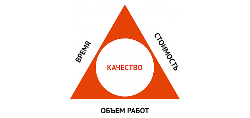
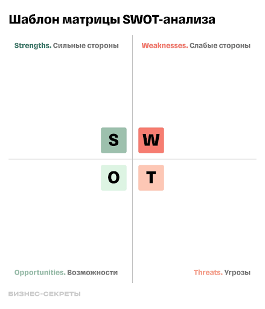

## Проект 8: Типы рисков, методы выявления и реагирования

> 💡 [Нажми сюда](https://new.oprosso.net/p/4cb31ec3f47a4596bc758ea1861fb624), **чтобы поделиться с нами обратной связью на этот проект**. Это анонимно и поможет нашей команде сделать обучение лучше. Рекомендуем заполнить опрос сразу после выполнения проекта.
> В этом проекте ты научишься находить и описывать риски, а также формировать план реагирования на угрозы.

## Оглавление

- [Chapter I](#chapter-i)
- [Chapter II](#chapter-ii)
- [Chapter III](#chapter-iii)
  - [1.1. Риски и Проектный треугольник. Уровни реагирования на риски](#11-%D1%80%D0%B8%D1%81%D0%BA%D0%B8-%D0%B8-%D0%BF%D1%80%D0%BE%D0%B5%D0%BA%D1%82%D0%BD%D1%8B%D0%B9-%D1%82%D1%80%D0%B5%D1%83%D0%B3%D0%BE%D0%BB%D1%8C%D0%BD%D0%B8%D0%BA-%D1%83%D1%80%D0%BE%D0%B2%D0%BD%D0%B8-%D1%80%D0%B5%D0%B0%D0%B3%D0%B8%D1%80%D0%BE%D0%B2%D0%B0%D0%BD%D0%B8%D1%8F-%D0%BD%D0%B0-%D1%80%D0%B8%D1%81%D0%BA%D0%B8)
  - [1.2. Цикл управления рисками. Идентификация рисков](#12-%D1%86%D0%B8%D0%BA%D0%BB-%D1%83%D0%BF%D1%80%D0%B0%D0%B2%D0%BB%D0%B5%D0%BD%D0%B8%D1%8F-%D1%80%D0%B8%D1%81%D0%BA%D0%B0%D0%BC%D0%B8-%D0%B8%D0%B4%D0%B5%D0%BD%D1%82%D0%B8%D1%84%D0%B8%D0%BA%D0%B0%D1%86%D0%B8%D1%8F-%D1%80%D0%B8%D1%81%D0%BA%D0%BE%D0%B2)
  - [1.3. Анализ рисков](#13-%D0%B0%D0%BD%D0%B0%D0%BB%D0%B8%D0%B7-%D1%80%D0%B8%D1%81%D0%BA%D0%BE%D0%B2)
  - [1.4. Толерантность к риску и риск-аппетит](#14-%D1%82%D0%BE%D0%BB%D0%B5%D1%80%D0%B0%D0%BD%D1%82%D0%BD%D0%BE%D1%81%D1%82%D1%8C-%D0%BA-%D1%80%D0%B8%D1%81%D0%BA%D1%83-%D0%B8-%D1%80%D0%B8%D1%81%D0%BA-%D0%B0%D0%BF%D0%BF%D0%B5%D1%82%D0%B8%D1%82)
  - [Полезные ссылки](#%D0%BF%D0%BE%D0%BB%D0%B5%D0%B7%D0%BD%D1%8B%D0%B5-%D1%81%D1%81%D1%8B%D0%BB%D0%BA%D0%B8)
- [Chapter IV](#chapter-iv)
  - [1.5. Задания](#15-%D0%B7%D0%B0%D0%B4%D0%B0%D0%BD%D0%B8%D1%8F)

## Chapter I

## Как учиться в «Школе 21»

«Школа 21» может быть не похожа на тот образовательный опыт, который случался с тобой ранее. Это обучение отличает высокий уровень автономии: у тебя есть задача, и ее необходимо выполнить. На протяжении всего курса ты будешь самостоятельно добывать информацию, чтобы углубиться в тему и решить задачу. Пользуйся всеми доступными средствами поиска информации — ресурсы интернета неограниченны. Внимательно относись к источникам информации (например, если используешь нейросети): проверяй, думай, анализируй, сравнивай.

Тебе необходимо презентовать свое решение другим учащимся и получить от них обратную связь. Взаимообучение (P2P, Peer-to-Peer) — это процесс, при котором учащиеся обмениваются знаниями и опытом, выступая одновременно в роли учителей и учеников. Этот подход позволяет учиться не только у преподавателя, но и друг у друга, что способствует более глубокому пониманию материала.

Смело проси о помощи: вокруг тебя такие же пиры, которые тоже проходят этот путь впервые. Не бойся откликаться на просьбы о помощи. Твой опыт ценен и полезен, смело делись им с другими участниками. Присоединяйся к Rocket.Chat, чтобы получать свежие анонсы от сообщества.

Твое обучение не будет иметь никакого смысла, если ты будешь копировать чужие решения. Если пользуешься помощью других — всегда разбирайся до конца, почему, как и зачем. Не бойся ошибиться.

Если ты на чем-то застрял и кажется, что ты уже все перепробовал, но все равно непонятно, куда идти, — просто передохни! Поверь, этот совет помогал многим специалистам в их работе. Проветрись, перезагрузи голову, и, возможно, в следующий раз тебе наконец придет нужное решение!

Важен не только результат обучения, но и сам процесс. Нужно не просто решить задачу, а понять, КАК ее решить.

### Как работать с проектом

- Перед выполнением проект необходимо склонировать с GitLab в одноименный репозиторий.
- Все файлы необходимо создавать в папке *src/* склонированного репозитория.
- После клонирования проекта необходимо создать ветку `develop` и вести разработку в ней. После этого пушить в GitLab также нужно ветку `develop`.
- В твоей директории не должно быть иных файлов, кроме тех, что обозначены в заданиях.

## Chapter II

Управление рисками в последние годы все актуальнее. Если еще пять лет назад компании учитывали только свои внутренние и организационные риски, то сейчас как никогда важно быть готовыми к любым внешним рискам, какими бы немыслимыми они ни казались. Неготовность, неожиданные проблемы, непредвиденные события и отсутствие плана, как с этим работать, может стоить бизнесу не только денег, но и репутации.

## Chapter III

### 1.1. Риски и Проектный треугольник. Уровни реагирования на риски

**Риски в проектах** — это события или условия, которые могут повлиять на достижение целей проекта. Риски могут быть позитивными (возможности) или негативными (угрозы) для проекта.

| Последствия угроз | Последствия возможностей |
| --- | --- |
| несоблюдение сроков превышение запланированного бюджета репутационные потери отсутствие потребности в продукте | сокращение сроков и экономия бюджета укрепление потребности в продукте усиление репутации |
| *Пример угрозы:* В команде разработки был один программист, который заболел на две недели, в связи с чем сроки по выполнению проекта вышли за рамки запланированных. | *Пример возможности:* Основной конкурент ушел с рынка РФ, его пользователи стали пользователями нашего продукта. |

Чтобы разобраться с тем, что такое риски на проекте, нам нужно познакомиться с проектным треугольником. Каждый проект состоит из трёх аспектов: **объем работ, время, стоимость**. И как только мы спланировали треугольник, на проект начинают оказывать воздействие риски.

> **Важно!** Само по себе невыполнение задачи не является риском. Риском может быть только событие, ставшее причиной, по которой мы не вписались в бюджет или не уложились в дедлайны.

Проектная деятельность всегда сопряжена с рисками, и важно уметь с ними работать — планировать и уметь реагировать. Можно выделить три уровня реагирования на риски:

1. **Реактивный**
2. **Калькулятивный**
3. **Проактивный**

Существует еще одна классификация способов реагирования на риски:

- **Принятие риска:** это означает, что мы осознаем риск, но согласны с ним и готовы принять его последствия.
- **Изменение риска:** можно применить меры для снижения степени риска или изменения его характера.
- **Избегание риска:** попытка полностью предотвратить возникновение риска.
- **Передача риска:** например, застраховать риск или делегировать его другой стороне.

Рассмотрим несколько примеров реальных рисков и методов реагирования, которые могут к ним применяться:

| Риск | Описание | Методы реагирования |
| --- | --- | --- |
| **Vendor Lock-In** (зависимость от одного поставщика технологии) | Компания выстраивает инфраструктуру или бизнес-процессы вокруг одного иностранного или отечественного вендора (например, облака, CRM, 1С-платформы, SDK). Когда вендор повышает цены, уходит с рынка или прекращает поддержку — компания оказывается «в ловушке» и в самом худшем случае теряет доступ к важным данным. | **Избегание**: использовать открытые стандарты и API, планировать архитектуру с возможностью миграции. **Изменение:** создавать "vendor-neutral" дизайн — например, мультиоблачную архитектуру. **Передача:** прописать в договоре с вендором условия выхода и переноса данных. **Принятие:** заложить бюджет и время на переход, если риск реализуется. |
| **Использование пиратского или нелицензированного ПО** | Некоторые компании (особенно в кризис или при ограниченном бюджете) используют нелицензированное ПО — ради экономии или из-за недоступности официальных поставщиков. Это создает юридические и репутационные риски, угрозы информационной безопасности. | **Избегание**: использовать легальные open source альтернативы **Изменение**: контролировать лицензионную чистоту через внутренние аудиты ПО **Передача**: делегировать управление лицензиями внешнему IT-провайдеру. **Принятие:** при необходимости закладывать риск в комплаенс-бюджет (но с планом легализации). |
| **Утечка данных** (внутренние или внешние нарушения безопасности) | Неавторизованный доступ к персональным данным клиентов, финансовой информации или коммерческим тайнам — по вине сотрудника, подрядчика или хакерской атаки. | **Избегание:** использовать принципы "минимальных прав" и защищённое хранение данных. **Изменение:** внедрить двухфакторную аутентификацию, аудит действий. **Передача:** заключить договор страхования кибер-рисков. **Принятие:** иметь план реагирования на инциденты. |

### 1.2. Цикл управления рисками. Идентификация рисков

Цикл управления рисками состоит из следующих этапов:

1. **Планирование управления рисками**
2. **Идентификация рисков**
3. **Качественный анализ рисков**
4. **Количественный анализ рисков**
5. **Планирование реагирования на риски**
6. **Реагирование на риски**

И есть один сквозной этап — **Мониторинг** — он применяется на всех этапах цикла.

Чтобы управлять рисками, нужен план. На практике в IT нечасто можно встретить документацию с планом. Обычно используются отдельные артефакты из модели управления рисками.

**План управления рисками** определяет:

- действия по управлению рисками;
- организационную деятельность, связанную с рисками, в соответствии с важностью проекта;
- как ключевые заинтересованные стороны будут:
  - выявлять риски,
  - анализировать риски,
  - разрабатывать меры реагирования на риски,
  - контролировать риски.

**План управления рисками** — это документ, в котором описано, как идентифицировать и анализировать риски, какие исполнители вовлечены в работу с ними, кто за что отвечает в случае их возникновения и т. д. (*Поищи примеры таких планов самостоятельно.*)

При идентификации рисков полезно воспользоваться следующими подходами:

| Метод | Описание |
| --- | --- |
| **Проходные сценарии** | представить себе различные сценарии, которые могут возникнуть во время проекта, и определить потенциальные риски. |
| **SWOT-анализ** | определить сильные и слабые стороны проекта, а также возможности и угрозы, которые могут возникнуть во время его реализации. |
| **Анализ причин и последствий** | определить возможные причины рисков и их возможные последствия для проекта. |

Приведем ***пример шаблона, по которому проводится SWOT-анализ***. Остальные методы изучи самостоятельно.

*SWOT-анализ может применяться не только для оценки рисков, но и в любой другой сфере, даже для оценки важных решений в жизни, например, переезда в другую страну. Суть метода в том, чтобы заполнить матрицу и оценить сильные, слабые стороны, возможности и угрозы. Когда мы наглядно расписываем все нюансы, оценить общую картину становится гораздо легче. Таким образом, инструмент позволяет структурировать наше восприятие конкретной ситуации или проекта и разложить его на составляющие, с которыми можно отдельно работать дальше.*

Существует множество онлайн-инструментов для проведения SWOT-анализа, например, [Visme](https://www.visme.co/ru/swot-analiz/).

**Шаблон для SWOT-анализа**

### 1.3. Анализ рисков

Анализ рисков является важным этапом управления рисками. Его целью является определение и оценка потенциальных рисков, чтобы разработать стратегии и планы реагирования на них.

При анализе рисков используются следующие методы:

- **Вероятностно-влиятельный анализ (P-I matrix):** позволяет оценить вероятность и влияние рисков и классифицировать их по степени важности.
- **SWOT-анализ:** помогает идентифицировать сильные и слабые стороны проекта, а также возможности и угрозы.
- **Дерево решений:** представляет возможные решения и их последствия и помогает принять решение о выборе стратегии реагирования.

Следует помнить, что некоторые риски могут быть сведены к нулю или хотя бы стать управляемыми, в то время как другие могут иметь существенное влияние на проект. Поэтому важно правильно анализировать риски и разрабатывать стратегии реагирования на них.

Для качественного анализа рисков используют Матрицу, с помощью которой оцениваются вероятность и влияние рисков — **Матрица оценки рисков (Probability Impact)**.

Эта матрица тебе потребуется для того, чтобы выполнить задание. **Шаблон ты найдешь в папке** `materials/` **к этому проекту.**

Категории рисков могут быть такими:

- технические риски,
- управленческие риски,
- организационные риски,
- внешние риски и т. д.

> **Обрати внимание:** ущерб оценивается как низкий, средний и высокий, если нет возможности дать количественную оценку (в деньгах). Это НЕ среднее вероятности и влияния, а дополнительная оценка.

### 1.4. Толерантность к риску и риск-аппетит

Разберем некоторые важные термины и понятия, которые часто используются при работе с рисками.

**Толерантность к риску** — это готовность или способность организации или индивида принять на себя риск. Разные организации и люди имеют разную толерантность к риску. Кто-то готов рисковать больше, кто-то предпочитает работать в более безопасных условиях. Большое значение имеют в том числе и личностные качества.

Правильная оценка толерантности к риску помогает принять взвешенные решения при управлении проектом.

Исходя из толерантности формируется **риск-аппетит** — это максимальный уровень риска, который организация готова принять в своем стремлении к достижению целевых показателей, до того момента, как понадобится принимать меры по снижению риска.

> **Пример:**
> Классический пример, помогающий понять, что такое риск-аппетит, — это франшиза в автостраховании КАСКО. Страхуя автомобиль с франшизой, мы принимаем уровень риска (определяемый суммой франшизы), который мы можем достаточно безболезненно взять на себя в случае каких-либо происшествий. Как и в бизнесе, мы напрямую меняем риск (оплата ремонта в размере франшизы) на выгоду (экономия на страховке). Размер франшизы — это и есть наш риск-аппетит.

Для внедрения в системе управления рисками такого подхода необходимо разработать концепцию аппетита к риску и принять на корпоративном уровне заявление о риск-аппетите.

**Заявление о риск-аппетите** содержит следующие разделы:

- Определение риск-аппетита;
- Общее описание целей управления рисками в организации;
- Границы риск-аппетита организации в целом;
- Оценка аппетита по конкретным категориям рисков и т. д.

Как только риск-аппетит нужным образом документирован, и информация о нем доведена до всех уровней управлений, он должен регулярно пересматриваться, желательно не реже, чем ежегодно. К сожалению, единой формулы расчета риск-аппетита нет (методы расчета существуют, но отличаются в зависимости от конкретной ситуации), кроме того, нередко риск-аппетит — это не один показатель, а их совокупность.

## Полезные ссылки

- <https://www.visme.co/ru/swot-analiz/>
- <https://www.google.com/sheets/>

## Chapter IV

### 1.5. Задания

#### Задание 1.

Дай определение каждому из уровней реагирования на риски: реактивный, калькулятивный, проактивный. Приведи по одному примеру проектного риска для каждого из уровней реагирования. Для выполнения задания руководствуйся логикой и здравым смыслом. Пирамида уровней реагирования на риски строится по принципу пирамиды Маслоу от базового в фундаменте до более сложного и кропотливого на вершине. Сформируй ответы в файл в формате .pdf или .docx, размести его в репозитории в папку `src/` в корне проекта (обязательно в ветку develop).

#### Задание 2.

В качестве объекта исследования используй продукт, над которым ты работал совместно с группой в задании прошлого модуля. Заполни реестр рисков по этому продукту. Опиши не менее двух рисков по каждой из следующих категорий (итого 10 рисков):

- технические риски,
- управленческие риски,
- организационные риски,
- внешние риски,
- предложи еще одну категорию и реалистичные риски по ней.

Пример заполнения реестра рисков. Шаблон таблицы ты найдешь в папке materials/ к этому модулю. Будь внимателен со столбцом «Ущерб» (это не среднее Вероятности и Влияния, а дополнительная оценка).

Если тебе неудобно работать в excel, импортируй файл в [google sheets](https://www.google.com/sheets/). После выполнения задания экспортируй итоговый файл в формате .xls и загрузи его для проверки в папку src/ в корне проекта (обязательно в ветку develop).