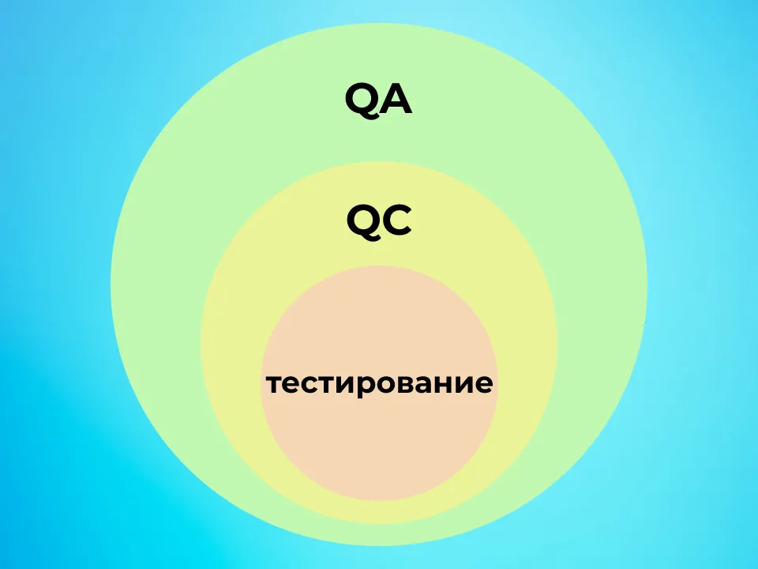

## Введение в тестирование

В этом проекте ты познакомишься с основами работы QA-инженера по ручному тестированию.

___

> 💡 Если это твой первый проект, заполни эту [форму](http://opros.so/kAnXy).

> 💡 [Нажми сюда](https://new.oprosso.net/p/4cb31ec3f47a4596bc758ea1861fb624), чтобы поделиться с нами обратной связью на этот проект. Это анонимно и поможет нашей команде сделать обучение лучше. Рекомендуем заполнить опрос сразу после выполнения проекта.

## Оглавление

-   [Глава 1](https://platform.21-school.ru/project/71963/task#%D0%B3%D0%BB%D0%B0%D0%B2%D0%B0-1)
    -   [Общая инструкция](https://platform.21-school.ru/project/71963/task#%D0%BE%D0%B1%D1%89%D0%B0%D1%8F-%D0%B8%D0%BD%D1%81%D1%82%D1%80%D1%83%D0%BA%D1%86%D0%B8%D1%8F)
-   [Глава 2](https://platform.21-school.ru/project/71963/task#%D0%B3%D0%BB%D0%B0%D0%B2%D0%B0-2)
    -   [Общая информация](https://platform.21-school.ru/project/71963/task#%D0%BE%D0%B1%D1%89%D0%B0%D1%8F-%D0%B8%D0%BD%D1%84%D0%BE%D1%80%D0%BC%D0%B0%D1%86%D0%B8%D1%8F)
-   [Глава 3](https://platform.21-school.ru/project/71963/task#%D0%B3%D0%BB%D0%B0%D0%B2%D0%B0-3)
    -   [Тестирование и тестировщики](https://platform.21-school.ru/project/71963/task#%D1%82%D0%B5%D1%81%D1%82%D0%B8%D1%80%D0%BE%D0%B2%D0%B0%D0%BD%D0%B8%D0%B5-%D0%B8-%D1%82%D0%B5%D1%81%D1%82%D0%B8%D1%80%D0%BE%D0%B2%D1%89%D0%B8%D0%BA%D0%B8)
    -   [Задание 1. Изучение ресурса ISTQB](https://platform.21-school.ru/project/71963/task#%D0%B7%D0%B0%D0%B4%D0%B0%D0%BD%D0%B8%D0%B5-1-%D0%B8%D0%B7%D1%83%D1%87%D0%B5%D0%BD%D0%B8%D0%B5-%D1%80%D0%B5%D1%81%D1%83%D1%80%D1%81%D0%B0-istqb)
-   [Глава 4](https://platform.21-school.ru/project/71963/task#%D0%B3%D0%BB%D0%B0%D0%B2%D0%B0-4)
    -   [QA, QC, Testing](https://platform.21-school.ru/project/71963/task#qa-qc-testing)
    -   [Задание 2. Отличия QA от QC](https://platform.21-school.ru/project/71963/task#%D0%B7%D0%B0%D0%B4%D0%B0%D0%BD%D0%B8%D0%B5-2-%D0%BE%D1%82%D0%BB%D0%B8%D1%87%D0%B8%D1%8F-qa-%D0%BE%D1%82-qc)
-   [Глава 5](https://platform.21-school.ru/project/71963/task#%D0%B3%D0%BB%D0%B0%D0%B2%D0%B0-5)
    -   [SDLC — жизненный цикл разработки ПО](https://platform.21-school.ru/project/71963/task#sec_sdlc)
    -   [Задание 3. Жизненный цикл разработки ПО](https://platform.21-school.ru/project/71963/task#%D0%B7%D0%B0%D0%B4%D0%B0%D0%BD%D0%B8%D0%B5-3-%D0%B6%D0%B8%D0%B7%D0%BD%D0%B5%D0%BD%D0%BD%D1%8B%D0%B9-%D1%86%D0%B8%D0%BA%D0%BB-%D1%80%D0%B0%D0%B7%D1%80%D0%B0%D0%B1%D0%BE%D1%82%D0%BA%D0%B8-%D0%BF%D0%BE)
-   [Глава 6](https://platform.21-school.ru/project/71963/task#%D0%B3%D0%BB%D0%B0%D0%B2%D0%B0-6)
    -   [Философия тестирования](https://platform.21-school.ru/project/71963/task#%D1%84%D0%B8%D0%BB%D0%BE%D1%81%D0%BE%D1%84%D0%B8%D1%8F-%D1%82%D0%B5%D1%81%D1%82%D0%B8%D1%80%D0%BE%D0%B2%D0%B0%D0%BD%D0%B8%D1%8F)
    -   [Задание 4. Принципы тестирования](https://platform.21-school.ru/project/71963/task#%D0%B7%D0%B0%D0%B4%D0%B0%D0%BD%D0%B8%D0%B5-4-%D0%BF%D1%80%D0%B8%D0%BD%D1%86%D0%B8%D0%BF%D1%8B-%D1%82%D0%B5%D1%81%D1%82%D0%B8%D1%80%D0%BE%D0%B2%D0%B0%D0%BD%D0%B8%D1%8F)

## Глава 1

### Общая инструкция

Как учиться в «Школе 21»:

-   Здесь тебя ждет уникальный образовательный опыт с большим количеством свободы. Ты получаешь задачу и самостоятельно ищешь пути решения, используя любые удобные способы поиска информации — ресурсы Интернета или нейросети (например, GigaChat). Но внимательно относись к качеству информации: проверяй, думай, анализируй, сравнивай.
-   Взаимообучение (Peer-to-Peer, P2P) — это обмен знаниями и опытом с другими пирами, где каждый выступает и учителем, и учеником. Такой подход позволяет глубже понять материал, учась друг у друга.
-   Чувствуй себя свободно и проси о помощи — вокруг тебя те, кто тоже впервые проходят этот путь. Делись своим опытом и идеями с другими. Присоединяйся к Rocket.Chat, чтобы быть в курсе всех новостей от нашего сообщества.
-   Твое обучение не будет иметь никакого смысла, если ты будешь копировать чужие решения. Если пользуешься помощью других — всегда разбирайся до конца, почему, как и зачем. Не бойся ошибиться.
-   Кажется, что задача невыполнима? Сделай перерыв, проветрись, перезагрузи голову — это помогало многим. Возможно, после этого решение придет само собой.
-   Важен не только результат обучения, но и сам процесс. Нужно не просто решить задачу, а понять, КАК ее решить.

Как работать с проектом:

-   Перед выполнением проект необходимо склонировать с GitLab в одноименный репозиторий.
-   Все файлы необходимо создавать в папке _src/_ склонированного репозитория.
-   После клонирования проекта необходимо создать ветку _develop_ и вести разработку в ней. После этого пушить в GitLab также нужно ветку _develop_.
-   В твоей директории не должно быть иных файлов, кроме тех, что обозначены в заданиях.

## Глава 2

### Общая информация

Профессия тестировщика программного обеспечения (Quality Assurance, QA) играет ключевую роль в процессе разработки ПО. Основная задача тестировщика — это проверка соответствия программного продукта требованиям и обеспечение качества на всех этапах жизненного цикла разработки ПО. Тестировщики работают над тем, чтобы конечный продукт был надежным, удобным в использовании и удовлетворял запросы пользователей/заказчика.

Существуют разные виды тестирования, включая ручное и автоматизированное тестирование, каждый из которых требует определенных навыков и подходов. Тестировщик должен уметь не только выявлять ошибки, но и работать в тесной связке с командой разработки для их устранения. В этой профессии важно внимание к деталям, аналитическое мышление и умение ясно и четко формулировать свои мысли как устно, так и письменно. О том, какими именно навыками важно обладать инженеру по тестированию, ты можешь ознакомиться в дополнительном материале _**"Soft и Hard Skills QA-инженера по тестированию"**_, который лежит в папке `materials`.

В этом проекте ты:

-   разберешься, что такое тестирование и почему это важный этап в процессе разработки ПО;
-   познакомишься с основными понятиями и терминами в тестировании, включая различие между QA и QC;
-   научишься применять стандарты тестирования для контроля качества разработки.

## Глава 3

### Тестирование и тестировщики

Что же такое тестирование?

**Тестирование** — это процесс, направленный на проверку соответствия программного продукта заданным требованиям. Другими словами, мы отвечаем на вопрос: «Соответствует ли реальное поведение программы ожидаемому?». **Требования**, в свою очередь, — это спецификация того, что должно быть реализовано.

Зачем проводится тестирование (цели тестирования)?

Попробуем сформулировать это так:

-   чтобы убедиться, что программный продукт функционирует в соответствии с ожиданиями;
-   чтобы выявить ситуации, в которых поведение программы является неправильным или не соответствует требованиям;
-   чтобы получить представление о состоянии продукта на данный момент.

Кроме того, тестировщики придумывают и проверяют различные сценарии поведения конечных пользователей и ведут коммуникацию с командой разработки до полного устранения обнаруженных дефектов.

И на этом моменте важно понимать, что формулировок и трактовок понятия «тестирование» великое множество и некоторые из них могут быть неверными. Всё из-за того, что источников информации, как и авторов, очень много, и есть риск получить сильное искажение как определений, так и представлений о тестировании в целом.

Чтобы такого не произошло, важно познакомиться с **международным ресурсом по тестированию** (и не только) — [ISTQB](https://www.istqb.org/), который котируется во всём мире.

### Задание 1. Изучение ресурса ISTQB

1.  Исследуй сайт ISTQB, изучи функциональность и возможности данного ресурса (ISTQB - ведущая организация, чьи стандарты и терминология в области тестирования признаны во всем мире).
2.  Сравни разделы Certifications, SCR и Glossary по следующим критериям: для кого предназначен раздел, для каких целей и как часто его можно использовать. Результаты представь в виде сводной таблицы.
3.  Найди в официальном глоссарии ISTQB определение понятия «тестирование». Выпиши его. Затем найди и выпиши два альтернативных определения этого термина из 2 других источников, укажи источники (на твой выбор, исключая Википедию). Сравни найденные определения с определением из ISTQB, проанализируй, в чем заключаются основные отличия или неточности по сравнению с официальным стандартом.
4.  Представь, что коллега-тестировщик в твоей команде путает понятие «тестирования» с другими (изучи, с какими другими понятиями можно путать понятие «тестирование»). Напиши краткое пояснение (5-7 предложений), в котором ты разграничиваешь эти понятия и объясняешь, для чего необходимо следование общепринятому стандарту.
5.  Выполненное задание оформи в файле _task\_1.md._

## Глава 4

### QA, QC, Testing

Теперь, когда ты знаешь, как проверить правдивость любых определений, мы можем идти дальше.

Часто в сфере тестирования можно встретить такие понятия, как:

-   Quality Assurance (QA) — обеспечение качества;
-   Quality Control (QC)— контроль качества;
-   Testing — тестирование.

Давай разберемся, что это такое и как их различать.

**Quality Control (QC)** обеспечивает проверку продукта не только на соответствие требованиям, но и на соответствие заранее согласованному уровню качества продукта и готовность к выпуску продукта в эксплуатацию.

**Quality Assurance (QA)** — это не только и не столько тестирование, будь то ручное или автоматизированное, а больше набор методик и подходов, предназначенных для выявления и контроля всех несоответствий качества программных продуктов. То есть QA включает в себя QC. QA должно обеспечивать методы и технологии всех участников процесса создания ПО, чтобы в итоге получить качественный веб-продукт.

Тогда можно сказать, что **тестирование (Testing)** является одной из техник контроля качества, включающей в себя активности по:

-   планированию работ (Test Management),
-   проектированию тестов (Test Design),
-   выполнению тестирования (Test Execution),
-   анализу полученных результатов (Test Analysis).

Если это представить графически, то мы получим следующее изображение:

### Задание 2. Отличия QA от QC

1.  Самостоятельно исследуй классические определения QA и QC и составь сравнительную таблицу, в которой будут отражены 3 колонки:
    
    -   на каком этапе подключаются к работе;
        
    -   основные активности в работе (с кем взаимодействуют, на что тратят бо́льшую часть времени и т. п.);
        
    -   взаимодействие с командой (обучение и наставничество, обсуждение успехов и неудач, обсуждение улучшений рабочих процессов и т. д.).
        
2.  Затем на сайтах по поиску работы найди по 3-4 реальные вакансии на позиции, где в названии или описании есть упоминание QA (например, «QA Engineer», «QA Lead») и QC (например, «QC Specialist», «QC Tester»).
    
    Обрати внимание, что большинство вакансий с заголовком «QA Engineer» на деле могут описывать обязанности тестировщика (QC). Твоя задача — найти вакансии, где обязанности действительно соответствуют философии QA (упреждающее обеспечение качества, работа с процессами).
    
    На основе анализа обязанностей в вакансиях, дополни таблицу четвертой колонкой «Как это выглядит в реальных вакансиях». Включи примеры обязанностей из найденных объявлений и ссылки на них.
    
3.  Оформи таблицу в файле _task\_2.md._
    

## Глава 5

### SDLC — жизненный цикл разработки ПО

Чтобы понять место тестирования в процессе разработки, необходимо понимать, как, собственно, строится и из чего состоит процесс разработки программного обеспечения (ПО).

**SDLC** (Software Development Life Cycle) — это структура, описывающая этапы разработки программного обеспечения от идеи до выпуска и сопровождения продукта. Важно понимать, что существует множество моделей SDLC, каждая из которых имеет свои особенности, плюсы и минусы. Тебе предстоит изучить несколько самых известных моделей разработки и понять, какие роли в них играют тестировщики и на каком этапе они подключаются к работе.

Как уже было сказано выше, у каждой модели жизненного цикла есть свои плюсы и минусы… Но иногда минусы очень существенные, и требуется в корне менять модель разработки ПО. Такая ситуация однажды и сложилась, и в ходе ее решения был создан **Agile manifesto**. Кстати, ты еще не раз услышишь фразу «у нас Agile». Выполнив задание ниже, ты будешь понимать, что этот человек имел в виду (возможно, будешь это понимать даже лучше, чем он :).

### Задание 3. Жизненный цикл разработки ПО

1.  Изучи следующие методологии разработки ПО (особенно важно понять достоинства и недостатки каждой методологии):
    
    -   Waterfall (водопадная модель);
    -   V-model;
    -   Incremental Model;
    -   Scrum;
    -   Kanban.
2.  Создай таблицу, сравнивающую методологии (Waterfall, V-Model, Incremental, Scrum, Kanban) по следующим критериям:
    
    -   Плюсы
    -   Минусы / Риски
    -   Пример/ тип проекта/компании, для которой данная методология подходит лучше всего (приведи краткий пример для каждой).
3.  Изучи, что такое «Agile-манифест» (например, [тут](https://agilemanifesto.org/iso/ru/manifesto.html)), выпиши 4 основные идеи этого манифеста. Для каждой из идей придумай по 1-2 конкретных действия или правила, которые могли бы быть в команде, следующей этому манифесту.
    
4.  Оформи все идеи в таблицу:
    
    |Идея манифеста|Что это значит на практике? (1-2 конкретных действия команды)|
    |---|---|
    |\[Текст идеи\]|1\. \[Конкретное действие\]
    2\. \[Конкретное действие\]|
    
5.  Обязательно обрати внимание на фразу: «То есть **не отрицая важности того, что справа**, мы всё-таки больше ценим то, что слева». В конце таблицы добавь комментарий о том, как ты понимаешь эту фразу.
    
6.  Выполненное задание оформи в файле _task\_3.md._
    

## Глава 6

### Философия тестирования

Философия тестирования отвечает на вопросы:

-   Что такое тестирование?
-   Почему тестирование необходимо?

А также содержит **принципы тестирования**.

На первые два вопроса мы уже ответили выше. Теперь поговорим о принципах тестирования.

Задание расписать сами принципы и что каждый означает у тебя еще будет, сейчас же мы просто поясним, что это и для чего. Принципы тестирования — это некие договоренности/аксиомы/манифесты. Если посмотреть на определение слова «принцип», то станет понятно, что это то, что не требует доказательств. Соответственно, и все принципы тестирования — это некие аксиомы. Знание этих принципов тестирования поможет сформировать грамотную стратегию тестирования, оптимизировать сам процесс тестирования, расставить приоритеты, оценить риски и т. д.

Запомни следующие важные тезисы:

-   Обязанность тестировщика — снизить вероятность появления ошибки в тестируемом объекте до минимума. Раз нельзя найти все баги, то нужно протестировать так, чтобы в эксплуатации не вылезли самые критичные.
-   При обнаружении любого пропущенного дефекта в продукте тестировщик обязан установить причину и следствие его появления (а не прикрываться принципом «Тестирование демонстрирует наличие дефектов, а не их отсутствие») и сделать работу над ошибками, чтобы в дальнейшем не пропускать по данной причине дефекты.

В общем, помни, что данные принципы созданы не для того, чтобы ими прикрываться, а чтобы использовать их как инструмент для улучшения качества и надежности продукта.

### Задание 4. Принципы тестирования

1.  Найди информацию про 7 принципов тестирования в минимум двух авторитетных источниках (Интернет в помощь). Укажи ссылки на источники и кратко (1-2 предложения) опиши каждый из принципов.
2.  Далее проранжируй 7 принципов тестирования по степени их важности для успеха проекта, на твой личный взгляд (укажи 3 самых важных и 1 менее важный принцип).
3.  Подумай, какие новые принципы или уточнения к старым стоило бы добавить к классическим 7 принципам с учетом современных реалий (например, распространение DevOps, AI-тестирование, низко-кодовые платформы). Запиши свои идеи.
4.  Выполненное задание оформи в файле _task\_4.md._

💡 [Нажми сюда](https://new.oprosso.net/p/4cb31ec3f47a4596bc758ea1861fb624), **чтобы оставить отзыв на этот проект**. Это анонимно и поможет нашей команде «Школы 21» сделать обучение по этому проекту лучше. Рекомендуем заполнить опрос сразу после выполнения проекта.