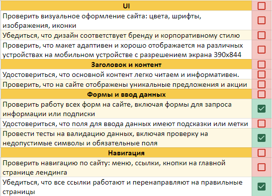

# **Тестовые артефакты**

В этом проекте ты научишься создавать тест-кейсы, чек-листы, баг-репорты, а также начнешь создание самого верхнеуровневого документа в тестировании — тест-плана.

💡 [Нажми сюда](https://new.oprosso.net/p/4cb31ec3f47a4596bc758ea1861fb624), **чтобы оставить отзыв на этот проект**. Это анонимно и поможет нашей команде «Школы 21» сделать обучение по этому проекту лучше. Рекомендуем заполнить опрос сразу после выполнения проекта.

## **Содержание**

- [Глава 1](#%D0%B3%D0%BB%D0%B0%D0%B2%D0%B0-1)
  - [Общая инструкция](#%D0%BE%D0%B1%D1%89%D0%B0%D1%8F-%D0%B8%D0%BD%D1%81%D1%82%D1%80%D1%83%D0%BA%D1%86%D0%B8%D1%8F)
- [Глава 2](#%D0%B3%D0%BB%D0%B0%D0%B2%D0%B0-2)
  - [Общая информация](#%D0%BE%D0%B1%D1%89%D0%B0%D1%8F-%D0%B8%D0%BD%D1%84%D0%BE%D1%80%D0%BC%D0%B0%D1%86%D0%B8%D1%8F)
- [Глава 3](#%D0%B3%D0%BB%D0%B0%D0%B2%D0%B0-3)
  - [Основные тестовые артефакты](#%D0%BE%D1%81%D0%BD%D0%BE%D0%B2%D0%BD%D1%8B%D0%B5-%D1%82%D0%B5%D1%81%D1%82%D0%BE%D0%B2%D1%8B%D0%B5-%D0%B0%D1%80%D1%82%D0%B5%D1%84%D0%B0%D0%BA%D1%82%D1%8B)
  - [Тест-кейс](#%D1%82%D0%B5%D1%81%D1%82-%D0%BA%D0%B5%D0%B9%D1%81)
  - [Задание 1. Составить тест-кейс](#%D0%B7%D0%B0%D0%B4%D0%B0%D0%BD%D0%B8%D0%B5-1-%D1%81%D0%BE%D1%81%D1%82%D0%B0%D0%B2%D0%B8%D1%82%D1%8C-%D1%82%D0%B5%D1%81%D1%82-%D0%BA%D0%B5%D0%B9%D1%81)
  - [Чек-лист и тестовый набор](#%D1%87%D0%B5%D0%BA-%D0%BB%D0%B8%D1%81%D1%82-%D0%B8-%D1%82%D0%B5%D1%81%D1%82%D0%BE%D0%B2%D1%8B%D0%B9-%D0%BD%D0%B0%D0%B1%D0%BE%D1%80)
  - [Задание 2. Составить чек-лист](#%D0%B7%D0%B0%D0%B4%D0%B0%D0%BD%D0%B8%D0%B5-2-%D1%81%D0%BE%D1%81%D1%82%D0%B0%D0%B2%D0%B8%D1%82%D1%8C-%D1%87%D0%B5%D0%BA-%D0%BB%D0%B8%D1%81%D1%82)
  - [Баг-репорт](#%D0%B1%D0%B0%D0%B3-%D1%80%D0%B5%D0%BF%D0%BE%D1%80%D1%82)
  - [Тест-план](#%D1%82%D0%B5%D1%81%D1%82-%D0%BF%D0%BB%D0%B0%D0%BD)
  - [Задание 3. Разработка тест-плана](#%D0%B7%D0%B0%D0%B4%D0%B0%D0%BD%D0%B8%D0%B5-3-%D1%80%D0%B0%D0%B7%D1%80%D0%B0%D0%B1%D0%BE%D1%82%D0%BA%D0%B0-%D1%82%D0%B5%D1%81%D1%82-%D0%BF%D0%BB%D0%B0%D0%BD%D0%B0)
- [Глава 4](#%D0%B3%D0%BB%D0%B0%D0%B2%D0%B0-4)
  - [Вспомогательные тестовые артефакты](#%D0%B2%D1%81%D0%BF%D0%BE%D0%BC%D0%BE%D0%B3%D0%B0%D1%82%D0%B5%D0%BB%D1%8C%D0%BD%D1%8B%D0%B5-%D1%82%D0%B5%D1%81%D1%82%D0%BE%D0%B2%D1%8B%D0%B5-%D0%B0%D1%80%D1%82%D0%B5%D1%84%D0%B0%D0%BA%D1%82%D1%8B)
  - [Чит-лист](#%D1%87%D0%B8%D1%82-%D0%BB%D0%B8%D1%81%D1%82)
  - [Задание 4. Дополнить чек-лист из задания 2](#%D0%B7%D0%B0%D0%B4%D0%B0%D0%BD%D0%B8%D0%B5-4-%D0%B4%D0%BE%D0%BF%D0%BE%D0%BB%D0%BD%D0%B8%D1%82%D1%8C-%D1%87%D0%B5%D0%BA-%D0%BB%D0%B8%D1%81%D1%82-%D0%B8%D0%B7-%D0%B7%D0%B0%D0%B4%D0%B0%D0%BD%D0%B8%D1%8F-2)
  - [Тестовые данные](#%D1%82%D0%B5%D1%81%D1%82%D0%BE%D0%B2%D1%8B%D0%B5-%D0%B4%D0%B0%D0%BD%D0%BD%D1%8B%D0%B5)
  - [Задание 5. Тестовые данные](#%D0%B7%D0%B0%D0%B4%D0%B0%D0%BD%D0%B8%D0%B5-5-%D1%82%D0%B5%D1%81%D1%82%D0%BE%D0%B2%D1%8B%D0%B5-%D0%B4%D0%B0%D0%BD%D0%BD%D1%8B%D0%B5)
  - [Тестовый сценарий](#%D1%82%D0%B5%D1%81%D1%82%D0%BE%D0%B2%D1%8B%D0%B9-%D1%81%D1%86%D0%B5%D0%BD%D0%B0%D1%80%D0%B8%D0%B9)
  - [Задание 6. Составить тестовый сценарий](#%D0%B7%D0%B0%D0%B4%D0%B0%D0%BD%D0%B8%D0%B5-6-%D1%81%D0%BE%D1%81%D1%82%D0%B0%D0%B2%D0%B8%D1%82%D1%8C-%D1%82%D0%B5%D1%81%D1%82%D0%BE%D0%B2%D1%8B%D0%B9-%D1%81%D1%86%D0%B5%D0%BD%D0%B0%D1%80%D0%B8%D0%B9)
  - [Сценарий использования](#%D1%81%D1%86%D0%B5%D0%BD%D0%B0%D1%80%D0%B8%D0%B9-%D0%B8%D1%81%D0%BF%D0%BE%D0%BB%D1%8C%D0%B7%D0%BE%D0%B2%D0%B0%D0%BD%D0%B8%D1%8F)

## **Глава 1**

### **Общая инструкция**

Как учиться в «Школе 21»:

- Здесь тебя ждет уникальный образовательный опыт с большим количеством свободы. Ты получаешь задачу и самостоятельно ищешь пути решения, используя любые удобные способы поиска информации — ресурсы Интернета или нейросети (например, GigaChat). Но внимательно относись к качеству информации: проверяй, думай, анализируй, сравнивай.
- Взаимообучение (Peer-to-Peer, P2P) — это обмен знаниями и опытом с другими пирами, где каждый выступает и учителем, и учеником. Такой подход позволяет глубже понять материал, учась друг у друга.
- Чувствуй себя свободно и проси о помощи — вокруг тебя те, кто тоже впервые проходят этот путь. Делись своим опытом и идеями с другими. Присоединяйся к Rocket.Chat, чтобы быть в курсе всех новостей от нашего сообщества.
- Твое обучение не будет иметь никакого смысла, если ты будешь копировать чужие решения. Если пользуешься помощью других — всегда разбирайся до конца, почему, как и зачем. Не бойся ошибиться.
- Кажется, что задача невыполнима? Сделай перерыв, проветрись, перезагрузи голову — это помогало многим. Возможно, после этого решение придет само собой.
- Важен не только результат обучения, но и сам процесс. Нужно не просто решить задачу, а понять, КАК ее решить.

Как работать с проектом:

- Перед выполнением проект необходимо склонировать с GitLab в одноименный репозиторий.
- Все файлы необходимо создавать в папке *src/* склонированного репозитория.
- После клонирования проекта необходимо создать ветку *develop* и вести разработку в ней. После этого пушить в GitLab также нужно ветку *develop*.
- В твоей директории не должно быть иных файлов, кроме тех, что обозначены в заданиях.

## **Глава 2**

### **Общая информация**

Работа тестировщика неразрывно связана с артефактами тестирования. Любое планирование, выполнение или отчет о проделанной работе — это то, чем предстоит заниматься каждый день. По тестовым артефактам очень часто собирают метрики по качеству продукта, прикидывают время выполнения и оценивают тестовое покрытие. Из всего вышесказанного должно быть понятно, что это важная тема, знание которой повысит твой уровень как специалиста по тестированию.

В этом проекте ты:

- разберешься в основных тестовых артефактах и создашь их;
- познакомишься с планом тестирования.

## **Глава 3**

### **Основные тестовые артефакты**

В ходе тестирования создаются и используются различные тестовые артефакты (например, документы, модели, дизайны, рисунки и т. д.). Наиболее распространёнными из них являются:

- **Тест-кейс** — последовательность действий, по которой можно проверить, соответствует ли тестируемая функция установленным требованиям.
- **Баг-репорт** — документ, описывающий несоответствие реальной работы программы с предъявленными к ней требованиями.
- **Чек-лист** — список необходимых проверок.
- **Тест-план** — это артефакт тестирования, описывающий действия, которые будут происходить в процессе тестирования: от разработки стратегии до критериев поиска ошибок. Он также описывает логику завершения задач и оценку рисков со сценариями их разрешения.

Чтобы глубже разобраться в проекте, важно сначала понять, какую роль играют эти артефакты в жизненном цикле разработки. Изучи эту связь заранее.

А теперь давай познакомимся с каждым из них подробнее! 😁
P.S.: и не забудь проверить папку Materials

### **Тест-кейс**

**Тест-кейс** — это тестовый артефакт, суть которого заключается в выполнении некоторого количества действий и условий, необходимых для проверки определенного функционала разрабатываемого ПО.

Из чего состоит тест-кейс?
Типичную структуру можно представить вот так:

- **ID кейса\*** (уникальный идентификатор, который может быть числовым, буквенным, буквенно-числовым). В системах управления тестированием (TMS) ID тест-кейса проставляется автоматически, исходя из его порядкового номера и проекта, в котором данный тест-кейс создаётся. Например: SM02 (SM — сокращённый код проекта, 02 — порядковый номер тест-кейса). В нашем курсе тест-кейсы нужно будет просто нумеровать.
- **Заголовок\*** — наименование тест-кейса. Не делай его большим, из названия должно быть сразу понятно, что и как тестируется. В названии тест-кейса не используй слово «Проверка» — это избыточно.
- **Шаги\*** — это описание последовательных действий, которые необходимо выполнить для проведения теста.
- **Ожидаемый результат\*** — это то, как система должна реагировать на шаги теста.
- **Постусловия** — возможные действия по приведению системы в первоначальный вид либо «подчистка за собой» каких-то файлов, данных в базе данных и т. д.

**\*** — обязательные поля тест-кейса.

### **Задание 1. Составить тест-кейс**

1. Перейди на сайт <https://www.saucedemo.com/> и составь тест-кейс на позитивную проверку авторизации (валидный логин и пароль). На этом этапе работай самостоятельно.
2. Составь тест-кейс на негативную проверку (тут не ограничивай свою фантазию только проверкой процесса авторизации). Можно проверить UI (интерфейс), можно проверить поля ввода, работу подсказок при неправильных действиях пользователя и т.д. На этом этапе работай самостоятельно.
3. Теперь протестируй возможности ИИ как ассистента для генерации рутинных задач.

   Попробуй сгенерировать черновик одного из тест-кейсов с помощью нейросети. Проанализируй полученный результат: все ли поля заполнены корректно? Соответствует ли заголовок принципу «Что? Где? Когда?»? Есть ли лишние или пропущенные шаги? Внеси правки и сохрани финальную версию.

   Сохрани скриншот промпта для решения задачи. Составь отчет - укажи, какой тест-кейс был сгенерирован с помощью ИИ, какой промпт был использован, и какие изменения были внесены после анализа.
4. Сделай несколько скриншотов процесса проверки позитивного и негативного сценариев (виден твой процесс проверки).
5. Выполненное задание и скриншоты оформи в файле *task\_1.md.*

### **Чек-лист и тестовый набор**

**Чек-лист** — это список проверок, которые нужно осуществить на тестируемом ресурсе. От тест-кейса чек-лист отличается степенью подробности.

Для использования чек-листа при тестировании нужно очень много информации держать в голове в момент прогона тестов и знать логику работы приложения (тут не расписываются сами тестовые случаи). Иными словами, чек-листы описывают кратко то, что хотим протестировать. Например:

Что лучше использовать в реальных условиях: тест-кейс или чек-лист — это вечный холивар и единого мнения до сих пор нет. У тебя при изучении данных артефактов сложится своё мнение, которое также, скорее всего, будет меняться с ростом опыта. В общем, неважно, что использовать, тест-кейсы или чек-листы — главное, чтобы функционал приложения был достаточно покрыт проверками и эти проверки были эффективными, а не существовали просто потому, что так надо.

**Тестовый набор (Test Suite)** — набор тест-кейсов, предназначенных для тестирования программы. Обычно используется для того, чтобы объединить в один набор несколько тест-кейсов, проверяющих один и тот же функционал. Его не стоит путать с чек-листом. Test Suite является обычным объединением тест-кейсов для удобства их выполнения и отслеживания.

### **Задание 2. Составить чек-лист**

1. Перейди на сайт «Школы 21» в раздел [«Как мы учим»](https://21-school.ru/methodology) и составь чек-лист (минимум 5 проверок) на данный раздел. На этом этапе работай самостоятельно.
2. Т.к. чек-лист это просто список проверок, то не всем, кто его читает, это может быть понятно, что предусматривает тот или иной пункт проверки. Укажи в скобках краткое описание смысла проверки для каждого пункта.
3. Далее используй нейросеть для расширения своего чек-листа. Попроси ИИ сгенерировать дополнительные проверки, специфичные для этого сайта. Выбери из предложенного списка 2-3 наиболее релевантные проверки и добавь их в свой чек-лист. Сохрани скриншот промпта для решения задачи. Составь отчет, в нем укажи, какие проверки были добавлены и почему.
4. Выполненное задание оформи в файле *task\_2.md.*

### **Баг-репорт**

**Баг-репорт** описывает найденный дефект. В связи с этим актуален вопрос: что вообще является багом? Иногда объективного ответа на этот вопрос нет. При решении этого вопроса в первую очередь нужно проверить требования к ПО. Если проверка требований или имеющейся документации по проекту не дала четкого ответа на вопрос, следует подумать о баге с перспективы пользовательского опыта: если пользователю может показаться, что данное поведение системы — ошибка, скорее всего, так оно и есть. Если совсем просто, под багом мы будем понимать ошибку, когда система не соответствует заявленным требованиям.

Более детально и на практике ты познакомишься с баг-репортами в проекте QA5\_Defects.

### **Тест-план**

Итак, мы подобрались к главному документу в тестировании.

**Тест-план** — документ, описывающий весь объем работ по тестированию, начиная с описания тестируемых объектов, стратегии, расписания, критериев начала и окончания тестирования, и заканчивая необходимым в процессе работы оборудованием, специальными знаниями, а также оценкой рисков с вариантами их разрешения.

**Тест-план позволяет:**

- приоритизировать задачи по тестированию;
- выстроить стратегию тестирования, согласованную со всей командой;
- вести учет всех требуемых ресурсов, как технических, так и человеческих;
- планировать использование ресурсов на тестирование;
- просчитать риски, возможные при проведении тестирования.

Для тест-плана существует **ГОСТ Р 56922-2016**. Это перевод международного стандарта ISO/IEC/IEEE 29119-3:2013. В данном стандарте представлены определения и примеры, а также шаблоны тестовой документации (план тестирования, тест-кейсы, чек-листы, отчеты по тестированию). Возможно, шаблоны тест-кейсов, чек-листов, тест-плана на конкретном проекте будут отличаться от тех, что указаны в стандарте. Это нормально. Каждая организация, проект, команда адаптирует процессы, документацию и т. д. под свои потребности (что-то убирает, где-то добавляет детализации), главное — не противоречить общепринятым стандартам и понятиям.

### **Задание 3. Разработка тест-плана**

1. Разработай план тестирования для сайта «Школа 21», [раздел «Корпоративное обучение»](https://21-school.ru/corporate-training/gruppovye-intensivy-dlia-rukovoditelei-i-komand). Классический тест-план содержит 15 пунктов. Твоя задача разработать тест-план, который будет содержать минимум 8 пунктов (с описанием каждого пункта), которые тебе понятны на данном этапе (все пункты заполнить корректно может быть трудно, т.к. мы еще не изучали некоторые темы, но понять назначение данных пунктов вполне реалистично).
2. Выполненное задание оформи в файле *task\_3.md.*

## **Глава 4**

### **Вспомогательные тестовые артефакты**

Кроме вышеперечисленных тестовых артефактов, ты также будешь использовать «вспомогательные» инструменты, например, «чит-лист» или генератор тестовых данных. Рассмотрим их, а также дополнительные тестовые артефакты детальнее.

### **Чит-лист**

**Чит-листом** можно считать некую «шпаргалку» по тестированию, цель которой — перечислить все возможные проверки. Функционал в различных приложениях зачастую повторяется (поля ввода логина и пароля на странице авторизации, валидация email, числовые поля и т. д.), поэтому, придумав проверки однажды, совсем необязательно вспоминать их при встрече такого же или очень схожего функционала и тем более придумывать заново.

На просторах интернета есть множество готовых чит-листов, которые могут дополнить твои проверки по уже выполненным заданиям.

### **Задание 4. Дополнить чек-лист из задания 2**

1. Найди в интернете чит-лист для проверки информационных веб-страниц. Выбери из него 5 пунктов, которые, по твоему мнению, наиболее важны для для раздела «Как мы учим» сайта «Школы 21», цель которого — привлечь абитуриентов.
2. Скопируй проверки из файла *task\_2.md* в файл *task\_4.md* и допиши недостающие проверки в раздел «новые проверки».
3. Протестируй данную страницу по обновленному списку проверок и укажи напротив каждой проверки её статус (pass или fail).
4. Все найденные баги или «странности» (при наличии) записывай в этот же документ, в котором создай новый раздел (название раздела на свой вкус).

### **Тестовые данные**

**Тестовые данные** — это данные, которые используются для проверки работоспособности функционала/приложения.

Например, чтобы протестировать форму по загрузке изображений, потребуются изображения разных форматов (jpeg, png, svg и т. п.), разных размеров… И это только позитивные проверки. Если ещё учесть негативные проверки, например, попытка загрузки файлов неподдерживаемых форматов, то количество файлов резко возрастёт.

Иногда возникают сложности с подготовкой тестовых данных. Например, нужен файл не только определенного типа, но и определенного размера (веса). Можно потратить много времени на создание такого файла, если не знать о ресурсах, которые помогут автоматизировано решить эту задачу. И кстати, от полноты и качества тестовых данных зависит правильность и тестовое покрытие объекта тестирования. Ведь согласись, нельзя быть уверенным в правильности работы, например, конвертера изображений, если не проверить все заявленные форматы файлов для данного конвертера. А чтобы их проверить, нужны валидные (и не только) тестовые данные в виде этих файлов разного формата. Соответственно, когда ты получаешь задачу, в которой явно нужны тестовые данные — оцени сначала, на что должны быть направлены эти тестовые данные.

Итого, если собрать всё вышесказанное и ответить на вопрос «для чего нам нужны тестовые данные?», то получим примерно следующий ответ:

1. Для повышения эффективности и качества тестирования («правильные» тестовые данные = правильное тестирование).
2. Для экономии времени (подготовив тестовые данные однажды, можно ими пользоваться очень долго).

Теперь, когда ты знаешь о важности тестовых данных, давай посмотрим, каких видов и типов они бывают.

По видам тестовые данные могут быть ориентированы на:

- Производительность,
- Интеграцию,
- Безопасность,
- Локализацию/интернационализацию.

Также тестовые данные могут различаться по типам. Например:

- Валидные,
- Невалидные (не соответствуют требованиям либо пустые),
- Случайные,
- Нагрузочные,
- Дублирующие.

### **Задание 5. Тестовые данные**

1. Найди минимум два ресурса для генерации файлов различного размера. С помощью таких ресурсов удобно проверять функционал на ограничения по размеру загружаемого файла, что очень пригодится в будущей работе.
2. Найди минимум 2 ресурса для генерации тестовых данных — такие ресурсы удобны при необходимости заполнения многочисленных форм валидными данными. Как минимум ресурс должен уметь генерировать ФИО (а еще лучше + номер телефона, email, адрес).
3. Укажи ссылки на ресурсы, найденные в п. 1 и п. 2. Все найденные ресурсы должны быть рабочими, т. е. реально уметь выполнять указанную в задании функцию.
4. Представь, что ты тестируешь форму загрузки аватара пользователя с ограничением: "не более 5 МБ". Используя один из ресурсов, создай три тестовых файла для проверки функционала загрузки аватара с лимитом 5 МБ (позитивный и негативный тест). Сделай скриншоты, подтверждающие размеры созданных файлов.
5. Сгенерируй 5 тестовых пользователей, у которых будут данные (ФИО, номер телефона, email, адрес) для конкретной страны (например, Австралия любая другая на твой вкус) и проверь, соответствуют ли форматы телефонов и адресов стандартам этой страны.
6. Полученные материалы добавь в файл *task\_5.md.*

### **Тестовый сценарий**

**Тестовый сценарий** — набор предусловий, входных данных, действий (где это применимо), ожидаемых результатов и постусловий, разработанных на основе условий тестирования.

По определению тестовый сценарий очень похож на тест-кейс, однако различия есть. Тест-кейс рассматривает более низкоуровневые проверки, тогда как тестовый сценарий нацелен на более верхнеуровневые проверки (сквозные проверки функционала, приложения).

Для примера возьмём почтовое приложение. Тест-кейсы будут проверять поле ввода электронного адреса, область ввода сообщения, отдельные кнопки и т. п. Тестовый сценарий же будет проверять саму отправку письма.

### **Задание 6. Составить тестовый сценарий**

1. Разработай тестовый сценарий по процессу [«Как поступить в «Школу 21»](https://21-school.ru/admission).
2. Выполненное задание оформи в файле *task\_6.md.*

### **Сценарий использования**

Сценарий использования или юзкейс (use case) — это сценарная техника описания взаимодействия пользователей с продуктом, которое приведет к достижению конкретной цели.

Сценарий использования описывает, кто и что может сделать с системой или что система может сделать с кем и чем.

Обычно данная техника используется для определения пользовательских, функциональных и нефункциональных требований.

Самостоятельно изучи различия тестового сценария и сценария использования (цель, кто использует, примеры использования).

Сценарий использования отвечает на вопросы:

- Кто использует функционал/приложение/сайт?
- Что хочет сделать пользователь (какое действие)?
- Цель пользователя, которую он хочет достичь за счет выполнения действия.
- Шаги, которые необходимы, чтобы совершить нужное действие.
- Описание того, как функционал/приложение/сайт должен отреагировать на действия пользователя.

💡 [Нажми сюда](https://new.oprosso.net/p/4cb31ec3f47a4596bc758ea1861fb624), **чтобы оставить отзыв на этот проект**. Это анонимно и поможет нашей команде «Школы 21» сделать обучение по этому проекту лучше. Рекомендуем заполнить опрос сразу после выполнения проекта.