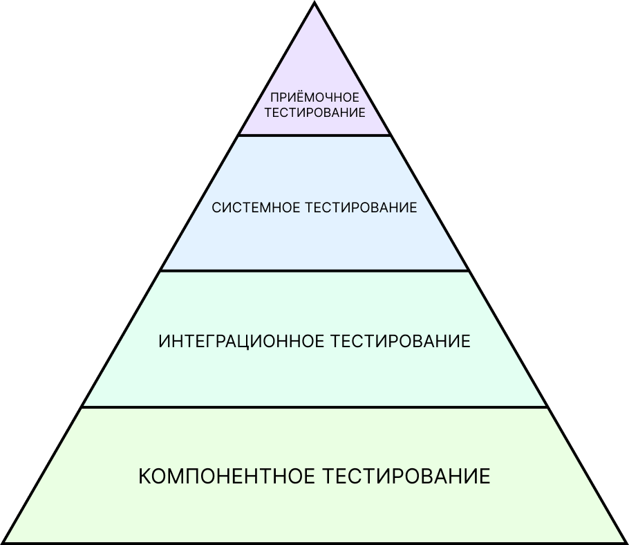
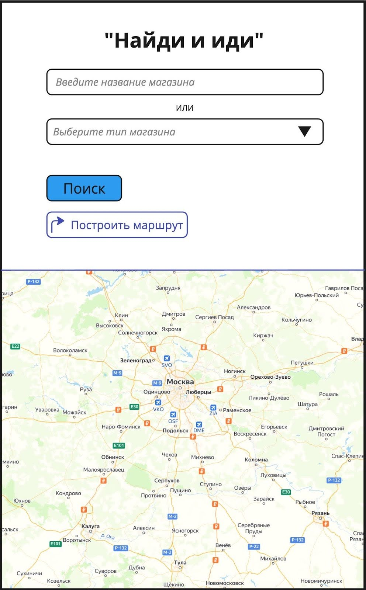

# Виды и уровни тестирования

В этом проекте ты научишься создавать чек-листы по методикам black box и grey box, а также научишься тестировать документацию.

💡 [Нажми сюда](https://new.oprosso.net/p/4cb31ec3f47a4596bc758ea1861fb624), **чтобы оставить отзыв на этот проект**. Это анонимно и поможет нашей команде «Школы 21» сделать обучение по этому проекту лучше. Рекомендуем заполнить опрос сразу после выполнения проекта.

## Содержание

- [Глава 1](#%D0%B3%D0%BB%D0%B0%D0%B2%D0%B0-1)
  - [Общая инструкция](#%D0%BE%D0%B1%D1%89%D0%B0%D1%8F-%D0%B8%D0%BD%D1%81%D1%82%D1%80%D1%83%D0%BA%D1%86%D0%B8%D1%8F)
- [Глава 2](#%D0%B3%D0%BB%D0%B0%D0%B2%D0%B0-2)
  - [Общая информация](#%D0%BE%D0%B1%D1%89%D0%B0%D1%8F-%D0%B8%D0%BD%D1%84%D0%BE%D1%80%D0%BC%D0%B0%D1%86%D0%B8%D1%8F)
- [Глава 3](#%D0%B3%D0%BB%D0%B0%D0%B2%D0%B0-3)
  - [Виды тестирования](#%D0%B2%D0%B8%D0%B4%D1%8B-%D1%82%D0%B5%D1%81%D1%82%D0%B8%D1%80%D0%BE%D0%B2%D0%B0%D0%BD%D0%B8%D1%8F)
  - [Задание 1. Классификация тестирования](#%D0%B7%D0%B0%D0%B4%D0%B0%D0%BD%D0%B8%D0%B5-1-%D0%BA%D0%BB%D0%B0%D1%81%D1%81%D0%B8%D1%84%D0%B8%D0%BA%D0%B0%D1%86%D0%B8%D1%8F-%D1%82%D0%B5%D1%81%D1%82%D0%B8%D1%80%D0%BE%D0%B2%D0%B0%D0%BD%D0%B8%D1%8F)
- [Глава 4](#%D0%B3%D0%BB%D0%B0%D0%B2%D0%B0-4)
  - [Уровни тестирования](#%D1%83%D1%80%D0%BE%D0%B2%D0%BD%D0%B8-%D1%82%D0%B5%D1%81%D1%82%D0%B8%D1%80%D0%BE%D0%B2%D0%B0%D0%BD%D0%B8%D1%8F)
  - [Задание 2. Уровни тестирования](#%D0%B7%D0%B0%D0%B4%D0%B0%D0%BD%D0%B8%D0%B5-2-%D1%83%D1%80%D0%BE%D0%B2%D0%BD%D0%B8-%D1%82%D0%B5%D1%81%D1%82%D0%B8%D1%80%D0%BE%D0%B2%D0%B0%D0%BD%D0%B8%D1%8F)
- [Глава 5](#%D0%B3%D0%BB%D0%B0%D0%B2%D0%B0-5)
  - [Тестирование документации](#%D1%82%D0%B5%D1%81%D1%82%D0%B8%D1%80%D0%BE%D0%B2%D0%B0%D0%BD%D0%B8%D0%B5-%D0%B4%D0%BE%D0%BA%D1%83%D0%BC%D0%B5%D0%BD%D1%82%D0%B0%D1%86%D0%B8%D0%B8)
  - [Задание 3. Практическое тестирование документации](#%D0%B7%D0%B0%D0%B4%D0%B0%D0%BD%D0%B8%D0%B5-3-%D0%BF%D1%80%D0%B0%D0%BA%D1%82%D0%B8%D1%87%D0%B5%D1%81%D0%BA%D0%BE%D0%B5-%D1%82%D0%B5%D1%81%D1%82%D0%B8%D1%80%D0%BE%D0%B2%D0%B0%D0%BD%D0%B8%D0%B5-%D0%B4%D0%BE%D0%BA%D1%83%D0%BC%D0%B5%D0%BD%D1%82%D0%B0%D1%86%D0%B8%D0%B8)
  - [Задание 4. Black-box](#%D0%B7%D0%B0%D0%B4%D0%B0%D0%BD%D0%B8%D0%B5-4-black-box)
  - [Задание 5. Grey-box](#%D0%B7%D0%B0%D0%B4%D0%B0%D0%BD%D0%B8%D0%B5-5-grey-box)

## Глава 1

### **Общая инструкция**

Как учиться в «Школе 21»:

- Здесь тебя ждет уникальный образовательный опыт с большим количеством свободы. Ты получаешь задачу и самостоятельно ищешь пути решения, используя любые удобные способы поиска информации — ресурсы Интернета или нейросети (например, GigaChat). Но внимательно относись к качеству информации: проверяй, думай, анализируй, сравнивай.
- Взаимообучение (Peer-to-Peer, P2P) — это обмен знаниями и опытом с другими пирами, где каждый выступает и учителем, и учеником. Такой подход позволяет глубже понять материал, учась друг у друга.
- Чувствуй себя свободно и проси о помощи — вокруг тебя те, кто тоже впервые проходят этот путь. Делись своим опытом и идеями с другими. Присоединяйся к Rocket.Chat, чтобы быть в курсе всех новостей от нашего сообщества.
- Твое обучение не будет иметь никакого смысла, если ты будешь копировать чужие решения. Если пользуешься помощью других — всегда разбирайся до конца, почему, как и зачем. Не бойся ошибиться.
- Кажется, что задача невыполнима? Сделай перерыв, проветрись, перезагрузи голову — это помогало многим. Возможно, после этого решение придет само собой.
- Важен не только результат обучения, но и сам процесс. Нужно не просто решить задачу, а понять, КАК ее решить.

Как работать с проектом:

- Перед выполнением проект необходимо склонировать с GitLab в одноименный репозиторий.
- Все файлы необходимо создавать в папке *src/* склонированного репозитория.
- После клонирования проекта необходимо создать ветку *develop* и вести разработку в ней. После этого пушить в GitLab также нужно ветку *develop*.
- В твоей директории не должно быть иных файлов, кроме тех, что обозначены в заданиях.

## Глава 2

### Общая информация

Виды и уровни тестирования — важный аспект в компетенции тестировщика. Данные знания необходимы для правильного выбора подхода тестирования на каждом этапе жизненного цикла разработки ПО, помогут в расстановке приоритетов при тестировании как определенной функциональности, так и продукта целиком.

Тестирование документации — один из ранних этапов статического тестирования. Качественно проверенная документация убирает потенциальные дефекты еще до их реализации в продукте/приложении.

В этом проекте ты освоишь на практике:

- составление чек-листа по методикам Black box и Grey box;
- тестирование документации.

## Глава 3

### Виды тестирования

Сейчас в различных источниках можно найти большое количество информации о видах тестирования. Можно даже самим придумать свои виды тестирования, если продукт специфический, и ничего из существующего не подошло.

Например, достаточно часто сегодня можно встретить текстовых или голосовых AI-помощников, которые помогают клиентам решать типичные вопросы и снижают нагрузку на живых операторов. Интеграция моделей вроде GPT делает диалог более естественным: вместо однообразных шаблонных фраз, которые часто не соответствуют смыслу вопроса, клиент получает качественно составленные ответы.

Но другая сторона медали - это то, что “некорректные” ответы бота могут привести к репутационным, административным и даже, теоретически, к уголовным последствиям.
Пример из практики: если чат-бот ритейл-компании начнет высказываться на темы политики или о публичных личностях, это может спровоцировать серьезный скандал.

Так, чтобы исключить такие риски, был внедрен специальный вид тестирования —“модель поведения бота”. Задача этого вида тестирования - убедиться, что ответы системы строго соответствуют ее базе знаний, и заблокировать любые реакции на вопросы, не связанные с ритейлом.

Но, конечно, есть основные виды тестирования, которые в 90% случаев тебе так или иначе встретятся в работе.

Тестирование разделяется на виды:

- По стадии процесса проведения
- По знанию устройства системы
- По направленности тестового сценария
- По выполнению кода

Чтобы погрузиться в тему видов тестирования, самостоятельно найди и осмысли информацию о видах тестирования в каждой из категорий.

### Задание 1. Классификация тестирования

Представь, что тебе поручили провести тестирование нового мобильного банковского приложения. На данный момент готовы:

- Отдельный модуль для перевода средств между счетами (без подключения к реальному банковскому шлюзу).
- Макет интерфейса с основными экранами.
- Первая полная сборка приложения для внутренних сотрудников.

Используя предложенную выше схему категоризации по предложи минимум по одному конкретному примеру вида тестирования для каждой ячейки таблицы, который был бы уместен на текущем этапе работы с приложением. В примере должно быть краткое описание, что именно проверяется.

1. Дозаполни таблицу категоризации типов тестирования (убедись, что в каждом столбце есть как минимум по два значения, но чем больше типов ты укажешь, тем эффективнее будет твоя peer-to-peer проверка, можешь также добавить дополнительные столбцы).

| По стадии проведения процесса тестирования | По знанию устройства системы | По направленности тестового сценария | По выполнению кода |
| --- | --- | --- | --- |
| Alfa-тестирование: тестирование макета интерфейса (п.2) силами дизайнеров и продукт-менеджеров на удобство и логику переходов. | Black-Box: ... | ... | ... |
| ... | ... | ... | ... |

1. Выполненное задание оформи в файле *task\_1.md.*

## Глава 4

### Уровни тестирования

Существуют три уровня тестирования:

1. **Модульное** (оно же компонентное, оно же юнит-тестирование);
2. **Интеграционное**;
3. **Системное**.

И ещё один уровень добавляется по международной классификации:

1. **Приёмочное тестирование** — тестирование, проводимое при сдаче продукта заказчику. Целью приёмочного тестирования является определение готовности программного продукта к использованию конечными пользователями. Набор тест-кейсов и сценариев разрабатывается на основании требований к данному приложению.

Без завершения одного вида тестирования в пирамиде переход к более высокому уровню не имеет никакого смысла, так как каждый уровень тестирования является отдельным этапом в процессе обеспечения качества программного продукта.

### Задание 2. Уровни тестирования

1. Чтобы погрузиться в тему уровней тестирования, самостоятельно найди, осмысли информацию и составь таблицу. Старайся найти наиболее интересные примеры дефектов (разные продукты и сценарии).

| Уровень тестирования | Что проверяем и на каком этапе жизненного цикла ПО | Кем проводится | Типичные артефакты для тестирования (минимум по 3 на каждый уровень) | Пример дефекта, характерного для этого уровня (минимум по 3 на каждый уровень) |
| --- | --- | --- | --- | --- |
| Модульное |  |  |  |  |
| Интеграционное |  |  |  |  |
| Системное |  |  |  |  |
| Приемочное |  |  |  |  |

1. Выполненное задание оформи в документе *task\_2.md.*

## Глава 5

### Тестирование документации

Итак, метод Black-box подразумевает, что мы не знаем, как работает система/приложение на уровне кода, но знаем его бизнес-логику.
Данный метод сильно опирается на бизнес-требования, НО! Требования тоже надо тестировать.

Качественное тестирование требований на ранних стадиях (до отправки документации в работу разработчикам и дизайнерам) помогает сэкономить время многих участников команды и деньги заказчика.

Существует 4 основных критерия, на которые ориентируются при тестировании документации:

1. Полнота;
2. Однозначность;
3. Непересекаемость;
4. Атомарность.

Для примера рассмотрим отрывок неудачного описания требований для почтового клиента:

«*Кнопка в нижней панели инструментов позволяет пользователю прикреплять файлы к письму, а кнопка в виде «колокольчика» позволяет включить оповещение о доставке письма*».

В данной формулировке нарушены целых 3 из 4 критериев правильности написания технического задания.

«...*прикреплять файлы к письму»* (Полнота)

1. Отсутствует информация о разрешенных типах прикрепляемых файлов.
2. Отсутствует информация о максимальном размере прикрепляемых файлов.
3. Отсутствует само описание процесса прикрепления файлов (например, при клике по кнопке откроется системное окно, в котором необходимо выбрать…).

«*Кнопка в нижней панели инструментов…»* (Однозначность)

Не указано, какая кнопка в нижней панели инструментов (их там четыре, и если исключить «колокольчик», про который явно указано, то остаются три неизвестные кнопки). Хоть интуитивно понятно, что это «скрепка», тем не менее это должно быть прописано в явном виде, и каждый, кто читает данное требование, должен одинаково понимать написанное.

«...*а кнопка в виде «колокольчика»...»* (Атомарность)

Требование для кнопки «оповещение» должно прописываться отдельно от требования для кнопки «вложение».

К тестированию документации нужно подходить очень ответственно, ведь это и первоначальный источник информации, на основе которого создается продукт, и одновременно исторические данные, к которым обращаются при уже реализованном продукте. То есть важно, чтобы документация была актуальной и полной всегда, а не только на этапе разработки продукта.

В проекте QA1\_Foundation мы рассматривали тему “Agile manifesto”.
Один из принципов этого манифеста гласит: "Работающий продукт важнее исчерпывающей документации".
Стоит отметить, что "работающий продукт" не отменяет необходимости в "исчерпывающей документации" — приоритет в первую очередь отдан тому, чтобы продукт функционировал. Все доводы в пользу необходимости документации подробно изложены в блоке "Тестирование документации".

### Задание 3. Практическое тестирование документации

Приложение «Найди и иди» предназначено для поиска нужного пользователям магазина и построения маршрута до него. Для упрощения задания считаем, что геолокация всегда разрешена приложению.

Техническое задание на приложение “Найди и иди”:

| **ID требования** | **Описание требования** |
| --- | --- |
| SC21-01 | **Поле ввода названия магазина** - Поле ввода названия магазина принимает любые символы. - Поле содержит плейсхолдер. - Плейсхолдер исчезает при вводе символов. - Минимальное количество символов — 2. - В поле сохраняются результаты предыдущих поисков. |
| SC21-02 | **Поле выбора типа магазина** - Поле выбора типа магазина представляет собой выпадающее меню со следующими вариантами выбора значений: 1. «Продуктовые магазины»; 2. «Магазины стройматериалов»; 3. «Аптеки»; и т.п. - Поле содержит плейсхолдер «Выберите тип магазина». - При наличии выбранного значения оно отображается в поле. |
| SC21-03 | **Кнопка «Поиск»** - Кнопка «Поиск» активна только в случае заполнения минимум одного поля (некликабельна при отсутствии заполнения обоих полей). - Успешные результаты поиска отображаются в виде флажков на карте. - Карту можно скроллить и зуммировать (стандартные жесты). |
| SC21-04 | **Кнопка «Построить маршрут»** - Кнопка «Построить маршрут» активна в следующих случаях: 1. Найден результат поиска введенного пользователем названия магазина и выбран его флаг на карте. 2. Выбран тип магазина (маршрут будет построен до ближайшего магазина с указанным типом). - Кнопка содержит иконку в виде изогнутой стрелки, надпись «Построить маршрут» и цвет фона #fff (белый). - При нажатии на кнопку цвет фона меняется на #586d73 (серый) и название кнопки меняется с «Построить маршрут» на «Отменить маршрут». |
| SC21-05 | **Область карты** - Область карты занимает половину области экрана телефона. - Для построения маршрута требуется выполнение условий в требовании **SC21-04**. - Построенный маршрут можно отменить только нажатием кнопки «Отмена». |
| SC21-06 | **Общие требования к работе приложения** - При повторном открытии приложения отображать незаконченный ранее маршрут. - Отключать точную геопозицию при низком заряде аккумулятора. |

1. Выполненное задание оформи в файле *task\_3.md.*
2. Скопируй техническое задание себе в файл (*task\_3.md*).
3. Проведи тестирование предоставленной технической документации (с учетом основных критериев составления ТЗ). На этом этапе выполни задание самостоятельно.
4. Распиши, как указано в примере (про почтовый клиент), какая фраза содержит ошибку, к какому критерию эта ошибка относится и пункты пояснения, почему это ошибка.
5. Затем используй нейросеть как “второго аналитика”, “консультанта”, “эксперта”. Загрузи текст ТЗ и попроси провести аналогичный анализ, явно указав критерии (полнота, однозначность, атомарность, непересекаемость). Сравни свой анализ с анализом ИИ. Нашел ли ИИ то же, что и ты? Обнаружил ли он ошибки, которые были пропущены? Согласишься ли ты с его выводами? В отчете опиши прикрепи промпт на задание и и результаты сравнения разбора ТЗ, выполненного самостоятельно, и разбора, выполненного ИИ.

### Задание 4. Black-box

1. Основываясь только на проанализированном ТЗ из задания 3 “Практическое тестирование документации”, напиши чек-лист проверок приложения "Найди и иди" по методике Black-box. На этом этапе выполни задание самостоятельно.
2. Попроси ИИ сгенерировать черновик такого чек-листа на основе ТЗ. Сравни со своим. Что лучше в твоем варианте, а что - в варианте ИИ? Объедини лучшие идеи в финальный чек-лист.
3. Выполненное задание оформи в файле *task\_4.md.*

### Задание 5. Grey-box

У тебя как тестировщика данного приложения есть доступ к базам данных в которых хранится информация о магазинах.

1. Основываясь вводных, указанных выше (описание задания), напиши чек-лист проверок приложения "Найди и иди" по методике Grey-box. На этом этапе выполни задание самостоятельно.
2. Попроси ИИ сгенерировать черновик Grey-box чек-листа. Обрати внимание, учел ли ИИ в своей генерации факт наличия доступа к БД. Если нет, уточни промпт. Проанализируй и доработай результат.
3. Выполненное задание оформи в файле *task\_5.md.*

Полноценного задания по white-box приложения «Найди и иди» на данном этапе не будет, т. к. для этого надо уметь читать код (а тестирование «белым ящиком» и есть чтение кода).

💡 [Нажми сюда](https://new.oprosso.net/p/4cb31ec3f47a4596bc758ea1861fb624), **чтобы оставить отзыв на этот проект**. Это анонимно и поможет нашей команде «Школы 21» сделать обучение по этому проекту лучше. Рекомендуем заполнить опрос сразу после выполнения проекта.