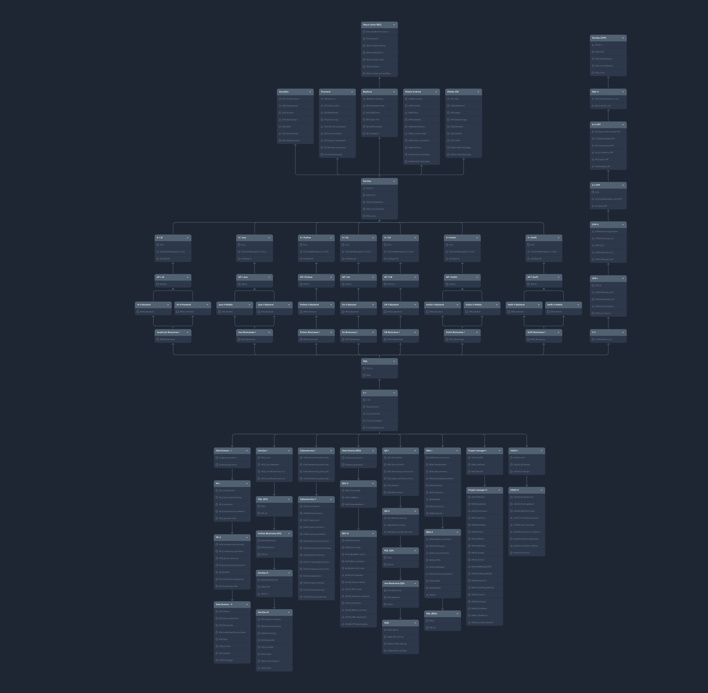

# 🍏 School 21 Educational Vault

Репозиторий содержит систематизированные образовательные материалы **School 21**. 

Для удобства рекомендуется использовать Obsidian.

---

## 🗺️ Образовательная траектория (Roadmap)

Ниже представлена визуальная карта модулей и проектов, включенных в данное хранилище.

---

## 📂 Структура проекта
* **Programming**: C, CPP, Python, Go, Java, Kotlin, Swift.
* **DevOps**: Linux, Docker, CICD, Kubernetes.
* **Data Science**: Machine Learning, SQL, Big Data.
* **Management**: Project Management, Agile, Risk Management.
* **QA**: Основы тестирования и автоматизации.

> **Note:** Если вы столкнулись с неточностью, можете сделать pull request. Не все материалы доступны на русском языке.

---

## 📽️ Видео и дополнительные материалы доступны по ссылке
[tgChannel](https://t.me/+rGx1jESa3kBlZjVi)

---

## ☕ Donations:

* **BTC:** `bc1qdjvfclenls4g9vss22sc2kmkd9xwmygze0727z`
* **ETH:** `0x5b1ADBc01788944f0ED710cD60Adc13a119151F2`
* **USDT (TRC20):** `TR93gTD8q71HJcexURuFsTwdYLuSPyLjVL`
* **XRP:** `rMfbp7AMH9VxD1eZP8MYe9uNJZM9QmD22C`

---
*Created with ❤️ for the community.*
