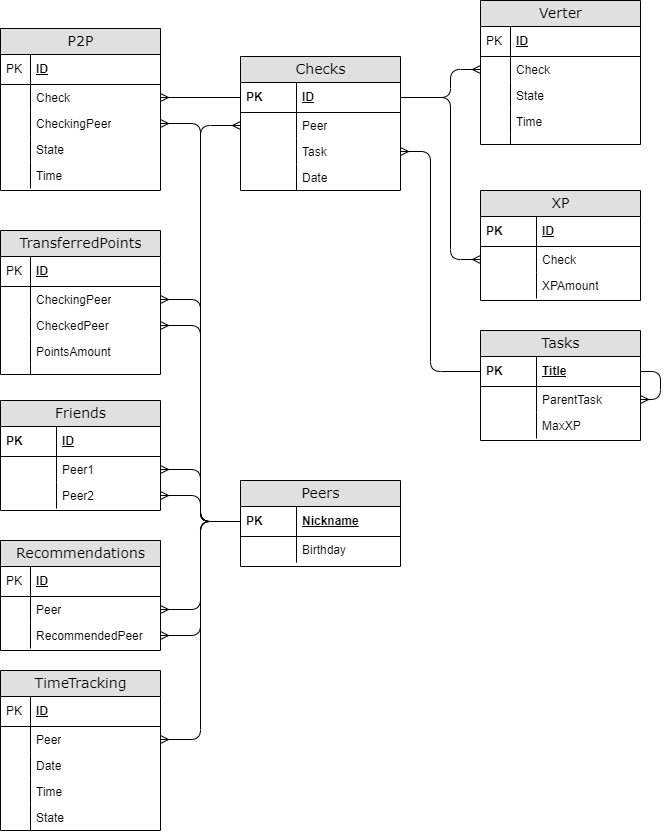

# Info21 v1.0

Анализ и статистика данных по «Школе 21».

💡 [Нажми сюда](https://new.oprosso.net/p/4cb31ec3f47a4596bc758ea1861fb624), **чтобы поделиться с нами обратной связью на этот проект**. Это анонимно и поможет нашей команде сделать обучение лучше. Рекомендуем заполнить опрос сразу после выполнения проекта.

## Contents

1. [Chapter I](#chapter-i) \
   1.1. [Introduction](#introduction)
2. [Chapter II](#chapter-ii) \
   2.1. [General rules](#general-rules) \
   2.2. [Logical view of database model](#logical-view-of-database-model)
3. [Chapter III](#chapter-iii) \
   3.1. [Part 1. Создание базы данных](#part-1-%D1%81%D0%BE%D0%B7%D0%B4%D0%B0%D0%BD%D0%B8%D0%B5-%D0%B1%D0%B0%D0%B7%D1%8B-%D0%B4%D0%B0%D0%BD%D0%BD%D1%8B%D1%85)\
   3.2. [Part 2. Изменение данных](#part-2-%D0%B8%D0%B7%D0%BC%D0%B5%D0%BD%D0%B5%D0%BD%D0%B8%D0%B5-%D0%B4%D0%B0%D0%BD%D0%BD%D1%8B%D1%85)\
   3.3. [Part 3. Получение данных](#part-3-%D0%BF%D0%BE%D0%BB%D1%83%D1%87%D0%B5%D0%BD%D0%B8%D0%B5-%D0%B4%D0%B0%D0%BD%D0%BD%D1%8B%D1%85)\
   3.4. [Дополнительно. Part 4. Метаданные](#%D0%B4%D0%BE%D0%BF%D0%BE%D0%BB%D0%BD%D0%B8%D1%82%D0%B5%D0%BB%D1%8C%D0%BD%D0%BE-part-4-%D0%BC%D0%B5%D1%82%D0%B0%D0%B4%D0%B0%D0%BD%D0%BD%D1%8B%D0%B5)

## Инструкции

Как учиться в «Школе 21»:

- Здесь тебя ждет уникальный образовательный опыт с большим количеством свободы. Ты получаешь задачу и самостоятельно ищешь пути решения, используя любые удобные способы поиска информации — ресурсы Интернета или нейросети (например, GigaChat). Но внимательно относись к качеству информации: проверяй, думай, анализируй, сравнивай.
- Взаимообучение (Peer-to-Peer, P2P) — это обмен знаниями и опытом с другими пирами, где каждый выступает и учителем, и учеником. Такой подход позволяет глубже понять материал, учась друг у друга.
- Чувствуй себя свободно и проси о помощи — вокруг тебя те, кто тоже впервые проходят этот путь. Делись своим опытом и идеями с другими. Присоединяйся к Rocket.Chat, чтобы быть в курсе всех новостей от нашего сообщества.
- Твое обучение не будет иметь никакого смысла, если ты будешь копировать чужие решения. Если пользуешься помощью других — всегда разбирайся до конца, почему, как и зачем. Не бойся ошибиться.
- Кажется, что задача невыполнима? Сделай перерыв, проветрись, перезагрузи голову — это помогало многим. Возможно, после этого решение придет само собой.
- Важен не только результат обучения, но и сам процесс. Нужно не просто решить задачу, а понять, КАК ее решить.

Как работать с проектом:

- Перед выполнением проект необходимо склонировать с GitLab в одноименный репозиторий.
- Все файлы необходимо создавать в папке *src/* склонированного репозитория.
- После клонирования проекта необходимо создать ветку *develop* и вести разработку в ней. После этого пушить в GitLab также нужно ветку *develop*.
- В твоей директории не должно быть иных файлов, кроме тех, что обозначены в заданиях.

## Chapter I

Чак остался поработать из дома. Теплый свежесваренный кофе стоял рядом на столе, тонкая струйка пара поднималась над кружкой. Оба монитора показывали экран загрузки ОС, и несколько мгновений спустя высветился приветственный экран. Чак лениво потянулся к мышке. Прощелкав ею, он добрался до директории с рабочими файлами. Хотя он работает в финансовом отделе, сегодня у него была совершенно другая задача: помочь с реализацией очередной идеи, пришедшей сверху, поскольку Чак был одним из тех немногочисленных сотрудников, хоть как-то знакомых с SQL. \
Structured Query Language, или язык, на котором «каждая домохозяйка будет способна написать запрос к базе данных», как когда-то заявляли его создатели. Вот только знакомые домохозяйки Чака по офису все никак не могли справиться с этим зверем, и поэтому именно ему обычно выпадала честь заниматься задачами, связанными с базами данных. Спасал только лишь прошлый программистский опыт. Не зря же он в конце концов просидел в университете все те четыре года.

«Сначала надо бы спроектировать базу, — пролетело в голове Чака. — Сущности с параметрами уже где-то были записаны, осталось разобраться со связями. Третьей нормальной формы тут точно хватит». \
Чак потянулся за листком, но краем глаза заметил распечатанные финансовые отчеты за прошедший период, лежащие неподалеку на столе. \
«С ними в следующий раз, сначала это. Да и вспомнить SQL на такой более простой задаче не будет лишним». \
В итоге он сначала отхлебнул кофе, а затем все-таки добрался до листочка. \
«Итак, посмотрим, что тут можно придумать», — начал свои размышления Чак...

## Introduction

В данном проекте тебе предстоит закрепить на практике свои знания SQL.
Тебе нужно будет создать базу данных со знаниями о «Школе 21» и написать процедуры и функции для получения информации, а также процедуры и триггеры для её изменения.

## Chapter II

## General Rules

- Use this page as your only reference. Do not listen to rumors and speculations about how to prepare your solution.
- Make sure you are using the latest version of PostgreSQL.
- It is perfectly fine if you use the IDE to write source code (aka SQL script).
- To be evaluated, your solution must be in your GIT repository.
- Your solutions will be evaluated by your peers.
- You should not leave any files in your directory other than those explicitly specified by the exercise instructions. It is recommended that you modify your `.gitignore` to avoid accidents.
- Got a question? Ask your neighbor to the right. Otherwise, try your neighbor on the left.
- Your reference manual: mates / Internet / Google.
- Read the examples carefully. You may need things not specified in the topic.
- And may the SQL-Force be with you!
- Absolutely anything can be represented in SQL! Let's get started and have fun!

## Logical view of database model

*Все поля при описании таблиц перечислены в том же порядке, что и на схеме.*

#### Таблица Peers

- Ник пира,
- день рождения.

#### Таблица Tasks

- Название задания,
- название задания, являющегося условием входа,
- максимальное количество XP.

Чтобы получить доступ к заданию, нужно выполнить задание, являющееся его условием входа.
Для упрощения будем считать, что у каждого задания всего одно условие входа.
В таблице должно быть одно задание, у которого нет условия входа (т.е. поле ParentTask равно null).

#### Статус проверки

Создай тип перечисления для статуса проверки, содержащий следующие значения:

- Start — начало проверки;
- Success — успешное окончание проверки;
- Failure — неудачное окончание проверки.

#### Таблица P2P

- ID,
- ID проверки,
- ник проверяющего пира,
- [статус P2P-проверки](#%D1%81%D1%82%D0%B0%D1%82%D1%83%D1%81-%D0%BF%D1%80%D0%BE%D0%B2%D0%B5%D1%80%D0%BA%D0%B8),
- время.

Каждая P2P-проверка состоит из двух записей в таблице: первая имеет статус начало, вторая — успех или неуспех. \
В таблице не может быть больше одной незавершенной P2P-проверки, относящейся к конкретному заданию, пиру и проверяющему. \
Каждая P2P-проверка (т. е. обе записи, из которых она состоит) ссылается на проверку в таблице Checks, к которой она относится.

#### Таблица Verter

- ID,
- ID проверки,
- [статус проверки Verter'ом](#%D1%81%D1%82%D0%B0%D1%82%D1%83%D1%81-%D0%BF%D1%80%D0%BE%D0%B2%D0%B5%D1%80%D0%BA%D0%B8),
- время.

Каждая проверка Verter'ом состоит из двух записей в таблице: первая имеет статус начало, вторая — успех или неуспех. \
Каждая проверка Verter'ом (т. е. обе записи, из которых она состоит) ссылается на проверку в таблице Checks, к которой она относится. \
Проверка Verter'ом может ссылаться только на те проверки в таблице Checks, которые уже включают в себя успешную P2P-проверку.

#### Таблица Checks

- ID,
- ник пира,
- название задания,
- дата проверки.

Описывает проверку задания в целом. Проверка обязательно включает в себя **один** этап P2P и, возможно, этап Verter. Для упрощения будем считать, что P2P и автотесты, относящиеся к одной проверке, всегда происходят в один день.

Проверка считается успешной, если соответствующий P2P-этап успешен, а этап Verter успешен либо отсутствует. Проверка считается неуспешной, если хоть один из этапов неуспешен.
То есть проверки, в которых ещё не завершился этап P2P, или он прошел успешно, но ещё не завершился этап Verter, не относятся ни к успешным, ни к неуспешным.

#### Таблица TransferredPoints

- ID,
- ник проверяющего пира,
- ник проверяемого пира,
- количество переданных пир-поинтов за всё время (только от проверяемого к проверяющему).

При каждой P2P-проверке проверяемый пир передаёт один пир-поинт проверяющему.
Эта таблица содержит все пары проверяемый-проверяющий и количество переданных пир-поинтов, то есть, другими словами, количество P2P-проверок указанного проверяемого пира данным проверяющим.

#### Таблица Friends

- ID,
- ник первого пира,
- ник второго пира.

Дружба взаимная, т. е. первый пир является другом второго, а второй — другом первого.

#### Таблица Recommendations

- ID,
- ник пира,
- ник пира, к которому рекомендуют идти на проверку.

Каждому может понравиться, как проходила P2P-проверка у того или иного пира.
Пир, указанный в поле Peer, рекомендует проходить P2P-проверку у пира из поля RecommendedPeer. Каждый пир может рекомендовать как ни одного, так и сразу несколько проверяющих.

#### Таблица XP

- ID,
- ID проверки,
- количество полученного XP.

За каждую успешную проверку пир, выполнивший задание, получает какое-то количество XP, отображаемое в этой таблице.
Количество XP не может превышать максимальное доступное для проверяемой задачи.
Первое поле этой таблицы может ссылаться только на успешные проверки.

#### Таблица TimeTracking

- ID,
- ник пира,
- дата,
- время,
- состояние (1 — пришел, 2 — вышел).

Данная таблица содержит информацию о посещениях пирами кампуса.
Когда пир входит в кампус, в таблицу добавляется запись с состоянием 1, когда покидает — с состоянием 2.

В заданиях, относящихся к этой таблице, под действием «выходить» подразумеваются все покидания кампуса за день, кроме последнего. В течение одного дня должно быть одинаковое количество записей с состоянием 1 и состоянием 2 для каждого пира.

Например:

| ID | Peer | Date | Time | State |
| --- | --- | --- | --- | --- |
| 1 | Aboba | 22.03.22 | 13:37 | 1 |
| 2 | Aboba | 22.03.22 | 15:48 | 2 |
| 3 | Aboba | 22.03.22 | 16:02 | 1 |
| 4 | Aboba | 22.03.22 | 20:00 | 2 |

В этом примере «выходом» является только запись с ID, равным 2. Пир с ником Aboba выходил из кампуса на 14 минут.

## Chapter III

## Part 1. Создание базы данных

Напиши скрипт *part1.sql*, создающий базу данных и все таблицы, описанные выше. Можно воспользоваться уже готовым датасетом, доступным по [ссылке](https://disk.yandex.ru/d/aD9ynYOYvhs6Ig).

Также внеси в скрипт процедуры, позволяющие импортировать и экспортировать данные для каждой таблицы из файла/в файл с расширением *.csv*. \
В качестве параметра каждой процедуры указывай разделитель *csv* файла.

В каждую из таблиц внеси как минимум по 5 записей.
По мере выполнения задания тебе потребуются новые данные, чтобы проверить все варианты работы. Эти новые данные также должны быть добавлены в этом скрипте.

Если для добавления данных в таблицы использовались *csv* файлы, они также должны быть выгружены в GIT-репозиторий.

\*Все задания должны быть названы в формате названий для «Школы 21», например, A5\_s21\_memory. \
В дальнейшем принадлежность к блоку будет определяться по содержанию в названии задания названия блока, например, «CPP3\_SmartCalc\_v2.0» принадлежит блоку CPP. \*

## Part 2. Изменение данных

Создай скрипт *part2.sql*, в который, помимо описанного ниже, внеси тестовые запросы/вызовы для каждого пункта.

##### 1) Напиши процедуру добавления P2P-проверки

Параметры: ник проверяемого, ник проверяющего, название задания, [статус P2P-проверки](#%D1%81%D1%82%D0%B0%D1%82%D1%83%D1%81-%D0%BF%D1%80%D0%BE%D0%B2%D0%B5%D1%80%D0%BA%D0%B8), время. \
Если задан статус «начало», добавь запись в таблицу Checks (в качестве даты используй сегодняшнюю). \
Добавь запись в таблицу P2P. \
Если задан статус «начало», в качестве проверки укажи только что добавленную запись, если же нет, то укажи проверку с незавершенным P2P-этапом.

##### 2) Напиши процедуру добавления проверки Verter'ом

Параметры: ник проверяемого, название задания, [статус проверки Verter'ом](#%D1%81%D1%82%D0%B0%D1%82%D1%83%D1%81-%D0%BF%D1%80%D0%BE%D0%B2%D0%B5%D1%80%D0%BA%D0%B8), время. \
Добавь запись в таблицу Verter (в качестве проверки укажи проверку соответствующего задания с самым поздним (по времени) успешным P2P-этапом).

##### 3) Напиши триггер: после добавления записи со статусом «начало» в таблицу P2P изменяется соответствующая запись в таблице TransferredPoints

##### 4) Напиши триггер: перед добавлением записи в таблицу XP проверяется корректность добавляемой записи

Запись считается корректной, если:

- Количество XP не превышает максимальное доступное для проверяемой задачи.
- Поле Check ссылается на успешную проверку.
  Если запись не прошла проверку, не добавляй её в таблицу.

## Part 3. Получение данных

Создай скрипт *part3.sql*, в который внеси описанные далее процедуры и функции.

##### 1) Напиши функцию, возвращающую таблицу TransferredPoints в более человекочитаемом виде

Ник пира 1, ник пира 2, количество переданных пир-поинтов. \
Количество отрицательное, если пир 2 получил от пира 1 больше поинтов.

Пример вывода:

| Peer1 | Peer2 | PointsAmount |
| --- | --- | --- |
| Aboba | Amogus | 5 |
| Amogus | Sus | -2 |
| Sus | Aboba | 0 |

##### 2) Напиши функцию, которая возвращает таблицу вида: ник пользователя, название проверенного задания, кол-во полученного XP

В таблицу включи только задания, успешно прошедшие проверку (определять по таблице Checks). \
Одна задача может быть успешно выполнена несколько раз. В таком случае в таблицу включи все успешные проверки.

Пример вывода:

| Peer | Task | XP |
| --- | --- | --- |
| Aboba | C8 | 800 |
| Aboba | CPP3 | 750 |
| Amogus | DO5 | 175 |
| Sus | A4 | 325 |

##### 3) Напиши функцию, определяющую пиров, которые не выходили из кампуса в течение всего дня

Параметры функции: день, например, 12.05.2022. \
Функция возвращает только список пиров.

##### 4) Посчитай изменение в количестве пир-поинтов каждого пира по таблице TransferredPoints

Результат выведи отсортированным по изменению числа поинтов. \
Формат вывода: ник пира, изменение в количество пир-поинтов.

Пример вывода:

| Peer | PointsChange |
| --- | --- |
| Aboba | 8 |
| Amogus | 1 |
| Sus | -3 |

##### 5) Посчитай изменение в количестве пир-поинтов каждого пира по таблице, возвращаемой [первой функцией из Part 3](#1-%D0%BD%D0%B0%D0%BF%D0%B8%D1%88%D0%B8-%D1%84%D1%83%D0%BD%D0%BA%D1%86%D0%B8%D1%8E-%D0%B2%D0%BE%D0%B7%D0%B2%D1%80%D0%B0%D1%89%D0%B0%D1%8E%D1%89%D1%83%D1%8E-%D1%82%D0%B0%D0%B1%D0%BB%D0%B8%D1%86%D1%83-transferredpoints-%D0%B2-%D0%B1%D0%BE%D0%BB%D0%B5%D0%B5-%D1%87%D0%B5%D0%BB%D0%BE%D0%B2%D0%B5%D0%BA%D0%BE%D1%87%D0%B8%D1%82%D0%B0%D0%B5%D0%BC%D0%BE%D0%BC-%D0%B2%D0%B8%D0%B4%D0%B5)

Результат выведи отсортированным по изменению числа поинтов. \
Формат вывода: ник пира, изменение в количество пир-поинтов.

Пример вывода:

| Peer | PointsChange |
| --- | --- |
| Aboba | 8 |
| Amogus | 1 |
| Sus | -3 |

##### 6) Определи самое часто проверяемое задание за каждый день

При одинаковом количестве проверок каких-то заданий в определенный день выведи их все. \
Формат вывода: день, название задания.

Пример вывода:

| Day | Task |
| --- | --- |
| 12.05.2022 | A1 |
| 17.04.2022 | CPP3 |
| 23.12.2021 | C5 |

##### 7) Найди всех пиров, выполнивших весь заданный блок задач и дату завершения последнего задания

Параметры процедуры: название блока, например, «CPP». \
Результат выведи отсортированным по дате завершения. \
Формат вывода: ник пира, дата завершения блока (т. е. последнего выполненного задания из этого блока).

Пример вывода:

| Peer | Day |
| --- | --- |
| Sus | 23.06.2022 |
| Amogus | 17.05.2022 |
| Aboba | 12.05.2022 |

##### 8) Определи, к какому пиру стоит идти на проверку каждому обучающемуся

Определять нужно, исходя из рекомендаций друзей пира, т. е. нужно найти пира, проверяться у которого рекомендует наибольшее число друзей. \
Формат вывода: ник пира, ник найденного проверяющего.

Пример вывода:

| Peer | RecommendedPeer |
| --- | --- |
| Aboba | Sus |
| Amogus | Aboba |
| Sus | Aboba |

##### 9) Определи процент пиров, которые:

- Приступили только к блоку 1;
- Приступили только к блоку 2;
- Приступили к обоим;
- Не приступили ни к одному.

Пир считается приступившим к блоку, если он проходил хоть одну проверку любого задания из этого блока (по таблице Checks).

Параметры процедуры: название блока 1, например, SQL, название блока 2, например, A. \
Формат вывода: процент приступивших только к первому блоку, процент приступивших только ко второму блоку, процент приступивших к обоим, процент не приступивших ни к одному.

Пример вывода:

| StartedBlock1 | StartedBlock2 | StartedBothBlocks | DidntStartAnyBlock |
| --- | --- | --- | --- |
| 20 | 20 | 5 | 55 |

##### 10) Определи процент пиров, которые когда-либо успешно проходили проверку в свой день рождения

Также определи процент пиров, которые хоть раз проваливали проверку в свой день рождения. \
Формат вывода: процент пиров, успешно прошедших проверку в день рождения, процент пиров, проваливших проверку в день рождения.

Пример вывода:

| SuccessfulChecks | UnsuccessfulChecks |
| --- | --- |
| 60 | 40 |

##### 11) Определи всех пиров, которые сдали заданные задания 1 и 2, но не сдали задание 3

Параметры процедуры: названия заданий 1, 2 и 3. \
Формат вывода: список пиров.

##### 12) Используя рекурсивное обобщенное табличное выражение, для каждой задачи выведи кол-во предшествующих ей задач

То есть сколько задач нужно выполнить, исходя из условий входа, чтобы получить доступ к текущей. \
Формат вывода: название задачи, количество предшествующих.

Пример вывода:

| Task | PrevCount |
| --- | --- |
| CPP3 | 7 |
| A1 | 9 |
| C5 | 1 |

##### 13) Найди «удачные» для проверок дни. День считается «удачным», если в нем есть хотя бы *N* идущих подряд успешных проверки

Параметры процедуры: количество идущих подряд успешных проверок *N*. \
Временем проверки считай время начала P2P-этапа. \
Под идущими подряд успешными проверками подразумеваются успешные проверки, между которыми нет неуспешных. \
При этом кол-во опыта за каждую из этих проверок должно быть не меньше 80% от максимального. \
Формат вывода: список дней.

##### 14) Определи пира с наибольшим количеством XP

Формат вывода: ник пира, количество XP.

Пример вывода:

| Peer | XP |
| --- | --- |
| Amogus | 15000 |

##### 15) Определи пиров, приходивших раньше заданного времени не менее *N* раз за всё время

Параметры процедуры: время, количество раз *N*. \
Формат вывода: список пиров.

##### 16) Определи пиров, выходивших за последние *N* дней из кампуса больше *M* раз

Параметры процедуры: количество дней *N*, количество раз *M*. \
Формат вывода: список пиров.

##### 17) Определи для каждого месяца процент ранних входов

Для каждого месяца посчитай, сколько раз люди, родившиеся в этом месяце, приходили в кампус за всё время (будем называть это общим числом входов). \
Для каждого месяца посчитай, сколько раз люди, родившиеся в этом месяце, приходили в кампус раньше 12:00 за всё время (будем называть это числом ранних входов). \
Для каждого месяца посчитай процент ранних входов в кампус относительно общего числа входов. \
Формат вывода: месяц, процент ранних входов.

Пример вывода:

| Month | EarlyEntries |
| --- | --- |
| January | 15 |
| February | 35 |
| March | 45 |

## Дополнительно. Part 4. Метаданные

Для данной части задания тебе нужно создать отдельную базу данных, в которую занести таблицы, функции, процедуры и триггеры, необходимые для тестирования процедур.

Создание и заполнение этой базы данных, а также написанные процедуры, внести в файл *part4.sql*.

##### 1) Создай хранимую процедуру, которая, не уничтожая базу данных, уничтожает все те таблицы текущей базы данных, имена которых начинаются с фразы 'TableName'.

##### 2) Создай хранимую процедуру с выходным параметром, которая выводит список имен и параметров всех скалярных SQL-функций пользователя в текущей базе данных. Имена функций без параметров выводить не нужно. Имена и список параметров должны выводиться в одну строку. Выходной параметр возвращает количество найденных функций.

##### 3) Создай хранимую процедуру с выходным параметром, которая уничтожает все SQL DML триггеры в текущей базе данных. Выходной параметр возвращает количество уничтоженных триггеров.

##### 4) Создай хранимую процедуру с входным параметром, которая выводит имена и описания типа объектов (только хранимых процедур и скалярных функций), в тексте которых на языке SQL встречается строка, задаваемая параметром процедуры.