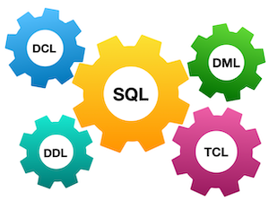
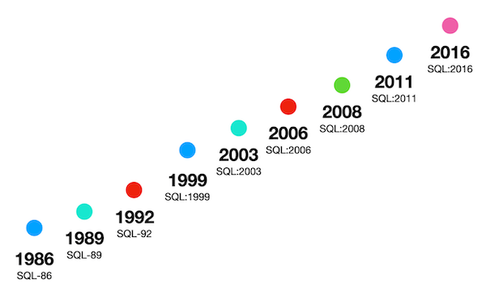

## *Relational Data Model and SQL*

В этом проекте ты научишься создавать SQL-запросы с использованием внутренних подзапросов в частях FROM и SELECT, а также фильтровать данные по диапазону дат.

Ты потренируешь навыки работы с условиями выборки, сортировкой по нескольким полям с разными направлениями и структурированием запросов для получения нужной информации.

Эти умения пригодятся тебе при анализе данных, создании отчетов и разработке приложений, взаимодействующих с базами данных.

**Для этого и последующих SQL1-проектов убедись, что у тебя есть отдельная база данных и доступ к ней в твоем кластере PostgreSQL. При необходимости обратись к инструкциям в `materials`.**

💡 [Нажми сюда](https://new.oprosso.net/p/4cb31ec3f47a4596bc758ea1861fb624), **чтобы поделиться с нами обратной связью на этот проект**. Это анонимно и поможет нашей команде сделать обучение лучше. Рекомендуем заполнить опрос сразу после выполнения проекта.

## Содержание

- [Как учиться в «Школе 21»](#%D0%BA%D0%B0%D0%BA-%D1%83%D1%87%D0%B8%D1%82%D1%8C%D1%81%D1%8F-%D0%B2-%D1%88%D0%BA%D0%BE%D0%BB%D0%B5-21)
- [Chapter I](#chapter-i)
- [Введение](#%D0%B2%D0%B2%D0%B5%D0%B4%D0%B5%D0%BD%D0%B8%D0%B5)
- [Chapter II](#chapter-ii)
- [Рекомендации к выполнению этого проекта](#%D1%80%D0%B5%D0%BA%D0%BE%D0%BC%D0%B5%D0%BD%D0%B4%D0%B0%D1%86%D0%B8%D0%B8-%D0%BA-%D0%B2%D1%8B%D0%BF%D0%BE%D0%BB%D0%BD%D0%B5%D0%BD%D0%B8%D1%8E-%D1%8D%D1%82%D0%BE%D0%B3%D0%BE-%D0%BF%D1%80%D0%BE%D0%B5%D0%BA%D1%82%D0%B0)
- [Chapter III](#chapter-iii)
- [Погружение в мир SQL](#%D0%BF%D0%BE%D0%B3%D1%80%D1%83%D0%B6%D0%B5%D0%BD%D0%B8%D0%B5-%D0%B2-%D0%BC%D0%B8%D1%80-sql)
- [Задание 00](#%D0%B7%D0%B0%D0%B4%D0%B0%D0%BD%D0%B8%D0%B5-00)
- [Задание 01](#%D0%B7%D0%B0%D0%B4%D0%B0%D0%BD%D0%B8%D0%B5-01)
- [Задание 02](#%D0%B7%D0%B0%D0%B4%D0%B0%D0%BD%D0%B8%D0%B5-02)
- [Задание 03](#%D0%B7%D0%B0%D0%B4%D0%B0%D0%BD%D0%B8%D0%B5-03)
- [Задание 04](#%D0%B7%D0%B0%D0%B4%D0%B0%D0%BD%D0%B8%D0%B5-04)
- [Задание 05](#%D0%B7%D0%B0%D0%B4%D0%B0%D0%BD%D0%B8%D0%B5-05)
- [Задание 06](#%D0%B7%D0%B0%D0%B4%D0%B0%D0%BD%D0%B8%D0%B5-06)
- [Задание 07](#%D0%B7%D0%B0%D0%B4%D0%B0%D0%BD%D0%B8%D0%B5-07)
- [Задание 08](#%D0%B7%D0%B0%D0%B4%D0%B0%D0%BD%D0%B8%D0%B5-08)
- [Задание 09](#%D0%B7%D0%B0%D0%B4%D0%B0%D0%BD%D0%B8%D0%B5-09)

## Как учиться в «Школе 21»

- Здесь тебя ждет уникальный образовательный опыт с большим количеством свободы. Ты получаешь задачу и самостоятельно ищешь пути решения, используя любые удобные способы поиска информации — ресурсы Интернета или нейросети (например, GigaChat). Но внимательно относись к качеству информации: проверяй, думай, анализируй, сравнивай.
- Взаимообучение (Peer-to-Peer, P2P) — это обмен знаниями и опытом с другими пирами, где каждый выступает и учителем, и учеником. Такой подход позволяет глубже понять материал, учась друг у друга.
- Чувствуй себя свободно и проси о помощи — вокруг тебя те, кто тоже впервые проходят этот путь. Делись своим опытом и идеями с другими. Присоединяйся к Rocket.Chat, чтобы быть в курсе всех новостей от нашего сообщества.
- Твое обучение не будет иметь никакого смысла, если ты будешь копировать чужие решения. Если пользуешься помощью других — всегда разбирайся до конца, почему, как и зачем. Не бойся ошибиться.
- Кажется, что задача невыполнима? Сделай перерыв, проветрись, перезагрузи голову — это помогало многим. Возможно, после этого решение придет само собой.
- Важен не только результат обучения, но и сам процесс. Нужно не просто решить задачу, а понять, КАК ее решить.

Как работать с проектом:

- Перед выполнением проект необходимо склонировать с GitLab в одноименный репозиторий.
- Все файлы необходимо создавать в папке *src/* склонированного репозитория.
- После клонирования проекта необходимо создать ветку *develop* и вести разработку в ней. После этого пушить в GitLab также нужно ветку *develop*.
- В твоей директории не должно быть иных файлов, кроме тех, что обозначены в заданиях.

## Chapter I

## Введение



Стандарты есть везде, и реляционные базы данных тоже подчиняются им. Если говорить откровенно, более строгие SQL-стандарты были в начале 2000-х. Но с появлением концепции «Big Data» реляционные СУБД нашли свои способы ее реализации, и теперь требования стали... мягче.



Посмотри на некоторые стандарты SQL ниже - что ты можешь сказать о будущем реляционных баз данных?

|  |  |
| --- | --- |
| D01_03 | D01_04 |
| D01_05 | D01_06 |
| D01_07 | D01_08 |

## Chapter II

## Рекомендации к выполнению этого проекта

- Убедись, что ты работаешь с последней версией PostgreSQL.
- Ты можешь писать код (SQL-скрипты) в любой удобной IDE - это совершенно нормально.
- В директории должны оставаться только файлы, явно указанные в задании. Настрой .gitignore, чтобы избежать случайных ошибок.
- Убедись, что у тебя есть личная база данных и доступ к ней в твоем кластере PostgreSQL.
- Скачай [скрипт](https://git.21-school.ru/masters/SQLB1_Basics.ID_574086/-/blob/32/./materials/model.sql) с моделью базы данных и примени его к своей базе - сделать это можно либо через командную строку с помощью psql, либо через любую удобную IDE, например DataGrip от JetBrains или pgAdmin из сообщества PostgreSQL.
- В каждом задании внимательно ознакомься с разделами «Разрешено» и «Запрещено» - там перечислены допустимые опции базы данных, типы, конструкции SQL и другие важные ограничения.
- Да прибудет с тобой сила SQL!
- Приступай к работе - и пусть это будет увлекательно!

Перед выполнением заданий изучи логическую структуру модели базы данных ниже.


1. **Таблица pizzeria** (справочник пиццерий)

   - поле id - первичный ключ
   - поле name - название пиццерии
   - поле rating - средний рейтинг пиццерии (от 0 до 5 баллов)
2. **Таблица person** (справочник клиентов, любящих пиццу)

   - поле id - первичный ключ
   - поле name - имя человека
   - поле age - возраст человека
   - поле gender - пол человека
   - поле address - адрес человека
3. **Таблица menu** (справочник с доступным меню и ценами на конкретные пиццы)

   - поле id - первичный ключ
   - поле pizzeria\_id - внешний ключ на таблицу pizzeria
   - поле pizza\_name - название пиццы в пиццерии
   - поле price - цена конкретной пиццы
4. **Таблица person\_visits** (журнал посещений пиццерий)

   - поле id - первичный ключ
   - поле person\_id - внешний ключ на таблицу person
   - поле pizzeria\_id - внешний ключ на таблицу pizzeria
   - поле visit\_date - дата посещения (например, 2022-01-01)
5. **Таблица person\_order** (журнал заказов)

   - поле id - первичный ключ
   - поле person\_id - внешний ключ на таблицу person
   - поле menu\_id - внешний ключ на таблицу menu
   - поле order\_date - дата заказа (например, 2022-01-01)

Посещения пиццерий и заказы - это разные сущности, между которыми нет прямой зависимости в данных. Например, клиент может находиться в одном ресторане, просто просматривая меню, и одновременно сделать заказ в другом ресторане по телефону или через мобильное приложение. Или другой вариант - быть дома и оформить заказ по телефону, не посещая заведение вовсе.

## Chapter III

## Погружение в мир SQL

## Задание 00

| Задание 00: Погружение в мир SQL |  |
| --- | --- |
| Директория для загрузки решений | ex00 |
| Файлы для загрузки | `day00_ex00.sql` |
| **Разрешено** |  |
| Язык | ANSI SQL |

Давай приступим к первому заданию. Напиши запрос SELECT, который вернет имена и возраст всех людей из города «Казань».

## Задание 01

| Задание 01: Погружение в мир SQL |  |
| --- | --- |
| Директория для загрузки решений | ex01 |
| Файлы для загрузки | `day00_ex01.sql` |
| **Разрешено** |  |
| Язык | ANSI SQL |

Теперь напиши запрос SELECT, который выведет имена и возраст всех женщин из города «Казань». И, конечно же, отсортируй результат по имени.

## Задание 02

| Задание 02: Погружение в мир SQL |  |
| --- | --- |
| Директория для загрузки решений | ex02 |
| Файлы для загрузки | `day00_ex02.sql` |
| **Разрешено** |  |
| Язык | ANSI SQL |

Составь два разных по синтаксису запроса SELECT, которые вернут список пиццерий (название и рейтинг) с рейтингом от 3.5 до 5 включительно, отсортированный по рейтингу.

- В первом запросе используй операторы сравнения (<=, >=).
- Во втором - ключевое слово BETWEEN.

## Задание 03

| Задание 03: Погружение в мир SQL |  |
| --- | --- |
| Директория для загрузки решений | ex03 |
| Файлы для загрузки | `day00_ex03.sql` |
| **Разрешено** |  |
| Язык | ANSI SQL |

Составь запрос SELECT, который вернет уникальные идентификаторы людей (без дубликатов), посетивших пиццерии в период с 6 по 9 января 2022 года (включительно), либо посетивших пиццерии с идентификатором 2.

Результат отсортируй по идентификатору человека в порядке убывания.

## Задание 04

| Задание 04: Погружение в мир SQL |  |
| --- | --- |
| Директория для загрузки решений | ex04 |
| Файлы для загрузки | `day00_ex04.sql` |
| **Разрешено** |  |
| Язык | ANSI SQL |

Составь запрос SELECT, который вернет одно вычисляемое поле с именем person\_information в виде одной строки, как показано в примере:

`Anna (age:16,gender:'female',address:'Moscow')`

В конце добавь сортировку по этому вычисляемому полю в порядке возрастания. Обрати особое внимание на правильное использование кавычек в формуле!

## Задание 05

| Задание 05: Погружение в мир SQL |  |
| --- | --- |
| Директория для загрузки решений | ex05 |
| Файлы для загрузки | `day00_ex05.sql` |
| **Разрешено** |  |
| Язык | ANSI SQL |
| **Запрещено** |  |
| Синтаксические конструкции SQL | `IN`, все виды `JOINs` |

Напиши запрос SELECT, который вернет имена людей (используя внутренний запрос в части SELECT), которые сделали заказы по меню с идентификаторами 13, 14 и 18, при этом дата заказа должна быть 7 января 2022 года.

Перед началом работы обязательно ознакомься с разделом «Запрещено».

Обрати внимание на пример внутреннего запроса.

```
SELECT 
    (SELECT ... ) AS NAME  -- это внутренний запрос в основном операторе
FROM ...
WHERE ...
```

## Задание 06

| Задание 06: Погружение в мир SQL |  |
| --- | --- |
| Директория для загрузки решений | ex06 |
| Файлы для загрузки | `day00_ex06.sql` |
| **Разрешено** |  |
| Язык | ANSI SQL |
| **Запрещено** |  |
| Синтаксические конструкции SQL | `IN`, все виды `JOINs` |

Используй конструкцию SQL из Задания 05 и добавь в оператор SELECT новый вычисляемый столбец с именем check\_name. В этом столбце реализуй проверку по следующему псевдокоду:

```
if (person_name == 'Denis'), вернуть true,
иначе вернуть false.
```

## Задание 07

| Задание 07: Погружение в мир SQL |  |
| --- | --- |
| Директория для загрузки решений | ex07 |
| Файлы для загрузки | `day00_ex07.sql` |
| **Разрешено** |  |
| Язык | ANSI SQL |

Давай применим интервалы возрастов к таблице person.

Напиши SQL-запрос, который вернет идентификаторы людей, их имена и интервал по возрасту в виде нового вычисляемого столбца с именем interval\_info, согласно следующему псевдокоду:

```
if (age >= 10 and age <= 20) - вернуть «interval #1»
else if (age > 20 and age < 24) - вернуть «interval #2»
во всех остальных случаях - вернуть «interval #3»
```

И, конечно, отсортируй результат по столбцу interval\_info в порядке возрастания.

## Задание 08

| Задание 08: Погружение в мир SQL |  |
| --- | --- |
| Директория для загрузки решений | ex08 |
| Файлы для загрузки | `day00_ex08.sql` |
| **Разрешено** |  |
| Язык | ANSI SQL |

Напиши SQL-запрос, который возвращает все столбцы из таблицы person\_order, где идентификатор является четным числом.

Результат должен быть отсортирован по этому идентификатору.

## Задание 09

| Задание 09: Погружение в мир SQL |  |
| --- | --- |
| Директория для загрузки решений | ex09 |
| Файлы для загрузки | `day00_ex09.sql` |
| **Разрешено** |  |
| Язык | ANSI SQL |
| **Запрещено** |  |
| Синтаксические конструкции SQL | все виды `JOINs` |

Составь запрос SELECT, который вернет имена людей и названия пиццерий на основе таблицы person\_visits с датами посещений в период с 7 по 9 января 2022 года (включительно), используя внутренний запрос в части FROM.

Обрати внимание на структуру итогового запроса:

```
SELECT (...) AS person_name ,  -- внутренний запрос в основном SELECT
        (...) AS pizzeria_name  -- внутренний запрос в основном SELECT
FROM (SELECT … FROM person_visits WHERE …) AS pv -- внутренний запрос в основном FROM
ORDER BY ...
```

Добавь сортировку по имени человека в порядке возрастания и по названию пиццерии в порядке убывания.