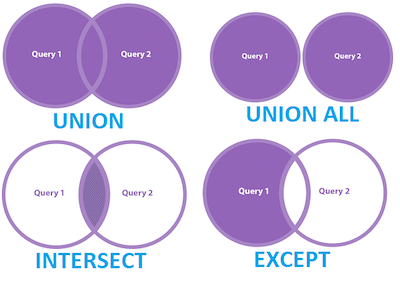
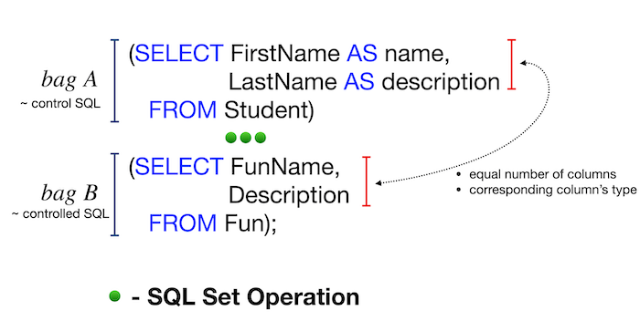

# Day 01 — SQL Bootcamp

## Основы работы с множествами и объединениями (JOIN) в SQL

В этом проекте ты освоишь основные навыки работы с SQL: использование множеств и операторов объединения, создание подзапросов, сортировку по нескольким столбцам, а также разные виды соединений таблиц. Ты научишься находить пересечения и различия в данных, что важно для анализа и решения бизнес-задач.

Эти знания пригодятся при разработке запросов, аналитике данных и администрировании баз.

💡 [Нажми сюда](https://new.oprosso.net/p/4cb31ec3f47a4596bc758ea1861fb624), **чтобы поделиться с нами обратной связью на этот проект**. Это анонимно и поможет нашей команде сделать обучение лучше. Рекомендуем заполнить опрос сразу после выполнения проекта.

## Содержание

- [Как учиться в «Школе 21»](#%D0%BA%D0%B0%D0%BA-%D1%83%D1%87%D0%B8%D1%82%D1%8C%D1%81%D1%8F-%D0%B2-%D1%88%D0%BA%D0%BE%D0%BB%D0%B5-21)
- [Chapter I](#chapter-i)
- [Введение](#%D0%B2%D0%B2%D0%B5%D0%B4%D0%B5%D0%BD%D0%B8%D0%B5)
- [Chapter II](#chapter-ii)
- [Рекомендации к выполнению этого проекта](#%D1%80%D0%B5%D0%BA%D0%BE%D0%BC%D0%B5%D0%BD%D0%B4%D0%B0%D1%86%D0%B8%D0%B8-%D0%BA-%D0%B2%D1%8B%D0%BF%D0%BE%D0%BB%D0%BD%D0%B5%D0%BD%D0%B8%D1%8E-%D1%8D%D1%82%D0%BE%D0%B3%D0%BE-%D0%BF%D1%80%D0%BE%D0%B5%D0%BA%D1%82%D0%B0)
- [Chapter III](#chapter-iii)
- [Задание 00 — Let's make UNION dance](#%D0%B7%D0%B0%D0%B4%D0%B0%D0%BD%D0%B8%D0%B5-00%E2%80%94lets-make-union-dance)
- [Задание 01 — UNION dance with subquery](#%D0%B7%D0%B0%D0%B4%D0%B0%D0%BD%D0%B8%D0%B5-01%E2%80%94union-dance-with-subquery)
- [Задание 02 — Duplicates or not duplicates](#%D0%B7%D0%B0%D0%B4%D0%B0%D0%BD%D0%B8%D0%B5-02%E2%80%94duplicates-or-not-duplicates)
- [Задание 03 — "Hidden" Insights](#%D0%B7%D0%B0%D0%B4%D0%B0%D0%BD%D0%B8%D0%B5-03%E2%80%94hidden-insights)
- [Задание 04 — Difference? Yep, let's find the difference between multisets](#%D0%B7%D0%B0%D0%B4%D0%B0%D0%BD%D0%B8%D0%B5-04%E2%80%94difference-yep-lets-find-the-difference-between-multisets)
- [Задание 05 — Did you hear about Cartesian Product?](#%D0%B7%D0%B0%D0%B4%D0%B0%D0%BD%D0%B8%D0%B5-05%E2%80%94did-you-hear-about-cartesian-product)
- [Задание 06 — Lets see on "Hidden" Insights](#%D0%B7%D0%B0%D0%B4%D0%B0%D0%BD%D0%B8%D0%B5-06%E2%80%94lets-see-on-hidden-insights)
- [Задание 07 — Just make a JOIN](#%D0%B7%D0%B0%D0%B4%D0%B0%D0%BD%D0%B8%D0%B5-07%E2%80%94just-make-a-join)
- [Задание 08 — Migrate JOIN to NATURAL JOIN](#%D0%B7%D0%B0%D0%B4%D0%B0%D0%BD%D0%B8%D0%B5-08%E2%80%94migrate-join-to-natural-join)
- [Задание 09 — IN versus EXISTS](#%D0%B7%D0%B0%D0%B4%D0%B0%D0%BD%D0%B8%D0%B5-09%E2%80%94in-versus-exists)
- [Задание 10 — Global JOIN](#%D0%B7%D0%B0%D0%B4%D0%B0%D0%BD%D0%B8%D0%B5-10%E2%80%94global-join)

## Как учиться в «Школе 21»

- Здесь тебя ждет уникальный образовательный опыт с большим количеством свободы. Ты получаешь задачу и самостоятельно ищешь пути решения, используя любые удобные способы поиска информации — ресурсы Интернета или нейросети (например, GigaChat). Но внимательно относись к качеству информации: проверяй, думай, анализируй, сравнивай.
- Взаимообучение (Peer-to-Peer, P2P) — это обмен знаниями и опытом с другими пирами, где каждый выступает и учителем, и учеником. Такой подход позволяет глубже понять материал, учась друг у друга.
- Чувствуй себя свободно и проси о помощи — вокруг тебя те, кто тоже впервые проходят этот путь. Делись своим опытом и идеями с другими. Присоединяйся к Rocket.Chat, чтобы быть в курсе всех новостей от нашего сообщества.
- Твое обучение не будет иметь никакого смысла, если ты будешь копировать чужие решения. Если пользуешься помощью других — всегда разбирайся до конца, почему, как и зачем. Не бойся ошибиться.
- Кажется, что задача невыполнима? Сделай перерыв, проветрись, перезагрузи голову — это помогало многим. Возможно, после этого решение придет само собой.
- Важен не только результат обучения, но и сам процесс. Нужно не просто решить задачу, а понять, КАК ее решить.

Как работать с проектом:

- Перед выполнением проект необходимо склонировать с GitLab в одноименный репозиторий.
- Все файлы необходимо создавать в папке *src/* склонированного репозитория.
- После клонирования проекта необходимо создать ветку *develop* и вести разработку в ней. После этого пушить в GitLab также нужно ветку *develop*.
- В твоей директории не должно быть иных файлов, кроме тех, что обозначены в заданиях.

## Chapter I

## Введение

Реляционные базы данных используют концепцию множеств в разных аспектах. Причём не только для операций объединения (UNION) или разности (MINUS) между множествами. Множества также отлично подходят для выполнения рекурсивных запросов.

В PostgreSQL доступны следующие операторы работы с множествами:

- UNION [ALL]
- EXCEPT [ALL]
- INTERSECT [ALL]

Ключевое слово ALL указывает на то, что в результате будут сохранены дублирующиеся строки.

Основные правила работы с множествами:

- Главный SQL-запрос определяет итоговые имена атрибутов для всего результата.
- В подчинённых SQL-запросах количество столбцов и их типы должны соответствовать структуре главного запроса.

Кроме того, множества в SQL полезны для вычисления некоторых специфических метрик в области Data Science — например, расстояния Жаккара между двумя объектами на основе имеющихся признаков данных.

## Chapter II

## Рекомендации к выполнению этого проекта

- Убедись, что ты работаешь с последней версией PostgreSQL.
- Ты можешь писать код (SQL-скрипты) в любой удобной IDE - это совершенно нормально.
- В директории должны оставаться только файлы, явно указанные в задании. Настрой .gitignore, чтобы избежать случайных ошибок.
- Убедись, что у тебя есть личная база данных и доступ к ней в твоем кластере PostgreSQL.
- Скачай [скрипт](https://git.21-school.ru/masters/SQLB2_Retrieving_data.ID_574087/-/blob/19/./materials/model.sql) с моделью базы данных и примени его к своей базе - сделать это можно либо через командную строку с помощью psql, либо через любую удобную IDE, например DataGrip от JetBrains или pgAdmin из сообщества PostgreSQL.
- В каждом задании внимательно ознакомься с разделами «Разрешено» и «Запрещено» - там перечислены допустимые опции базы данных, типы, конструкции SQL и другие важные ограничения.
- Да прибудет с тобой сила SQL!
- Приступай к работе - и пусть это будет увлекательно!

Перед выполнением заданий изучи логическую структуру модели базы данных ниже.

1. **Таблица pizzeria** (справочник пиццерий)

   - поле id - первичный ключ
   - поле name - название пиццерии
   - поле rating - средний рейтинг пиццерии (от 0 до 5 баллов)
2. **Таблица person** (справочник клиентов, любящих пиццу)

   - поле id - первичный ключ
   - поле name - имя человека
   - поле age - возраст человека
   - поле gender - пол человека
   - поле address - адрес человека
3. **Таблица menu** (справочник с доступным меню и ценами на конкретные пиццы)

   - поле id - первичный ключ
   - поле pizzeria\_id - внешний ключ на таблицу pizzeria
   - поле pizza\_name - название пиццы в пиццерии
   - поле price - цена конкретной пиццы
4. **Таблица person\_visits** (журнал посещений пиццерий)

   - поле id - первичный ключ
   - поле person\_id - внешний ключ на таблицу person
   - поле pizzeria\_id - внешний ключ на таблицу pizzeria
   - поле visit\_date - дата посещения (например, 2022-01-01)
5. **Таблица person\_order** (журнал заказов)

   - поле id - первичный ключ
   - поле person\_id - внешний ключ на таблицу person
   - поле menu\_id - внешний ключ на таблицу menu
   - поле order\_date - дата заказа (например, 2022-01-01)

Посещения пиццерий и заказы - это разные сущности, между которыми нет прямой зависимости в данных. Например, клиент может находиться в одном ресторане, просто просматривая меню, и одновременно сделать заказ в другом ресторане по телефону или через мобильное приложение. Или другой вариант - быть дома и оформить заказ по телефону, не посещая заведение вовсе.

## Chapter III

## Задание 00 — Let's make UNION dance

| Задание 00: Let's make UNION dance |  |
| --- | --- |
| Директория для загрузки решений | ex00 |
| Файлы для загрузки | `day01_ex00.sql` |
| **Разрешено** |  |
| Язык | ANSI SQL |

Напиши SQL-запрос, который объединит в один общий список идентификаторы меню и названия пицц из таблицы menu, а также идентификаторы и имена людей из таблицы person.

В итоговом результате столбцы должны называться так, как показано в примере ниже - сначала выборка по object\_id, а затем по object\_name.

| object\_id | object\_name |
| --- | --- |
| 1 | Anna |
| 1 | cheese pizza |
| ... | ... |

## Задание 01 — UNION dance with subquery

| Задание 01: UNION dance with subquery |  |
| --- | --- |
| Директория для загрузки решений | ex01 |
| Файлы для загрузки | `day01_ex01.sql` |
| **Разрешено** |  |
| Язык | ANSI SQL |

Измени SQL-запрос из "Задания 00" следующим образом:

- Удали столбец object\_id
- Измени порядок сортировки: сначала выведи данные из таблицы person (по object\_name), затем из таблицы menu (также по object\_name) - как показано в примере ниже

Сохрани дублирующиеся строки.

| object\_name |
| --- |
| Andrey |
| Anna |
| ... |
| cheese pizza |
| cheese pizza |
| ... |

## Задание 02 — Duplicates or not duplicates

| Задание 02: Duplicates or not duplicates |  |
| --- | --- |
| Директория для загрузки решений | ex02 |
| Файлы для загрузки | `day01_ex02.sql` |
| **Разрешено** |  |
| Язык | ANSI SQL |
| **Запрещено** |  |
| Синтаксические конструкции SQL | `DISTINCT`, `GROUP BY`, `HAVING`, все виды `JOINs` |

Напиши SQL-запрос, который:

- Возвращает уникальные названия пицц из таблицы menu
- Сортирует результаты по столбцу pizza\_name в порядке убывания

Перед началом работы обязательно ознакомься с разделом «Запрещено».

## Задание 03 — "Hidden" Insights

| Задание 03: "Hidden" Insights |  |
| --- | --- |
| Директория для загрузки решений | ex03 |
| Файлы для загрузки | `day01_ex03.sql` |
| **Разрешено** |  |
| Язык | ANSI SQL |
| **Запрещено** |  |
| Синтаксические конструкции SQL | все виды `JOINs` |

Напиши SQL-запрос, который:

Находит пересечение данных по:

- Дате заказа (order\_date) и ID человека (person\_id) из таблицы person\_order
- Дате визита (visit\_date) и ID человека (person\_id) из таблицы person\_visits

См. пример ниже. Проще говоря, тебе нужно найти идентификаторы людей, которые в один и тот же день и посетили заведение, и сделали заказ пиццы.

При этом результат следует отсортировать сначала по дате действия (action\_date) в порядке возрастания, а затем по person\_id — в порядке убывания.

| action\_date | person\_id |
| --- | --- |
| 2022-01-01 | 6 |
| 2022-01-01 | 2 |
| 2022-01-01 | 1 |
| 2022-01-03 | 7 |
| 2022-01-04 | 3 |
| ... | ... |

## Задание 04 — Difference? Yep, let's find the difference between multisets

| Задание 04: Difference? Yep, let's find the difference between multisets |  |
| --- | --- |
| Директория для загрузки решений | ex04 |
| Файлы для загрузки | `day01_ex04.sql` |
| **Разрешено** |  |
| Язык | ANSI SQL |
| **Запрещено** |  |
| Синтаксические конструкции SQL | все виды `JOINs` |

Напиши SQL-запрос, который вернет разницу (операция MINUS) по значениям столбца person\_id между таблицами person\_order и person\_visits, при этом сохраняя дубликаты.

Запрос должен учитывать только записи за 7 января 2022 года

- Для таблицы person\_order - где order\_date = '2022-01-07'
- Для таблицы person\_visits - где visit\_date = '2022-01-07'

## Задание 05 — Did you hear about Cartesian Product?

| Задание 05: Did you hear about Cartesian Product? |  |
| --- | --- |
| Директория для загрузки решений | ex05 |
| Файлы для загрузки | `day01_ex05.sql` |
| **Разрешено** |  |
| Язык | ANSI SQL |

Напиши SQL-запрос, который вернет все возможные комбинации записей из таблиц person и pizzeria.

В результате выполнения запроса сначала должны идти столбцы с идентификаторами из таблицы person, а затем — из таблицы pizzeria.

Изучи образец ожидаемого результата ниже.

Учитывай, названия столбцов в твоем результате могут отличаться от примера.

| person.id | person.name | age | gender | address | pizzeria.id | pizzeria.name | rating |
| --- | --- | --- | --- | --- | --- | --- | --- |
| 1 | Anna | 16 | female | Moscow | 1 | Pizza Hut | 4.6 |
| 1 | Anna | 16 | female | Moscow | 2 | Dominos | 4.3 |
| ... | ... | ... | ... | ... | ... | ... | ... |

## Задание 06 — Lets see on "Hidden" Insights

| Задание 06: Lets see on "Hidden" Insights |  |
| --- | --- |
| Директория для загрузки решений | ex06 |
| Файлы для загрузки | `day01_ex06.sql` |
| **Разрешено** |  |
| Язык | ANSI SQL |

Вернемся к Заданию 03 и изменим SQL-запрос так, чтобы он возвращал имена людей вместо их идентификаторов.

Измени сортировку:

- Сначала по дате действия (action\_date) в порядке возрастания
- Затем по имени человека (person\_name) в порядке убывания

Изучи образец ожидаемого результата ниже.

| action\_date | person\_name |
| --- | --- |
| 2022-01-01 | Irina |
| 2022-01-01 | Anna |
| 2022-01-01 | Andrey |
| ... | ... |

## Задание 07 — Just make a JOIN

| Задание 07: Just make a JOIN |  |
| --- | --- |
| Директория для загрузки решений | ex07 |
| Файлы для загрузки | `day01_ex07.sql` |
| **Разрешено** |  |
| Язык | ANSI SQL |

Напиши SQL-запрос, который возвращает:

- Дату заказа из таблицы person\_order
- Имя человека, сделавшего заказ (из таблицы person), имя и возраст должны быть отформатированы, как показано в образце ниже

Сортирует результаты по обоим столбцам в порядке возрастания.

| order\_date | person\_information |
| --- | --- |
| 2022-01-01 | Andrey (age:21) |
| 2022-01-01 | Andrey (age:21) |
| 2022-01-01 | Anna (age:16) |
| ... | ... |

## Задание 08 — Migrate JOIN to NATURAL JOIN

| Задание 08: Migrate JOIN to NATURAL JOIN |  |
| --- | --- |
| Директория для загрузки решений | ex08 |
| Файлы для загрузки | `day01_ex08.sql` |
| **Разрешено** |  |
| Язык | ANSI SQL |
| Синтаксические конструкции SQL | `NATURAL JOIN` |
| **Запрещено** |  |
| Синтаксические конструкции SQL | все виды `JOINs` |

Перепиши SQL-запрос из Задания 07, используя конструкцию NATURAL JOIN. Результат должен совпадать с результатом из Задания 07.

## Задание 09 — IN versus EXISTS

| Задание 09: IN versus EXISTS |  |
| --- | --- |
| Директория для загрузки решений | ex09 |
| Файлы для загрузки | `day01_ex09.sql` |
| **Разрешено** |  |
| Язык | ANSI SQL |

Напиши два SQL-запроса, которые возвращают список пиццерий, в которые не заходили люди: первый — с использованием оператора IN, второй — с использованием EXISTS.

## Задание 10 — Global JOIN

| Задание 10: Global JOIN |  |
| --- | --- |
| Директория для загрузки решений | ex10 |
| Файлы для загрузки | `day01_ex10.sql` |
| **Разрешено** |  |
| Язык | ANSI SQL |

Напиши SQL-запрос, который вернет список имен людей, заказавших пиццу в соответствующей пиццерии.

Возвращает список людей, заказавших пиццу, с указанием:

- Имени клиента
- Названия пиццы
- Названия пиццерии

Сортирует результаты по трем столбцам (все по возрастанию):

- person\_name (имя клиента)
- pizza\_name (название пиццы)
- pizzeria\_name (название пиццерии)

Изучи образец ожидаемого результата ниже.

| person\_name | pizza\_name | pizzeria\_name |
| --- | --- | --- |
| Andrey | cheese pizza | Dominos |
| Andrey | mushroom pizza | Dominos |
| Anna | cheese pizza | Pizza Hut |
| ... | ... | ... |