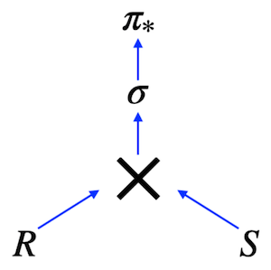

## *Deep diving into JOINs in SQL*

В этом проекте ты освоишь основные навыки работы с SQL и реляционными базами данных: понимание реляционной алгебры, использование различных типов соединений (JOIN), создание запросов с помощью CTE, обработку пропущенных значений, фильтрацию и сортировку данных.

Эти умения пригодятся в разработке, оптимизации баз данных, аналитике и программировании для эффективной работы с данными и принятия решений на их основе.

💡 [Нажми сюда](https://new.oprosso.net/p/4cb31ec3f47a4596bc758ea1861fb624), **чтобы поделиться с нами обратной связью на этот проект**. Это анонимно и поможет нашей команде сделать обучение лучше. Рекомендуем заполнить опрос сразу после выполнения проекта.

## Содержание

- [Как учиться в «Школе 21»](#%D0%BA%D0%B0%D0%BA-%D1%83%D1%87%D0%B8%D1%82%D1%8C%D1%81%D1%8F-%D0%B2-%D1%88%D0%BA%D0%BE%D0%BB%D0%B5-21)
- [Chapter I](#chapter-i)
- [Введение](#%D0%B2%D0%B2%D0%B5%D0%B4%D0%B5%D0%BD%D0%B8%D0%B5)
- [Chapter II](#chapter-ii)
- [Рекомендации к выполнению этого проекта](#%D1%80%D0%B5%D0%BA%D0%BE%D0%BC%D0%B5%D0%BD%D0%B4%D0%B0%D1%86%D0%B8%D0%B8-%D0%BA-%D0%B2%D1%8B%D0%BF%D0%BE%D0%BB%D0%BD%D0%B5%D0%BD%D0%B8%D1%8E-%D1%8D%D1%82%D0%BE%D0%B3%D0%BE-%D0%BF%D1%80%D0%BE%D0%B5%D0%BA%D1%82%D0%B0)
- [Chapter III](#chapter-iii)
- [Задание 00 — Move to the LEFT, move to the RIGHT](#%D0%B7%D0%B0%D0%B4%D0%B0%D0%BD%D0%B8%D0%B5-00%E2%80%94move-to-the-left-move-to-the-right)
- [Задание 01 — Find data gaps](#%D0%B7%D0%B0%D0%B4%D0%B0%D0%BD%D0%B8%D0%B5-01%E2%80%94find-data-gaps)
- [Задание 02 — FULL means 'completely filled'](#%D0%B7%D0%B0%D0%B4%D0%B0%D0%BD%D0%B8%D0%B5-02%E2%80%94full-means-completely-filled)
- [Задание 03 — Reformat to CTE](#%D0%B7%D0%B0%D0%B4%D0%B0%D0%BD%D0%B8%D0%B5-03%E2%80%94reformat-to-cte)
- [Задание 04 — Find favourite pizzas](#%D0%B7%D0%B0%D0%B4%D0%B0%D0%BD%D0%B8%D0%B5-04%E2%80%94find-favourite-pizzas)
- [Задание 05 — Investigate Person Data](#%D0%B7%D0%B0%D0%B4%D0%B0%D0%BD%D0%B8%D0%B5-05%E2%80%94investigate-person-data)
- [Задание 06 — Favourite pizzas for Denis and Anna](#%D0%B7%D0%B0%D0%B4%D0%B0%D0%BD%D0%B8%D0%B5-06%E2%80%94favourite-pizzas-for-denis-and-anna)
- [Задание 07 — Cheapest pizzeria for Dmitriy](#%D0%B7%D0%B0%D0%B4%D0%B0%D0%BD%D0%B8%D0%B5-07%E2%80%94cheapest-pizzeria-for-dmitriy)
- [Задание 08 — Continuing to research data](#%D0%B7%D0%B0%D0%B4%D0%B0%D0%BD%D0%B8%D0%B5-08%E2%80%94continuing-to-research-data)
- [Задание 09 — Who loves cheese and pepperoni?](#%D0%B7%D0%B0%D0%B4%D0%B0%D0%BD%D0%B8%D0%B5-09%E2%80%94who-loves-cheese-and-pepperoni)
- [Задание 10 — Find persons from one city](#%D0%B7%D0%B0%D0%B4%D0%B0%D0%BD%D0%B8%D0%B5-10%E2%80%94find-persons-from-one-city)

## Как учиться в «Школе 21»

- Здесь тебя ждет уникальный образовательный опыт с большим количеством свободы. Ты получаешь задачу и самостоятельно ищешь пути решения, используя любые удобные способы поиска информации — ресурсы Интернета или нейросети (например, GigaChat). Но внимательно относись к качеству информации: проверяй, думай, анализируй, сравнивай.
- Взаимообучение (Peer-to-Peer, P2P) — это обмен знаниями и опытом с другими пирами, где каждый выступает и учителем, и учеником. Такой подход позволяет глубже понять материал, учась друг у друга.
- Чувствуй себя свободно и проси о помощи — вокруг тебя те, кто тоже впервые проходят этот путь. Делись своим опытом и идеями с другими. Присоединяйся к Rocket.Chat, чтобы быть в курсе всех новостей от нашего сообщества.
- Твое обучение не будет иметь никакого смысла, если ты будешь копировать чужие решения. Если пользуешься помощью других — всегда разбирайся до конца, почему, как и зачем. Не бойся ошибиться.
- Кажется, что задача невыполнима? Сделай перерыв, проветрись, перезагрузи голову — это помогало многим. Возможно, после этого решение придет само собой.
- Важен не только результат обучения, но и сам процесс. Нужно не просто решить задачу, а понять, КАК ее решить.

Как работать с проектом:

- Перед выполнением проект необходимо склонировать с GitLab в одноименный репозиторий.
- Все файлы необходимо создавать в папке *src/* склонированного репозитория.
- После клонирования проекта необходимо создать ветку *develop* и вести разработку в ней. После этого пушить в GitLab также нужно ветку *develop*.
- В твоей директории не должно быть иных файлов, кроме тех, что обозначены в заданиях.

## Chapter I

## Введение



Это изображение реляционного выражения в виде дерева. Это выражение соответствует следующему SQL-запросу:

```
SELECT * 
    FROM R CROSS JOIN S  
WHERE clause
```

Другими словами, любой SQL-запрос можно описать на математическом языке реляционной алгебры.

Ты можешь задать вопрос: "Зачем изучать реляционную алгебру, если SQL можно писать сразу, без неё?"

Ответ — и да, и нет.

**Да,** потому что ты действительно можешь написать SQL-запрос с первой попытки.

**Нет,** потому что без понимания основ реляционной алгебры не обойтись: она используется в оптимизации запросов и их семантическом анализе.

Какие виды соединений существуют в реляционной алгебре? На самом деле, «Cross Join» — это базовый оператор, от которого происходят все остальные типы соединений:

- Natural Join
- Theta Join
- Semi Join
- Anti Join
- Left, Right и Full Joins

Как работает соединение двух таблиц?

Посмотри на фрагмент псевдокода, показывающий логику соединения без использования индексов:

```
FOR r in R LOOP  
    FOR s in S LOOP  
    if r.id = s.r_id then add(r,s)  
    …  
    END;  
END;
```

Это просто набор циклов... Никакой магии.

## Chapter II

## Рекомендации к выполнению этого проекта

- Убедись, что ты работаешь с последней версией PostgreSQL.
- Ты можешь писать код (SQL-скрипты) в любой удобной IDE - это совершенно нормально.
- В директории должны оставаться только файлы, явно указанные в задании. Настрой .gitignore, чтобы избежать случайных ошибок.
- Убедись, что у тебя есть личная база данных и доступ к ней в твоем кластере PostgreSQL.
- Скачай [скрипт](https://git.21-school.ru/masters/SQLB3_Retrieving_data.ID_574089/-/blob/20/./materials/model.sql) с моделью базы данных и примени его к своей базе - сделать это можно либо через командную строку с помощью psql, либо через любую удобную IDE, например DataGrip от JetBrains или pgAdmin из сообщества PostgreSQL.
- В каждом задании внимательно ознакомься с разделами «Разрешено» и «Запрещено» - там перечислены допустимые опции базы данных, типы, конструкции SQL и другие важные ограничения.
- Да прибудет с тобой сила SQL!
- Приступай к работе - и пусть это будет увлекательно!

Перед выполнением заданий изучи логическую структуру модели базы данных ниже.


1. **Таблица pizzeria** (справочник пиццерий)

   - поле id - первичный ключ
   - поле name - название пиццерии
   - поле rating - средний рейтинг пиццерии (от 0 до 5 баллов)
2. **Таблица person** (справочник клиентов, любящих пиццу)

   - поле id - первичный ключ
   - поле name - имя человека
   - поле age - возраст человека
   - поле gender - пол человека
   - поле address - адрес человека
3. **Таблица menu** (справочник с доступным меню и ценами на конкретные пиццы)

   - поле id - первичный ключ
   - поле pizzeria\_id - внешний ключ на таблицу pizzeria
   - поле pizza\_name - название пиццы в пиццерии
   - поле price - цена конкретной пиццы
4. **Таблица person\_visits** (журнал посещений пиццерий)

   - поле id - первичный ключ
   - поле person\_id - внешний ключ на таблицу person
   - поле pizzeria\_id - внешний ключ на таблицу pizzeria
   - поле visit\_date - дата посещения (например, 2022-01-01)
5. **Таблица person\_order** (журнал заказов)

   - поле id - первичный ключ
   - поле person\_id - внешний ключ на таблицу person
   - поле menu\_id - внешний ключ на таблицу menu
   - поле order\_date - дата заказа (например, 2022-01-01)

Посещения пиццерий и заказы - это разные сущности, между которыми нет прямой зависимости в данных. Например, клиент может находиться в одном ресторане, просто просматривая меню, и одновременно сделать заказ в другом ресторане по телефону или через мобильное приложение. Или другой вариант - быть дома и оформить заказ по телефону, не посещая заведение вовсе.

## Chapter III

## Задание 00 — Move to the LEFT, move to the RIGHT

| Задание 00: Move to the LEFT, move to the RIGHT |  |
| --- | --- |
| Директория для загрузки решений | ex00 |
| Файлы для загрузки | `day02_ex00.sql` |
| **Разрешено** |  |
| Язык | ANSI SQL |
| **Запрещено** |  |
| Синтаксические конструкции SQL | `NOT IN`, `IN`, `NOT EXISTS`, `EXISTS`, `UNION`, `EXCEPT`, `INTERSECT` |

Напиши SQL-запрос, который выведет список пиццерий с их рейтингом, но только те, которые никто не посещал.

## Задание 01 — Find data gaps

| Задание 01: Find data gaps |  |
| --- | --- |
| Директория для загрузки решений | ex01 |
| Файлы для загрузки | `day02_ex01.sql` |
| **Разрешено** |  |
| Язык | ANSI SQL |
| Синтаксические конструкции SQL | `generate_series(...)` |
| **Запрещено** |  |
| Синтаксические конструкции SQL | `NOT IN`, `IN`, `NOT EXISTS`, `EXISTS`, `UNION`, `EXCEPT`, `INTERSECT` |

Напиши SQL-запрос, который возвращает отсутствующие даты с 1 по 10 января 2022 года (включительно) для посещений людьми с идентификаторами 1 и 2 — то есть дни, пропущенные обоими.

Отсортируй результат по дате посещения в порядке возрастания.

Изучи образец ожидаемого результата ниже.

| missing\_date |
| --- |
| 2022-01-03 |
| 2022-01-04 |
| 2022-01-05 |
| ... |

## Задание 02 — FULL means 'completely filled'

| Задание 02: FULL means 'completely filled' |  |
| --- | --- |
| Директория для загрузки решений | ex02 |
| Файлы для загрузки | `day02_ex02.sql` |
| **Разрешено** |  |
| Язык | ANSI SQL |
| **Запрещено** |  |
| Синтаксические конструкции SQL | `NOT IN`, `IN`, `NOT EXISTS`, `EXISTS`, `UNION`, `EXCEPT`, `INTERSECT` |

Напишите SQL-запрос, который возвращает:

- Полный список имен людей, посетивших (или не посетивших) пиццерии в период с 1 по 3 января 2022 года
- Полный список названий пиццерий, которые посещались (или не посещались) в этот же период

Ниже приведен пример данных с указанием требуемых названий колонок.

Для NULL-значений в колонках person\_name и pizzeria\_name используй замену на '-'. Добавь сортировку по всем трем колонкам.

| person\_name | visit\_date | pizzeria\_name |
| --- | --- | --- |
| - | null | DinoPizza |
| - | null | DoDo Pizza |
| Andrey | 2022-01-01 | Dominos |
| Andrey | 2022-01-02 | Pizza Hut |
| Anna | 2022-01-01 | Pizza Hut |
| Denis | null | - |
| Dmitriy | null | - |
| ... | ... | ... |

## Задание 03 — Reformat to CTE

| Задание 03: Reformat to CTE |  |
| --- | --- |
| Директория для загрузки решений | ex03 |
| Файлы для загрузки | `day02_ex03.sql` |
| **Разрешено** |  |
| Язык | ANSI SQL |
| Синтаксические конструкции SQL | `generate_series(...)` |
| **Запрещено** |  |
| Синтаксические конструкции SQL | `NOT IN`, `IN`, `NOT EXISTS`, `EXISTS`, `UNION`, `EXCEPT`, `INTERSECT` |

Вернись к Заданию 01 и перепиши SQL-запрос, используя CTE (Common Table Expression). В CTE-блоке реализуй генератор дат. Результат должен совпадать с результатом из Задания 01.

| missing\_date |
| --- |
| 2022-01-03 |
| 2022-01-04 |
| 2022-01-05 |
| ... |

## Задание 04 — Find favourite pizzas

| Задание 04: Find favourite pizzas |  |
| --- | --- |
| Директория для загрузки решений | ex04 |
| Файлы для загрузки | `day02_ex04.sql` |
| **Разрешено** |  |
| Язык | ANSI SQL |

Найди полную информацию обо всех возможных вариантах пиццерий и ценах на пиццу с грибами или пепперони.

Отсортируй результаты по названию пиццы и названию пиццерии.

Пример ожидаемого результата с названиями колонок приведен ниже (используй те же имена колонок в своем SQL-запросе).

| pizza\_name | pizzeria\_name | price |
| --- | --- | --- |
| mushroom pizza | Dominos | 1100 |
| mushroom pizza | Papa Johns | 950 |
| pepperoni pizza | Best Pizza | 800 |
| ... | ... | ... |

## Задание 05 — Investigate Person Data

| Задание 05: Investigate Person Data |  |
| --- | --- |
| Директория для загрузки решений | ex05 |
| Файлы для загрузки | `day02_ex05.sql` |
| **Разрешено** |  |
| Язык | ANSI SQL |

Найди имена всех женщин старше 25 лет и отсортируй результат по имени. Пример вывода приведен ниже.

| name |
| --- |
| Elvira |
| ... |

## Задание 06 — Favourite pizzas for Denis and Anna

| Задание 06: Favourite pizzas for Denis and Anna |  |
| --- | --- |
| Директория для загрузки решений | ex06 |
| Файлы для загрузки | `day02_ex06.sql` |
| **Разрешено** |  |
| Язык | ANSI SQL |

Найдите все названия пицц (и соответствующие названия пиццерий из таблицы menu), которые заказывали Денис или Анна.

Отсортируй результат по обеим колонкам.

Пример вывода данных представлен ниже.

| pizza\_name | pizzeria\_name |
| --- | --- |
| cheese pizza | Best Pizza |
| cheese pizza | Pizza Hut |
| ... | ... |

## Задание 07 — Cheapest pizzeria for Dmitriy

| Задание 07: Cheapest pizzeria for Dmitriy |  |
| --- | --- |
| Директория для загрузки решений | ex07 |
| Файлы для загрузки | `day02_ex07.sql` |
| **Разрешено** |  |
| Язык | ANSI SQL |

Определи название пиццерии, которую Дмитрий посетил 8 января 2022 года, где он мог заказать пиццу дешевле 800 рублей.

## Задание 08 — Continuing to research data

| Задание 08: Continuing to research data |  |
| --- | --- |
| Директория для загрузки решений | ex08 |
| Файлы для загрузки | `day02_ex08.sql` |
| **Разрешено** |  |
| Язык | ANSI SQL |

Найди имена всех мужчин из Москвы или Самары, которые заказывали пиццу с пепперони, грибами или оба вида сразу.

Отсортируй результат по именам в обратном алфавитном порядке.

Пример ожидаемого результата приведен ниже.

| name |
| --- |
| Dmitriy |
| ... |

## Задание 09 — Who loves cheese and pepperoni?

| Задание 09: Who loves cheese and pepperoni? |  |
| --- | --- |
| Директория для загрузки решений | ex09 |
| Файлы для загрузки | `day02_ex09.sql` |
| **Разрешено** |  |
| Язык | ANSI SQL |

Найди имена всех женщин, которые заказывали и пепперони, и сырную пиццу (в любое время и в любых пиццериях).

Отсортируй результат по именам в алфавитном порядке.

Пример ожидаемого результата приведен ниже.

| name |
| --- |
| Anna |
| ... |

## Задание 10 — Find persons from one city

| Задание 10: Find persons from one city |  |
| --- | --- |
| Директория для загрузки решений | ex10 |
| Файлы для загрузки | `day02_ex10.sql` |
| **Разрешено** |  |
| Язык | ANSI SQL |

Найди имена людей, проживающих по одному адресу (в одном городе).

Результат должен быть отсортирован в три колонки: по имени первого человека, имени второго человека и общему адресу.

Пример результата приведен ниже.

Используй в своем запросе указанные ниже названия колонок.

| person\_name1 | person\_name2 | common\_address |
| --- | --- | --- |
| Andrey | Anna | Moscow |
| Denis | Kate | Kazan |
| Elvira | Denis | Kazan |
| ... | ... | ... |