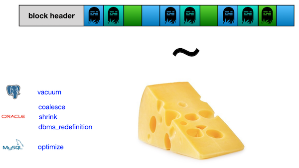

## *Continuing to JOIN and make change in data*

В этом проекте ты научишься извлекать данные из базы с помощью сложных SQL-запросов и изменять их при помощи языка управления данными (DML) — вставлять, обновлять и удалять записи для поддержания актуальности базы.

Эти знания необходимы, если ты планируешь стать специалистом по базам данных, аналитиком, разработчиком или бизнес-аналитиком.

Умение эффективно извлекать и модифицировать данные из базы поможет при разработке систем учета, анализа продаж, персонализации сервиса, а также при создании отчетов и дашбордов.

💡 [Нажми сюда](https://new.oprosso.net/p/4cb31ec3f47a4596bc758ea1861fb624), **чтобы поделиться с нами обратной связью на этот проект**. Это анонимно и поможет нашей команде сделать обучение лучше. Рекомендуем заполнить опрос сразу после выполнения проекта.

## Содержание

- [Как учиться в «Школе 21»](#%D0%BA%D0%B0%D0%BA-%D1%83%D1%87%D0%B8%D1%82%D1%8C%D1%81%D1%8F-%D0%B2-%D1%88%D0%BA%D0%BE%D0%BB%D0%B5-21)
- [Chapter I](#chapter-i)
- [Введение](#%D0%B2%D0%B2%D0%B5%D0%B4%D0%B5%D0%BD%D0%B8%D0%B5)
- [Chapter II](#chapter-ii)
- [Рекомендации к выполнению этого проекта](#%D1%80%D0%B5%D0%BA%D0%BE%D0%BC%D0%B5%D0%BD%D0%B4%D0%B0%D1%86%D0%B8%D0%B8-%D0%BA-%D0%B2%D1%8B%D0%BF%D0%BE%D0%BB%D0%BD%D0%B5%D0%BD%D0%B8%D1%8E-%D1%8D%D1%82%D0%BE%D0%B3%D0%BE-%D0%BF%D1%80%D0%BE%D0%B5%D0%BA%D1%82%D0%B0)
- [Chapter III](#chapter-iii)
- [Задание 00 — Let's find appropriate prices for Kate](#%D0%B7%D0%B0%D0%B4%D0%B0%D0%BD%D0%B8%D0%B5-00%E2%80%94lets-find-appropriate-prices-for-kate)
- [Задание 01 — Let's find forgotten menus](#%D0%B7%D0%B0%D0%B4%D0%B0%D0%BD%D0%B8%D0%B5-01%E2%80%94lets-find-forgotten-menus)
- [Задание 02 — Let's find forgotten pizza and pizzerias](#%D0%B7%D0%B0%D0%B4%D0%B0%D0%BD%D0%B8%D0%B5-02%E2%80%94lets-find-forgotten-pizza-and-pizzerias)
- [Задание 03 — Let's compare visits](#%D0%B7%D0%B0%D0%B4%D0%B0%D0%BD%D0%B8%D0%B5-03%E2%80%94lets-compare-visits)
- [Задание 04 — Let's compare orders](#%D0%B7%D0%B0%D0%B4%D0%B0%D0%BD%D0%B8%D0%B5-04%E2%80%94lets-compare-orders)
- [Задание 05 — Visited but did not make any order](#%D0%B7%D0%B0%D0%B4%D0%B0%D0%BD%D0%B8%D0%B5-05%E2%80%94visited-but-did-not-make-any-order)
- [Задание 06 — Find price-similarity pizzas](#%D0%B7%D0%B0%D0%B4%D0%B0%D0%BD%D0%B8%D0%B5-06%E2%80%94find-price-similarity-pizzas)
- [Задание 07 — Let's cook a new type of pizza](#%D0%B7%D0%B0%D0%B4%D0%B0%D0%BD%D0%B8%D0%B5-07%E2%80%94lets-cook-a-new-type-of-pizza)
- [Задание 08 — Let's cook a new type of pizza with more dynamics](#%D0%B7%D0%B0%D0%B4%D0%B0%D0%BD%D0%B8%D0%B5-08%E2%80%94lets-cook-a-new-type-of-pizza-with-more-dynamics)
- [Задание 09 — New pizza means new visits](#%D0%B7%D0%B0%D0%B4%D0%B0%D0%BD%D0%B8%D0%B5-09%E2%80%94new-pizza-means-new-visits)
- [Задание 10 — New visits means new orders](#%D0%B7%D0%B0%D0%B4%D0%B0%D0%BD%D0%B8%D0%B5-10%E2%80%94new-visits-means-new-orders)
- [Задание 11 — "Improve" a price for clients](#%D0%B7%D0%B0%D0%B4%D0%B0%D0%BD%D0%B8%D0%B5-11%E2%80%94improve-a-price-for-clients)
- [Задание 12 — New orders are coming!](#%D0%B7%D0%B0%D0%B4%D0%B0%D0%BD%D0%B8%D0%B5-12%E2%80%94new-orders-are-coming)
- [Задание 13 — Money back to our customers](#%D0%B7%D0%B0%D0%B4%D0%B0%D0%BD%D0%B8%D0%B5-13%E2%80%94money-back-to-our-customers)

## Как учиться в «Школе 21»

- Здесь тебя ждет уникальный образовательный опыт с большим количеством свободы. Ты получаешь задачу и самостоятельно ищешь пути решения, используя любые удобные способы поиска информации — ресурсы Интернета или нейросети (например, GigaChat). Но внимательно относись к качеству информации: проверяй, думай, анализируй, сравнивай.
- Взаимообучение (Peer-to-Peer, P2P) — это обмен знаниями и опытом с другими пирами, где каждый выступает и учителем, и учеником. Такой подход позволяет глубже понять материал, учась друг у друга.
- Чувствуй себя свободно и проси о помощи — вокруг тебя те, кто тоже впервые проходят этот путь. Делись своим опытом и идеями с другими. Присоединяйся к Rocket.Chat, чтобы быть в курсе всех новостей от нашего сообщества.
- Твое обучение не будет иметь никакого смысла, если ты будешь копировать чужие решения. Если пользуешься помощью других — всегда разбирайся до конца, почему, как и зачем. Не бойся ошибиться.
- Кажется, что задача невыполнима? Сделай перерыв, проветрись, перезагрузи голову — это помогало многим. Возможно, после этого решение придет само собой.
- Важен не только результат обучения, но и сам процесс. Нужно не просто решить задачу, а понять, КАК ее решить.

Как работать с проектом:

- Перед выполнением проект необходимо склонировать с GitLab в одноименный репозиторий.
- Все файлы необходимо создавать в папке *src/* склонированного репозитория.
- После клонирования проекта необходимо создать ветку *develop* и вести разработку в ней. После этого пушить в GitLab также нужно ветку *develop*.
- В твоей директории не должно быть иных файлов, кроме тех, что обозначены в заданиях.

## Chapter I

## Введение

Реляционная теория — это математическая основа современных реляционных баз данных. Каждая часть баз данных имеет соответствующее математическое и логическое обоснование, включая операторы INSERT, UPDATE и DELETE. (На иллюстрации изображён доктор Эдгар Фрэнк Кодд).

Как работает оператор INSERT с математической точки зрения.

|  |  |
| --- | --- |
| INSERT rel RELATION {TUPLE {A INTEGER(4),B INTEGER(4),C STRING ('Hello') }}; | Ты можешь использовать математические операторы INSERT и конструкцию "tuple" для преобразования входящих данных в строку. |
| С другой стороны, можно использовать явное присваивание с оператором UNION | rel:=rel UNION RELATION {TUPLE {A INTEGER(4), B INTEGER (7), C STRING ('Hello')}}; |

Оператор DELETE

|  |  |
| --- | --- |
| DELETE rel WHERE A = 1; | Если нужно удалить строку, где A = 1, это можно сделать напрямую. |
| … или через новое присваивание, исключающее строку с A = 1 | rel:=rel WHERE NOT (A = 1); |

Оператор UPDATE. Здесь рассмотрим два варианта.

|  |  |
| --- | --- |
| UPDATE rel WHERE A = 1 {B:= 23\*A, C:='String #4'}; | Оператор UPDATE с точки зрения реляционной алгебры |
| Новое присваивание для переменной-отношения rel с использованием CTE (общего табличного выражения) и операций над множествами | rel:=WITH (rel WHERE A = 1) AS T1, (EXTEND T1 ADD (23\*A AS NEW\_B, 'String #4' AS NEW\_C)) AS T2, T2 {ALL BUT B,C} AS T3, (T3 RENAME (NEW \_B AS B, NEW \_C AS C)) AS T4: (S MINUS T1) UNION T4; |

Последний случай с оператором UPDATE действительно интересен, потому что, по сути, ты добавляешь новую запись, а затем «вычитаешь» (удаляешь) старую строку.

По сути, операция UPDATE эквивалентна последовательности DELETE и INSERT, для чего существует специальный термин - маркер удаления "Tombstone", который отмечает удаляемые или изменяемые записи.

Важно: чрезмерное накопление Tombstone-маркеров приводит к снижению производительности и ухудшению метрики TPS (количество транзакций в секунду), поэтому необходимо регулярно очищать устаревшие данные.

Давай "приготовим" что-то полезное из имеющихся данных! :-)

## Chapter II

## Рекомендации к выполнению этого проекта

- Убедись, что ты работаешь с последней версией PostgreSQL.
- Ты можешь писать код (SQL-скрипты) в любой удобной IDE - это совершенно нормально.
- В директории должны оставаться только файлы, явно указанные в задании. Настрой .gitignore, чтобы избежать случайных ошибок.
- Убедись, что у тебя есть личная база данных и доступ к ней в твоем кластере PostgreSQL.
- Скачай [скрипт](https://git.21-school.ru/masters/SQLB4_DML.ID_574090/-/blob/23/./materials/model.sql) с моделью базы данных и примени его к своей базе - сделать это можно либо через командную строку с помощью psql, либо через любую удобную IDE, например DataGrip от JetBrains или pgAdmin из сообщества PostgreSQL.
- В каждом задании внимательно ознакомься с разделами «Разрешено» и «Запрещено» - там перечислены допустимые опции базы данных, типы, конструкции SQL и другие важные ограничения.
- Да прибудет с тобой сила SQL!
- Приступай к работе - и пусть это будет увлекательно!

Перед выполнением заданий изучи логическую структуру модели базы данных ниже.

1. **Таблица pizzeria** (справочник пиццерий)

   - поле id - первичный ключ
   - поле name - название пиццерии
   - поле rating - средний рейтинг пиццерии (от 0 до 5 баллов)
2. **Таблица person** (справочник клиентов, любящих пиццу)

   - поле id - первичный ключ
   - поле name - имя человека
   - поле age - возраст человека
   - поле gender - пол человека
   - поле address - адрес человека
3. **Таблица menu** (справочник с доступным меню и ценами на конкретные пиццы)

   - поле id - первичный ключ
   - поле pizzeria\_id - внешний ключ на таблицу pizzeria
   - поле pizza\_name - название пиццы в пиццерии
   - поле price - цена конкретной пиццы
4. **Таблица person\_visits** (журнал посещений пиццерий)

   - поле id - первичный ключ
   - поле person\_id - внешний ключ на таблицу person
   - поле pizzeria\_id - внешний ключ на таблицу pizzeria
   - поле visit\_date - дата посещения (например, 2022-01-01)
5. **Таблица person\_order** (журнал заказов)

   - поле id - первичный ключ
   - поле person\_id - внешний ключ на таблицу person
   - поле menu\_id - внешний ключ на таблицу menu
   - поле order\_date - дата заказа (например, 2022-01-01)

Посещения пиццерий и заказы - это разные сущности, между которыми нет прямой зависимости в данных. Например, клиент может находиться в одном ресторане, просто просматривая меню, и одновременно сделать заказ в другом ресторане по телефону или через мобильное приложение. Или другой вариант - быть дома и оформить заказ по телефону, не посещая заведение вовсе.

## Chapter III

## Задание 00 — Let's find appropriate prices for Kate

| Задание 00: Let's find appropriate prices for Kate |  |
| --- | --- |
| Директория для загрузки решений | ex00 |
| Файлы для загрузки | `day03_ex00.sql` |
| **Разрешено** |  |
| Язык | ANSI SQL |

Напиши SQL-запрос, который возвращает список:

- названия пицц,
- цены на пиццы,
- названия пиццерий,
- даты посещений

для клиента Kate с ценами в диапазоне от 800 до 1000 рублей.

Упорядочить результаты по названию пиццы, цене и названию пиццерии.

Пример ожидаемого результата с названиями колонок приведен ниже:

| pizza\_name | price | pizzeria\_name | visit\_date |
| --- | --- | --- | --- |
| cheese pizza | 950 | DinoPizza | 2022-01-04 |
| pepperoni pizza | 800 | Best Pizza | 2022-01-03 |
| pepperoni pizza | 800 | DinoPizza | 2022-01-04 |
| ... | ... | ... | ... |

## Задание 01 — Let's find forgotten menus

| Задание 01: Let's find forgotten menus |  |
| --- | --- |
| Директория для загрузки решений | ex01 |
| Файлы для загрузки | `day03_ex01.sql` |
| **Разрешено** |  |
| Язык | ANSI SQL |
| **Запрещено** |  |
| Синтаксические конструкции SQL | Любые типы JOIN-операций |

Найди все идентификаторы меню, которые никто не заказывал.

Результат должен быть отсортирован по идентификатору.

Ниже пример вывода.

| menu\_id |
| --- |
| 5 |
| 10 |
| ... |

## Задание 02 — Let's find forgotten pizza and pizzerias

| Задание 02: Let's find forgotten pizza and pizzerias |  |
| --- | --- |
| Директория для загрузки решений | ex02 |
| Файлы для загрузки | `day03_ex02.sql` |
| **Разрешено** |  |
| Язык | ANSI SQL |

Используй SQL-запрос из Задания 01 и выведи названия пицц из пиццерии, которые никто не заказывал, включая соответствующие цены.

Результат должен быть отсортирован по названию пиццы и цене.

Ниже приведен пример вывода.

| pizza\_name | price | pizzeria\_name |
| --- | --- | --- |
| cheese pizza | 700 | Papa Johns |
| cheese pizza | 780 | DoDo Pizza |
| ... | ... | ... |

## Задание 03 — Let's compare visits

| Задание 03: Let's compare visits |  |
| --- | --- |
| Директория для загрузки решений | ex03 |
| Файлы для загрузки | `day03_ex03.sql` |
| **Разрешено** |  |
| Язык | ANSI SQL |

Найди пиццерии, которые посещали чаще женщины или чаще мужчины.\
Сохраняй дубликаты при использовании операторов работы с множествами\
(конструкции UNION ALL, EXCEPT ALL, INTERSECT ALL).

Отсортируй результат по названию пиццерии.\
Пример данных приведен ниже.

| pizzeria\_name |
| --- |
| Best Pizza |
| Dominos |
| ... |

## Задание 04 — Let's compare orders

| Задание 04: Let's compare orders |  |
| --- | --- |
| Директория для загрузки решений | ex04 |
| Файлы для загрузки | `day03_ex04.sql` |
| **Разрешено** |  |
| Язык | ANSI SQL |

Найди объединение пиццерий, в которые заказы делали исключительно женщины, и тех, в которые заказы делали исключительно мужчины. Другими словами, определи множества пиццерий, заказанных только женщинами и только мужчинами, и выполни операцию UNION над этими множествами. Обрати внимание, что слово «только» применяется строго к каждой гендерной группе. При использовании операторов множеств (UNION, EXCEPT, INTERSECT) не включай дубликаты.\
Результат должен быть отсортирован по названию пиццерии.\
Ниже приведен пример данных.

| pizzeria\_name |
| --- |
| Papa Johns |

## Задание 05 — Visited but did not make any order

| Задание 05: Visited but did not make any order |  |
| --- | --- |
| Директория для загрузки решений | ex05 |
| Файлы для загрузки | `day03_ex05.sql` |
| **Разрешено** |  |
| Язык | ANSI SQL |

Напиши SQL-запрос, который вернет список пиццерий, которые посещал Андрей, но из которых он не делал заказов.\
Результат должен быть отсортирован по названию пиццерии.\
Ниже приведен пример вывода данных.

| pizzeria\_name |
| --- |
| Pizza Hut |

## Задание 06 — Find price-similarity pizzas

| Задание 06: Find price-similarity pizzas |  |
| --- | --- |
| Директория для загрузки решений | ex06 |
| Файлы для загрузки | `day03_ex06.sql` |
| **Разрешено** |  |
| Язык | ANSI SQL |

Найди совпадающие названия пицц с одинаковой ценой, но из разных пиццерий. Результат должен быть отсортирован по названию пиццы.\
Ниже приведен пример данных.\
Убедись, что имена столбцов совпадают с приведенными в примере.

| pizza\_name | pizzeria\_name\_1 | pizzeria\_name\_2 | price |
| --- | --- | --- | --- |
| cheese pizza | Best Pizza | Papa Johns | 700 |
| ... | ... | ... | ... |

## Задание 07 — Let's cook a new type of pizza

| Задание 07: Let's cook a new type of pizza |  |
| --- | --- |
| Директория для загрузки решений | ex07 |
| Файлы для загрузки | `day03_ex07.sql` |
| **Разрешено** |  |
| Язык | ANSI SQL |

Добавь новую пиццу с названием «greek pizza» (используй id = 19) по цене 800 рублей в ресторане «Dominos» (pizzeria\_id = 2).

Внимание: выполнение этого задания может привести к некорректному изменению данных. Ты можешь восстановить исходную структуру базы данных\
с данными - файл лежит в папке Materials.

## Задание 08 — Let's cook a new type of pizza with more dynamics

| Задание 08: Let's cook a new type of pizza with more dynamics |  |
| --- | --- |
| Директория для загрузки решений | ex08 |
| Файлы для загрузки | `day03_ex08.sql` |
| **Разрешено** |  |
| Язык | ANSI SQL |
| **Запрещено** |  |
| Синтаксические конструкции SQL | Не используй прямые числовые значения для идентификаторов Primary key и pizzeria. |

Добавьте новую пиццу с названием «sicilian pizza» (с ID, рассчитанным как «максимальный существующий ID + 1») по цене 900 рублей в ресторан «Dominos» (используйте подзапрос для получения идентификатора пиццерии).

Внимание: выполнение этого задания может привести к некорректному изменению данных. Ты можешь восстановить исходную структуру базы данных\
с данными - файл лежит в папке Materials и повторно выполнить скрипт из заданий 07.

## Задание 09 — New pizza means new visits

| Задание 09: New pizza means new visits |  |
| --- | --- |
| Директория для загрузки решений | ex09 |
| Файлы для загрузки | `day03_ex09.sql` |
| **Разрешено** |  |
| Язык | ANSI SQL |
| **Запрещено** |  |
| Синтаксические конструкции SQL | Не используй прямые числовые значения для идентификаторов Primary key и pizzeria. |

Зафиксируй новые посещения ресторана Domino's Денисом и Ириной 24 февраля 2022 года.\
Внимание: выполнение этого задания может привести к некорректному изменению данных. Ты можешь восстановить исходную структуру базы данных\
с данными - файл лежит в папке Materials и повторно выполнить скрипты из заданий 07, 08.

## Задание 10 — New visits means new orders

| Задание 10: New visits means new orders |  |
| --- | --- |
| Директория для загрузки решений | ex10 |
| Файлы для загрузки | `day03_ex10.sql` |
| **Разрешено** |  |
| Язык | ANSI SQL |
| **Запрещено** |  |
| Синтаксические конструкции SQL | Не используй прямые числовые значения для идентификаторов Primary key и pizzeria. |

Зарегистрируй новые заказы от Дениса и Ирины 24 февраля 2022 года на новое блюдо меню — «sicilian pizza».\
Внимание: выполнение этого задания может привести к некорректному изменению данных. Ты можешь восстановить исходную структуру базы данных\
с данными - файл лежит в папке Materials и повторно выполнить скрипты из заданий 07, 08, 09.

## Задание 11 — "Improve" a price for clients

| Задание 11: "Improve" a price for clients |  |
| --- | --- |
| Директория для загрузки решений | ex11 |
| Файлы для загрузки | `day03_ex11.sql` |
| **Разрешено** |  |
| Язык | ANSI SQL |

Измени цену на «greek pizza», уменьшив её на 10% от текущего значения.

Внимание: выполнение этого задания может привести к некорректному изменению данных. Ты можешь восстановить исходную структуру базы данных\
с данными - файл лежит в папке Materials и повторно выполнить скрипты из заданий 07, 08, 09 и 10.

## Задание 12 — New orders are coming!

| Exercise 12: New orders are coming! |  |
| --- | --- |
| Директория для загрузки решений | ex12 |
| Файлы для загрузки | `day03_ex12.sql` |
| **Разрешено** |  |
| Язык | ANSI SQL |
| Синтаксические конструкции SQL | generate\_series(...) |
| Шаблон синтаксиса SQL | Используй шаблон "insert-select" |
| INSERT INTO ... SELECT ... |  |
| **Запрещено** |  |
| Синтаксические конструкции SQL | Не используй прямые числовые значения для идентификаторов Primary key и pizzeria. |
|  | Не используй оконные функции, такие как ROW\_NUMBER() |
|  | Не используй отдельные операторы INSERT |

Зарегистрируй новые заказы "greek pizza" для всех клиентов 25 февраля 2022 года.

Внимание: выполнение этого задания может привести к некорректному изменению данных. Ты можешь восстановить исходную структуру базы данных\
с данными - файл лежит в папке Materials и повторно выполнить скрипты из заданий 07, 08, 09, 10, 11.

## Задание 13 — Money back to our customers

| Задание 13: Money back to our customers |  |
| --- | --- |
| Директория для загрузки решений | ex13 |
| Файлы для загрузки | `day03_ex13.sql` |
| **Разрешено** |  |
| Язык | ANSI SQL |

Напиши два SQL-запроса (DML), которые удалят все новые заказы из задания 12 по дате заказа. Затем удали пиццу «greek pizza» из меню.

Внимание: выполнение этого задания может привести к некорректному изменению данных. Ты можешь восстановить исходную структуру базы данных\
с данными - файл лежит в папке Materials и повторно выполнить скрипты из заданий 07, 08, 09, 10, 11, 12 и 13.