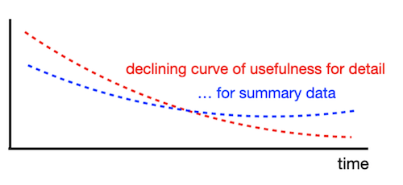
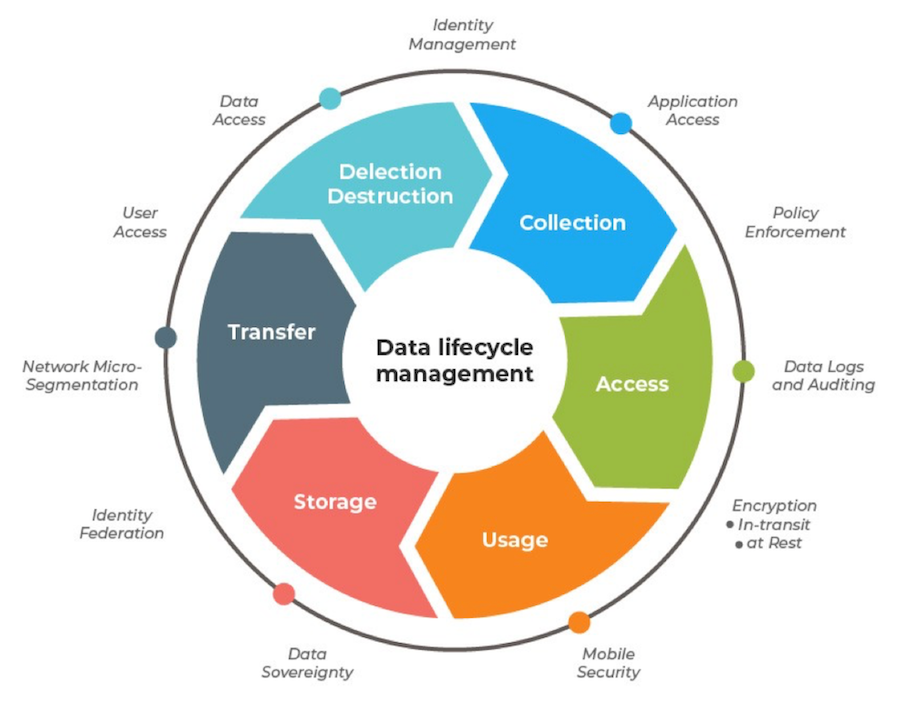

## *Aggregated data is more informative, isn't it?*

В этом проекте ты освоишь ключевые практические навыки SQL-анализа, необходимые для решения реальных бизнес-задач: агрегацию данных (расчет сумм, средних, минимума/максимума), группировку по атрибутам, фильтрацию результатов, соединение таблиц и работу с условиями.

Ты научишься превращать сырые данные из базы в структурированные отчеты, рассчитывать метрики эффективности, анализировать поведение клиентов и принимать обоснованные бизнес-решения на основе данных.

💡 [Нажми сюда](https://new.oprosso.net/p/4cb31ec3f47a4596bc758ea1861fb624), **чтобы поделиться с нами обратной связью на этот проект**. Это анонимно и поможет нашей команде сделать обучение лучше. Рекомендуем заполнить опрос сразу после выполнения проекта.

## Содержание

- [Как учиться в «Школе 21»](#%D0%BA%D0%B0%D0%BA-%D1%83%D1%87%D0%B8%D1%82%D1%8C%D1%81%D1%8F-%D0%B2-%D1%88%D0%BA%D0%BE%D0%BB%D0%B5-21)
- [Chapter I](#chapter-i)
- [Введение](#%D0%B2%D0%B2%D0%B5%D0%B4%D0%B5%D0%BD%D0%B8%D0%B5)
- [Chapter II](#chapter-ii)
- [Рекомендации к выполнению этого проекта](#%D1%80%D0%B5%D0%BA%D0%BE%D0%BC%D0%B5%D0%BD%D0%B4%D0%B0%D1%86%D0%B8%D0%B8-%D0%BA-%D0%B2%D1%8B%D0%BF%D0%BE%D0%BB%D0%BD%D0%B5%D0%BD%D0%B8%D1%8E-%D1%8D%D1%82%D0%BE%D0%B3%D0%BE-%D0%BF%D1%80%D0%BE%D0%B5%D0%BA%D1%82%D0%B0)
- [Chapter III](#chapter-iii)
- [Задание 00 — Simple aggregated information](#%D0%B7%D0%B0%D0%B4%D0%B0%D0%BD%D0%B8%D0%B5-00-simple-aggregated-information)
- [Задание 01 — Let's see real names](#%D0%B7%D0%B0%D0%B4%D0%B0%D0%BD%D0%B8%D0%B5-01-lets-see-real-names)
- [Задание 02 — Restaurants statistics](#%D0%B7%D0%B0%D0%B4%D0%B0%D0%BD%D0%B8%D0%B5-02-restaurants-statistics)
- [Задание 03 — Restaurants statistics #2](#%D0%B7%D0%B0%D0%B4%D0%B0%D0%BD%D0%B8%D0%B5-03-restaurants-statistics-2)
- [Задание 04 — Clause for groups](#%D0%B7%D0%B0%D0%B4%D0%B0%D0%BD%D0%B8%D0%B5-04-clause-for-groups)
- [Задание 05 — Person's uniqueness](#%D0%B7%D0%B0%D0%B4%D0%B0%D0%BD%D0%B8%D0%B5-05-persons-uniqueness)
- [Задание 06 — Restaurant metrics](#%D0%B7%D0%B0%D0%B4%D0%B0%D0%BD%D0%B8%D0%B5-06-restaurant-metrics)
- [Задание 07 — Average global rating](#%D0%B7%D0%B0%D0%B4%D0%B0%D0%BD%D0%B8%D0%B5-07-average-global-rating)
- [Задание 08 — Find pizzeria's restaurant locations](#%D0%B7%D0%B0%D0%B4%D0%B0%D0%BD%D0%B8%D0%B5-08-find-pizzerias-restaurant-locations)
- [Задание 09 — Explicit type transformation](#%D0%B7%D0%B0%D0%B4%D0%B0%D0%BD%D0%B8%D0%B5-09-explicit-type-transformation)

## Как учиться в «Школе 21»

- Здесь тебя ждет уникальный образовательный опыт с большим количеством свободы. Ты получаешь задачу и самостоятельно ищешь пути решения, используя любые удобные способы поиска информации — ресурсы Интернета или нейросети (например, GigaChat). Но внимательно относись к качеству информации: проверяй, думай, анализируй, сравнивай.
- Взаимообучение (Peer-to-Peer, P2P) — это обмен знаниями и опытом с другими пирами, где каждый выступает и учителем, и учеником. Такой подход позволяет глубже понять материал, учась друг у друга.
- Чувствуй себя свободно и проси о помощи — вокруг тебя те, кто тоже впервые проходят этот путь. Делись своим опытом и идеями с другими. Присоединяйся к Rocket.Chat, чтобы быть в курсе всех новостей от нашего сообщества.
- Твое обучение не будет иметь никакого смысла, если ты будешь копировать чужие решения. Если пользуешься помощью других — всегда разбирайся до конца, почему, как и зачем. Не бойся ошибиться.
- Кажется, что задача невыполнима? Сделай перерыв, проветрись, перезагрузи голову — это помогало многим. Возможно, после этого решение придет само собой.
- Важен не только результат обучения, но и сам процесс. Нужно не просто решить задачу, а понять, КАК ее решить.

Как работать с проектом:

- Перед выполнением проект необходимо склонировать с GitLab в одноименный репозиторий.
- Все файлы необходимо создавать в папке *src/* склонированного репозитория.
- После клонирования проекта необходимо создать ветку *develop* и вести разработку в ней. После этого пушить в GitLab также нужно ветку *develop*.
- В твоей директории не должно быть иных файлов, кроме тех, что обозначены в заданиях.

## Chapter I

## Введение

For detailed data over time, see the Curve of Usefulness. In other words, detailed data (i.e. user transactions, facts about products and providers, etc.) is not useful to us from a historical perspective, because we only need to know some aggregation to describe what was going on a year ago.

Why is this happening? The reason lies in our analytical mind. Actually, we want to focus on our business strategy from a historical perspective to set new business goals, and we don't need the details.

From a database point of view, "Analytical mind" corresponds to OLAP traffic (information layer), "details" corresponds to OLTP traffic (raw data layer). Today, there is a more flexible pattern for storing detailed data and aggregated information in the ecosystem. I am talking about LakeHouse = DataLake + DataWareHouse.

If we are talking about historical data, then we should mention the "Data Lifecycle Management" pattern. In simple words, what should we do with old data? TTL (time-to-live), SLA for data, Retention Data Policy, etc. are terms used in Data Governance strategy.

Для анализа детализированных данных в динамике обрати внимание на Кривую Полезности. Иными словами, детализированные данные (такие как транзакции пользователей, сведения о продуктах и поставщиках и т.д.) не представляют ценности с исторической точки зрения, поскольку для описания ситуации годичной давности необходимы лишь агрегированные показатели.

Почему так происходит? Причина кроется в особенностях аналитического мышления. По сути, твоя задача - сфокусироваться на исторической ретроспективе бизнес-стратегии для формирования новых целей, без необходимости погружаться в детали.

С точки зрения архитектуры баз данных, «Аналитическое мышление» соответствует OLAP-трафику (информационный уровень), а «детали» - OLTP-трафику (уровень сырых данных). Сегодня существует более гибкий подход для совместного хранения детализированных данных и агрегированной информации в экосистеме - концепция LakeHouse = DataLake + DataWareHouse.

Если говорить об исторических данных, следует упомянуть паттерн «Управление Жизненным Циклом Данных» (Data Lifecycle Management).

Проще говоря, что делать с устаревшими данными? TTL (время жизни), SLA для данных, Политика Хранения Данных - эти термины относятся к стратегии управления данными (Data Governance).

## Chapter II

## Рекомендации к выполнению этого проекта

- Убедись, что ты работаешь с последней версией PostgreSQL.
- Ты можешь писать код (SQL-скрипты) в любой удобной IDE - это совершенно нормально.
- В директории должны оставаться только файлы, явно указанные в задании. Настрой .gitignore, чтобы избежать случайных ошибок
- Убедись, что у тебя есть личная база данных и доступ к ней в твоем кластере PostgreSQL.
- Скачай [скрипт](https://git.21-school.ru/masters/SQLB9_OLAP.ID_574096/-/blob/15/materials/model.sql) из папки Materials с моделью базы данных и примени его к своей базе - сделать это можно либо через командную строку с помощью psql, либо через любую удобную IDE, например DataGrip от JetBrains или pgAdmin из сообщества PostgreSQL. **Процесс обучения является инкрементным и линейным, поэтому убедись, что все изменения, которые были внесены в проект SQLB4\_DML (Day 03) в ходе Заданий 07-13, и в проект SQLB5\_Snapshots (Day 04) Задание 07, должны сохраняться (это похоже на реальную ситуацию, когда после выпуска релиза требуется обеспечить согласованность данных для новых изменений).**
- В каждом задании внимательно ознакомься с разделами «Разрешено» и «Запрещено» - там перечислены допустимые опции базы данных, типы, конструкции SQL и другие важные ограничения.
- Да прибудет с тобой сила SQL
- Приступай к работе - и пусть это будет увлекательно!

Перед выполнением заданий изучи логическую структуру модели базы данных ниже.

1. Таблица **pizzeria** (справочник пиццерий)

- поле id — первичный ключ
- поле name — название пиццерии
- поле rating — средний рейтинг пиццерии (от 0 до 5 баллов)

1. Таблица **person** (справочник клиентов, любящих пиццу)

- поле id — первичный ключ
- поле name — имя человека
- поле age — возраст человека
- поле gender — пол человека
- поле address — адрес человека

1. Таблица **menu** (справочник с доступным меню и ценами на конкретные пиццы)

- поле id — первичный ключ
- поле pizzeria\_id — внешний ключ на таблицу pizzeria
- поле pizza\_name — название пиццы в пиццерии
- поле price — цена конкретной пиццы

1. Таблица **person\_visits** (журнал посещений пиццерий)

- поле id — первичный ключ
- поле person\_id — внешний ключ на таблицу person
- поле pizzeria\_id — внешний ключ на таблицу pizzeria
- поле visit\_date — дата посещения (например, 2022-01-01)

1. Таблица **person\_order** (журнал заказов)

- поле id — первичный ключ
- поле person\_id — внешний ключ на таблицу person
- поле menu\_id — внешний ключ на таблицу menu
- поле order\_date — дата заказа (например, 2022-01-01)

Посещения пиццерий и заказы - это разные сущности, между которыми нет прямой зависимости в данных. Например, клиент может находиться в одном ресторане, просто просматривая меню, и одновременно сделать заказ в другом ресторане по телефону или через мобильное приложение. Или другой вариант - быть дома и оформить заказ по телефону, не посещая заведение вовсе.

## Chapter III

## Задание 00 — Simple aggregated information

| Задание 00: Simple aggregated information |  |
| --- | --- |
| Директория для загрузки решений | ex00 |
| Файлы для загрузки | `day07_ex00.sql` |
| **Разрешено** |  |
| Язык | ANSI SQL |

Выполним простую агрегацию. Напиши SQL-запрос, который возвращает идентификаторы людей (person\_id) и соответствующее количество посещений любых пиццерий.

Отсортируй результат по количеству посещений в порядке убывания (descending), а затем по идентификатору человека (person\_id) в порядке возрастания (ascending).

Пример данных ниже

| person\_id | count\_of\_visits |
| --- | --- |
| 9 | 4 |
| 4 | 3 |
| ... | ... |

## Задание 01 — Let's see real names

| Задание 01: Let's see real names |  |
| --- | --- |
| Директория для загрузки решений | ex01 |
| Файлы для загрузки | `day07_ex01.sql` |
| **Разрешено** |  |
| Язык | ANSI SQL |

Измени SQL-запрос из Задания 00 так, чтобы он возвращал имя человека (name), а не его идентификатор.

Дополнительное условие - нужно вывести только топ-4 человека с наибольшим количеством визитов во все пиццерии, отсортированных по имени человека. Ниже приведен пример результата.

| name | count\_of\_visits |
| --- | --- |
| Dmitriy | 4 |
| Denis | 3 |
| ... | ... |

## Задание 02 — Restaurants statistics

| Задание 02: Restaurants statistics |  |
| --- | --- |
| Директория для загрузки решений | ex02 |
| Файлы для загрузки | `day07_ex02.sql` |
| **Разрешено** |  |
| Язык | ANSI SQL |

Напиши SQL-запрос, который выведет топ-3 заведения, которые являются самыми популярными по количеству посещений и по количеству заказов, объединив результаты в один список.

Добавь столбец action\_type, который будет содержать значения 'order' (заказ) или 'visit' (посещение) в зависимости от того, из какой таблицы взяты данные.

Ознакомься с примером данных ниже.

Отсортируйте итоговый результат в порядке возрастания по столбцу action\_type и в порядке убывания по столбцу с количеством (count).

| name | count | action\_type |
| --- | --- | --- |
| Dominos | 6 | order |
| ... | ... | ... |
| Dominos | 7 | visit |
| ... | ... | ... |

## Задание 03 — Restaurants statistics #2

| Задание 03: Restaurants statistics #2 |  |
| --- | --- |
| Директория для загрузки решений | ex03 |
| Файлы для загрузки | `day07_ex03.sql` |
| **Разрешено** |  |
| Язык | ANSI SQL |

Напиши SQL-запрос, который покажет, как рестораны группируются по количеству посещений и по количеству заказов, а затем объединит эти данные по названию пиццерии.

Можно использовать внутренний запрос из Задания 02 (Restaurants by Visits and by Orders) без каких-либо ограничений на количество строк.

Добавь следующие правила:

- Вычисли общую сумму заказов и посещений для каждой пиццерии (учитывай, что не все пиццерии могут присутствовать в обеих таблицах).
- Отсортируй результаты по столбцу total\_count (общее количество) в порядке убывания, а затем по столбцу name (название) в порядке возрастания.

Ознакомься с примером данных ниже.

| name | total\_count |
| --- | --- |
| Dominos | 13 |
| DinoPizza | 9 |
| ... | ... |

## Задание 04 — Clause for groups

| Задание 04: Clause for groups |  |
| --- | --- |
| Директория для загрузки решений | ex04 |
| Файлы для загрузки | `day07_ex04.sql` |
| **Разрешено** |  |
| Язык | ANSI SQL |
| **Запрещено** |  |
| Синтаксическая конструкция | WHERE |

Напиши SQL-запрос, который возвращает имя человека (person name) и соответствующее количество посещений любых пиццерий при условии, что это количество превышает 3 раза (> 3).

Ознакомься с примером данных ниже.

| name | count\_of\_visits |
| --- | --- |
| Dmitriy | 4 |

## Задание 05 — Person's uniqueness

| Задание 05: Person's uniqueness |  |
| --- | --- |
| Директория для загрузки решений | ex05 |
| Файлы для загрузки | `day07_ex05.sql` |
| **Разрешено** |  |
| Язык | ANSI SQL |
| **Запрещено** |  |
| Синтаксическая конструкция | GROUP BY, any type (UNION,...) working with sets |

Напиши простой SQL-запрос, который возвращает список уникальных имен людей, сделавших хотя бы один заказ в любой из пиццерий.

Отсортируй результат по имени человека.

Ознакомься с примером ниже.

| name |
| --- |
| Andrey |
| Anna |
| ... |

## Задание 06 — Restaurant metrics

| Задание 06: Restaurant metrics |  |
| --- | --- |
| Директория для загрузки решений | ex06 |
| Файлы для загрузки | `day07_ex06.sql` |
| **Разрешено** |  |
| Язык | ANSI SQL |

Напиши SQL-запрос, который возвращает для каждой пиццерии:

- общее количество заказов,
- среднюю цену,
- максимальную цену
- и минимальную цену на проданные пиццы.

Результат должен быть отсортирован по названию пиццерии. Округли среднюю цену до двух знаков после запятой.

Ознакомься с примером данных ниже.

| name | count\_of\_orders | average\_price | max\_price | min\_price |
| --- | --- | --- | --- | --- |
| Best Pizza | 5 | 780 | 850 | 700 |
| DinoPizza | 5 | 880 | 1000 | 800 |
| ... | ... | ... | ... | ... |

## Задание 07 — Average global rating

| Задание 07: Average global rating |  |
| --- | --- |
| Директория для загрузки решений | ex07 |
| Файлы для загрузки | `day07_ex07.sql` |
| **Разрешено** |  |
| Язык | ANSI SQL |

Напиши SQL-запрос, который возвращает общий средний рейтинг (выходной атрибут назови global\_rating) для всех ресторанов.

Округли среднее значение рейтинга до 4 знаков после запятой.

## Задание 08 — Find pizzeria's restaurant locations

| Задание 08: Find pizzeria's restaurant locations |  |
| --- | --- |
| Директория для загрузки решений | ex08 |
| Файлы для загрузки | `day07_ex08.sql` |
| **Разрешено** |  |
| Язык | ANSI SQL |

Из данных известны личные адреса людей. Предположим, что человек посещает только пиццерии в своем городе.

Напиши SQL-запрос, который возвращает:

1. Адрес (person address)
2. Название пиццерии (pizzeria name)
3. Число его заказов (count of orders) в этой пиццерии.

Отсортируй результат сначала по адресу, а затем по названию заведения.

Ознакомься с примером выходных данных ниже.

| address | name | count\_of\_orders |
| --- | --- | --- |
| Kazan | Best Pizza | 4 |
| Kazan | DinoPizza | 4 |
| ... | ... | ... |

## Задание 09 — Explicit type transformation

| Задание 09: Explicit type transformation |  |
| --- | --- |
| Директория для загрузки решений | ex09 |
| Файлы для загрузки | `day07_ex09.sql` |
| **Разрешено** |  |
| Язык | ANSI SQL |

Напиши SQL-запрос, который возвращает агрегированную информацию по адресу каждого человека.

В результат должны быть включены:

- вычисляемый столбец с формулой: «Максимальный возраст - (Минимальный возраст / Максимальный возраст)»,
- средний возраст по каждому адресу average age per address),
- результат сравнения формулы и среднего возраста (то есть, если значение формулы больше среднего возраста, то значение должно быть True, иначе - False).

Результат необходимо отсортировать по столбцу с адресом.

Ниже приведен пример ожидаемых данных.

| address | formula | average | comparison |
| --- | --- | --- | --- |
| Kazan | 44.71 | 30.33 | true |
| Moscow | 20.24 | 18.5 | true |
| ... | ... | ... | ... |