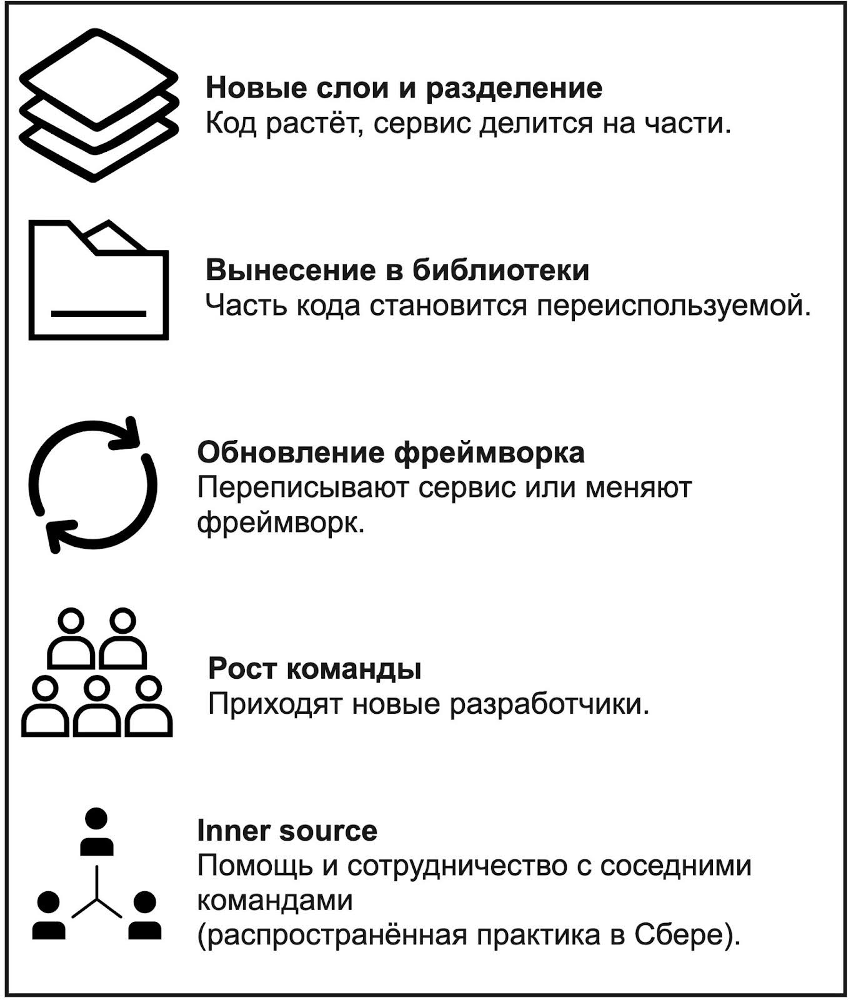
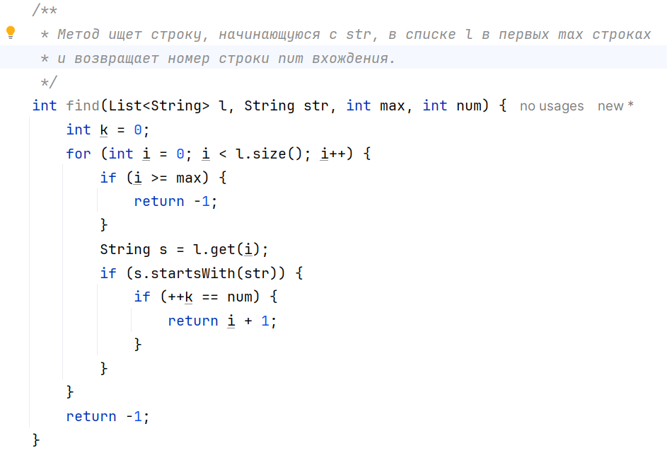
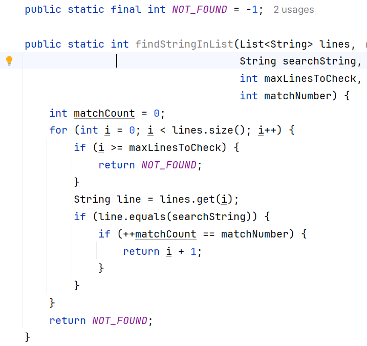

# Project Clean Code

В этом проекте ты научишься создавать поддерживаемые проекты на языке **Java** в соответствии с концепцией «чистого кода».

💡 [Нажми сюда](https://new.oprosso.net/p/4cb31ec3f47a4596bc758ea1861fb624), **чтобы поделиться с нами обратной связью на этот проект**. Это анонимно и поможет нашей команде сделать обучение лучше. Рекомендуем заполнить опрос сразу после выполнения проекта.

## Содержание

- [Как учиться в «Школе 21»](#%D0%BA%D0%B0%D0%BA-%D1%83%D1%87%D0%B8%D1%82%D1%8C%D1%81%D1%8F-%D0%B2-%D1%88%D0%BA%D0%BE%D0%BB%D0%B5-21)
- [Введение](#%D0%B2%D0%B2%D0%B5%D0%B4%D0%B5%D0%BD%D0%B8%D0%B5)
- [Общие замечания](#%D0%BE%D0%B1%D1%89%D0%B8%D0%B5-%D0%B7%D0%B0%D0%BC%D0%B5%D1%87%D0%B0%D0%BD%D0%B8%D1%8F)
  - [Принципы чистого кода и Java](#%D0%BF%D1%80%D0%B8%D0%BD%D1%86%D0%B8%D0%BF%D1%8B-%D1%87%D0%B8%D1%81%D1%82%D0%BE%D0%B3%D0%BE-%D0%BA%D0%BE%D0%B4%D0%B0-%D0%B8-java)
- [Chapter I](#chapter-i)
  - [Задание 0. Тестовый бизнес-сервис](#%D0%B7%D0%B0%D0%B4%D0%B0%D0%BD%D0%B8%D0%B5-0-%D1%82%D0%B5%D1%81%D1%82%D0%BE%D0%B2%D1%8B%D0%B9-%D0%B1%D0%B8%D0%B7%D0%BD%D0%B5%D1%81-%D1%81%D0%B5%D1%80%D0%B2%D0%B8%D1%81)
  - [Задание 1. Имена](#%D0%B7%D0%B0%D0%B4%D0%B0%D0%BD%D0%B8%D0%B5-1-%D0%B8%D0%BC%D0%B5%D0%BD%D0%B0)
  - [Задание 2. Принцип единой ответственности](#%D0%B7%D0%B0%D0%B4%D0%B0%D0%BD%D0%B8%D0%B5-2-%D0%BF%D1%80%D0%B8%D0%BD%D1%86%D0%B8%D0%BF-%D0%B5%D0%B4%D0%B8%D0%BD%D0%BE%D0%B9-%D0%BE%D1%82%D0%B2%D0%B5%D1%82%D1%81%D1%82%D0%B2%D0%B5%D0%BD%D0%BD%D0%BE%D1%81%D1%82%D0%B8)
  - [Задание 3. Слои приложения](#%D0%B7%D0%B0%D0%B4%D0%B0%D0%BD%D0%B8%D0%B5-3-%D1%81%D0%BB%D0%BE%D0%B8-%D0%BF%D1%80%D0%B8%D0%BB%D0%BE%D0%B6%D0%B5%D0%BD%D0%B8%D1%8F)
  - [Задание 4. Создание модульных (unit) тестов](#%D0%B7%D0%B0%D0%B4%D0%B0%D0%BD%D0%B8%D0%B5-4-%D1%81%D0%BE%D0%B7%D0%B4%D0%B0%D0%BD%D0%B8%D0%B5-%D0%BC%D0%BE%D0%B4%D1%83%D0%BB%D1%8C%D0%BD%D1%8B%D1%85-unit-%D1%82%D0%B5%D1%81%D1%82%D0%BE%D0%B2)
  - [Задание 5. Критерии хорошего теста](#%D0%B7%D0%B0%D0%B4%D0%B0%D0%BD%D0%B8%D0%B5-5-%D0%BA%D1%80%D0%B8%D1%82%D0%B5%D1%80%D0%B8%D0%B8-%D1%85%D0%BE%D1%80%D0%BE%D1%88%D0%B5%D0%B3%D0%BE-%D1%82%D0%B5%D1%81%D1%82%D0%B0)
  - [Задание 6. Использование тестовых двойников (mock)](#%D0%B7%D0%B0%D0%B4%D0%B0%D0%BD%D0%B8%D0%B5-6-%D0%B8%D1%81%D0%BF%D0%BE%D0%BB%D1%8C%D0%B7%D0%BE%D0%B2%D0%B0%D0%BD%D0%B8%D0%B5-%D1%82%D0%B5%D1%81%D1%82%D0%BE%D0%B2%D1%8B%D1%85-%D0%B4%D0%B2%D0%BE%D0%B9%D0%BD%D0%B8%D0%BA%D0%BE%D0%B2-mock)
  - [Задание 7. Создание интеграционных тестов](#%D0%B7%D0%B0%D0%B4%D0%B0%D0%BD%D0%B8%D0%B5-7-%D1%81%D0%BE%D0%B7%D0%B4%D0%B0%D0%BD%D0%B8%D0%B5-%D0%B8%D0%BD%D1%82%D0%B5%D0%B3%D1%80%D0%B0%D1%86%D0%B8%D0%BE%D0%BD%D0%BD%D1%8B%D1%85-%D1%82%D0%B5%D1%81%D1%82%D0%BE%D0%B2)
  - [Задание 8. Уровень покрытия кода тестами](#%D0%B7%D0%B0%D0%B4%D0%B0%D0%BD%D0%B8%D0%B5-8-%D1%83%D1%80%D0%BE%D0%B2%D0%B5%D0%BD%D1%8C-%D0%BF%D0%BE%D0%BA%D1%80%D1%8B%D1%82%D0%B8%D1%8F-%D0%BA%D0%BE%D0%B4%D0%B0-%D1%82%D0%B5%D1%81%D1%82%D0%B0%D0%BC%D0%B8)
  - [Задание 9. Основные принципы разработки — SOLID, DRY, KISS](#%D0%B7%D0%B0%D0%B4%D0%B0%D0%BD%D0%B8%D0%B5-9-%D0%BE%D1%81%D0%BD%D0%BE%D0%B2%D0%BD%D1%8B%D0%B5-%D0%BF%D1%80%D0%B8%D0%BD%D1%86%D0%B8%D0%BF%D1%8B-%D1%80%D0%B0%D0%B7%D1%80%D0%B0%D0%B1%D0%BE%D1%82%D0%BA%D0%B8---solid-dry-kiss)
  - [Задание 10. Паттерны проектирования](#%D0%B7%D0%B0%D0%B4%D0%B0%D0%BD%D0%B8%D0%B5-10-%D0%BF%D0%B0%D1%82%D1%82%D0%B5%D1%80%D0%BD%D1%8B-%D0%BF%D1%80%D0%BE%D0%B5%D0%BA%D1%82%D0%B8%D1%80%D0%BE%D0%B2%D0%B0%D0%BD%D0%B8%D1%8F)
  - [Задание 11. Контроль качества кода](#%D0%B7%D0%B0%D0%B4%D0%B0%D0%BD%D0%B8%D0%B5-11-%D0%BA%D0%BE%D0%BD%D1%82%D1%80%D0%BE%D0%BB%D1%8C-%D0%BA%D0%B0%D1%87%D0%B5%D1%81%D1%82%D0%B2%D0%B0-%D0%BA%D0%BE%D0%B4%D0%B0)
  - [Задание 12. Работа с TODO](#%D0%B7%D0%B0%D0%B4%D0%B0%D0%BD%D0%B8%D0%B5-12-%D1%80%D0%B0%D0%B1%D0%BE%D1%82%D0%B0-%D1%81-todo)
  - [Задание 13. Когда нужен JavaDoc?](#%D0%B7%D0%B0%D0%B4%D0%B0%D0%BD%D0%B8%D0%B5-13-%D0%BA%D0%BE%D0%B3%D0%B4%D0%B0-%D0%BD%D1%83%D0%B6%D0%B5%D0%BD-javadoc)
- [Для подготовки к P2P-проверке. Как оценивать задания этого проекта?](#%D0%B4%D0%BB%D1%8F-%D0%BF%D0%BE%D0%B4%D0%B3%D0%BE%D1%82%D0%BE%D0%B2%D0%BA%D0%B8-%D0%BA-p2p-%D0%BF%D1%80%D0%BE%D0%B2%D0%B5%D1%80%D0%BA%D0%B5-%D0%BA%D0%B0%D0%BA-%D0%BE%D1%86%D0%B5%D0%BD%D0%B8%D0%B2%D0%B0%D1%82%D1%8C-%D0%B7%D0%B0%D0%B4%D0%B0%D0%BD%D0%B8%D1%8F-%D1%8D%D1%82%D0%BE%D0%B3%D0%BE-%D0%BF%D1%80%D0%BE%D0%B5%D0%BA%D1%82%D0%B0)

## Как учиться в «Школе 21»

- Здесь тебя ждет уникальный образовательный опыт с большим количеством свободы. Ты получаешь задачу и самостоятельно ищешь пути решения, используя любые удобные способы поиска информации — ресурсы интернета или нейросети (например, GigaChat). Но внимательно относись к качеству информации: проверяй, думай, анализируй, сравнивай.
- Взаимообучение (Peer-to-Peer, P2P) — это обмен знаниями и опытом с другими пирами, где каждый выступает и учителем, и учеником. Такой подход позволяет глубже понять материал, учась друг у друга.
- Чувствуй себя свободно и проси о помощи — вокруг тебя те, кто тоже впервые проходят этот путь. Делись своим опытом и идеями с другими. Присоединяйся к RocketChat, чтобы быть в курсе всех новостей от нашего сообщества.
- Твое обучение не будет иметь никакого смысла, если ты будешь копировать чужие решения. Если пользуешься помощью других — всегда разбирайся до конца, почему, как и зачем. Не бойся ошибиться.
- Кажется, что задача невыполнима? Сделай перерыв, проветрись, перезагрузи голову — это помогало многим. Возможно, после этого решение придет само собой.
- Важен не только результат обучения, но и сам процесс. Нужно не просто решить задачу, а понять, КАК ее решить.

Как работать с проектом:

- Перед выполнением проект необходимо склонировать с GitLab в одноименный репозиторий.
- Все файлы необходимо создавать в папке `src/` склонированного репозитория.
- После клонирования проекта необходимо создать ветку `develop` и вести разработку в ней. После этого пушить в GitLab также нужно ветку `develop`.
- В твоей директории не должно быть иных файлов, кроме тех, что обозначены в заданиях.

## Введение

**Почему так важна читаемость кода?**

Давай посмотрим на жизненный цикл реального проекта в крупной компании, например, долгосрочная разработка и сопровождение сервиса.

Такие проекты живут долго — порой годами. За это время в них исправляют ошибки и, конечно, добавляют новый функционал, который часто изначально не планировался.

Для каждого такого шага нужно внимательно прочитать существующий код и понять, где и как его менять. В итоге получается, что мы читаем код гораздо чаще, чем пишем.

Все это — этапы развития проекта, которые поддерживают разработчики.

Когда код продуман и легко расширяется, эти задачи могут быть по-настоящему увлекательными и мотивирующими. Напротив, непонятный код — это стресс и страх что-то сломать своими правками. Тогда хочется не исправлять код, а переписать. Но менеджер просит быстрее внести правки, и не всегда понимает, с чем связана сложность.

Разработчики шутят: *«Как только мы написали код, он сразу стал legacy (устаревшим)»*. В этой шутке есть доля правды: страх править код — это хороший маркер legacy-кода.

Но страха вносить правки может не быть, если код будет «чистым».

**Что такое чистый код?**

Основные принципы чистого кода хорошо описал Роберт Мартин в одноименной книге «Чистый код». Книга станет отличным дополнением к этому проекту, поможет глубже разобраться в теме и выполнить задания на более высоком уровне.

**Что делает код чистым? Ряд достаточно простых действий:**

- осмысленные имена классов, методов и переменных;
- непрерывная работа над улучшением кода — рефакторинг;
- написание тестов, т. к. тесты — это документация;
- деление кода на методы и классы удобного размера для легкого чтения и понимания.

Поэтому основной результат усилий по созданию чистого кода — появление легко поддерживаемого кода.

В этом проекте ты потренируешься в создании именно такого легко поддерживаемого кода через выполнение следующих заданий:

1. Имена.
2. Принцип единой ответственности.
3. Слои приложения.
4. Создание модульных (unit) тестов.
5. Критерии хорошего теста.
6. Использование тестовых двойников (mock).
7. Создание интеграционных тестов.
8. Уровень покрытия кода тестами.
9. Основные принципы разработки — SOLID, DRY, KISS.
10. Паттерны проектирования.
11. Контроль качества кода.
12. Работа с TODO.
13. Когда нужен JavaDoc?

## Общие замечания

### Принципы чистого кода и Java

В Сбере большинство проектов пишут на Java, поэтому все примеры в этом проекте — на Java. Хотя сам проект не привязан к этому языку: описанные принципы актуальны для любого языка, но инструменты у каждого будут свои.

В папке materials собраны материалы, на которые можно ориентироваться при работе над проектом.

## Chapter I

### Задание 0. Тестовый бизнес-сервис

***Представь, что ты начинаешь разработку нового финансового сервиса. Задача сервиса — расчет ставки текущей ставки накопительного счета в банке. В этом проекте ты ведешь разработку по принципам Agile, т. е. итеративно (также работают в Сбере).***

***Твоя команда приняла решение, что в первой версии сервиса комиссия будет рассчитываться по следующему простому алгоритму:***

- ***10 процентов — базовая ставка***
- ***2 процента — надбавка в первый три месяца.***

***Сервис будет вызываться из веб и мобильного приложения по протоколу REST. На вход он принимает дату открытия счета и идентификатор клиента, возвращает текущий процент.***

**Основные шаги:**

В IntelliJ IDEA создай новый проект:

- Выбери Spring Boot проект.
- Выбери систему сборки Maven или Gradle, для данного проекта это непринципиально.
- Выбери JDK 21.
- Добавь в проект зависимость Spring Web.
- Создай простейшую структуру проекта с одним пакетом web.
- Создай Spring Web REST Controller, реализуй в нем расчет в методе calc.

*Рекомендация*: в промышленной разработке лучше использовать LTS (Long Term Support) релизы Java — релизы с долговременной поддержкой. Это означает, что исправления ошибок (patches) для данной версии будут выпускаться существенно дольше. В Сбере в основном используют именно LTS-версии Java.

### Задание 1. Имена

**У тебя есть контроллер, созданный на предыдущем шаге.**

Как он называется? Поймет ли новый разработчик назначение класса по этому имени? То же касается метода контроллера. Конечно, можно добавить информацию через JavaDoc, но нужно ли, если имя уже понятно? К JavaDoc мы еще вернемся.

**Важный момент**: если часть названия одинаковая и для класса, и для метода, стоит ли ее повторять в названии? Или все очевидно из контекста вызова метода?

Как работать с числовыми значениями в коде? Понятные тебе числа 3, 10 или 12 в коде метода — магические числа для читателя. Вынеси их в константу и назови в соответствии с назначением — так код легче читать и менять.

Придумывать имена — часть программирования, не менее значимая, чем реализация бизнес-логики или проектирование доменной модели. Главное в этом деле — найти баланс между понятностью и длиной имени класса или метода.

Посмотри на эти два скриншота — насколько код на втором стал понятнее. Более того, документация стала не нужна.

1. 
2. 

В итоге получается код с измененными именами, но без изменений в функционале.

Такой процесс называется рефакторингом и помогает сохранять код чистым. С рефакторингом ты еще столкнешься в других заданиях.

**ВОПРОСЫ, КОТОРЫЕ ТОЧНО ЗАДАСТ ТВОЙ ТИМЛИД:**

**Такие вопросы часто звучат при приеме на работу. Постарайся ответить простыми словами, приведи примеры из опыта разработки — чтобы уверенно отвечать и на собеседовании, и в рабочих ситуациях.**

1. *Чем плохо название метода calc?*
2. *Насколько улучшит читаемость такое название метода calcPercentForAccountByCreateDateAndClientBonusPackageAndClientTransactionHistoryForLastMonth? Почему?*
3. *Относятся ли правила наименования к именам параметров метода? К локальным переменным? Константам? Пакетам?*
4. *Как должны быть связаны имя метода контроллера и путь в API, по которому этот метод вызывается?*
5. *Предположим, в будущем ты планируешь добавить в контроллер еще ряд методов с информацией о счете. Нужно ли сразу назвать контроллер так, чтобы он это отражал?*

**Результат:**

1. Придумай понятное и читаемое имя контроллера.
2. Аналогично поступи с методом, рассчитывающим процент по счету.
3. Вынеси проценты и длину бонусного периода в константы.
4. При необходимости сделай более читаемыми имена корневого пакета и проекта.

### Задание 2. Принцип единой ответственности

***В ходе развития проекта, над которым ты работаешь, бизнес решил изменить условия вклада:***

- ***2 процента — надбавка, если у клиента подключен пакет «СберПрайм».***
- ***2 или 4 процента — надбавка, если клиент делал покупки на сумму 30 или 50 тысяч за предыдущий календарный месяц соответственно.***

***Для выполнения новых бизнес-требований тебе необходимо внести изменения в существующий код. Для этого перед выполнением задания сделай 2 шага:***

- ***Создай классы-заглушки, имитирующие сервис получения данных о клиенте и сервис получения истории операций клиента.***
- ***После чего доработай сервис расчета процентов.***

Код стал сложнее, и, кажется, снова пришло время рефакторинга.

Сейчас вся бизнес-логика находится в методе контроллера. Метод calc уже стал большим и сложным для чтения. При этом контроллер, как сущность из модели MVC (Model View Controller), отвечает за отображение данных. Наличие бизнес-логики в контроллере может быть неочевидно для того, кто будет читать твой код.

Еще один повод рефакторинга — принцип единой ответственности (Single Responsibility): метод или класс должен должен отвечать за что-то одно — либо отображение, либо бизнес-логика. Это важный принцип чистого кода.

Поэтому давай изменим код в соответствии с этим принципом. Бизнес-логику можно разместить либо в сервисном классе (SavingsAccountService), либо в классе модели (SavingsAccount), которая содержит данные и расчетный метод. Попробуй объединить оба подхода: сервис отвечает за получение данных из внешних источников (профиль клиента и история операций), реализованных в виде заглушек, а класс модели принимает все данные на вход и рассчитывает проценты.

У тебя может возникнуть вопрос: не слишком ли маленькие методы? Не приведет ли это к излишнему расходу ресурсов процессора и памяти на создание и вызов новых сущностей? В 99 случаях из 100 об этом не стоит беспокоиться. Компилятор и JVM (виртуальная машина Java) умно оптимизируют код. Оставь оптимизацию им, а твоя основная задача — сделать код читаемым и поддерживаемым.

**ВОПРОСЫ, КОТОРЫЕ ТОЧНО ЗАДАСТ ТВОЙ ТИМЛИД:**

1. *Почему важно ограничивать размеры методов? Классов? Какой предельный размер методов и классов рекомендуется?*
2. *Чем грозит нарушение принципа единой ответственности?*
3. *Какой код должен быть в классе контроллера?*

**Результат:**

1. Создай новые классы для бизнес-логики.
2. Перенеси в сервисный класс метод расчета процента.
3. Раздели метод расчета процентов на части, чистую бизнес-логику вынеси в класс модели.

### Задание 3. Слои приложения

**Итак, у тебя есть отдельные классы для бизнес-логики.** Где они должны находиться?

Здесь поговорим о слоях приложения. Контроллер — часть слоя представления, у тебя он находится в пакете web. Бизнес-логика — это слой модели. Их стоит разделить.

Есть два способа разделения слоев — пакеты и отдельные модули. В этом проекте тебе достаточно пакетов, т. к. несколько модулей усложнят сервис и увеличат время его сборки.

На что влияет разделение по пакетам?

1. Видимость классов в Java (уровень package).
2. Читаемость (да, опять). Опытный разработчик может сразу перейти к слою модели или представления в зависимости от того, что он собирается править. С двумя файлами проблем не будет, но в будущем сервис вырастет.
3. Переиспользование. Ты можешь выставить различные API на основе одной и той же бизнес-логики. Например, в Сбере один и тот же функционал может быть доступен как в мобильной, так и веб-версии СБОЛ, в банкомате, на планшете у сотрудника в отделении банка и даже в AI-помощнике.

У тебя снова может возникнуть вопрос: всего несколько классов, но уже много пакетов. Нужно ли сразу закладывать такое разделение?

Ответ: необязательно. В Agile-разработке (практика Сбера) работают итеративно. Сначала был один пакет, а теперь, с ростом бизнес-логики, пришло время разделить код по слоям.

**ВОПРОСЫ, КОТОРЫЕ ТОЧНО ЗАДАСТ ТВОЙ ТИМЛИД:**

1. *Почему важно разделять приложения на слои?*
2. *Какие слои приложения ты знаешь?*
3. *Чему могут соответствовать слои в Java-приложении? Как выбрать тот или иной способ разделения?*

**Результат:**

1. Выдели отдельный пакет model, перенеси туда класс модели.
2. Выдели отдельный пакет service, перенеси туда сервисный класс.
3. Выдели отдельный пакет adapter, перенеси туда классы, отвечающие за обращения к внешним сервисам.

### Задание 4. Создание модульных (unit) тестов

Должен ли разработчик писать тесты? И как тесты связаны с читаемостью и поддерживаемостью кода, о которых мы говорим?

Тесты = лучшая документация к коду. Почему? В них видны входные и выходные параметры, поэтому понятно, как использовать тот или иной метод.

Тесты помогают убрать страх внесения изменений и сделать код поддерживаемым: просто запускай тесты до и после правок и проверяй ожидаемое поведение программы — либо нет ошибок, либо появляется ошибка там, где должна, исходя из логики изменений. С последующим ее исправлением.

До этого мы обходились без тестов, но пора это исправить. Поэтому будем писать тесты, и в этом задании начнем с модульных (unit) тестов.

**ВОПРОСЫ, КОТОРЫЕ ТОЧНО ЗАДАСТ ТВОЙ ТИМЛИД:**

1. *Зачем нужны тесты?*
2. *Как часто нужно запускать тесты?*
3. *Какие виды тестов ты знаешь? Какой тест считается модульным?*

**Результат:**

1. Подключи в проект JUnit 5 и Truth.
2. Напиши тесты на класс расчета процентов.
3. Напиши тесты на класс сервиса.
4. Напиши тесты на класс контроллера.

### Задание 5. Критерии хорошего теста

Наличие тестов — это хорошо. Но есть правила тестирования, которые помогают создать надежный код.

| **Один тест — одна проверка** | **AAA-структура** | **Явные assert’ы** | **Принципы чистого кода** | **Независимость тестов** | **Скорость тестов** |
| --- | --- | --- | --- | --- | --- |
| Один тест проверяет одно или несколько тесно связанных условий. Цель — чтобы при правке кода краснел только один тест. | Визуально тест разделен на 3 части: Arrange-Act-Assert.  Это облегчает читаемость. | Проверка выполнения кода без выброса исключения возможна, но недостаточна — лучше явно проверять результат. | Тест — это тоже код. Соблюдай принцип Single Responsibility и понятных названий. | Успешная реализация теста не зависит от «железа» или порядка выполнения. | Так как тесты запускаются после каждого серьезного изменения, важно, чтобы тест выполнялся быстро — в течение нескольких миллисекунд. |

**ВОПРОСЫ, КОТОРЫЕ ТОЧНО ЗАДАСТ ТВОЙ ТИМЛИД:**

1. *Чем плох тест без assert?*
2. *Что делать, если твой тест работает нестабильно?*
3. *Чем плоха ситуация, когда есть один тест на все методы класса?*
4. *Что ты будешь делать, если при изменении в коде у тебя упала половина твоих тестов?*

**Результат:**

1. Посмотри на тесты из предыдущего задания и сделай их максимально отвечающими всем перечисленным критериям хорошего теста. При необходимости перепиши их.

### Задание 6. Использование тестовых двойников (mock)

***Сервис, над которым ты работаешь, похож на настоящий, но пока данные о клиенте и его операциях берутся из заглушек, содержащих постоянные или случайные значения.***

Давай заменим их на реальные сервисные классы, которые получают данные по протоколу REST из внешнего источника. Так работает микросервисная архитектура: каждый сервис отвечает за свою небольшую часть функционала — расчет процентов, профиль клиента или его историю транзакций. В Сбере команды живут в мире микросервисной архитектуры.

Теперь попробуй запустить тесты после такого изменения.

Да-да, они упали, т. к. в локальном окружении нет внешних сервисов. Их разрабатывает другие команды, собрать их все локально может быть сложно.

Для создания тестовых двойников тебе поможет специальная библиотека — Mockito. У нее куча возможностей, но лучше начать с изучения базовых методов — mock и spy.

**ВОПРОСЫ, КОТОРЫЕ ТОЧНО ЗАДАСТ ТВОЙ ТИМЛИД:**

1. *Зачем нужны тестовые двойники (заглушки)?*
2. *Что умеет Mockito?*
3. *Чем отличается mock от spy?*

**Результат:**

1. Подключи в проект Mockito и Spring RestClient (или любой другой клиент на свой выбор).
2. Перепиши сервисы получения профиля клиента и его истории транзакций на использование выбранного HTTP client. Создай интерфейсы для данных сервисов, помести их в сервисный слой.
3. Замени вызов внешних сервисов на заглушку, созданную с помощью Mockito. Убедись, что тесты позеленели.
4. Добавь в тест метода контроллера проверку на то, что он вызывает метод расчета процентов из модели ровно один раз.

### Задание 7. Создание интеграционных тестов

Чтобы понять, что такое интеграционные тесты, начни с пирамиды тестирования — там все разложено по полочкам.

Зачем интеграционные тесты разработчику? Да, в команде обычно есть тестировщики (как в Сбере), которые проверяют приложение как «черный ящик». Но ты как разработчик отвечаешь за работоспособность своего кода. Модульные тесты проверяют только кусочки. А сработает ли все вместе?

И как раз поэтому небольшое число интеграционных тестов нужно создать на этапе разработки.

- Интеграционный тест проверяет успешное выполнение запроса + несколько негативных сценариев (по возможности). Полное покрытие не нужно — этим займутся тестировщики.

Для написания интеграционных тестов используй фреймворк String Test. Для тестирования вызова сервиса в данном проекте можешь использовать MockMvc и @RestClientTest. Альтернативно — RestAssured и MockWebServer.

**Важно подчеркнуть**: при использовании данных компонентов происходит сетевое взаимодействие на уровне HTTP-протокола.

**ВОПРОСЫ, КОТОРЫЕ ТОЧНО ЗАДАСТ ТВОЙ ТИМЛИД:**

1. *Чем отличается модульный тест от интеграционного?*
2. *Зачем разработчик пишет интеграционные тесты?*
3. *Как должно соотноситься количество модульных и интеграционных тестов?*

**Результат:**

1. Подключи к проекту модуль String Test.
2. Напиши интеграционный тест, возвращающий корректный ответ. Проверь его выполнение.
3. Напиши интеграционный тест с некорректными входными данными. Проверь его выполнение.

### Задание 8. Уровень покрытия кода тестами

Как определить, что тестов достаточно?

В небольшом приложении может быть десяток тестов, в крупном — сотни. Чтобы контролировать качество, важно отслеживать процент покрытия кода тестами. В Сбере проверка покрытия — это стандартная практика, являющаяся одним из Quality Gate — проверок, которые сервис проходит при выводе в ПРОМ (промышленную среду).

Для расчета покрытия существуют специальные библиотеки, запускающиеся одновременно с тестами. Самая распространенная — JaCoCo.

Какой процент покрытия считать хорошим? Рекомендуемое значение — 80%. Почему не 100%? Потому что:

- Нет смысла тестировать простой код (вроде геттеров и сеттеров). Код, который бессмысленно тестировать, можно исключить из расчета покрытия.
- Покрыть весь код бывает сложно.

**Пример хорошей практики:**

- Покрыть бизнес-логику модульными тестами.
- Покрыть простой код (например, контроллеры) интеграционными тестами.

Такой подход помогает сосредоточиться на важном и не тратить время на избыточное тестирование.

**ВОПРОСЫ, КОТОРЫЕ ТОЧНО ЗАДАСТ ТВОЙ ТИМЛИД:**

1. *Какой код стоит покрывать тестами в первую очередь?*
2. *Какой код не нужно покрывать тестами?*
3. *Что ты будешь делать, если достичь требуемого покрытия кода тестами в 80% очень сложно?*

**Результат:**

1. Подключи в проект плагин JaCoCo.
2. Прогони все тесты в проекте и узнай текущее покрытие.
3. Доведи покрытие до 80%. Сохрани скриншот в каталоге result/ex08, подтверждающий уровень покрытия.

### Задание 9. Основные принципы разработки — SOLID, DRY, KISS

Часто правила разработки зависят от языка, фреймворка, организации, бизнес-процесса. Но есть основа — универсальные правила, которые собраны в аббревиатуру SOLID.

- S (Single Responsibility) — уже рассмотрели ранее.
- D (Dependency Inversion) — интерфейс с одной реализацией и в одном пакете — это не Dependency Inversion.

В этом задании тебе нужно будет «ломать», а не улучшать код, для того чтобы понять принципы SOLID на практике.

**ВОПРОСЫ, КОТОРЫЕ ТОЧНО ЗАДАСТ ТВОЙ ТИМЛИД:**

1. *Опиши все принципы SOLID и расскажи, к чему приводит их нарушение.*
2. *Чем грозит нарушение принципа DRY?*
3. *Чем грозит нарушение принципа KISS?*

**Результат:**

1. Создай наследника класса SavingsAccount — SavingsAccountForSalaryClient. Пусть для такого счета бонусный период длится не 3, а 12 месяцев. Исправь код так, чтобы он нарушал принцип OSP и корректная реализация SavingsAccountForSalaryClient была невозможна. Сохрани этот код в отдельной ветке.
2. Создай наследника класса SavingsAccount — NoBonusPeriodSavingsAccount. Реализуй метод расчета надбавки за бонусный период так, чтобы он нарушал принцип LSP. Подсказка: используй исключения. Сохрани этот код в отдельной ветке.
3. Извлеки из SavingsAccount интерфейс и модифицируй его так, чтобы он нарушал принцип ISP. Заставь код компилироваться, а тесты — проходить. Сохрани этот код в отдельной ветке.
4. На примере любого из адаптеров в сервисе измени код так, чтобы он нарушал принцип DIP. Сохрани этот код в отдельной ветке.
5. Возьми созданный ранее класс SavingsAccountForSalaryClient. Переопредели в нем основной метод расчета процента, нарушив принцип DRY. Ремарка: так часто бывает, что нарушение одного принципа тянет за собой нарушение другого. Сохрани этот код в отдельной ветке.
6. Модифицируй код расчета суммы операций за предыдущий календарный метод так, чтобы он нарушал принцип KISS. Например, исключи из расчета отмененные операции — операции, проводимые в один день, сумма по которым одинакова по модулю, но отличается знаком. Сохрани этот код в отдельной ветке.

### Задание 10. Паттерны проектирования

Паттерн — в переводе с английского языка «шаблон».

**Плюсы использования паттернов:**

| **Проверены годами и ускоряют разработку** | **Улучшают читаемость кода** |
| --- | --- |
| Шаблон — проверенная временем реализация какого-то часто используемого компонента. Описание реализации в виде назначения, блок-схемы, особенности реализации, отличий от других паттернов помогают не тратить время на придумывание. | Название паттерна = общий язык для разработчиков. |

**Риски применения паттернов:**

Использование паттерна только ради того, чтобы его использовать, — это антипаттерн. Сначала пойми задачу, потом выбирай инструмент. Для этого достаточно изучить основные паттерны проектирования, впервые описанные в одноименной книге, авторы которой получили прозвище «банда четырех». Всего их 23. Ссылка на сайт с описанием основных паттернов есть в папке materials.

Еще важный момент — паттерны могут являться частью языка (Kotlin) или фреймворка (Spring).

**ВОПРОСЫ, КОТОРЫЕ ТОЧНО ЗАДАСТ ТВОЙ ТИМЛИД:**

1. *Чем полезны паттерны?*
2. *Какие паттерны ты знаешь?*
3. *Какие паттерны реализует за тебя Spring?*

**Результат:**

1. Реализуй еще один тип счета, например, тот же SavingsAccountForSalaryClient из предыдущего задания.
2. Добавь в API новый параметр — тип счета.
3. Реализуй паттерн «Фабричный метод», создающий счет нужного типа, и напиши для нового кода тест.

### Задание 11. Контроль качества кода

**Все действия из предыдущих заданий были направлены на повышение качества кода. Но как его измерить?**

Коллеги или тимлид могут оценить твой код вручную на code review — распространенная практика в Сбере, часто даже обязательная. Однако у ручной проверки, хоть она и экспертная, есть минусы: она долгая, неполная и иногда субъективная.

Здесь помогают **статические анализаторы кода.** Они не исполняют код, а преобразуют его в абстрактное синтаксическое дерево (структура данных) и проверяют на соответствие заданным правилам.

Но важно помнить: синтаксические анализаторы могут ошибаться. Не все стандартные правила подходят под твой проект. Они не найдут все ошибки. Например, проверить длину метода легко, а вот принцип Single Responsibility — сложно (даже люди часто об этом не могут договориться).

Синтаксические анализаторы — не панацея, а полезный инструмент. Главное, что анализ нужно проводить регулярно, например, на pull request, а также регулярно исправлять ошибки.

Следующий вопрос — какой анализатор выбрать? В Сбере используется SonarQube Server — внешний анализатор, расположенный на отдельной группе серверов. Плюс такого подхода — сервер хранит историю сканирования, можно отслеживать динамику улучшений и стандартизировать проверки у нескольких команд разработки. Еще SonarQube умеет хранить и контролировать покрытие кода тестами.

Но в рамках этого проекта разворачивать сервер SonarQube — слишком сложная задача, поэтому попробуем локальный анализатор.

Самые известные open source анализаторы для Java — checkstyle, SpotBugs и PMD. Существует и локальная версия SonarQube.

**ВОПРОСЫ, КОТОРЫЕ ТОЧНО ЗАДАСТ ТВОЙ ТИМЛИД:**

1. *Зачем нужны статические анализаторы кода?*
2. *Как часто нужно запускать статический анализ?*
3. *Что делать, если ты не согласен с ошибкой, найденной анализатором?*

**Результат:**

1. Подключи к проекту плагин любого статического анализатора из перечисленных выше.
2. Запусти проверку, исправь найденные ошибки.
3. Сохрани скриншот, подтверждающий отсутствие ошибок в проекте, в каталоге result/ex11.
4. Установи плагин IDEA этого анализатора, изучи его возможности.

### Задание 12. Работа с TODO

TODO — это комментарий в коде о том, что ты не успел сделать. Проверки в IDE и статические анализаторы ругаются на наличие TODO.

Значит ли это, что TODO в коде быть не должно? Нет. У любой задачи есть срок. Нельзя бесконечно проводить рефакторинг кода.

*Пример*: при реализации функционала возникает идея, как можно улучшить код для более четкого соблюдения принципа Единственной ответственности. Но улучшение требует много времени на рефакторинг. Нужно ли его делать с бизнес-фичей? Если это может привести к срыву сроков — нет. Тут нам помогают TODO.

Проблема с TODO возникает тогда, когда они остаются в коде на месяцы и годы. Статические анализаторы и IDE напомнят о забытых TODO при проверке — используй это, чтобы не копить технический долг.

**ВОПРОСЫ, КОТОРЫЕ ТОЧНО ЗАДАСТ ТВОЙ ТИМЛИД:**

1. *Можно ли оставлять TODO в завершенной задаче?*
2. *Когда TODO может привести к проблеме?*

**Результат:**

1. Посмотри на свой код и подумай, как его можно улучшить. Сохрани эту информацию в TODO.

### Задание 13. Когда нужен JavaDoc?

Встроенный набор правил статических анализаторов предполагает проверки на наличие JavaDoc у классов, методов, конструкторов.

При этом принципы Чистого кода говорят об обратном. Многие разработчики поддерживают этот подход — код должен быть настолько понятным, чтобы документация не требовалась.

Когда можно обойтись без JavaDoc? Когда можно исправить ситуацию просто более понятным названием. Или написать тест, который задокументирует рекомендуемое использование кода.

Есть ряд исключений, когда JavaDoc нужен:

- совместно используемые библиотеки. Тогда по JavaDoc можно сформировать отдельный пакет документации и выложить его на страницу библиотеки;
- уже упомянутые ранее TODO;
- особенности вызова кода, на которые сложно написать тест;
- ссылки на используемые алгоритмы.

Главное — избегать очевидных комментариев, которые ухудшают читаемость кода.

**ВОПРОСЫ, КОТОРЫЕ ТОЧНО ЗАДАСТ ТВОЙ ТИМЛИД:**

1. *В каких случаях нужно писать JavaDoc?*
2. *В каких случаях точно не нужно писать JavaDoc и почему?*

**Результат:**

1. Посмотри еще раз свой код. Если там есть неочевидное поведение, исправь его переименованием или написанием JavaDoc.

## Для подготовки к P2P-проверке. Как оценивать задания этого проекта?

**Перечитай эти рекомендации перед P2P-проверкой.**

В инструкции по проверке к каждому заданию указано несколько результирующих артефактов и контрольные вопросы.

Например:

- Все тесты в проекте имеют хотя бы один assert.
- Каждый тест имеет осмысленное название.
- В каждом тесте визуально видны три блока: Arrange, Act, Assert.
- Каждый тест проверяет один сценарий — позитивный, негативный или граничный.
- Спроси у пира контрольные вопросы из задания («Вопросы, которые точно задаст твой тимлид»).

К каждому заданию тебе нужно проверить все артефакты и задать три контрольных вопроса из предложенных.

- Каждый реализованный артефакт = 1 балл.
- Каждый ответ на вопрос = 1 балл, если ответ уверенный и правильный ответ, возможно, с примером. 0,5 балла – если ответ неполный (например, нет понимания, зачем это нужно или где применять).

Если сумма баллов получается больше пяти — округляем до пяти, максимум можно получить 5 баллов за каждое задание.

💡 [Нажми сюда](https://new.oprosso.net/p/4cb31ec3f47a4596bc758ea1861fb624), **чтобы поделиться с нами обратной связью на этот проект**. Это анонимно и поможет нашей команде сделать обучение лучше. Рекомендуем заполнить опрос сразу после выполнения проекта.