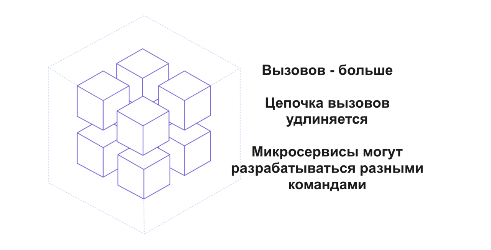
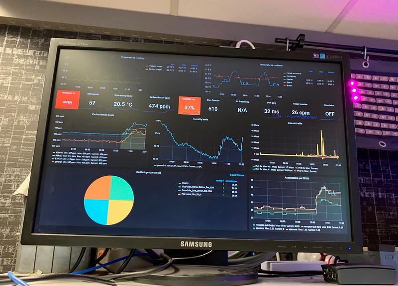
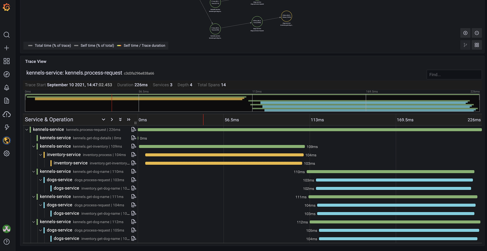

# Project Observability

В этом проекте ты научишься создавать сервисы, которые максимально информируют о своем текущем состоянии в облачной среде. Наблюдаемость (observability) в production — одно из ключевых требований для микросервисной архитектуры.

Обладая этим навыком, ты сможешь глубже понимать работу системы, помочь команде эффективно реагировать на инциденты, уверенно работать с современной инфраструктурой и ускорить свое профессиональное развитие.

💡 [Нажми сюда](https://new.oprosso.net/p/4cb31ec3f47a4596bc758ea1861fb624), **чтобы поделиться с нами обратной связью на этот проект**. Это анонимно и поможет нашей команде сделать обучение лучше. Рекомендуем заполнить опрос сразу после выполнения проекта.

## Содержание

- [Как работать с проектом](#%D0%BA%D0%B0%D0%BA-%D1%80%D0%B0%D0%B1%D0%BE%D1%82%D0%B0%D1%82%D1%8C-%D1%81-%D0%BF%D1%80%D0%BE%D0%B5%D0%BA%D1%82%D0%BE%D0%BC)
- [Введение](#%D0%B2%D0%B2%D0%B5%D0%B4%D0%B5%D0%BD%D0%B8%D0%B5)
- [Общие замечания](#%D0%BE%D0%B1%D1%89%D0%B8%D0%B5-%D0%B7%D0%B0%D0%BC%D0%B5%D1%87%D0%B0%D0%BD%D0%B8%D1%8F)
- [Chapter I](#chapter-i)
  - [Задание 1. healthcheck](#%D0%B7%D0%B0%D0%B4%D0%B0%D0%BD%D0%B8%D0%B5-1-healthcheck)
  - [Задание 2. Логи](#%D0%B7%D0%B0%D0%B4%D0%B0%D0%BD%D0%B8%D0%B5-2-%D0%BB%D0%BE%D0%B3%D0%B8)
  - [Задание 3. Уровни логирования](#%D0%B7%D0%B0%D0%B4%D0%B0%D0%BD%D0%B8%D0%B5-3-%D1%83%D1%80%D0%BE%D0%B2%D0%BD%D0%B8-%D0%BB%D0%BE%D0%B3%D0%B8%D1%80%D0%BE%D0%B2%D0%B0%D0%BD%D0%B8%D1%8F)
  - [Задание 4. Контекст логирования](#%D0%B7%D0%B0%D0%B4%D0%B0%D0%BD%D0%B8%D0%B5-4-%D0%BA%D0%BE%D0%BD%D1%82%D0%B5%D0%BA%D1%81%D1%82-%D0%BB%D0%BE%D0%B3%D0%B8%D1%80%D0%BE%D0%B2%D0%B0%D0%BD%D0%B8%D1%8F)
  - [Задание 5. Маскирование в логах](#%D0%B7%D0%B0%D0%B4%D0%B0%D0%BD%D0%B8%D0%B5-5-%D0%BC%D0%B0%D1%81%D0%BA%D0%B8%D1%80%D0%BE%D0%B2%D0%B0%D0%BD%D0%B8%D0%B5-%D0%B2-%D0%BB%D0%BE%D0%B3%D0%B0%D1%85)
  - [Задание 6. Метрики](#%D0%B7%D0%B0%D0%B4%D0%B0%D0%BD%D0%B8%D0%B5-6-%D0%BC%D0%B5%D1%82%D1%80%D0%B8%D0%BA%D0%B8)
  - [Задание 7. Трейсы (трассировки)](#%D0%B7%D0%B0%D0%B4%D0%B0%D0%BD%D0%B8%D0%B5-7-%D1%82%D1%80%D0%B5%D0%B9%D1%81%D1%8B-%D1%82%D1%80%D0%B0%D1%81%D1%81%D0%B8%D1%80%D0%BE%D0%B2%D0%BA%D0%B8)
  - [Задание 8. Телеметрия сервиса](#%D0%B7%D0%B0%D0%B4%D0%B0%D0%BD%D0%B8%D0%B5-8-%D1%82%D0%B5%D0%BB%D0%B5%D0%BC%D0%B5%D1%82%D1%80%D0%B8%D1%8F-%D1%81%D0%B5%D1%80%D0%B2%D0%B8%D1%81%D0%B0)
- [Для подготовки к P2P-проверке. Как оценивать задания этого проекта?](#%D0%B4%D0%BB%D1%8F-%D0%BF%D0%BE%D0%B4%D0%B3%D0%BE%D1%82%D0%BE%D0%B2%D0%BA%D0%B8-%D0%BA-p2p-%D0%BF%D1%80%D0%BE%D0%B2%D0%B5%D1%80%D0%BA%D0%B5-%D0%BA%D0%B0%D0%BA-%D0%BE%D1%86%D0%B5%D0%BD%D0%B8%D0%B2%D0%B0%D1%82%D1%8C-%D0%B7%D0%B0%D0%B4%D0%B0%D0%BD%D0%B8%D1%8F-%D1%8D%D1%82%D0%BE%D0%B3%D0%BE-%D0%BF%D1%80%D0%BE%D0%B5%D0%BA%D1%82%D0%B0)

## Как работать с проектом:

- Перед выполнением проект необходимо склонировать с GitLab в одноименный репозиторий.
- Все файлы необходимо создавать в папке *src/* склонированного репозитория.
- После клонирования проекта необходимо создать ветку develop и вести разработку в ней. После этого пушить в GitLab также нужно ветку develop.
- В твоей директории не должно быть иных файлов, кроме тех, что обозначены в заданиях.

## Введение

**Наблюдаемость (observability)** — способность приложения отбрасывать информацию о своем состоянии при работе:

1. Healthcheck — данные о работоспособности сервиса в целом.
2. Логи — текстовое описание событий, происходящих в сервисе.
3. Метрики — агрегированные и обезличенные показатели событий.
4. Трейсы (traces) — сведения о длительности и вложенности цепочек вызовов.

Эта информация особенно важна для микросервисов, когда мы разделяем один большой сервис на множество мелких (в отличие от монолитного приложения) — все вызовы между сервисами становятся внешними.

Чтобы все это сопровождать на ПРОМе (в production), необходимы данные о состоянии микросервисов или телеметрия.

**Телеметрия** — это технология удаленного сбора, передачи и анализа данных от различных устройств или объектов.

Термин пришел из промышленности и лег в основу стандарта OpenTelemetry, который объединяет сбор логов, метрик и трассировок.

О чем еще нужно помнить, кроме необходимости отбрасывать события телеметрии?

|  |  |
| --- | --- |
| **Корректность**  События должны отражать реальное состояние, например, категория error должна означать настоящую ошибку, прерывающую выполнение программы. | **Достаточность**  Любые ошибки должны приводить к отбрасыванию логов и, скорее всего, метрик. Но и при нормальном выполнении программы нужно оставлять информацию. Например, чтобы понять, что происходило до ошибки. Или собрать статистику по успешному выполнению запросов. Или понимать, сколько времени в среднем выполняется запрос. |
| **Неизбыточность**  Сопровождению сложно будет найти причины проблемы, если для этого придется «продираться» через тысячи строк и сотни событий. Слишком много данных затрудняет анализ и увеличивает затраты на хранение. | **Сквозной мониторинг**  Должна быть возможность связать все события телеметрии по конкретному вызову. |

Почему наблюдаемость важна для разработчика? Даже у хорошо протестированных систем могут возникать ошибки в ПРОМе. Если команда сопровождения не сможет быстро найти причину, вопрос вернется к тебе.

В Сбере роли сопровождения и разработки разделены. Команды работают по Agile, и роль третьей линии поддержки выполняет разработчик. Кроме того, в Сбере есть архитектурные требования о наличии healthcheck, логов и метрик.

В данном проекте тебе предстоит доработать созданное приложение из проекта Reliability — сервис рекомендации игр. В процессе доработки ты изучишь следующие темы:

- healthcheck,
- логи,
- уровни логирования,
- контекст логирования,
- маскирование в логах,
- метрики,
- трейсы (трассировки),
- телеметрия сервиса.

## Общие замечания

В папке materials собраны материалы, на которые можно ориентироваться при работе над проектом.

## Chapter I

### Задание 1. healthcheck

**healthcheck** — это одна или несколько «ручек» сервиса, которые можно вызвать у нашего сервиса, чтобы по ответу понять, жив ли он. Обычно это REST endpoint, который возвращает:

- код 200 — если сервис работает исправно;
- код 500 — если возникли проблемы.

В зависимости от того, кто выполняет healthcheck — могут использоваться разные способы проверки. Например, вызов по TCP или вызов из командной строки.

**Кто будет вызывать healthcheck у твоего сервиса?**

Сегодня большинство сервисов разворачиваются в облаке, чаще всего в Kubernetes (k8s) — это промышленный стандарт, который используется в Сбере (под названием DropApp).

**Зачем k8s вызывает healthcheck?**

**Kubernetes** — это оркестратор Docker-контейнеров, задача которого поддерживать нужное количество работоспособных контейнеров. Чтобы понять, жив ли контейнер, k8s вызывает healthcheck. Поэтому информация, которую он получает, вызывая healthcheck, критически важна для корректной работы облака.

А еще это важно для:

- определения момента запуска контейнера, чтобы направлять на него пользовательский трафик;
- выявления неудачного старта контейнера и автоматического его рестарта.

Да, рестарт не всегда помогает, но это лучшее, что можно сделать в автоматическом режиме.

Для этого Kubernetes использует разные виды probes — типов healthcheck.

**Healthcheck вне облака**

В промышленной среде перед сервером с Java-приложениями обычно стоит обратный proxy-сервер, который:

- балансирует запросы на несколько Java-серверов;
- выполняет проверки безопасности;
- ограничивает поток входящих запросов (rate limiter);
- отдает статический контент и многое другое.

Интересно, что перед облаком тоже стоит proxy-сервер. По требованиям надежности приложения должны размещаться минимум в 2 облачных кластерах (разных облаках), и между ними тоже нужно балансировать запросы. Чтобы убедиться, что оба облака «живы» и в них можно отправлять запросы клиента, необходим healthcheck.

Еще один полезный побочный эффект от наличия healthcheck — по его появлению можно определить время старта пода. А быстрый старт, как и наличие healthcheck, — базовые требования для облачных приложений.

**ВОПРОСЫ, КОТОРЫЕ ТОЧНО ЗАДАСТ ТВОЙ ТИМЛИД:**

**Такие вопросы часто звучат при приеме на работу. Постарайся ответить простыми словами, приведи примеры из опыта разработки, чтобы уверенно отвечать и на собеседовании, и в рабочих ситуациях.**

1. *Зачем нужен healthcheck?*
2. *Почему healthcheck особенно важен в облаке?*
3. *Какие виды healthcheck бывают в облаке, и чем они отличаются?*
4. *Как проще всего реализовать healthcheck в Spring Boot приложении? В каком случае лучше реализовать healthcheck самому, а в каком — с помощью готовой библиотеки?*
5. *Нужно ли проверять авторизацию пользователя при вызове healthcheck?*

**Результат:**

1. Подключи в созданное ранее (в проекте Reliability) Spring-приложение, возвращающее список рекомендованных игр, библиотеку для отбрасывания healthcheck. Настрой ее так, чтобы она выставляла наружу только endpoint для healthcheck.
2. Запусти приложение, проверь, как работает healthcheck и какую информацию он может возвращать.
3. Сделай свой кастомный метод, возвращающий результат проверки здоровья сервиса. Сэмулируй проблемы у сервиса, убедись, что это отразилось в ответе healthcheck.

### Задание 2. Логи

**log4j2 и logback** — лидирующие библиотеки для вывода логов в Java.

Для простой замены одной библиотеки на другую применяется паттерн Фасад в виде библиотеки **slf4j** (Simple Logging Facade for Java).

Также облегчить подключение логирования поможет **Lombok**.

Важно не столько, какую библиотеку использовать, сколько следовать ряду правил (оцени себя: какие из этих принципов ты уже применяешь в своей работе, а про какие не так часто вспоминаешь?):

- Вывод отладочных сообщений через System.out допустим только в тестах. В основном коде следует сразу использовать библиотеку логирования.
- В classpath проекта должна быть только одна библиотека логирования (не считая фасада) — это значительно упрощает настройку логов. По идее, внешние библиотеки не должны включать в зависимостях конкретную библиотеку логирования, но на практике это встречается не всегда.
- Все ошибки и исключения нужно логировать. Исключение составляют случаи, когда exception является отрицательным результатом проверки и не прерывает процесс обработки запроса клиента.
- При логировании исключений (exeption) нельзя удалять информацию о стеке вызовов, тем более что API всех популярных библиотек позволяет легко ее сохранить.
- В записи лога обязательно должны присутствовать дата, время и уровень логирования. Время следует выводить в корректном часовом поясе, согласованном с командой сопровождения.

**При настройке логирования обращай внимание на:**

1. Куда выводятся логи. Это определяют appenders. Базовые варианты — консоль и файл. В облаке с помощью инструментов типа Fluent Bit логи из файла можно перенаправлять в удаленное хранилище.
2. Шаблон логов. Шаблон упрощает поиск по логам — например, позволяет искать все события с уровнем логирования ERROR.
3. Фильтрацию логов. Фильтровать можно по уровню, времени и другим атрибутам записи лога. Фильтрация помогает уменьшить объем данных, с которыми работает команда сопровождения.

**Совет!** Периодически нужно изучать логи на тестовых стендах и проверять их полезность.

**ВОПРОСЫ, КОТОРЫЕ ТОЧНО ЗАДАСТ ТВОЙ ТИМЛИД:**

1. *Чем плохо выводить логи через System.out?*
2. *Зачем нужна библиотека slf4j?*
3. *На что нужно обратить внимание при выборе шаблона логов?*
4. *Может ли избыточное логирование замедлить сервис, и как с этим бороться?*

**Результат:**

1. Добавь в приложение библиотеку логирования (можешь начать с любой на твое усмотрение: logback или log4j) и фасад к ней.
2. Настрой appenders в консоль и файл и шаблон записи лога.
3. Добавь вывод в лог информации об успешном завершении операции получения списка игр и вывод в лог всех возникающих при работе приложения ошибок. Проверь, как логи выглядят в консоли IDE и в файловой системе. Проверь как случай успешного получения результата, так и выбрасывание исключения.
4. Сделай отдельную ветку. В этой ветке замени библиотеку логирования другую (logback на log4j или наоборот, смотря какая библиотека была ранее) и перенастрой проект на нее. Название ветки должно содержать библиотеку логирования.

### Задание 3. Уровни логирования

Один из основных параметров логов — уровень логирования.

Вот стандартный набор уровней для бизнес-приложений:

1. TRACE.
2. DEBUG.
3. INFO.
4. WARNING.
5. ERROR.

Встречается еще один уровень — FATAL. Но из практики разработки, это что-то вроде OutOfMemory, которое прикладной код не выбрасывает.

**TRACE** — самый редко встречающийся уровень. Почему? Потому что при выборе между трассировкой через логи и запуском в режиме отладчика нужно выбирать отладчик.

Это значительно быстрее, т. к. не требует пересборок сервиса. Почему именно «пересборок» во множественном числе? Потому что в ООП много классов и методов, и с первого раза правильно расставить TRACE почти невозможно.

Единственный недостаток отладки в том, что если она проводится на тестовом или dev-стенде, другие люди не смогут там работать. Их нужно заранее предупредить. Еще лучше иметь минимум два стенда.

Если ты все же используешь TRACE, его нужно убирать сразу после нахождения проблемы.

**DEBUG** — обычно используется на тестовых стендах для анализа данных от смежных команд и их влияния на состояние сервиса.

Разработка и отладка часто ведутся на заглушках, и до конца неясно, какие данные придут от смежников, даже несмотря на согласованную аналитику.

Если DEBUG используется для трассировки шагов — см. абзац выше. Что делать с DEBUG? Убирать перед фиксацией ПРОМ релиза. Не из-за производительности — этот момент можно решить, — а из-за ухудшения читаемости: размер кода увеличивается, а лог часто дублирует близлежащий метод по информативности, нарушая принцип DRY. Если DEBUG находится во внешней библиотеке, отключаем его через настройку уровня логирования для конкретного пакета.

Все последующие уровни в основном предназначены для сопровождения и тестировщиков.

**INFO** — нет ошибки, но сервис достиг важной точки, и эта информация поможет при разборе проблем.

Встречались случаи, когда строгое сопровождение запрещало писать писать на ПРОМ логи с уровнем INFO, но в итоге запрет всегда снимали.

**WARN** — ошибки, не позволяющей ответить на запрос клиента, нет.

Однако есть некритичные проблемы или нехватка данных, из-за чего происходит альтернативный сценарий: берутся данные из кеша или выполняется обходной путь, и клиенту возвращается ответ.

**ERROR** — ошибка, прокидываемая клиенту. Важно отметить, что текст ошибки в логе и текст для клиента отличаются по уровню детализации, т. е. stack trace нужно вывести в лог, но не нужно показывать клиенту. При событии уровня ERROR обработка запроса прерывается и возвращается ошибка согласно API.

Две самые частые ошибки с ERROR на практике:

1. Вывод error на любую ошибку при получении данных из внешнего сервиса, даже если она не блокирующая.
2. Error из используемой библиотеки, которая не является блокирующей для процесса. В таких случаях ее нужно убрать либо через настройку уровня логирования для пакета библиотеки, либо через доработку самой библиотеки (если возможно).

Еще два важных момента:

1. Чтобы при логировании уровня INFO или WARN на ПРОМе или при нагрузочном тестировании не выполнялись лишние операции, используй ленивое вычисление параметров для сообщений.
2. Логирование можно настраивать по отдельным пакетам — для своих пакетов повысить уровень логирования, для сторонних — понизить.
3. При изменении функционала сервиса нужно проводить ревизию логов, в частности смотреть на уровни логирования. Возможно, где-то уровень нужно повысить или понизить.

**ВОПРОСЫ, КОТОРЫЕ МОЖЕТ ЗАДАТЬ ТВОЙ ТИМЛИД:**

1. *Предположим, у твоего сервиса возникла ошибка в среде, где нельзя запускать отладку. Например, на ПРОМе, к которому в Сбере разработчики не имеют доступа. И непонятно, в какой строчке кода ошибка. Как найти ошибку в этом случае?*
2. *Какие уровни логирования допустимо оставлять в релизе, который пойдет на ПРОМ, и почему?*
3. *Тебе нужно вывести в лог информацию о том, что внешний сервис не передал данные, при этом данные для ответа клиенту допустимо брать из кеша. Какой уровень ты будешь использовать и почему?*

**Результат:**

1. Добавь логирование выходных данных метода получения списка игр таким образом, чтобы оно не влияло на производительность приложения при любом уровне логирования.
2. Попробуй отладить данный метод его по шагам с помощью отладчика IDE и логирования, сравни оба подхода.
3. Настрой разные уровни логирования для своего кода и для всех подключаемых библиотек.

### Задание 4. Контекст логирования

Все популярные библиотеки логирования, включая **SLF4J**, позволяют добавлять информацию о контексте логируемого события. Это можно сделать двумя способами:

1. Добавление маркера (Marker)
   - У события может быть только один маркер.
   - Маркер передается в каждый вызов команды логирования.
2. Добавление атрибутов в виде пары ключ-значение в MDC (Mapped Diagnostic Context)
   - MDC — Mapped Diagnostic Context — набор пар ключ-значение, хранящихся в потоке выполнения (ThreadLocal).

Примеры значений в MDC:

- данные о сервере;
- данные о клиенте и его сессии;
- информация о микросервисе и его версии;
- сквозные идентификаторы запроса (для трассировки) и многое другое.

Важные моменты:

1. Изначально контекст пуст, если его не заполняет прикладная библиотека.
2. Контекст нужно очищать после обработки запроса, чтобы лишние данные не попали в контекст другого запроса.

Как используются маркеры и MDC?

- Оба механизма позволяют фильтровать записи логов.
- Фильтрация может выполняться локально в настройках библиотеки, чтобы лишние данные не попали на сервер для долговременного хранения.
- Также фильтрация возможна удаленно при разборе инцидентов в UI отображения логов для поиска нужной информации.

Например, фильтровать по атрибутам логов позволяет **Grafana**, используемая в Сбере для просмотра логов.

MDC дает возможность сохранения любых данных контекста события и поэтому широко применяется на практике.

**ВОПРОСЫ, КОТОРЫЕ ТОЧНО ЗАДАСТ ТВОЙ ТИМЛИД:**

1. *Зачем нужен MDC?*
2. *Какие значения там полезно сохранить?*
3. *В какой момент нужно заполнять контекст?*
4. *Как MDC используется для фильтрации логов?*
5. *Зачем очищать контекст логирования?*

**Результат:**

1. Добавь в контекст логирования при вызове любого метода контроллера информацию об URL вызываемого метода, IP клиента, имени микросервиса и его версии.
2. Выведи всю эту информацию в лог.
3. Настрой фильтрацию вывода в лог по любому атрибуту MDC.

### Задание 5. Маскирование в логах

**Маскирование** — процесс замены чувствительных данных на спецсимволы — например, звездочки или точки.

Зачем это нужно?

- По требованиям законодательства и кибербезопасности.
- Логи не хранятся вечно, но доступ к ним имеют многие люди.
- Системы хранения логов позволяют делать выгрузки, что увеличивает риски утечек.

Ты можешь задать вопрос: «Какие данные нужно маскировать?». Об этом лучше спросить у эксперта по кибербезопасности продукта, над которым ты работаешь. В Сбере такой эксперт есть в каждом подразделении. Обычно маскируются персональные данные клиентов и сотрудников.

**Рекомендации по процессу маскирования:**

|  |  |  |  |
| --- | --- | --- | --- |
| Повторяющиеся данные — например, ФИО — стоит маскировать единообразно. Следовательно, нужен сервис маскирования и набор стандартных шаблонов для маскирования. | Маскирование должно изменять данные так, чтобы восстановить исходные было невозможно. | Маскирование не должно мешать поиску и фильтрации по логам — данные должны сохранять достаточно информации для идентификации запроса. | При возникновении сомнений по реализации следует проконсультироваться с экспертом по кибербезопасности в компании. |

Примеры допустимого маскирования:

- П. Иван Иванович.
- +7 (963) 1\*\*\*\*\*\*\*11

**ВОПРОСЫ, КОТОРЫЕ ТОЧНО ЗАДАСТ ТВОЙ ТИМЛИД:**

1. *Зачем маскировать данные в логах?*
2. *Представь, что клиент вводит в форме номер карты, дату действия карты и CVC (CVV) код. Объясни, какую маску ты используешь и почему?*
3. *Нужно ли маскировать данные при вызове сервиса — поставщика данных — по API?*
4. *Нужно ли маскировать данные в контексте логирования?*

**Результат:**

1. Добавь в контроллер метод подписки на получение списка рекомендуемых игр с указанием электронной почты. Добавь логирование входных параметров этого метода.
2. Напиши сервис маскирования электронной почты.
3. Замаскируй персональные данные в логах.

### Задание 6. Метрики

**Метрики** — это некие числовые показатели состояния системы, которые получает, хранит и отображает система мониторинга.

**Лог VS Метрика**

| Лог — текст. | Метрика — числовой показатель. Например,   - факт успешного или неуспешного выполнения запроса, - время выполнения запроса или старта приложения, - загрузка процессора или памяти, - ошибка в коде и др. |
| --- | --- |

В Java для работы с метриками часто используют библиотеку Micrometer — фасад для различных систем и протоколов мониторинга, аналогичный slf4j для логирования. Micrometer легко интегрируется с Spring Boot.

Все метрики можно разбить на типы, самые распространенные из которых:

| **Тип метрики** | **Описание** | **Пример** |
| --- | --- | --- |
| Counter | Счетчик событий, при каждом событии увеличивается на некоторое значения (обычно 1). | Число успешных вызовов сервиса. |
| Timer | Измеряет длительность события.  Позволяет строить гистограммы и процентили для анализа времени отклика. | Время выполнения операции (например, для демонстрации проблем со временем обработки запроса). |
| Gauge | Отображает текущее значение контролируемого показателя. | Загрузка процессора. |

Принцип RED для ключевых метрик:

- Rate — число событий;
- Errors — число ошибок;
- Duration — время обработки запроса.

Твоя задача как разработчика — определить оптимальный набор метрик для отслеживания состояния приложения и исключить ненужные.

- Метрику можно исключить явным вызовом в коде сервиса.
- Если ты используешь библиотеку Micrometer, то у тебя есть преимущество — она умеет автоматически исключать множество стандартных метрик «из коробки». Это могут быть как системные метрики, например, связанные с работой JVM, так и бизнес-метрики, такие как количество REST-вызовов.

Далее команда сопровождения настроит дашборд, позволяющий на графиках отслеживать текущие значения метрик.

В Сбере и в других крупных компаниях для отображения метрик используется Grafana.

*Источник: <https://www.flickr.com/photos/69505536@N03/31693926147/>*

Можно выводить дашборд на большой экран рядом со своим рабочим местом. Но надежнее на основе получаемых метрик настроить Alerting — уведомление на телефон, email или мессенджер о превышении метрикой определенного порога.

Еще один важный момент: так же, как к логам через MDC можно добавлять атрибуты, к метрикам можно добавлять теги — обычно те же, что и для логов. По тегам доступна фильтрация метрик.

Из-за особенностей работы с метриками, которые позволяют агрегировать данные по времени с фильтрацией по тегам, теги должны содержать относительно статичные значения. То есть:

- сотни вариантов значений тегов допустимы;
- ❌ произвольный текст в тегах — нет.

**ВОПРОСЫ, КОТОРЫЕ ТОЧНО ЗАДАСТ ТВОЙ ТИМЛИД:**

1. *Нужно ли отбрасывать метрики, если все события в приложении уже логируются?*
2. *Могут ли метрики быть полезны для анализа штатной работы программы? Приведи примеры.*
3. *Что стоит добавить в теги метрики для облачного приложения (работающего в k8s)?*
4. *Предположим, ты хочешь отслеживать метрики по отдельному пользователю интернет-приложения с миллионами пользователей. Можно ли это сделать?*
5. *Какие метрики умеет отбрасывать Micrometer «из коробки»? Какие типы интеграций он поддерживает автоматически?*

**Результат:**

1. Подключи в проект библиотеку для отбрасывания метрик. Включи сбор метрик и отбрасывание их по REST endpoint в формате Prometheus.
2. Посмотри, какие метрики отбрасываются по умолчанию.
3. Добавь явно в методе получения списка игр отбрасывание всех 3 основных типов метрик в императивном стиле.
4. Сделай то же самое в декларативном стиле с помощью аннотаций для тех типов метрик, для которых это возможно в методе подписки на рекомендации.
5. Добавь теги к метрикам, посмотри, как изменился вывод метрик по REST.
6. Сохрани скриншоты с ответами REST endpoint в формате Prometheus, где видны добавленные тобой метрики и их теги, в папку result/ex06.

### Задание 7. Трейсы (трассировки)

Как уже было сказано выше, иметь достоверные данные о состоянии микросервисов очень важно из-за большого числа интеграций между ними.

Если логи и метрики существовали до эры микросервисов, то трейсы появились примерно одновременно с ней.

Почему? Потому что цепочки интеграций стали сложнее, и общая задержка при ответе клиенту выросла. Логов и метрик перестало хватать для ответа на вопрос: на каком участке возникает проблема?

Суть трассировки проста:

1. Каждому запросу от клиента присваивается идентификатор — traceId, который передается от одного микросервиса к другому.
2. Каждому отдельному этапу обработки запроса присваивается идентификатор — spanId.\
   По умолчанию новый spanId создается при передаче вызова в новый микросервис, но ничто не мешает разбить обработку сложного запроса внутри одного микросервиса на несколько span.
3. При вызове одного span из другого в вызываемый передается родительский spanId. Это позволяет выстроить цепочку вызовов в иерархическом виде:

1. Для trace и span сохраняется информация о времени исполнения.
   - В итоге трассировка позволяет: найти узкие места в производительности, проверить корректность цепочки вызовов и даже найти случаи, когда цепочка вызовов закольцовывается.

Подобно метрикам и логам, к span можно добавлять теги с метаданными для удобной фильтрации.

Например, в тег можно включить название сервера или идентификатор документа, чтобы отследить проблемы, связанные с конкретным сервером или документом.

Также, как и с метриками, в большинстве реализаций библиотек трейсинга доступна функция auto instrumentation — автоматическое подключение данных для трассировки большинства стандартных протоколов интеграции (REST, Kafka и др.):

1. Генерация traceId и spanId при получении входящего запроса, если их нет.
2. Получение метаданных из входящего запроса и связывание с parent span.
3. Вычисление времени исполнения span.
4. Передача информации в исходящие запросы.
5. Отбрасывание информации о трейсах в систему хранения. Конечно, возможно и ручное создание trace и span.

Еще одна характеристика трейсов, на которую стоит обратить внимание, — частота семплирования. Трейсы отбрасываются при каждом вызове, а нужны только для разбора проблем. Чтобы сократить объем хранимых данных, целесообразно отправлять на сервер не все 100% вызовов, а лишь их часть.

**ВОПРОСЫ, КОТОРЫЕ ТОЧНО ЗАДАСТ ТВОЙ ТИМЛИД:**

С достаточно большой вероятностью твой тимлид в данном и следующем задании задаст тебе один вопрос:

1. *Что это такое (трейсы), и откуда вообще у тебя информация о них?*

   В Сбере трассировка на данный момент находится сейчас на стадии внедрения. Тем не менее тема сама по себе важна, так как часть стандарта Open Telemetry, поэтому она включена в проект.

Но можно добавить еще один вопрос:

1. *Почему трассировка важна именно для микросервисной архитектуры?*

**Результат:**

1. Подключи к проекту зависимости для отбрасывания трейсов с экспортом данных в формате Zipkin, настрой частоту сэмплирования.
2. Создай второй микросервис с REST-контроллером, возвращающий список игр и рекомендаций. Сделай его максимально простым, пусть все возвращаемые данные будут фиксированными. Настрой вызов его из основного сервиса.
3. Скачай и запусти сервер трассировки Zipkin.
4. Выполни пару запросов, убедись, что трейсы отбрасываются.
5. Добавь генерацию span-а вручную в коде в императивном и декларативном (аннотации) виде для методов получения списка игр и метода подписки на рекомендации соответственно. Добавь несколько тегов. Проверь, как изменились отбрасываемые данные.
6. Сохрани скриншоты с сервера Zipkin, на которых видны добавленные span и их теги, в папку result/ex07.

### Задание 8. Телеметрия сервиса

Данное задание — это логический финал предыдущих.

Ты уже знаешь, что информация о состоянии сервиса может храниться в трех видах:

| **Логи** | **Метрики** | **Трейсы** |
| --- | --- | --- |
| Передают текстовое описание состояния | Передают количественные показатели | Связывают цепочку операций воедино |

Было бы здорово объединить все три вида телеметрии при разборе проблем, т. е. иметь возможность перейти в UI от трейса по конкретному клиентскому запросу к логам, далее к метрикам. Для этого уже даже есть сквозной идентификатор для — **traceId**.

Именно решение этой задачи — основное назначение стандарта Open Telemetry. В рамках этого стандарта логи, метрики и трейсы рассматриваются как разные виды сигналов.

Стандарт описывает ряд компонентов, необходимых для отбрасывания сигналов:

1. Коллектор — обеспечивает формирование сигналов вне зависимости от используемых серверов для обработки и хранения телеметрии.
2. Exporters — экспортируют данные в формат, требуемый конкретным сервером.
3. Instrumentation — автоматическое формирование сигналов.
4. Samplers — реализуют сэмплирование, то есть пропускают часть данных для уменьшения объема хранения.

Еще стандартизируются имена тегов для логов, метрик и трейсов, а также используемые внешние API.

Самое главное — стандарт обеспечивает распространение **traceId** и **spanId** в контекст логов и метрик, что позволяет связать всю телеметрию воедино.

Для добавления корреляционного идентификатора traceId пришлось доработать стандарт метрик, добавив новую сущность — **exemplars**. Они похожи на теги, но позволяют хранить динамическую информацию.

**Важный момент**: стандарт все еще развивается, поэтому поддержка его в разных серверах и фреймворках может быть неполной. Но с уверенностью можно сказать, что будущее за ним.

**Еще один важный момент**: на данный момент Open Telemetry рекомендует в прикладном коде оставлять стандартные библиотеки логирования — slf4j, log4j, logback — и не менять их на собственный фасад ввиду их широкой распространенности.

**ВОПРОСЫ, КОТОРЫЕ ТОЧНО ЗАДАСТ ТВОЙ ТИМЛИД:**

1. *Зачем нам нужен еще один стандарт?*
2. *Можно ли его использовать сейчас?*

**Результат:**

Чтобы можно было сравнить результат этого задания с предыдущими, сделай еще одну ветку, унаследовав ее от существующей.

1. Подключи к проекту библиотеки, реализующие стандарт Open Telemetry для метрик и трейсов.
2. Добейся, чтобы отправка данных телеметрии работала корректно.
3. Убедись, что в метрики и логи тоже пробрасывается traceId.
4. Сохрани скриншоты, на которых виден traceId в логах, метриках и трейсах в каталог result/ex08.

## Для подготовки к P2P-проверке. Как оценивать задания этого проекта?

**Перечитай эти рекомендации перед P2P-проверкой.**

В инструкции по проверке к каждому заданию указано несколько результирующих артефактов и контрольные вопросы.

Например:

- У выводимых в лог сообщений из прикладного кода настроено ленивое вычисление параметров.
- Настроены разные уровни логирования для сообщений из прикладного кода и из библиотек.
- Спроси у пира контрольные вопросы из задания («Вопросы, которые точно задаст твой тимлид»).

К каждому заданию тебе нужно проверить все артефакты и задать три контрольных вопроса из предложенных (если их больше).

- Каждый реализованный артефакт = 1 балл.
- Каждый ответ на вопрос = 1 балл, если ответ уверенный и правильный ответ, возможно, с примером. 0,5 балла — если ответ неполный (например, нет понимания, зачем это нужно или где применять).

Если сумма баллов получается больше пяти — округляем до пяти, максимум можно получить 5 баллов за каждое задание.

💡 [Нажми сюда](https://new.oprosso.net/p/4cb31ec3f47a4596bc758ea1861fb624), **чтобы поделиться с нами обратной связью на этот проект**. Это анонимно и поможет нашей команде сделать обучение лучше. Рекомендуем заполнить опрос сразу после выполнения проекта.